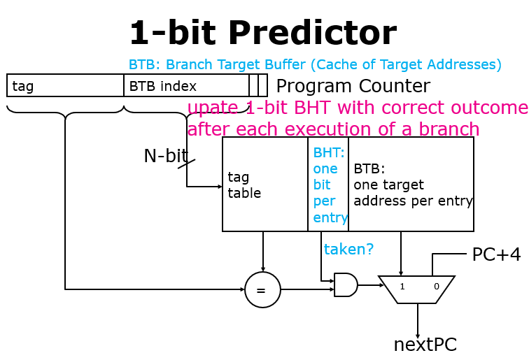
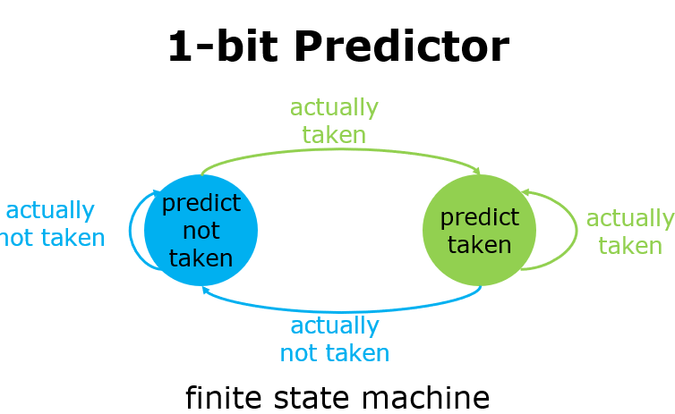
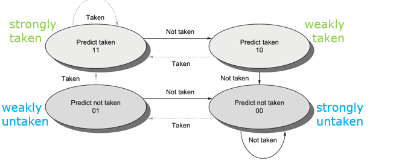
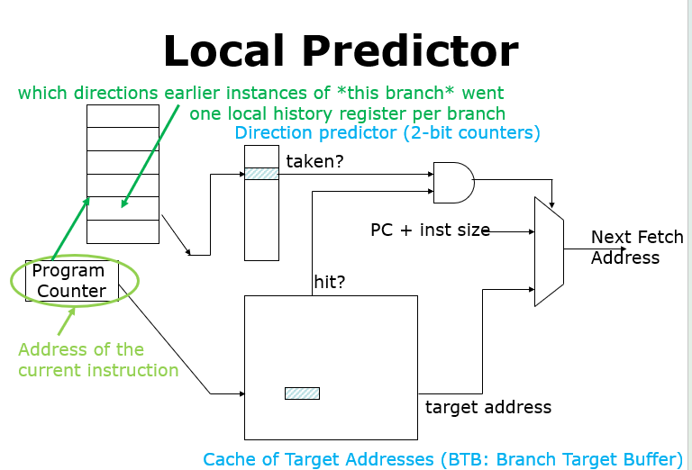
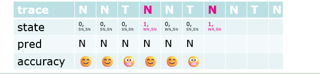
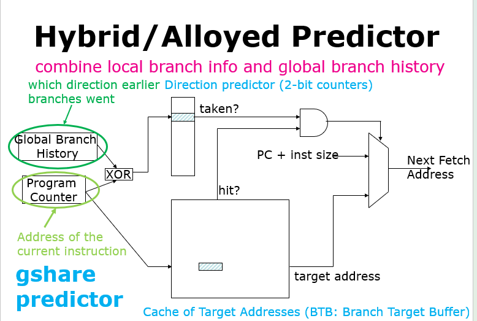
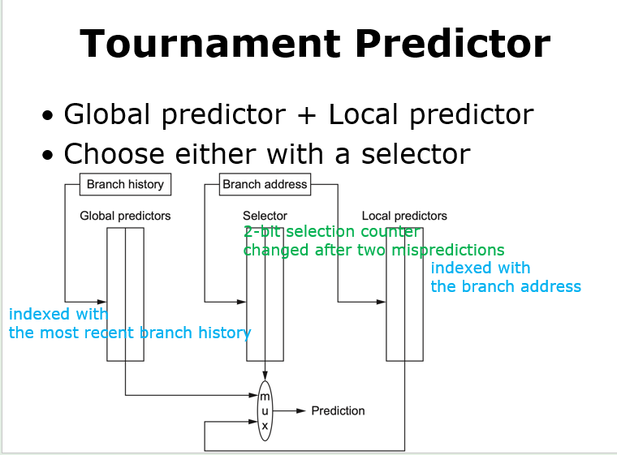
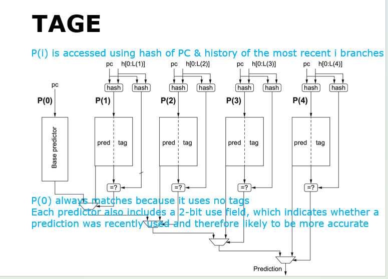

# 第七章 ILP与动态调度

本章探讨动态分支预测的演进，分析动态调度中的记分牌与 Tomasulo 算法，并剖析如何通过寄存器重命名与重排序缓冲区（ROB）实现乱序执行、顺序提交的投机执行机制。

---

## 动态分支预测技术

为了在处理器运行期间根据历史行为实时调整预测方向，引入了动态分支预测：

### 基础预测器
* **1位分支预测器（1-bit Predictor）**：
    1. 使用**分支历史表（Branch History Table, BHT）**缓存分支上一次的跳转状态，其中0为不跳转，1为跳转。
    2. 取指阶段：当 CPU 取到一条分支指令时，立刻根据指令地址的低位查 BHT 。
    3. 预测：读取表里存的那 1 个 bit。如果读到 1，就预测“会跳”；读到 0，就预测“不跳”。
    4. 后续操作：依据这个预测结果，CPU 会立刻调整取指路径，往预测的目标地址去取指令。可以看到**BTB （Branch Target Buffer）分支目标缓冲**，这里面就存放了之前运行过的分支指令的目标地址，如果 hit ，说明确实是一条已知的分支指令
    5. 更新状态：当分支指令真正执行完毕后，CPU 会根据实际结果，去更新 BHT 表里对应的那 1 个 bit，以便下一次使用。

    <div align="center">
      
    </div>

    <div align="center">
      
    </div>

    * 局限性：对单次异常跳转过于敏感。例如对一个执行9次跳转、1次不跳转的循环分支，初始化为不跳转时其准确率仅为 80%（进入和退出各错一次）；面对跳转和不跳转交替出现的循环（T-N-T-N...），预测准确率会降为 0%。

* **2位分支预测器（2-bit Predictor）**：
    1. 采用2位饱和计数器，只有当连续两次预测错误时才改变预测状态。在保持低存储开销的同时，极大提升了对异常跳转的容错度。
    2. 本质依旧是一个有限状态机。包含四个状态：strongly / weakly taken, strongly / weakly untaken。

    <div align="center">
      
    </div>

* **N位预测器**：
    1. 将饱和计数器推广到 $N$ 位，其数值范围为 $0$ 到 $2^N - 1$。预测阈值为 $(2^N - 1) / 2$
    2. 大于等于该阈值预测跳转，小于该阈值预测不跳转。

### 高级关联与混合预测器
* **局部预测（Local Predictor）**：
    局部预测器的细节如下
    1. 针对单个分支，**局部历史寄存器（LHR：Local History Register）**记录了近几次的执行情况. 根据PC的一些特定位来映射到表格中
    2. Direction Predictor (中间 of 2-bit counters): 这是一个表格，存储了之前见过的 2-bit 饱和计数器。它通过刚才查到的历史记录序列作为索引来查看计数器。
    3. 适合捕捉和处理同一个分支内部的周期性跳转规律。

    ??? example "3位局部历史寄存器（LHR）预测循环的物理过程"
        **已知场景**：程序中有一个执行次数较少的循环 `for (i = 1; i < 4; i++) { ... }`。
        * 该循环的分支指令（判断是否跳回循环开头）在每次循环执行时的跳转结果序列为：**跳转、跳转、跳转、不跳转**（Taken, Taken, Taken, Not-Taken），缩写为 `1, 1, 1, 0`。
        * 整个循环在运行期间会反复被外部调用，因此分支历史序列为 `111011101110...` 的周期性循环。
        
        **局部预测器工作原理**：
        1. 采用 **3 位局部历史寄存器（LHR）** 来记录当前分支的最近 3 次跳转历史。
        2. 在第 4 次循环判断时，LHR 的值必定为 `111`（因为前 3 次全部跳转）。此时，由于 LHR 的值 `111` 唯一映射到退出循环的场景，方向预测器会输出 `0`（Not-Taken），从而成功预测循环退出。
        3. 当下一次重新进入循环并执行第一轮时，LHR 的值变更为 `110`（最后三次历史为 Taken, Taken, Not-Taken）。此状态唯一对应“重新开始循环的第一轮判断”，故方向预测器会查表输出 `1`（Taken），预测跳回。
        4. 总结：通过 3 位 LHR，这 4 种分支流向状态（`111` $\to$ 0，`110` $\to$ 1，`101` $\to$ 1，`011` $\to$ 1）在查表时被完全解耦和隔离，一旦饱和计数器训练完成，局部预测器对该循环分支的**预测准确率可达到 100%**。

    <div align="center">
      
    </div>

    * 局部历史预测器状态转换算例:
    <div align="center">
      
    </div>
        * 已知条件：使用 1 位局部历史寄存器（初始为 0）；每项历史对应的预测器为 2 位计数器（初始为强烈不跳转 SN，即 00）。
        * 指令流：给定一个分支结果序列循环，如 `(Not-Taken, Not-Taken, Taken)*`（简记为 `(N, N, T)*`）。
        * 问题：在执行 100 次循环迭代（共 300 次分支执行）后，共发生多少次预测错误？
        * 分析：
            * 1位历史记录上一次的结果（0 代表 N，1 代表 T）。系统维护两个 2 位预测计数器：P[0]（对应历史为 0）和 P[1]（对应历史为 1）。
            * 第一轮迭代：
                * 第1次 (N)：当前历史为 0 $\to$ 索引 P[0] (00, 预测 N)。实际为 N，预测正确。P[0] 保持 00，更新历史为 0。
                * 第2次 (N)：当前历史为 0 $\to$ 索引 P[0] (00, 预测 N)。实际为 N，预测正确。P[0] 保持 00，更新历史为 0。
                * 第3次 (T)：当前历史为 0 $\to$ 索引 P[0] (00, 预测 N)。实际为 T，预测错误。P[0] 变为 01 (Weakly N)，更新历史为 1。
            * 第二轮迭代：
                * 第1次 (N)：当前历史为 1 $\to$ 索引 P[1] (00, 预测 N)。实际为 N，预测正确。P[1] 保持 00，更新历史为 0。
                * 第2次 (N)：当前历史为 0 $\to$ 索引 P[0] (01, 预测 N)。实际为 N，预测正确。P[0] 变回 00，更新历史为 0。
                * 第3次 (T)：当前历史为 0 $\to$ 索引 P[0] (00, 预测 N)。实际为 T，预测错误。P[0] 变为 01，更新历史为 1。
            * 后续轮次与第二轮完全相同。每次迭代的第3次（即 Taken）总是会因为索引到 P[0]（值为 00 或 01，均预测 N）而预测错误，并把 P[0] 从 00 踩到 01。而随后的第2次 N 会再次将 P[0] 从 01 刷回 00。
            * 因此，每轮迭代必然且仅发生 1 次预测错误。100 轮迭代后，预测错误次数为 100 次（共 300 次执行，准确率为 66.7%）。
        

* **关联分支预测（Correlate Branch Prediction）**：
    关联分支预测器也叫做两级自适应预测器（Two-level Predictor）的细节如下
    1. 核心思想是使用最近 $m$ 个全局分支的历史跳转行为来帮助选择当前分支的预测。即**全局分支历史（Global Branch History, GBH）**，本质是一个左移寄存器。
    2. 由全局历史索引去访问方向预测器（Direction Predictor / PHT，Pattern History Table），它本质是一个2位饱和计数器。
    3. 对于 **(m, n) 预测器**，它使用最近 $m$ 个分支的历史去选择 $2^m$ （一个分支要对应一位，分别有0和1两种选择，即跳转和不跳转）个分支预测器，每个预测器为 $n$ 位饱和计数器。
    4. 存储开销分析：
        * 独立 PHT（每个分支有单独的表）：总开销为 $2^m \times n \times 2^b$ 位（其中 $2^b$ 代表分支指令的索引数量）。
        * 统一 PHT（所有分支共享全局表）：总开销为 $2^m \times n$ 位。其缺点是容易产生不同分支之间的冲突干扰（Less branch specific）。

    <div align="center">
      
    </div>

    * 全局关联实例：
        * 代码场景：
          ```c
          if (aa == 2) aa = 0; // 分支 b1
          if (bb == 2) bb = 0; // 分支 b2
          if (aa != bb) { ... } // 分支 b3
          ```
        * 数据流关联：若分支 b1 和 b2 均为 Taken，那么分支 b3 必然是 Untaken 。这说明 b3 的跳转方向与 b1, b2 的全局历史强关联。

* **gshare 预测器**：
    1. 将当前分支的 PC 地址与全局分支历史进行异或（XOR）运算后产生哈希索引值。
    2. 利用该哈希索引值去访问全局历史表，可以显著减少不同分支在表中的冲突不命中（Conflict Misses）。

    <div align="center">
      
    </div>

* **锦标赛预测器（Tournament Predictor）**：
    1. 同时部署多个预测器（典型的如一个全局关联预测器，一个局部历史预测器）。
    2. 使用一个基于 2 位饱和计数器的**选择器（Selector）**来选择使用哪个预测器，该选择器根据预测器的历史准确度进行动态切换。

    <div align="center">
      
    </div>

* **标记混合预测器（TAGE Predictor）**：
    1. 利用一系列基于不同长度的全局历史（例如：0, 2, 4, 8, 16...）进行哈希索引。
    2. 在多个历史表匹配时，优先采信匹配成功且历史长度最长的表所给出的预测结果。
    3. 每个条目包含一个 2 位的使用字段（Use Field），用来动态指示该预测的活跃度和可靠性。

    <div align="center">
      
    </div>

---

## 动态调度
动态调度（Dynamic Scheduling）的核心是通过硬件对指令执行顺序进行重排，以减少因数据相关产生的暂停，允许乱序执行和乱序完成。

???+ example "动态调度引入动机"
    ```assembly
    fdiv.d f0, f2, f4
    fadd.d f10, f0, f8
    fsub.d f12, f8, f14
    ```

    * **顺序（In-order）流水线**：由于 fadd.d 与 fdiv.d 有 RAW 冲突（等待 f0），fadd.d 会在译码阶段暂停。此时，即使后续的 fsub.d 没有与前面的指令存在任何数据依赖，它也会被强行阻塞，导致流水线闲置。
    * **乱序（Out-of-order）流水线**：通过将译码拆分为**发射（Issue，IS）**和**读操作数（Read Operands，RO）**，允许没有相关性的 fsub.d 越过等待中的 fadd.d 提前执行。

有以下实现动态调度的技术：

### 记分牌算法 (Scoreboarding)
[参考阅读：记分牌算法](https://zhuanlan.zhihu.com/p/496078836)

* 核心思想：通过中心化控制部件（Scoreboard）监视所有指令之间的相关性并控制指令的发射与执行。将译码阶段拆分为发射（顺序执行，检查结构冲突）和读操作数（等待数据相关消除后读取操作数进入 EX 阶段）。
* 四大执行阶段及其控制条件：
    * **发射(issue)**：
        1. 若所需功能单元空闲，且没有其他指令用到和当前指令相同的寄存器，那么记分板就将指令发射到这个功能单元上，并更新其内部数据结构。
        2. 该步骤替换了原来 RISC-V 流水线中的 ID 阶段。
        3. 通过确保没有其他活跃的功能单元想要将结果写入到相同的目标寄存器中，我们保证了 WAW 冒险不会发生。
        如果结构冒险或 WAW 冒险存在，那么必须停止指令发射（包括其他指令），直到这些冒险都不存在为止。
        4. 当停顿发射时，IF（指令获取）和发射阶段之间的缓冲区将会被填充。
        5. 如果缓冲区只保存单项，IF 能够立刻停止；
        如果缓冲区是一个能保存多条指令的队列，那么只有当队列被填满时 IF 才停止。  
    * **读取操作数(read operands)**：
        1. 记分监控源操作数的可用性。
        2. 若没有先前发射的活跃指令要向其写入的话，该源操作数就是空闲的，此时记分板会告诉功能单元可以从寄存器读取该操作数，并继续执行下去。
        3. 记分板在这步动态解决了 RAW 冒险，且指令可能以乱序形式被送往执行阶段。
        4. 该步骤结合上一步，完成了原 RISC-V 流水线上的 ID 阶段的功能。
    * **执行(execution)**：
        1. 一旦接收到所有操作数，功能单元开始执行。
        2. 当结果计算出来后，它通知记分板这一完成情况。
        3. 该步骤取代了原 RISC-V 流水线的 EX 阶段，且需要在浮点数运算上花费多个时钟周期。
    * **写入结果(write result)**：
        1. 一旦记分板知道功能单元完成执行，它会先检查 WAR 冒险，如有必要会停顿这一完成执行的指令。
        2. 当出现以下情况时，完成执行的指令暂时不能写入其结果：先于完成执行指令之前的指令还没有读取操作数，且这个操作数和完成执行指令的结果用到相同的寄存器。
        3. 如果 WAR 不存在或被消除，记分板告诉功能单元将结果存储到目标寄存器中。
        4. 这一步替代原 RISC-V 流水线的 WB 阶段。  
* 三张状态控制表：
    * **指令状态表（Instruction Status）**：记录每条指令处于 Issue, Read, Exec, Write 哪个阶段。
    * **功能单元状态表（Functional Unit Status）**：每个功能单元记录：
        * `Busy`（当前单元是否忙）
        * `Op`（操作类型）
        * `Fi`（目的寄存器）
        * `Fj, Fk`（源寄存器）
        * `Qj, Qk`（产生源操作数的功能单元名称，为 0 表示就绪）
        * `Rj, Rk`（指示源操作数是否就绪的标志 Yes/No）。
    * **寄存器结果状态表（Register Result Status）**：记录每个寄存器目前正在被哪个功能单元写入（如 `Result[F2] = Mult1`）。
* 局限性：由于不具备寄存器重命名功能，当存在反相关（WAR）与输出相关（WAW）时，记分牌必须引入流水线暂停来阻塞指令。

### Tomasulo 算法
[参考阅读：Tomasulo 算法](https://zhuanlan.zhihu.com/p/499978902)

* 核心优势：冲突检测与控制逻辑完全分布式化（分布在各保留站和缓存区中）；通过**寄存器重命名（Register Renaming）**彻底消除了 WAW 和 WAR 冲突。

    !!! warning "Tomasulo 算法冲突消除边界"
        1. 寄存器重命名能够彻底消除 WAR（读后写）和 WAW（写后写）名称冲突。
        2. 但它绝不能消除 RAW（写后读）真数据冲突！对于 RAW 冲突，Tomasulo 的解法是让指令在保留站中挂起等待，通过在 CDB 上监听其所依赖的保留站（或 ROB 条目）Tag，直到产生数据的指令执行完毕并在 CDB 广播时被唤醒。

* 三大执行阶段：
    1. 发射（Issue）：从指令队列头部取指。若有空闲保留站（RS），发射指令。如果寄存器中操作数已就绪，将其复制到保留站中；若未就绪（悬挂在某个保留站 `Qi` 上），则将源字段重命名为对应的保留站 ID（写入 `Qj` 或 `Qk`）。同时更新寄存器状态表中的目标寄存器映射（设为当前保留站 `Qi`）。
    2. 执行（Execute）：如果源操作数在保留站中尚未就绪，则在 CDB 上监听。当所有操作数就绪（即 `Qj == 0` 且 `Qk == 0`）后，分配功能单元开始执行。对于访存指令，在 EX 阶段第一步计算有效地址并排队。
    3. 写回结果（Write Result）：计算完成，在 CDB 上广播结果和保留站 ID（Tag）。所有监听该 Tag 的保留站、寄存器状态表以及 Store 缓冲区都会直接在总线上捕获数据，并清空相应的等待 Tag（设为 0）。释放该保留站。
* 保留站各字段的物理意义：
    * `Busy`：指示当前保留站是否空闲（Yes/No）。
    * `Op`：执行的操作（如 ADD.D, MULT.D）。
    * `Vj, Vk`：源操作数的实际数值（仅当已就绪时有效）。
    * `Qj, Qk`：尚未就绪的源操作数所依赖的保留站 ID（为 0 表示已就绪，此时直接读取 `Vj, Vk` 的值）。
    * `A`：地址信息（用于 Load 和 Store 缓冲区的有效地址记录）。
    * `Register Status Table`：包含 `Qi` 字段，指向将要向对应寄存器写入结果的保留站 ID（为 0 表示该寄存器当前的值即为最新）。
* 物理寄存器回收机制（Slide 86-87）：
    * 当某物理寄存器不再被任何后续指令作为源操作数读取，且当后续有另外一条向相同体系结构寄存器写入的指令提交（Commit）时，该物理寄存器即可被回收并重新分配。

???+ example "Tomasulo 寄存器重命名解决 RAW/WAW/WAR 冲突实例"
    * **原始代码**：
      ```assembly
      fdiv.d f0, f2, f4
      fadd.d f6, f0, f8
      fsd    f6, 0(x1)
      fsub.d f8, f10, f14
      fmul.d f6, f10, f8
      ```
    * **冲突分析**：
      * `fadd.d` 与 `fdiv.d` 在 `f0` 上存在 RAW（真相关）。
      * `fsub.d` 与 `fadd.d` 在 `f8` 上存在 WAR（反相关，`fsub.d` 不能在 `fadd.d` 读取 `f8` 之前写回）。
      * `fmul.d` 与 `fadd.d` 在 `f6` 上存在 WAW（输出相关，`fmul.d` 不能在 `fadd.d` 写回之前覆盖 `f6`）。
    * **重命名过程**（引入物理重命名暂存器 `S` 和 `T`）：
      * `fadd.d` 的目的寄存器 `f6` 被重命名为暂存器 `S`，后续消费 `f6` 的 `fsd` 指令的源操作数也同步重命名为 `S`。这消存在 `fadd.d` 与 `fmul.d` 的 WAW 冲突。
      * `fsub.d` 的目的寄存器 `f8` 被重命名为暂存器 `T`，后续消费 `f8` 的 `fmul.d` 指令的源操作数也同步重命名为 `T`。这消除了 `fsub.d` 与 `fadd.d` 的 WAR 冲突。
    * **重命名后代码**：
      ```assembly
      fdiv.d f0, f2, f4
      fadd.d S, f0, f8    ; 写入 S
      fsd    S, 0(x1)     ; 读取 S
      fsub.d T, f10, f14  ; 写入 T
      fmul.d f6, f10, T   ; 读取 T
      ```
      此时 `fsub.d` 可以越过 `fadd.d` 乱序执行并提前写回，而不会破坏数据流顺序。

??? example "Tomasulo 状态表填空大题示例"
    **考题模板**：给定一段浮点指令流（如 `fld f6, 32(x1)`、`fsub.d f2, f6, f4`、`fmul.d f0, f2, f6`），给定硬件延迟（如 Add 2 周期，Mul 10 周期，Load 1 周期），要求画出指令执行时间表，或填写某一时刻（如第 5 周期）的保留站和寄存器状态表。

    **三步解题套路**：

    1. **理清依赖关系**：拿到代码后，立刻在草稿纸上画出数据依赖图。例如 `fsub.d` 依赖于 `fld` 写回的 `f6`（即 RAW 相关）。
    2. **按 Issue 顺序依次模拟**：
        * 每发射一条指令，检查并为其分配空闲保留站（如 `Add1`, `Mult1`）。
        * 检查源寄存器的 `Qi` 状态：若 `Qi == 0`，说明数据就绪，直接填入值到 `Vj` 或 `Vk` 中；若 `Qi != 0`，说明数据悬挂，将 `Qi` 的值填入保留站的 `Qj` 或 `Qk` 中，开始监听。
        * 立即将目标寄存器的 `Qi` 指向该保留站（即 Register Rename，例如 `f2` 的 `Qi` 设为 `Add1`）。
    3. **CDB 广播与清零**：在指令写回周期，所有 `Qj` 或 `Qk` 等于当前写回保留站 ID 的项，必须同步填入真实值 `Vj` 或 `Vk` 并将 `Qj/Qk` 标记清零（设为 0）。同时，检查寄存器状态表，如果该寄存器的 `Qi` 仍指向该写回保留站，将其清零（说明该值已安全写回寄存器）。

---

## 寄存器重命名机制实例

### 物理重命名映射过程示例
假设初始状态下，体系结构寄存器 `x1, x2, x3` 被物理寄存器 `p1, p2, p3` 映射持有。

```assembly
; 原始汇编序列                    ; 寄存器重命名后的物理指令序列
mul x2, x2, x2                  mul p7, p2, p2      ; x2 的新值重命名并写入 p7 
add x1, x1, x2                  add p8, p1, p7      ; 读 p7(x2) 与 p1(x1)，结果写入 p8
mul x2, x4, x4                  mul p9, p4, p4      ; 解除 WAW 冲突：x2 重新映射到 p9
add x3, x3, x2                  add p10, p3, p9     ; 读 p9(x2) 与 p3(x3)，结果写入 p10
mul x2, x6, x6                  mul p11, p6, p6     ; 解除 WAW 冲突：x2 重新映射到 p11
add x5, x5, x2                  add p12, p5, p11    ; 读 p11(x2) 与 p5(x5)，结果写入 p12
```
* **效果**：物理寄存器 `p7`、`p9` 和 `p11` 相互独立，消除了 `x2` 上的输出相关与反相关，使得三个 `mul` 指令可以完全并行乱序执行。

---

## 硬件投机与重排序缓冲区 (ROB)

### 1. 硬件投机基本原理
* **什么是硬件投机（Hardware Speculation）**：硬件投机是指 CPU 配合动态分支预测，在分支指令最终方向判定前，就“猜测性”地提前获取、发射并执行后续路径上指令的一种技术。
* **为什么需要硬件投机**：在传统的动态调度（如未带 ROB 的 Tomasulo 算法）中，指令虽能乱序执行，但在分支指令判定前，其后的指令是不允许进入 EX 阶段开始执行的（控制依赖锁定）。为了突破这一限制，必须允许处理器跳过分支边界，沿着预测方向强行投机执行指令。
* **它的主要作用**：
    1. 跨越分支障碍，在更广阔的空间中发掘指令级并行度（ILP），减少控制冒险造成的流水线闲置。
    2. 实现**精确异常（Precise Exception）**：投机指令在未确定安全前，绝对不被允许真正改写物理寄存器或内存。如果在投机执行中遇到异常或发现预测错误，硬件可完好无损地回滚恢复，保证逻辑的绝对正确。
* **物理底线**：遵循 **乱序执行，顺序提交（Out-of-Order execution & In-order commit）** 的原则。即指令的执行是乱序且高度并行的，但在修改寄存器堆和内存状态时，必须严格按照程序原本的串行顺序（In-order）进行提交。

### 2. 重排序缓冲区 (Reorder Buffer, ROB)
ROB 是一个按程序顺序维护的 FIFO 队列：

1. 所有的计算结果先广播写入 ROB 中暂存，禁止直接修改真正的体系结构寄存器或写入内存。
2. 寄存器状态表变化：在投机架构下，寄存器状态表的 `Qi` 字段**指向的是 ROB 的条目号（Entry Number）**，而不再是 Tomasulo 算法中的保留站名称（Reservation Station Name）。
3. Store 缓冲区的功能完全被归入 ROB。
4. ROB 条目包含以下四个核心字段：
    * `Instruction Type`：指令类型（如 branch, store, 寄存器操作 ALU/load）。
    * `Destination`：目标寄存器号（对于 Load 和 ALU 操作）或内存写入物理基址（对于 Store 操作）。
    * `Value`：暂存的指令计算结果，直到该指令顺利提交（Commit）。
    * `Ready`：指示执行是否已完成且数据是否就绪（Yes/No）。

    <div align="center">
      
    </div>

### 3. 投机下的四阶段工作流
1. **发射（Issue）**：
    * 从指令队列头部取出一条指令。
    * 若保留站与 ROB 均有空闲条目，发射该指令，并为其分配保留站 $r$ 和 ROB 条目号 $b$。
    * 获取源操作数：
      * 若源操作数 `rs` 在寄存器中就绪（或在 ROB 中已就绪且 Ready），直接读取值并写入保留站的 `Vj`；
      * 若源操作数 `rs` 正在被先前的指令写入且未就绪（由 `Regs[rs].Qi` 指向 ROB 条目号 $h$），则令保留站的 `Qj` 监听该 ROB 条目号 $h$。
      * 另一源操作数 `rt` 采用相同策略处理。
    * 更新状态：将目标寄存器 `rd` 的映射 `Regs[rd].Qi` 更新指向当前分配的 ROB 条目号 $b$（指示最新值来源于该 ROB 缓冲项）。
2. **执行（Execute）**：
    * 当保留站中所有源操作数都就绪（`Qj == 0` 且 `Qk == 0`）后，分配功能单元开始执行。
    * 访存指令地址计算：
      * Load/Store 在此阶段仅计算有效地址。
      * 内存 RAW 冒险处理：Load 的有效地址算出后，如果前方有相同的 Store 地址，Load 必须挂起等待；或者当有更早的未计算地址的 Store 时，Load 也必须等待其地址算出以防冲突。
3. **写回结果（Write Result）**：
    * 当功能单元计算完成，结果（连带对应的 ROB 条目号 $b$）在公共数据总线（CDB）上进行广播。
    * 将计算的值写入 ROB 对应条目 $b$ 的 `Value` 字段中，并将 `Ready` 置为 Yes。
    * 监听该 CDB 的所有保留站捕获数据，并清空相应的等待 Tag（设为 0）。
    * **立即释放该保留站**，以允许后续指令复用（注意：保留站在 Write Result 阶段就释放，而不需要等到 Commit 阶段）。
4. **提交（Commit）**：
    * 只有当指令到达 ROB 头部且处于 `Ready` 状态（即前面的指令都已顺利执行无异常）时，才允许安全提交。分为三种场景：
      * **常规/ALU指令提交**：把 ROB 条目中的暂存值写入真正的体系结构寄存器 `rd` 中。若此时 `Regs[rd].Qi` 依然指向该 ROB 条目号 $b$，则将 `Qi` 清零。随后释放该 ROB 队列条目。
      * **Store指令提交**：将 ROB 中已就绪的暂存数据真正写入内存中。随后释放该 ROB 队列条目。
      * **分支预测失败提交**：如果分支预测失败，立即冲刷（Flush）整个 ROB 队列，清除所有寄存器映射状态，并将取指重定向到正确的分支目标路径。

    <div align="center">
      
    </div>

---

## 课件（lec07）知识点清单

1. 静态与动态分支预测的对比 (Slide 2 - Slide 3)
2. 动态分支预测中的 1-bit 预测器原理与局限性 (Slide 4 - Slide 9)
3. 2-bit 饱和计数器状态机与推广到 N-bit 预测器 (Slide 10 - Slide 13)
4. 局部历史预测器（Local Predictor）与循环测试实例 (Slide 14 - Slide 18)
5. 全局关联预测器（Correlating Predictor）与 eqntott 分支关联实例 (Slide 19 - Slide 21)
6. 两级预测器及 (m, n) 预测器的存储开销推导 (Slide 22 - Slide 25)
7. gshare 预测器与混合/锦标赛预测器（Tournament Predictor）的结构 (Slide 26 - Slide 32)
8. TAGE 预测器机制与几何级数历史匹配 (Slide 33 - Slide 39)
9. 动态调度的引入背景与数据冲突（RAW/WAW/WAR） (Slide 41 - Slide 44)
10. 记分牌算法（Scoreboard）的 ID 拆分与三个控制状态表 (Slide 45 - Slide 51)
11. 记分牌算法的四阶段演进算例与缺陷限制 (Slide 52 - Slide 66)
12. Tomasulo 算法核心结构（发射队列、保留站、CDB、Load/Store 缓冲区） (Slide 67 - Slide 76)
13. Tomasulo 算法的核心优势与寄存器重命名解决冲突原理 (Slide 77 - Slide 84)
14. 寄存器重命名的物理寄存器分配与回收机制 (Slide 85 - Slide 112)
15. Tomasulo 算法的三个执行阶段（Issue, Execute, Write Result）的工作细节 (Slide 113 - Slide 117)
16. Tomasulo 保留站、寄存器状态表与缓冲区的各字段物理定义 (Slide 118 - Slide 121)
17. Tomasulo 经典执行算例（CDB广播与清零） (Slide 122 - Slide 141)
18. Tomasulo 算法硬件转换状态机代码 (Slide 142 - Slide 158)
19. Tomasulo 与循环展开静态调度结合的局限性 (Slide 159 - Slide 162)
20. 基于分支预测的投机执行（Speculation）引入 (Slide 163 - Slide 168)
21. 投机执行的核心机制（乱序执行、顺序提交）与重排序缓冲区（ROB）结构 (Slide 169 - Slide 176)
22. ROB 投机架构下的四阶段工作流（Issue, Execute, Write, Commit） (Slide 177 - Slide 184)
23. 投机执行经典算例（ROB状态表更新） (Slide 185 - Slide 193)
24. ROB 状态机代码细节与 Store 投机地址计算 (Slide 194 - Slide 213)
25. 投机执行下不同指令周期延迟的追踪大题 (Slide 214 - Slide 231)
