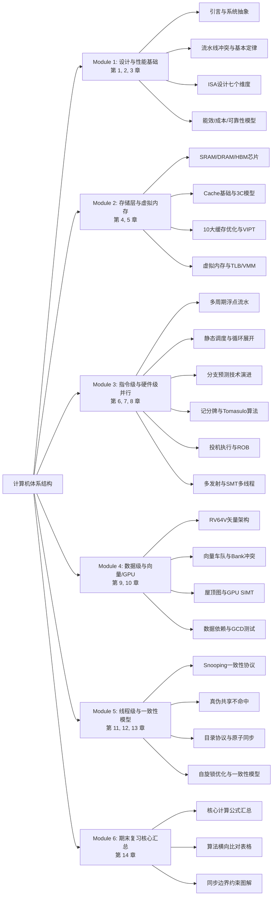

# 计算机体系结构知识地图 (CompArch Mindmap)

本章作为整门“计算机体系结构（Computer Architecture）”课程的**知识地图（Syllabus Mindmap）**，将全书 14 章的知识体系进行高度整合，划分为 **5 大核心学术模块 + 1 个复习汇总模块**。

本文件旨在像“思维导图”一样，以树状多层级嵌套列表的形式，将整个教学内容中的大类、小类、核心概念、公式、关键算法、直至微结构寄存器与硬件电路等**每一个细微的考点与知识点**全部罗列出来，便于考前自查与针对性检索。

---

## 一、 课程体系高层次知识框架

---

## 二、 模块化细粒度知识导图

### 模块 1：计算机系统设计与性能评测基础 (Module 1)
* **对应章节**：[第一章 引言](Introduction.md)、[第二章 计算机设计基础-基础篇](Fundamentals_Basics.md)、[第三章 趋势与性能评测](Trends_Performance.md)

* **1. 计算机系统抽象层与定义**
    * **计算机系统九大抽象层**：应用问题 $\to$ 算法 $\to$ 程序 $\to$ 运行时系统 $\to$ 指令集体系结构（ISA） $\to$ 微结构 $\to$ 逻辑设计 $\to$ 电路设计 $\to$ 物理与电子学。
    * **ISA（指令集体系结构）与微结构（Microarchitecture）的分界线**：
        * **ISA（显式契约）**：对软件开发人员可见。包含通用寄存器（GPR）数量/宽度、编址方式（字节寻址）、寻址模式、操作数类型、指令分类（数据传输/控制流/算术逻辑）、控制流跳转机制、指令编码（固定/可变）。
        * **微结构（物理实现）**：对软件开发人员透明。包含流水线级数、流水线调度策略、Cache大小/相联度/组织方式、分支预测器类型、执行部件（ALU）数量。
    * **定量分析方法（Quantitative Approach）**：现代计算机体系结构的设计准则，以实际应用负载下的执行时间、功耗与成本作为评估指标，进行设计折中（Trade-off）。

* **2. 经典五阶段流水线与三种冲突**
    * **五阶段 RISC 流水线**：
        * **取指（IF）**：从指令内存获取下一条指令，更新程序计数器（PC）。
        * **译码/读寄存器（ID）**：读取寄存器堆，对立即数进行符号扩展，检查冲突。
        * **执行（EX）**：进行算术逻辑运算（ALU）或计算访存内存物理地址。
        * **访存（MEM）**：读取或写入数据存储器，或更新跳转后的 PC。
        * **写回（WB）**：将结果写回寄存器堆。
    * **流水线冲突（Hazards）及其微结构级解决方案**：
        * **结构冲突（Structural Hazard）**：硬件资源不足。典型场景：单端口统一内存（Unified Memory）导致 `指令 i (Load)` 的 **MEM** 阶段与 `指令 i+3` 的 **IF** 阶段发生冲突。解决方案：**插入暂停周期（Stall / 产生气泡 Bubble）**，或采用哈佛架构（Harvard Architecture，指令和数据内存分离）。
        * **数据冲突（Data Hazard）**：指令存在数据相关性（写后读 RAW、读后写 WAR、写后写 WAW）。
            * *RAW 冲突解决方案*：旁路传播/前推技术（Forwarding/Bypassing，将 EX/MEM 或 MEM/WB 级的数据直接送入 ALU 输入端）、前半周期写后半周期读（Double Bump）、插入 Stall 暂停。
        * **控制冲突（Control Hazard）**：分支跳转指令尚未确定下一条指令地址。
            * *解决方案*：分支暂停（Stalls）、分支延迟槽（Branch Delay Slot，编译器在分支后插入一条必定执行的无关指令）、分支预测（Branch Prediction）。

* **3. 性能演进与定量设计基本定律**
    * **物理极限演进**：
        * **摩尔定律（Moore's Law）**：晶体管数量每两年翻倍，2015年趋于原子极限终结。
        * **登纳德缩放定律（Dennard Scaling）**：晶体管尺寸缩小而功耗密度保持恒定。约在 2004 年因漏电流和电压无法等比降低而终结，导致处理器主频封顶，逼迫产业转向多核（Multi-Core）发展。
    * **阿姆达尔定律（Amdahl's Law）**：
        * 整体加速比公式：$\text{Speedup} = \frac{1}{(1 - F_{\text{enhanced}}) + \frac{F_{\text{enhanced}}}{S_{\text{enhanced}}}}$
        * 加速极限：当 $S_{\text{enhanced}} \to \infty$ 时，最大加速比为 $\frac{1}{1 - F_{\text{enhanced}}}$。
        * 核心设计准则：**使常见情况变快（Make common case fast）**。
    * **Lhadma 定律**：作为阿姆达尔定律的补充，强调**不能让非常规（未优化）的情况变得太慢（Yet uncommon case not so slow）**。
    * **计算机五大分类及瓶颈**：个人移动设备 PMD（能效/散热/软实时）、桌面计算（性价比/单机计算）、服务器（可用性/吞吐量/扩展性）、仓储级计算机 WSC（性价比/能源效率/电力网络带宽）、嵌入式（极度价格敏感/低功耗/无第三方软件）。
    * **并行性四大层级**：数据级并行（DLP）、任务级并行（TLP）、指令级并行（ILP，硬件发掘）、请求级并行（RLP）。
    * **弗林分类法（Flynn's Classification）**：SISD、SIMD（发掘 DLP，矢量/GPU）、MISD（无实现）、MIMD（发掘 TLP 与 RLP，多核/多处理器）。

* **4. ISA 设计的七个关键维度**
    * **1. ISA 的分类**：寄存器-内存型（Register-Memory，如 x86，允许访存计算） vs 加载-存储型（Load-Store / Register-Register，如 RISC-V/ARM，计算只能通过寄存器）。
    * **2. 内存寻址与对齐**：字节寻址。内存对齐边界（地址对齐：$Address \bmod Size == 0$），未对齐访存需要两次内存访问及硬件拼接，损耗性能。
    * **3. 寻址方式**：RISC-V 仅支持 3 种（寄存器、立即数、偏移量/位移寻址）；x86/ARM 支持复杂寻址（比例变址 Scaled index、自增自减 Autoincrement/Autodecrement）。
    * **4. 操作数类型与大小**：8位（字符）、16位（半字）、32位（字）、64位（双字）、单精度/双精度浮点数。
    * **5. 操作指令分类**：数据传输、算术逻辑、控制流、浮点。
    * **6. 控制流指令**：条件分支、无条件跳转、过程调用与返回。利用**跳转并链接（Jump and Link）**机制将返回地址保存在链接寄存器（Link Register, 如 `ra`）中。
    * **7. 指令集编码**：固定长度编码（RISC-V/ARMv8 均为 32 位，简化流水线译码） vs 可变长度编码（x86 1-18 字节，高代码密度但译码极其复杂）。

* **5. 趋势、能效、成本与可靠性定量模型**
    * **带宽优先于延迟原则（Bandwidth over Latency）**：硬件带宽的改进速度远快于延迟，设计应重点通过多线程等手段隐藏延迟，最大化吞吐。
    * **功耗与能效优化模型**：
        * 动态功耗公式：$\text{Power}_{\text{dynamic}} \propto \frac{1}{2} \times C \times V^2 \times f$
        * 单次任务动态能量公式：$\text{Energy}_{\text{dynamic}} \propto C \times V^2$
        * 优化手段：动态电压频率调节（DVFS）、门控时钟/电源（Clock/Power Gating）、多核低频并行运行、Dark Silicon（暗硅效应）。
    * **集成电路成本模型**：
        * 芯片成本：$\text{Chip Cost} = \frac{\text{Die Cost}}{\text{Yield}}$
        * 晶片（Die）成本与面积关系：$\text{Die Cost} \propto \text{Die Area}^{\alpha}$（$\alpha$ 取值 3~4，成本随面积指数上升）。
        * 良率（Yield）公式：$\text{Yield} = \text{Wafer Yield} \times \left(1 + \frac{\text{Defect Density} \times \text{Die Area}}{N}\right)^{-N}$。
        * 财务指标：CAPEX（资本支出，折旧计入芯片成本）与 OPEX（运营支出）。
    * **可靠性与可信赖性**：
        * 逻辑链条：故障（Fault，物理缺陷） $\to$ 错误（Error，状态异常） $\to$ 失效（Failure，系统功能丧失）。
        * 指标公式：MTTR（平均修复时间）、MTTF（平均无故障时间）、FIT（10^9小时内失效数，$\text{FIT} = 10^9 / \text{MTTF}$）、MTBF（平均失效间隔时间，$\text{MTBF} = \text{MTTF} + \text{MTTR}$）。
        * 系统可用性（Availability）：$\text{Availability} = \frac{\text{MTTF}}{\text{MTTF} + \text{MTTR}}$
        * **RAID 级别对比**：RAID 0（条带化，无容错） $\to$ RAID 1（纯镜像） $\to$ RAID 3（位交叉校验，单一校验盘） $\to$ RAID 4（块交叉校验，单一校验盘） $\to$ RAID 5（分布式块校验，消除校验写瓶颈） $\to$ RAID 6（双重分布式校验，可容忍两个物理盘损坏）。
    * **性能评测基础**：
        * 性能衡量：SPECCPU 跑分测试、几何平均数（Geometric Mean）汇总。
        * 局部性原理（Principle of Locality）：时间局部性（刚才访问过的地址马上会再次访问）与空间局部性（刚才访问的地址邻近的地址会被访问）。
        * CPU 时间核心铁律：$\text{CPU Time} = \text{Instruction Count} \times \text{CPI} \times \text{Clock Cycle Time}$

---

### 模块 2：存储层次结构与虚拟内存管理 (Module 2)
* **对应章节**：[第四章 存储层次结构基础](Memory_Basics.md)、[第五章 存储层次结构高级篇](Memory_Advances.md)

* **1. 存储芯片底座与非易失可靠性**
    * **SRAM vs DRAM**：
        * **SRAM（静态随机存储器）**：6个晶体管（6T）结构，速度极快（匹配CPU），集成度低，功耗大，用作一级/二级缓存。
        * **DRAM（动态随机存储器）**：1个晶体管和1个电容（1T1C）结构，集成度极高，速度慢，读出具有破坏性（Destructive Read，需 Row Buffer 重写恢复），电容漏电需要定期刷新（Refresh）。
    * **DRAM 性能优化技术**：
        * 异步 DRAM $\to$ 同步 SDRAM（时钟同步） $\to$ 双倍数据率 DDR（时钟上升沿和下降沿均传输数据）。
        * HBM（高带宽内存）：通过硅通孔（TSV）技术进行 3D 堆叠，提供超宽总线带宽。
    * **非易失存储与可靠性**：
        * 闪存（Flash Memory）：NAND型（高集成度，适合SSD）、NOR型（支持按字节读取，适合存放引导代码，写入慢）。
        * 内存可靠性保护：ECC（纠正单比特错误，检测双比特错误）、Chipkill 技术（提供多比特甚至整颗DRAM芯片损坏的容错能力）。

* **2. Cache 基础与经典 3C 冲突模型**
    * **Cache 映射结构**：直接映射（Direct-Mapped，每块映射到唯一组）、组相联（Set-Associative，每块映射到固定组的任意路）、全相联（Fully-Associative，任意块可映射到任意位置）。
    * **地址划分**：虚拟/物理地址 = 标记（Tag） + 索引（Index） + 块偏移（Offset）。
    * **3C 冲突模型**：
        * **规避/强制不命中（Compulsory Miss）**：首次访问该数据块。
        * **容量不命中（Capacity Miss）**：Cache 容量不足，容不下程序运行所需的全部工作集，导致被替换。
        * **冲突不命中（Conflict Miss）**：发生在直接映射或组相联中，多个数据块映射到同一个 Set 引起频繁替换。
    * **缓存设计 2:1 规则**：容量为 $N$ 的直接映射缓存，其不命中率约等于容量为 $N/2$ 的两路组相联缓存。

* **3. 经典与高级 Cache 优化大纲（十项技术）**
    * **平均内存访问时间（AMAT）**：$\text{AMAT} = \text{Hit Time} + \text{Miss Rate} \times \text{Miss Penalty}$
    * **多级缓存机制**：
        * 本地不命中率（Local Miss Rate） = $\text{当前级 Miss 数} / \text{到达当前级的访问数}$。
        * 全局不命中率（Global Miss Rate） = $\text{当前级 Miss 数} / \text{CPU 发出的总访问数}$。
        * L1/L2 嵌套下 AMAT：$\text{AMAT} = \text{Hit Time}_{\text{L1}} + \text{Miss Rate}_{\text{L1}} \times \left(\text{Hit Time}_{\text{L2}} + \text{Miss Rate}_{\text{L2}} \times \text{Miss Penalty}_{\text{L2}}\right)$。
    * **VIPT（虚拟索引物理标记）及无别名约束**：
        * 工作原理：利用虚拟地址中的 Index 字段与 Page Offset 重叠，在 TLB 进行虚拟地址到物理地址翻译的同时，并行访问 Cache 提取 Tag，最后用翻译出来的物理 Tag 进行比较。
        * **无别名物理约束条件**：$\text{Index + Offset 的位数} \le \text{Page Offset 的位数}$，即 $\text{Set Size（单路容量）} \le \text{页大小（Page Size）}$。
    * **十项高级 Cache 优化技术**：
        * 1. **小而简单的 L1 Cache**：降低命中时间（Hit Time）与电容功耗。
        * 2. **路预测（Way Prediction）**：组相联中先预测路，降低 Tag 比较功耗和命中时间。
        * 3. **缓存流水化（Pipelining Cache）**：将 Cache 访问拆分为多个流水级，配合高频处理器。
        * 4. **非阻塞缓存（Non-blocking Cache）**：允许在 Miss 发生时继续响应后续的读写 Hit（Hit under Miss）或 Miss（Miss under Miss）。
        * 5. **多信道与多 Bank 缓存（Multibanked Cache）**：将 Cache 划分为多个独立的物理 Bank，支持并行读写。
        * 6. **关键字优先与提前重启（Critical Word First & Early Restart）**：发生 Miss 时，先将当前指令需要的字（Critical Word）调入，CPU 立即恢复运行，其余字在后台静默加载。
        * 7. **合并写缓冲区（Merging Write Buffer）**：写缓冲区中将相邻的连续物理写合并为一个大写块，节省总线写带宽。
        * 8. **编译器级优化**：循环嵌套交换（Loop Interchange）、分块（Blocking/Tiling，将矩阵划分为子块以容纳在 Cache 中）、数组合并。
        * 9. **硬件预取（Hardware Prefetching）**：硬件自动分析访存流，提前将数据/指令预取进 Cache。
        * 10. **编译器指示预取（Software Prefetching）**：编译器在代码中显式插入非阻塞预取指令。

* **4. 虚拟内存、TLB与虚拟机安全**
    * **虚拟内存核心机制**：分页机制，实现进程地址空间保护、物理内存安全共享、逻辑空间扩容。
    * **快表（TLB, Translation Lookaside Buffer）**：
        * 结构：存放近期翻译过的页表项（PTE）的高相联度 Cache。
        * 转换流程：输入虚拟地址 $\to$ 并行检索所有 Tag $\to$ 检查访问权限保护 $\to$ 命中输出物理页框号 $\to$ 与页内偏移拼接为物理地址。
    * **页大小的选择折中**：大页可以减少多级页表的级数、降低 TLB 不命中率，但会导致页内碎片严重，浪费物理空间。
    * **虚拟机监控器（VMM/Hypervisor）与地址翻译**：
        * 硬件拦截机制：敏感指令（如修改页表基址）必须陷入 VMM 执行。
        * 二阶段地址翻译：客户机虚拟地址（GVA） $\to$ 客户机物理地址（GPA） $\to$ 宿主机物理地址（HPA）。通过**影子页表（Shadow Page Tables）**或硬件辅助的**扩展页表/嵌套页表（EPT/NPT）**进行映射。

---

### 模块 3：指令级并行（ILP）与动态/静态调度 (Module 3)
* **对应章节**：[第六章 指令级并行与静态调度](ILP_Static.md)、[第七章 指令级并行与动态调度](ILP_Dynamic.md)、[第八章 硬件级并行发掘](ILP_Exploitation.md)

* **1. 浮点多周期流水线与 WAW/结构冲突**
    * **浮点流水线时空指标**：
        * **延迟（Latency）**：指令产生结果所需的周期数。
        * **重复间隔（Initiation Interval）**：流水线能够接受下一条同类指令的最小间隔周期。
    * **冲突检测电路设计**：浮点操作延迟不同导致多条指令在同一周期写回，产生 **WAW（输出相关）冲突**或**写端口结构冲突**。微结构采用**移位寄存器（Shift Register）**方法，在指令发射阶段检查未来写回周期是否冲突。

* **2. 流水线深水区 (MIPS R4000)**
    * **MIPS R4000 八阶段超流水线（Superpipelined）**：IF1, IF2, IS, RF, EX, DF1, DF2, TC, WB。
    * **深水区代价**：流水线加深增加了前推硬件的复杂度，且分支预测失败带来的暂停开销从 1 周期上升到 3 周期。

* **3. 静态调度、循环展开与迹调度**
    * **循环展开（Loop Unrolling）**：
        * 原理：将循环体复制 $N$ 次展平，通过寄存器重命名消除 WAW/WAR 相关性，合并控制分支开销。
        * 静态指令调度：编译器通过调整指令顺序，把不相关的指令塞入 Load-Use 延迟槽或分支延迟槽。
    * **迹调度（Trace Scheduling）**：提取最可能执行的路径（迹 Trace）进行全局跨分支指令调度，并插入补偿代码（Compensation Code）保证其他分支正确。
    * **超块（Superblock）**：单入口多出口的代码块，简化了静态编译调度的复杂度。

* **4. 动态分支预测技术演进**
    * **静态预测**：Predict-Taken, Predict-Not-Taken。
    * **动态预测器**：
        * **Bimodal Predictor（双模/1-bit/2-bit 预测器）**：2-bit 饱和计数器（States: Strong/Weak Taken, Strong/Weak Not Taken）能有效应对双重循环中内层循环跳出时的反复误判。
        * **关联/两级预测器（Correlating/Two-Level Predictor）**：使用全局历史寄存器（GHR）记录近期所有分支的历史流，结合分支地址 Index 共同检索预测器。
        * **锦标赛预测器（Tournament Predictor）**：动态监视全局和局部预测器的准确率，选择最优的一个输出。
        * **TAGE 预测器**：最先进的利用多级不同历史长度的几何分布哈希表进行标签匹配的预测器。

* **5. 记分牌算法 (Scoreboarding)**
    * 经典乱序执行算法，不支持寄存器重命名，不使用 CDB 广播。
    * **四阶段流**：
        * 1. **发射（Issue）**：按序。检查功能单元是否空闲（结构冲突），且目标寄存器无其他指令写入（WAW 冲突）。
        * 2. **读操作数（Read Operands）**：乱序。等待源操作数就绪，解决 RAW 冲突。
        * 3. **执行（Execution）**：计算结果。
        * 4. **写结果（Write Result）**：乱序。检查是否存在 **WAR（反相关）冲突**（即前面的指令还没读该寄存器，当前指令不能写），无冲突方可写回寄存器。

* **6. Tomasulo 算法**
    * 采用**分布式保留站（Reservation Station）**和**公共数据总线（CDB）广播前递**。
    * **寄存器重命名消除 WAR/WAW**：指令发射时，将目标寄存器指向产生它的保留站编号（重命名）。后续指令直接从保留站的 `Qj/Qk` 等待广播，彻底消除了对寄存器物理命名的依赖（消除了 WAR 和 WAW）。
    * **保留站 7 大核心字段**：`Busy`（占用忙）、`Op`（操作码）、`Vj/Vk`（源操作数就绪后的数值）、`Qj/Qk`（产生源操作数的保留站编号，0 表示就绪）、`A`（Load/Store 访存地址偏移）。
    * **Tomasulo 三阶段流程**：
        * 1. **发射（Issue）**：从指令队列取指令。若有空闲保留站，则发射并重命名寄存器。
        * 2. **执行（Execute）**：若操作数就绪（`Qj/Qk == 0`），功能单元计算；否则在 CDB 上监听。
        * 3. **写结果（Write Result）**：计算完毕，通过 CDB 广播结果和保留站号。所有等待该结果的保留站 and 寄存器堆同时写入，并释放保留站。

* **7. 硬件投机与重排序缓冲区 (ROB)**
    * **精确中断（Precise Interrupts）**：当流水线指令发生异常时，确保异常指令之前的所有指令均已完成修改，而其后所有指令均未对系统状态做出任何改动。
    * **ROB 机制核心**：**乱序执行、顺序提交（Out-of-Order execution & In-order commit）**。所有指令乱序执行后，结果必须先写入按序分配的重排序缓冲区（ROB）中，只有当它到达 ROB 头部时，才能按顺序将结果写回寄存器或内存（提交 Commit）。
    * **ROB 四阶段流程**：
        * 1. **发射（Issue）**：按序。分配保留站与 ROB 条目。
        * 2. **执行（Execute）**：乱序。
        * 3. **写结果（Write Result）**：乱序。广播 CDB 并将数据填入 ROB，释放保留站。
        * 4. **提交（Commit）**：按序。从 ROB 头部检查，若就绪则更新寄存器堆/向内存写入，若遇到分支预测失败，则清空 ROB 中后续的所有投机指令。

* **8. 硬件级并行发掘 (Multi-issue & Multithreading)**
    * **多发射技术**：
        * **超标量（Superscalar）**：硬件在运行期动态检查指令冲突并并行发射。
        * **超长指令字（VLIW）**：编译器在编译期静态将多条无冲突指令打包成一个大指令包（Instruction Bundle），硬件无冲突检查电路，结构简单但失去二进制兼容性。
    * **动态双发射时空算例**：定量计算有投机状态（ROB 提交）与无投机状态在冲突发生时的 CPI 与执行延迟。
    * **分支目标缓冲（BTB）**：不仅预测分支方向，还在 **IF 阶段**直接提供分支跳转的**目标地址**，避免取指阶段的跳转延迟。
    * **返回地址栈（RAS）**：专门针对函数 `Call/Return` 的硬件栈，`Call` 时压入 PC+4，`Return` 时弹出，极大提升间接跳转预测准确率。
    * **多线程硬件分类**：
        * **细粒度多线程（Fine-grained）**：每周期以轮询方式切换线程，隐藏短挂起。
        * **粗粒度多线程（Coarse-grained）**：仅在发生严重挂起（如 L2 Cache Miss）时进行昂贵的线程上下文切换。
        * **同时多线程（SMT / 超线程）**：在单个时钟周期内，物理发射窗口可同时混杂发射来自不同物理线程的指令，最大化功能部件（ALU）利用率。
    * **Intel Core i7 微架构前端实例**：解码 x86 变长指令为固定长度的微操作（uops），放入乱序发射窗口。

---

### 模块 4：数据级并行（DLP）与矢量/GPU计算 (Module 4)
* **对应章节**：[第九章 数据级并行与矢量/GPU架构](DLP_Architecture.md)、[第十章 数据级并行发掘](DLP_Exploitation.md)

* **1. 向量处理器与 RV64V 架构**
    * **向量架构优势**：单条向量指令执行成百上千次数据操作，减少指令获取与译码带宽开销，消除了大量分支跳转指令。
    * **核心硬件寄存器**：向量寄存器堆（如 32 个宽寄存器）、向量长度寄存器（VL）、最大向量长度（MVL）、掩码寄存器（Vector Mask，实现向量 if-else 条件执行）。
    * **条带挖掘（Strip Mining）**：当循环迭代次数 $N$ 超过最大向量长度（MVL）时，编译器将循环拆分为以 MVL 为步长的子循环，利用 `vsetvli` 指令动态配置 VL 逐步执行。

* **2. 向量流水线执行时间与车队计算**
    * **车队（Convoy）**：一组由于无结构冲突而可以在向量流水线中重叠执行的向量指令集合。
    * **Chime（钟声）**：执行一个车队的时间指标。向量长度为 $n$ 时，具有 $m$ 个车队的向量程序总耗时大约为 $m \times n$ 周期。
    * **向量链接技术（Vector Chaining）**：相当于向量级的前推（Forwarding）。当前一条向量指令的第一个元素计算出后，无需等待整条向量写回寄存器，直接送入下一条向量操作流水线，使得两辆存在 RAW 关联的向量车队可以“合并执行”。

* **3. 内存多 Bank 组织与步长冲突**
    * **多 Bank 内存**：为了匹配向量处理器单周期高访存吞吐，主存被划分为 $M$ 个独立的 Bank，各自拥有独立的行缓冲与读写控制。
    * **步长冲突（Stride Conflict）**：当向量访存步长（Stride）与 Bank 数量不互质时，连续的元素访问会落入同一个物理 Bank 导致冲突，受限于 Bank 忙时间（Busy Time）。
    * **冲突判定公式**：$\frac{\text{LCM}(Stride, Bank)}{Stride} < \text{Bank Busy Time}$，若成立则发生冲突挂起。
    * **散布-收集（Scatter-Gather）**：针对稀疏矩阵的非连续地址寻址（`vindex` 向量寄存器寻址）。

* **4. 屋顶图模型与 GPU SIMT 架构**
    * **屋顶图模型（Roofline Model）**：
        * 横轴：计算强度（Operational Intensity，单位 FLOPs/Byte）。
        * 纵轴：实际达到的浮点性能（GFLOPs/sec）。
        * 拐点：决定了程序是受限于**计算瓶颈（Compute-bound）**还是受限于**带宽瓶颈（Memory-bound）**。
    * **GPU 软件映射结构**：线程（Thread） $\to$ 线程束（Warp，基本调度单元，32个线程） $\to$ 线程块（Thread Block，映射到 SM） $\to$ 网格（Grid，映射到整个 GPU 芯片）。
    * **SIMT（单指令多线程）与分支分歧（Branch Divergence）**：一个 Warp 的 32 个线程在硬件 Lane 上共享同一指令发射器。如果 Warp 内部发生 if-else 分支走向不同路径，硬件必须通过**分支同步栈（Branch Divergence Stack）**对不同路径进行掩码串行化执行，严重损害效率。
    * **GPU 内存层次**：高频低延迟的寄存器与共享内存（Shared Memory，SM 内多 Bank 共享），大容量高延迟的全局内存（Global Memory，DRAM，需通过合并访存 Coalescing 降低延迟）。

* **5. 数据级并行发掘（数据相关性与 GCD 测试）**
    * **循环携带相关性（Loop-Carried Dependence）**：当前迭代的数据计算依赖于之前迭代的计算结果，导致循环无法直接并行化。
    * **仿射索引（Affine Index）**：数组下标表现为循环计数器 $i, j$ 的线性组合（如 $a \cdot i + b$）。
    * **最大公约数测试（GCD Test）**：
        * 原理：检测是否存在数据冲突。对于访存下标 $a \cdot i + b$ 和 $c \cdot j + d$，若满足：
        * $\text{GCD}(a, c)$ 能整除 $(d - b)$
        * 则在循环范围内**可能**存在数据相关性，无法直接进行硬件级并行展开。
    * **重构消除相关性**：利用**标量展开（Scalar Expansion）**将标量变为向量数组，或者利用**并行归约（Reduction）**重构消除名字相关（WAW/WAR）。

---

### 模块 5：线程级并行（TLP）与一致性模型 (Module 5)
* **对应章节**：[第十一章 线程级并行与缓存一致性](TLP_Coherence.md)、[第十二章 线程级并行与内存一致性](TLP_Consistency.md)、[第十三章 线程级并行发掘](TLP_Exploitation.md)

* **1. 多处理器存储架构与并行阻碍**
    * **UMA（均匀访存模型）**：SMP 架构，所有核心共享一个物理内存，总线相连，访问物理内存延迟相同，扩展规模受限。
    * **NUMA（非均匀访存模型）**：DSM 架构，内存分布在各节点，访问本地内存极快，跨网络访问远程节点慢，扩展性极高。
    * **多处理器定量计算**：结合阿姆达尔定律、通信延迟 CPI 折算进行规模评估。

* **2. 缓存一致性监听协议 (Snooping Coherence)**
    * **一致性（Coherence）定义**：确保对同一内存位置的读写操作在所有核心的 Cache 中保持同步。包括写传播（修改后能通知他人）和写串行化（所有人看到的写顺序一致）。
    * **MSI 监听协议**：
        * **M（Modified）**：数据被修改，且是系统中唯一的最新副本（脏且独占），拥有写回内存的责任。
        * **S（Shared）**：数据干净，系统中可能有多个核心同时拥有该副本。
        * **I（Invalid）**：本 Cache 块无效。
        * *核心总线动作*：PrRd/PrWr（处理器读写）、BusRd（总线读）、BusRdX（总线读独占，准备写）、BusUpgr（总线升级，S 变 M）。
    * **协议高级扩展**：
        * **MESI 协议**：增加 **E（Exclusive）**。块干净且独占，写该数据时无需通过总线发送失效信号，大幅降低单线程独占读写时的总线负荷。
        * **MOESI 协议**：增加 **O（Owned）**。共享且脏状态，Owner 核心持有最新脏块，其他核心持有 S 状态，读时直接由 Owner 转发而无需写回主存。
        * **MESIF 协议**：增加 **F（Forward）**。指定唯一的 Shared 副本负责转发应答读请求，防止总线数据冲突。

* **3. 缓存不命中分类与真/伪共享**
    * **真共享不命中（True Sharing Miss）**：核心 A 改写了变量 $X$，核心 B 随后读取 $X$，由于缓存一致性要求，核心 B 被迫发生 Miss 去获取最新值。
    * **伪共享不命中（False Sharing Miss）**：核心 A 写入变量 $X$，核心 B 读取变量 $Y$，**但 $X$ 与 $Y$ 被存放在同一个 Cache Line 中**。核心 A 的写操作导致整个 Cache Line 失效，核心 B 读取未改动的 $Y$ 时被迫发生 Miss。
    * *判定 Trace 追踪步骤*：分析各时间戳上核心对 Cache 块的读写历史与块内变量偏移。

* **4. 分布式目录协议 (Directory Coherence)**
    * **解决痛点**：避免 Snooping 在大规模核心下广播所有读写请求的总线瓶颈。
    * **目录基本状态**：Uncached（未缓存）、Shared（干净共享，目录记录共享者节点位图 Sharing Vector）、Modified（脏独占，记录独占者 Owner 节点编号）。
    * **读写 Miss 控制流**：Local 核心向 Home 节点发送请求 $\to$ Home 查找目录，向 Owner 节点发送 Invalid/Fetch 消息 $\to$ Owner 将数据回送 Home/Local 并修改目录状态。

* **5. 硬件同步机制与自旋锁优化**
    * **原子操作对 `lr/sc`**：
        * `lr.d rd, (rs1)`：载入保留值，并在该物理地址的监控器上注册“保留标记”。
        * `sc.d rd, rs2, (rs1)`：条件存储。若期间该地址无其他核心写入，则写入成功（`rd` 置 0）；若保留标记已失效，则写入失败（`rd` 置非 0）。
        * *汇编锁实现*：利用 `lr/sc` 在 RISC-V 下构建原子交换（Atomic Swap）自旋锁。
    * **自旋锁的一致性流量优化**：
        * **传统自旋锁瓶颈**：自旋阶段反复执行 `amoswap` 或 `sc` 等写操作，不停争抢总线独占权，触发 Cache Line 反复失效，导致总线一致性流量发生灾难性崩溃。
        * **读自旋优化（Spin-on-Read / Test-and-Test-and-Set）**：核心在自旋等待期间，只发起普通的 **Read** 操作。锁块以 Shared 状态缓存在本地 Cache 中，不产生总线流量。只有当锁被释放（触发失效）时，核心才发起一次写操作去争抢锁。
        * 基于 `lr/sc` 过滤写流量的轻量级自旋锁设计。

* **6. 内存一致性模型与同步约束**
    * **顺序一致性（Sequential Consistency, SC）**：最严格模型，要求读写操作完全按程序顺序执行，且全局核心看到相同的交错顺序。
    * **放松一致性模型（Relaxed Consistency Models）**：
        * **TSO（Total Store Order）**：允许写后读（W $\to$ R）重排（设有写缓冲区 Write Buffer）。
        * **PSO（Partial Store Order）**：允许写后写（W $\to$ W）和写后读重排。
        * **RC / RISC-V 弱内存模型**：读写之间可任意乱序，仅在同步指令处受限。
    * **Acquire/Release 控制屏障边界**：
        * **Acquire（获取屏障, SA）**：阻止屏障**后面**的读写操作被重排到屏障**前面**（用于 Lock 操作）。
        * **Release（释放屏障, SR）**：阻止屏障**前面**的读写操作被重排到屏障**后面**（用于 Unlock操作）。

---

### 模块 6：期末复习大纲与计算公式汇总 (Module 6)
* **对应章节**：[第十四章 课程期末复习](Course_Review.md)

* **1. 全书定量计算核心公式合集**
    * 性能与时间：$\text{CPU Time} = \text{Instruction Count} \times \text{CPI} \times \text{Clock Cycle Time}$
    * 阿姆达尔定律：$S_{\text{overall}} = \frac{1}{(1 - \sum f_i) + \sum \frac{f_i}{s_i}}$
    * 缓存访存时间：$\text{AMAT} = \text{Hit Time} + \text{Miss Rate} \times \text{Miss Penalty}$
    * 含有 L2 缓存：$\text{AMAT} = \text{Hit Time}_{\text{L1}} + \text{Miss Rate}_{\text{L1}} \times \left(\text{Hit Time}_{\text{L2}} + \text{Miss Rate}_{\text{L2}} \times \text{Miss Penalty}_{\text{L2}}\right)$
    * 向量计算 Chime 时间：$\text{Execution Time} \approx m \times n$
    * 多 Bank 内存冲突判定不等式：$\frac{\text{LCM}(\text{Stride}, \text{Bank})}{\text{Stride}} < \text{Bank Busy Time}$
    * 可靠性指标：$\text{MTBF} = \text{MTTF} + \text{MTTR}$，$\text{Availability} = \frac{\text{MTTF}}{\text{MTTF} + \text{MTTR}}$

* **2. 经典指令调度控制机构横向对比**
    * 记分牌算法（Scoreboard，集中式控制、按序发射乱序执行、无重命名、通过 Stall 解决 WAR/WAW） vs Tomasulo 算法（分布式保留站控制、寄存器重命名、CDB 数据前递广播、彻底消除 WAR/WAW）。
    * 动态硬件投机（ROB）四阶段状态转移流程。

* **3. 存储层次优化及无别名（VIPT）约束**
    * VIPT 缓存设计无冲突映射判定：$\text{Index + Offset} \le \text{Page Offset}$，单路组大小不得大于系统页大小。

* **4. Acquire/Release 同步锁临界区边界约束**
    * 临界区代码保护规范，控制读写操作无法跨越同步屏障重排。
