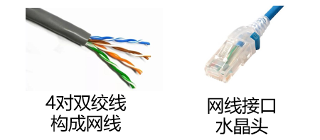
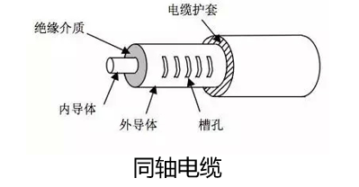

# 计算机网络

## 引言

### 网络实例

#### 网络分类与构成

- 网络分类（按地域）

    1. 个域网 PAN (Personal Area Network)：
       
        覆盖范围大致在 10 米半径以内。主要是用于便携式消费电器和个人通信设备之间的短距离通信的网络。比较常见的设备有：蓝牙耳机、智能手表、智能手环。

    2. 局域网 LAN (Local Area Network)：
       
        局部地区形成的区域网络，小到办公室，大到整个校园，一般是由单一机构管理。典型技术与应用有：有线以太网、无线 WLAN（即 Wi-Fi）、打印机共享等等。

    3. 城域网 MAN (Metropolitan Area Network)：
       
        其范围多能覆盖一个城市。一般是由运营商或者政府部门统筹建设，用来连接同城内的多个局域网。比如：有线电视网络等。

    4. 广域网 WAN (Wide Area Network)：
       
        覆盖范围极大，可以跨越省份，甚至是国家和大洲。常见设施有：海底光缆、卫星通信等。其中，因特网 (Internet) 就是全球最大的广域互联网络。
        
        > Internet：互联网/因特网，是一个专有名词。特指覆盖全球的、使用 TCP/IP 协议的互联网络。
        >
        > internet：互连网，是一个通用名词，来源于 inter-network（互联网络）。泛指把任意两个或者多个计算机网络用路由器连在一起形成的集合，它们的通信协议不一定是 TCP/IP。

- 互联网的层级结构
  
    ISP (Internet Service Provider)：网络服务提供商。

    1. Tier-1 ISP：
       
        第一层，全球最高级别的网络运营商，拥有跨大洲的全球骨干网（如中国电信、中国联通、美国 AT&T 等）。它们彼此平起平坐，核心特点是互不结算，即互相免费交换流量，不需要交过路费。

    2. Tier-2 ISP：
       
        即地区 ISP，覆盖一个国家或特定大区域的网络（如教育网、中国移动等）。因为网络无法直达全球，通常必须向更高级别的 Tier-1 ISP 购买转接服务，并支付流量费。

    3. 本地 ISP：
       
        接入网络。直接面向家庭、公司、校园网等最终用户提供宽带上网服务。

    4. IXP / IX (Internet Exchange Point)：
       
        互连网交换点。允许同级的地区 ISP 之间在此直接交换流量，无需向上绕路主干网。这既大幅降低了通信时延，又省去了向高级 ISP 支付的流量费。

- 互联网的构成

    1. 网络边缘：
       
        即主机 / 端系统。比如：手机、电脑、智能手表等。主机主要用来运行程序、产生信息并发送给互联网，接收数据并提供给应用程序。

    2. 网络核心：
       
        即互联端系统的分组交换设备以及通信链路。比如：路由器、交换机；光纤、电缆。

#### 网络边缘

- 接入网 (Access Network)
  
    目标是将主机物理连接到边缘路由器，边缘路由器就是主机去往远程端系统路径上的第一台路由器。

    1. 光纤到户 FTTH (Fiber To The Home)：
       
        我国及全球主流的高速接入方式。主要分为有源光网络 AON 和无源光网络 PON。
        
        目前最普及的是无源光网络 PON (Passive Optical Network)：局端为 OLT (光线路终端)，用户端为 ONT (光网络终端，俗称光猫)，中间通过无需供电的无源分光器分发光纤信号。
        
        具有带宽大、线路极其稳定的优势。

    2. 数字用户线 DSL (Digital Subscriber Line)：
       
        利用传统电话线的双绞铜线传输高频数据。
        
        用户端通过分路器 (Splitter) 将高频数据信号与低频语音信号分离（不同频率互不干扰），数据进入调制解调器，再汇聚到局端的 DSLAM (数字用户线接入复用器) 进入互联网。
        
        典型特点是上下行速率不对称（ADSL，下行快、上行慢）。我国已基本全面升级为 FTTH，欧美部分国家仍有大量使用。

    3. 同轴电缆 Cable 与混合光纤同轴网 HFC (Hybrid Fiber-Coaxial)：
       
        利用传统的有线电视同轴电缆接入上网。采用 HFC 结构，主干段使用光纤传输，接入家庭段使用同轴电缆连接至电缆头端 (Headend)。
        
        其核心特点是多家庭共享介质（同一片区的用户共享电缆头端总带宽，用网高峰期可能会抢占带宽），上下行速率同样不对称。

    4. 无线接入网 (Wireless Access Network)：
       
        通过无线基站或无线接入点 (AP) 将移动终端连接到路由器。主要分为两大类：

        - 无线局域网 WLAN (Wireless LAN / Wi-Fi)：主要覆盖建筑物内或周边短距离（数十米），遵循 IEEE 802.11 系列协议（如 Wi-Fi 6 理论峰值可达 9.6 Gbps）。
        - 广域移动蜂窝网络 (Cellular Network)：由移动通信运营商基站覆盖（数公里范围），包括 4G/5G 移动网络，实现全地域无缝漫游。

    5. 实际企业与家庭混合组网：
       
        现实中的接入网通常是有线与无线的混合体（如台式机接有线以太网，手机平板连 Wi-Fi）。家用无线路由器通常是一个高度集成的小盒子，内部集成了：Wi-Fi 无线接入点 (AP)、以太网交换机、路由器 (含 NAT 地址转换与防火墙)，甚至集成了调制解调器 (光猫)。

- 物理介质

    - 传输单元：bit 

        > 存储常用Byte做单位，进制为$2^{10}$
        >
        > 传输常用Bit做单位，进制为$10^3$

    - 物理媒体：发射机和接收机之间的具体链路介质
        - 引导型介质：信号在固体介质中传播，如：铜、光纤
        - 非引导型介质：信号自由传播，如：无线电

    以下为一些常见的物理媒体：

    1. 光纤：

        玻璃纤维携带光脉冲，每个脉冲代表一位信号，用于高速点对点传输。

        中继器相距很远，对电磁噪声免疫。

    2. 双绞线：

        两根绝缘铜线互相缠绕为一对。

        电话线：1对双绞线。

        网线：4对双绞线。

        {style="display: block; margin: 0 auto;" width="40%"}

    3. 同轴电缆：

        两根同心铜导线，双向传输。

        {style="display: block; margin: 0 auto;" width="40%"}

    4. 无线电：

        电磁频谱中各种波段携带的信号，没有物理的电线，不依赖介质。

        易受传播环境影响，比如：反射、物体阻挡、噪声干扰等。

        无线链路类型（范围从小到大）有：蓝牙，无线局域网/WiFi，广域/4G/5G，地面微波，卫星。

#### 网络核心

- 网络核心概述

    由互联端系统的分组交换设备（路由器、交换机）和各级通信链路构成的网状网络，目标是将海量端系统互联起来。

- 网络核心的两大功能：路由与转发

    数据分组在网络核心中依靠逐跳 (hop-by-hop) 方式从一个路由器转发到下一个路由器，最终抵达目的地。核心路由器主要承担两大功能：

    1. 路由 (Routing)：

        全局操作。路由是一个过程：路由器中的 CPU 通过与全网其他的路由器交流，掌握全网的拓扑图；然后利用路由算法和路由协议，找出最佳路径，并生成路由表 (Routing Table)。

        > 既然转发要看路由表，那么按道理路由表既可以静态被指定也可以动态调整，即对应两种路由方式：
        >
        > - 静态路由：网络管理员在登陆路由器后台后，定死一条规则：凡是发送给某网段的包，一律发给指定端口。例如：家用的路由器一般都是静态的，即默认路由。
        >
        > - 动态路由：网络核心的成千上万个路由器之间，不停地运行路由协议，进行相互交流，交换各自链路的拥堵程度和时延，然后再根据各自情况算出一张最优的路由表。

    2. 转发 (Forwarding)：

        本地操作。当路由器接收到一个数据包后，其硬件芯片通过查看包头上的 IP 地址，并通过查看路由表，找到对应的出接口，并利用内部总线将这个包发出，这就是转发。

- 典型数据交换方式

    1. 电路交换 (Circuit Switching)：

        按传统电话通信系统模型建立。通常采用面向连接方式：
        
        - 通信前必须先呼叫建立连接，实现端到端的资源预留（包括链路带宽与交换机处理能力）。
        - 物理通路被通信双方独占，资源专用，即使双方静默不传输数据，该信道也无法被其他连接共享。
        - 传输性能好、延迟固定，但信道利用率低，若中间设备发生故障则通信直接中断。
        
        电路交换常用的多路复用技术：

        - FDM (Frequency Division Multiplexing，频分多路复用)：将总带宽划分给不同频率范围，多路信号在不同频率上并行传输（如收音机不同频道）。
        - TDM (Time Division Multiplexing，时分多路复用)：将时间划分为周期性等长的帧，各用户固定轮流占用特定的时隙 (Slot) 进行传输。
        
        > 致命缺陷：无法应对计算机网络中广泛存在的突发 (Burst) 流量（即用户要么不点鼠标信道闲置，要么突然下载占满），造成严重资源浪费。

    2. 报文交换 (Message Switching)：

        采用存储-转发 (Store-and-Forward) 机制，将用户的数据作为一个完整的整体（报文，Message）进行传输。
        
        - 路由器必须接收到完整的整个数据报文后，才能开始向下一跳发送。
        - 单跳发送时延为 $L/R$（其中 $L$ 为报文位数，$R$ 为链路传输速率 bps）。
        - 缺点：大报文传输时单跳时延极高，中间路由器需要巨大的缓冲存储空间，容易引发长时间拥塞，现代网络已极少使用。

    3. 分组交换 (Packet Switching，也称包交换)：

        现代计算机互联网的核心基石。
        
        - 将大报文拆分成多个较小的数据块，称为分组 (Packet)。
        - 每个分组的首部（Header）都包含源地址和目的地址等控制信息，各个分组在网络中独立选择传输路径。
        - 同样采用存储-转发机制，但由于分组体积小，多个分组可以在各链路间流水线式并发传输，极大降低了整体时延。
        - 核心优势——统计多路复用 (Statistical Multiplexing)：不同主机产生的分组按需动态共享信道带宽，谁有数据谁发，不发时不占用资源，网络信道利用率极高。

- 三种交换方式的对比总结

    | 交换方式 | 建立连接 | 传输单位 | 资源共享方式 | 优缺点与适用场景 |
    | :--- | :--- | :--- | :--- | :--- |
    | 电路交换 | 需先建立连接并预留资源 | 连续比特流（直达） | 双方独占，不与其他连接共享 | 延迟稳定但利用率低，适合电话语音等连续通信，难以应对突发流量 |
    | 报文交换 | 无需建立连接 | 完整大报文 (Message) | 存储-转发，按需共享 | 无需预留资源，但单跳延迟大、路由器缓存压力大，现代网络已淘汰 |
    | 分组交换 | 无需建立连接 | 较小的数据分组 (Packet) | 存储-转发，统计多路复用按需共享带宽 | 延迟小（流水线传输）、抗毁性强、灵活性高，最适合有海量突发数据传输需求的互联网 |

### 协议与分层结构

- 网络协议与设计目的

    1. 网络协议 (Network Protocol)：
       
        为在网络中进行数据交换而建立的规则、标准或约定。通信双方必须共同遵守，互相理解。
        
        协议三要素：
        - 语法：规定传输数据的格式，即怎么讲。
        - 语义：规定所要完成的功能，即讲什么。
        - 时序：规定各种操作的先后顺序，即双方讲话的次序。

    2. 协议设计目标：
       
        网络协议设计主要为了解决五个核心问题：可靠性、资源分配、拥塞控制、自适应性以及网络安全。

- 协议分层结构

    1. 分层的必要性：
       
        计算机网络极其复杂且高度异构，传输介质多样，接入方式各异，新技术层出不穷。分层结构能够将复杂的大系统拆分成清晰独立的模块：各层功能独立，接口统一，下层技术的演化不会影响上层应用。

    2. 体系结构核心术语：
       
        - 层次栈 (Protocol Stack)：网络使用分层结构，每一层都使用下一层提供的服务，并为上一层提供自己的服务。
        - 对等实体 (Peer)：不同机器上处于同一层次的活动实体。
        - 接口 (Interface)：相邻两层之间的边界，定义了下层向上层提供哪些具体服务原语。
        - 网络体系结构：层和协议的集合称为网络体系结构，具体系统使用的一组协议实现称为协议栈。

    3. 数据的封装与解封装：
       
        - 发送端层层封装 (Encapsulation)：应用层数据向下逐层传递，每一层为其添加本层的控制首部 (Header)。
        - 接收端层层解封装 (De-encapsulation)：自底向上逐层剥离首部，最终还原出原始数据。
        - 协议数据单元 PDU (Protocol Data Unit)：不同层对应的数据传输单元。应用层为消息或报文 (Message)，传输层为段 (Segment)，网络层为数据报或分组 (Packet)，数据链路层为帧 (Frame)，物理层为比特 (Bit)。

- 服务原语与服务和协议的关系

    1. 两类基本服务：
       
        - 面向连接：按照电话系统模型建立。通信前先建立连接并确认，数据传输过程保持同步与确认，通信结束后释放连接。
        - 无连接：按照邮政系统模型建立。数据包携带完整的目标地址直接发出，传输过程无需提前建立连接，也不需要逐跳应答。

    2. 服务原语 (Service Primitives)：
       
        用户进程用来访问下层服务所调用的一组基本操作。面向连接的核心原语包括：连接请求、接受响应、请求数据、应答、请求断开、断开连接。

    3. 服务与协议的关系：
       
        - 协议是水平的：对等实体之间通信必须遵守的规约。
        - 服务是垂直的：下层实体向上层实体提供的功能，上层实体通过接口使用下层实体的服务。
        - 实体使用本层的协议来实现它向上层承诺提供的服务。

### 参考模型

- OSI 7 层参考模型 (Open Systems Interconnection)

    由国际标准化组织 ISO 提出的 7 层理论模型：

    1. 物理层 (Physical Layer)：
       
        定义如何在信道上传输 0 和 1 比特流。规范了机械接口大小形状、电气信号电压电流、时序接口采样频率与物理传输介质。

    2. 数据链路层 (Data Link Layer)：
       
        实现相邻网络实体间的数据传输。核心功能包括成帧 (Framing)、错误检测与纠正、基于 48 位硬件物理地址 (MAC 地址) 进行寻址、流量控制以及共享信道上的介质访问控制。

    3. 网络层 (Network Layer)：
       
        负责将数据包跨越网络从源设备发送到目的设备 (Host to Host)。核心功能是路由选择 (Routing) 与数据转发，处理拥塞控制、服务质量控制以及异构网络互联。
        
        > 为什么有了 MAC 地址还需要 IP 地址？MAC 地址是烧录在网卡上的扁平物理地址，没有层次结构；IP 地址具有层次化的网络拓扑结构，能够支持全球路由器进行高效的路由汇总和查表寻路。

    4. 传输层 (Transport Layer)：
       
        负责端系统之间进程到进程 (Process to Process) 的端到端数据传输，通过端口号区分主机上的不同进程。分为可靠传输模式与不可靠传输模式。

    5. 会话层 (Session Layer)：
       
        在应用程序之间建立、管理和维持会话，并使会话获得同步。

    6. 表示层 (Presentation Layer)：
       
        关注所传递信息的语法和语义，管理数据的表示方法、数据结构转换、加密解密和数据压缩。

    7. 应用层 (Application Layer)：
       
        直接面向用户的网络应用程序，提供便捷的网络服务调用接口。

- TCP/IP 参考模型

    互联网实际采用的 4 层事实标准：

    1. 层次划分：
       
        - 网络接口层 (Host-to-Network Layer)：描述了链路为无连接的互联网层必须提供的基本功能，定义主机与传输线路之间的接口。
        - 互联网层 (Internet Layer)：以 IP 协议为核心，允许主机将数据包注入网络并独立传输至目的地。
        - 传输层 (Transport Layer)：允许源主机与目的主机上的对等实体进行端到端通信，提供 TCP 协议（面向连接可靠字节流）与 UDP 协议（无连接不可靠数据报）。
        - 应用层 (Application Layer)：包含所有高层协议（如 DNS、HTTP、FTP、SMTP 等），吸收了 OSI 模型中表示层与会话层的功能。

    2. 设计哲学（端到端原则）：
       
        - 摒弃了电话系统中笨终端与聪明网络的设计思路，采用聪明终端与简单网络。
        - 网络核心功能尽可能简单，只负责通过路由表快速转发 IP 分组，丢失恢复等复杂工作交给边缘端系统，极大提升了网络的可扩展性。
        - IP 沙漏模型：中间唯一的 IP 层实现了 IP over everything（可以在各种底层物理网络上运行）以及 Everything over IP（可以支撑各种各样的上层网络应用）。

    3. OSI 模型与 TCP/IP 模型的对比与不足：
       
        - OSI 的不足：时机糟糕（推出时 TCP/IP 已随 UNIX 广泛普及并免费使用）；模型过于复杂，会话层和表示层内容很少，数据链路层和网络层又过于繁杂，且差错控制等功能在不同层反复出现；属于官方强加标准。
        - TCP/IP 的不足：未严格区分服务、接口和协议等核心概念；通用性较差，不适合描述其他协议栈；网络接口层混淆了接口与分层，且未包含物理层与数据链路层等重要底层细节。

    4. 教学采用的 5 层折中模型：
       
        结合 OSI 的概念清晰性与 TCP/IP 的实用性，自顶向下分为：应用层、传输层、网络层、数据链路层、物理层。

### 网络应用与套接字编程

- 应用程序架构与进程标识

    1. 客户-服务器体系结构 (C/S 架构，Client/Server)：
       
        网络应用最主流的架构形式。
        
        - 服务器 (Server)：一台总是在线的主机，运行服务器程序，具有永久且熟知的 IP 地址和端口号，被动等待客户请求。
        - 客户端 (Client)：运行在用户终端上的程序，在需要时主动向服务器发起通信并请求服务。客户之间彼此不通信。

    2. 进程标识与端口号 (Port Number)：
       
        仅凭主机 IP 地址只能定位到具体机器，无法区分该主机上同时运行的多个网络程序。因此操作系统使用端口号来区分不同进程。
        
        网络通信中的完整端点标识由主机 IP 地址与端口号构成的二元组决定。

- 套接字核心概念与地址结构

    1. 套接字 API (Socket API)：
       
        源自 1981 年加州大学伯克利分校在 BSD UNIX 4.1 中引入的接口，现已成为编写因特网网络程序的通用工业标准。应用通过该接口调用传输层的 TCP 可靠字节流服务或 UDP 不可靠数据报服务。

    2. 通用地址结构 sockaddr：
       
        作为不同网络协议族地址结构的通用父类，主要包含 2 字节的地址族标识 sa_family 以及 14 字节的地址数据内容 sa_data。在系统调用传参时通常需要做强制类型转换。

    3. IPv4 专有地址结构 sockaddr_in：
       
        编程中处理 IPv4 地址时实际使用的结构体：
        
        - sin_family：地址族，固定为 AF_INET。
        - sin_port：16 位端口号，必须按照网络字节序存储。
        - sin_addr：32 位 IPv4 地址，存储为无符号整型数。
        - sin_zero：8 字节保留空字节，用于使该结构体大小与通用结构体 sockaddr 保持一致。

- 核心套接字系统调用 API

    1. 创建套接字 socket：
       
        向内核申请创建套接字，返回套接字描述符。参数包括地址族（如 IPv4 对应的 AF_INET）、套接字类型（TCP 对应 SOCK_STREAM，UDP 对应 SOCK_DGRAM）以及特定协议号。该描述符在 Linux 中与普通文件描述符兼容，可直接使用 read 和 write 进行数据读写。

    2. 绑定地址 bind：
       
        将套接字描述符与本地地址及端口进行绑定。服务器必须显式调用以公布自己的熟知端口供客户端寻址；客户端通常无需调用，由操作系统自动为其分配 1024 到 5000 之间的临时端口。

    3. 监听套接字 listen：
       
        TCP 服务器专用调用。将主动套接字转变为被动监听套接字，并设置参数 backlog 用于限定系统未完成连接队列的最大长度。

    4. 接受连接 accept：
       
        TCP 服务器专用调用。从已完成三次握手的连接队列中取出一个就绪的客户端连接，返回一个全新的套接字描述符（已连接套接字），专门用于与该客户端进行后续数据交互。
        
        > 核心区别：监听套接字全程只有一个，负责持续等待新的连接；已连接套接字在每次建立连接后单独生成，数据交互完毕后即可关闭。此机制允许服务器并发服务多个客户。

    5. 发起连接 connect：
       
        TCP 客户端专用调用。客户端通过该接口向目标服务器的 IP 和端口主动发起建立连接的请求，底层触发 TCP 三次握手过程，调用过程为阻塞状态直至连接建立完毕或超时出错。

    6. 数据收发与关闭 close：
       
        - TCP 收发：直接面向连接通道调用 read 和 write，或者使用 send 和 recv。
        - UDP 收发：由于无连接，每次收发必须显式指定目标地址或获取来源地址，分别调用 sendto 与 recvfrom。
        - 关闭连接 close：对于 TCP 套接字，调用会向对端发送断开连接通知并触发四次挥手；对于 UDP 套接字，调用则直接通知内核释放该描述符占用的系统资源。

### 计算机网络性能度量指标

- 速率、带宽与吞吐量

    1. 比特率与数据率 (Bit Rate)：
       
        主机在数字信道上传送数据的速率，单位为比特每秒 (b/s 或 bps)。在通信度量中，进率遵循十进制，即 1 kbps = $10^3$ bps，1 Mbps = $10^6$ bps，1 Gbps = $10^9$ bps。注意区分计算机内部数据存储采用的二进制字节层级（1 KB = $2^{10}$ 字节）。

    2. 带宽 (Bandwidth)：
       
        网络通道传送数据的能力，即单位时间内某条信道所能通过的最高数据率，单位同样为 bit/s。

    3. 包转发率与线速 (Packet Per Second, PPS)：
       
        交换机或路由器等设备以分组为单位的处理与转发速率。线速转发指网络设备端口在满负荷工况下，对数据包转发速率达到了该物理线路允许的最高极限速度。

    4. 吞吐量 (Throughput) 与有效吞吐量 (Goodput)：
       
        - 吞吐量：单位时间内通过某个网络、信道或接口的实际数据量总量。
        - 有效吞吐量：单位时间内目的端真正正确接收到的有用数据量，排除了因丢包产生的重复重传数据和协议冗余开销。

- 网络时延体系

    时延 (Delay / Latency) 指数据从网络一端传送到另一端所需的总时间。数据在端到端传输过程中的总时延由四部分相加构成：

    1. 传输时延 / 发送时延：
       
        主机或路由器将数据分组推送到传输物理介质上所需要的时间。
        
        计算公式为：数据分组长度 L (bit) 除以 链路传输速率 R (bit/s)，即 $d_{trans} = L / R$。

    2. 传播时延：
       
        电磁波在物理信道介质中传播一定距离所花费的时间。
        
        计算公式为：两节点间的物理距离 Distance (m) 除以 电磁波在该介质中的传播速度 c (m/s)，即 $d_{prop} = \text{Distance} / c$。
        
        > 在光纤和铜线介质中，电磁波的传播速度通常约为光速的三分之二，即大约每秒 20 万公里 ($2 \times 10^8\text{ m/s}$)。

    3. 节点处理时延：
       
        主机或路由器在收到数据分组后，对分组进行分析所花费的时间。包括检查首部差错、校验数据完整性以及检索本地路由表决定输出接口等。现代高速路由器该时延通常在微秒级别。

    4. 排队时延：
       
        数据分组在路由器的输入输出缓冲区队列中等待处理和发送所经历的时间。排队时延完全取决于网络当前的拥塞程度和瞬时到达流量，变动幅度极大且难以精确预测。

- 往返时延与时延带宽积

    1. 往返时延 RTT (Round-Trip Time)：
       
        从发送方发送一个数据包开始，到发送方收到接收方返回的确认信息所经历的总耗时。网络诊断工具 Ping 主要就是通过计算 ICMP 报文的 RTT 来评估链路连通质量与时延水平。

    2. 时延带宽积 (Bandwidth-Delay Product)：
       
        传播时延与链路带宽的乘积，计算公式为：时延带宽积 = 传播时延 $\times$ 带宽。
        
        其物理意义为按比特计数的链路物理容量。代表发送端连续发送数据时，当发出的第一个比特刚好抵达链路终点瞬间，整条物理管道中正在向前传播的比特总数。只有当链路管道充满比特时，信道才得到了最充分的利用。

- 丢包率、利用率与时延抖动

    1. 丢包率 (Packet Loss Rate)：
       
        传输过程中丢失的数据包数量占全部发送数据包总数的比率。网络丢包绝大多数并非物理线缆损坏，而是因为路由器排队队列溢出，新到达的分组无处存放而被主动丢弃。

    2. 利用率 (Utilization)：
       
        某信道被实际使用的时间占总时间的百分比。网络利用率过高会导致排队时延急剧上升，通常当利用率超过百分之五十时，网络时延就会显著恶化。

    3. 时延抖动 (Jitter)：
       
        时延在时间上的变化不稳定性。主要源于网络中各路由器排队队列长短的剧烈起伏。时延抖动对于网页浏览等非实时应用影响有限，但对语音通话、视频会议和在线游戏等多媒体交互业务会带来严重的卡顿脱节体验。

### 网络安全基础

- 常见网络威胁与攻击形式

    1. 互联网早期的安全缺陷：
       
        因特网最初由科研和军方机构设计时，假设环境是一组相互信任的用户连接到一个透明的网络中，底层 TCP/IP 体系未内置强制加密与身份防伪机制，为后续安全威胁埋下了根源。

    2. 常见恶意软件：
       
        - 病毒 (Virus)：需要依赖用户的主动交互（如打开带毒邮件附件、运行未知程序）才能完成感染并寄生扩散的恶意代码。
        - 蠕虫 (Worm)：无须用户进行显式交互即可独立在网络中运行和传播的程序。通过持续扫描网络中存在系统漏洞的主机进行自动化自主入侵，典型代表如利用永恒之蓝漏洞传播的 WannaCry 勒索病毒。

    3. 拒绝服务攻击 DoS 与分布式拒绝服务攻击 DDoS：
       
        攻击者制造海量虚假垃圾流量占用网络带宽或系统处理能力，使正常合法用户的请求无法获得响应。攻击者通常先通过病毒程序感染大量联网设备构建僵尸网络 (Botnet)，再通过僵尸网络集中对目标主机发动分布式流量轰炸。

    4. 数据截获与伪造：
       
        - 数据包嗅探 (Packet Sniffing)：在共享局域网中，攻击者通过将网卡设置为混杂模式，被动读取并记录传输线路上经过的所有明文数据包。
        - IP 欺骗 (IP Spoofing)：攻击者伪造数据包首部的源 IP 地址，用于冒充合法可信系统身份或干扰安全追溯。

- 核心网络安全防御手段

    1. 身份认证：通过凭证、令牌等机制确认通信实体身份的真实性。
    2. 数据加密：利用对称加密或非对称加密算法保证数据在线路传输中的机密性。
    3. 完整性检查与数字签名：通过哈希校验与数字签名机制检测数据传输过程中是否被恶意篡改，并提供抗抵赖性。
    4. 防火墙与隔离：部署在网络边缘和核心边界处的专用安全检查屏障，依据既定安全规则严格过滤异常网络流量，隔离保护内部网络。

### 标准化组织与互联网演进

- 核心标准化组织与 RFC 机制

    1. 官方国际标准组织：
       
        - ISO (国际标准化组织)：制定了国际标准 ISO 7498，即著名的 OSI 7 层网络参考模型。
        - ITU (国际电信联盟)：联合国专门机构，下属 ITU-R 负责无线频谱分配，ITU-T 负责制定全球电信网络标准。

    2. 工程与行业组织：
       
        - IEEE (电气和电子工程师协会)：全球最大的专业技术组织，在通信领域最著名的贡献是制定了 IEEE 802 系列局域网标准，包括以太网标准 802.3 与无线局域网 Wi-Fi 标准 802.11。
        - W3C (万维网联盟)：负责制定 Web 技术的通用标准，包括 HTML、CSS、DOM 等规范。

    3. 互联网事实标准与 IETF：
       
        - IETF (互联网工程任务组)：制定互联网核心标准（如 TCP、IP、HTTP 等）的民间国际权威机构。
        - RFC 文档 (Request For Comments，请求评注)：互联网核心标准的公开发布形式，向全球免费公开。任何标准均需经过工作组充分讨论、邮件列表论证以及实际代码运行验证，最终才被正式确立为 RFC 事实标准。
        - IETF 的核心文化：信奉粗略共识与可运行代码，拒绝单一行政权威与空洞投票，一切以代码工程实测有效为准。

- 互联网发展里程碑

    1. 早期诞生阶段：
       
        - 1969 年：美国国防部高级研究计划局建立 ARPANET，首次在实际工程中采用分组交换技术，最初连接 UCLA、SRI、UCSB 与犹他大学 4 个节点。
        - 1983 年：ARPANET 全面改用 TCP/IP 协议族，标志着现代互联网的正式诞生。

    2. 商业化与技术演化阶段：
       
        - Web 1.0 时代（1993 到 1999 年）：以 Mosaic 和网景浏览器商用为起点，以静态网页浏览、门户网站为主，通信以用户单向下载数据为主，对下行带宽要求高。
        - Web 2.0 时代（2000 到 2007 年）：以社交媒体、博客、网络视频为代表，用户开始大量主动产生并上传内容，对双向带宽提出更高要求。
        - 移动互联网时代（2007 年至今）：由 3G、4G、5G 蜂窝网络与智能手机浪潮推动，网络走向随时随地连接，并进一步向云服务、物联网、智能网联汽车等万物智联领域扩展。

    3. 我国互联网发展关键节点：
       
        - 1987 年：建成国内第一个电子邮件节点，发出中国第一封电子邮件（越过长城，走向世界）。
        - 1994 年：通过 64K 专线正式全功能接入国际互联网；同年启动中国教育和科研计算机网 CERNET 建设。
        - 近年发展：全面建成全球最大规模的 5G 网络与光纤宽带基础设施，大规模推进纯 IPv6 主干网部署。
