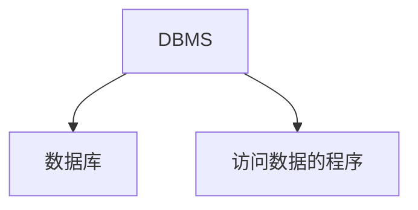
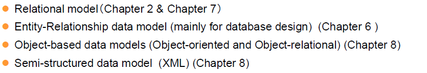
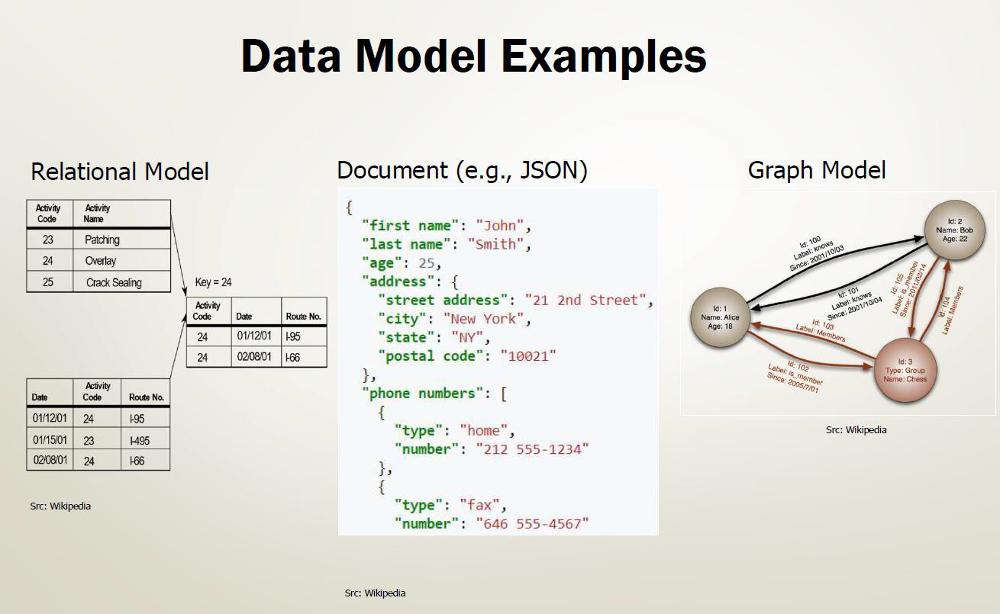
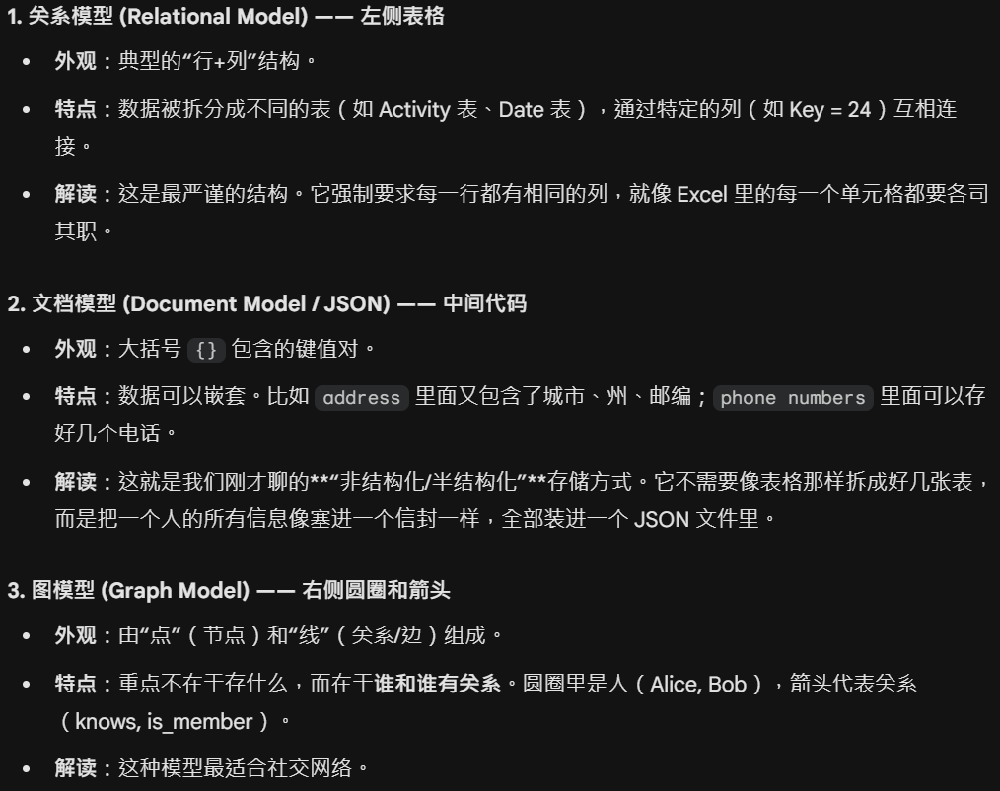
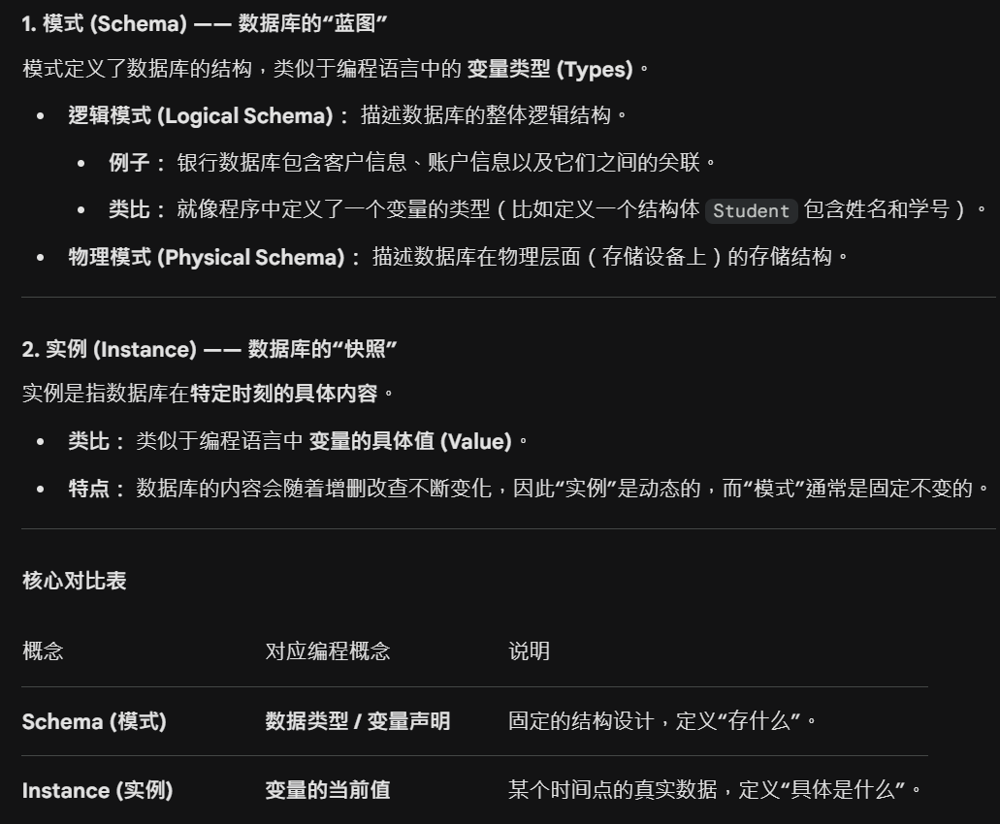

## 数据库系统


### 第一章---引言

#### Database System Applications

- **DBMS(Database-Management System): 数据库管理系统**
  - 目标: 提供一种高效方便地存取数据库信息地途径
  - 组成: 



- 数据库系统常用于管理的数据集合特征
  - 高价值
  - 数量庞大
  - 经常同时被多个用户和应用系统访问

- DB, DBS, DBMS

> **数据库:** 数据的集合, 即数据本身; 
>
> **数据库系统/数据库管理系统:** 管理数据的软件, 用于创建, 使用, 维护数据库; 是用户与数据库的接口; 
>
> > **数据库系统:** 有些解释数据库系统是一个 "完整的系统", 由 "数据库" "数据库管理系统(及开发工具)" "应用系统" "数据库管理员" "最终用户" "硬件平台" 等组成的 **完整运行环境**

#### Purpose Of Database Systems

- **数据管理技术的产生和发展**

  ```mermaid
  graph LR
  人工管理 --> 文件系统 --> 数据库系统
  ```

- **文件系统存储信息的优点和弊端**

    - **优点**

        1. 数据可以长期保存;
        2. 由文件系统管理数据, 不再用之前的纸带

    - **缺点**

        1. **Data redundancy and inconsistency(数据冗余性和不一致性)**

            **冗余**: 即相同信息可能在好几个文件中重复存储(eg: 学生的姓名同时出现在学校的总学生名单和院系的学生名单中)

            **不一致**: 即同一数据的不同副本可能不一致(eg: xx 同学的住址在文件 A 中被修改, 但是在文件 B 和 C 中还没来得及修改或伪同步)

        2. **Difficulty in accessing data**

            **访问困难**: 当数据需要被连续调用并且加有一定的范围限制的时候, 数据的访问就有很大的困难. (eg: 办事人员需要找到在某个限定范围的名单, 比如成绩在 70-80 之间, 但是设计者没有考虑这个问题, 没有现成的应用程序去满足需求; 如果之后办事人员又只要其中的前 20 个人, 那就更难办了)

        3. **Integrity Problem(完整性问题)**

            数据库中存储数据的值必须满足特定类型的 **一致性约束(Consistency constraint)**: 难以添加新的约束条件或者修改已有的约束条件(eg: 退休年龄 = 65)

        4. **Data Isolation(数据孤立)**

            数据分散在不同文件中, 文件又可能格式不同, 编写程序检索适当数据很困难. 

        5. **Atomicity Problem(原子性问题)**

            操作必须是原子的: 要么都发生要么都不发生(eg: 账户 A 从账户 B 贷出 100＄, 则账户 A+100 和账户 B-100 应该是都要发生或者都不发生)

        6. **Concurrent-access anomaly(并发访问异常)**

            系统应允许多个用户同时更新数据(eg: 账户 A 有 1000＄, 两个人同时从中分别贷出了 100＄ 和 400＄, 其正确的结果返回应该是 500＄, 但由于没有协调等原因, 最后可能显示 900＄ 或者 600＄)

        7. **Security Problem**

            相关职位的人员应约束为只能看到和其相关的数据(eg: 工资管理的人看数据库的财务部分, 他们不需要管学术部分的数据)

#### View Of Data(数据视图)

- Levels of Abstraction 数据抽象的三个层次(由低到高)
  1. **Physical Level**: 物理层. 描述数据是如何存放在硬盘上的, (比如用了什么文件格式, 存在哪个扇区等)通常只有数据库软件本身关心. 
  2. **Logical Level**: 逻辑层. 描述数据库中存储了什么数据, 以及数据之间的关系. 由 DBA 和程序员关心. 
  3. **View Level**: 视图层. 只描述整个数据库中的一部分, 因为大多数用户不需要看到所有数据. (出于安全考虑)

#### Data Medels(数据模型)

- 定义

  - 一个描述数据, 数据联系, 数据语义以及数据约束的工具集合. 

- 四种主要模型分类

  

  - **关系模型 (Relational model)**: 最主流. 用 "表"(行和列)来组织数据. 
  - **实体-联系模型 (E-R model)**: 主要用于 **设计阶段**. 像画思维导图一样理清实体(如学生, 老师)及其关系. 
  - **基于对象的模型 (Object-based model)**: 结合了编程中 "对象" 的概念, 处理更复杂的数据类型. 
  - **半结构化模型 (Semi-structured model)**: 比如 XML 或 JSON, 数据结构比较灵活, 不像表格那么固定. 

- 示例

  { width="67%" }

  { width="67%" }

#### Instances and Schemas (实例与模型)

- 一些解释

  { width="67%" }

#### Data Definition Language (DDL)


