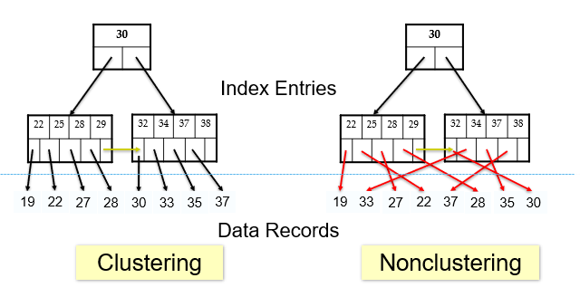
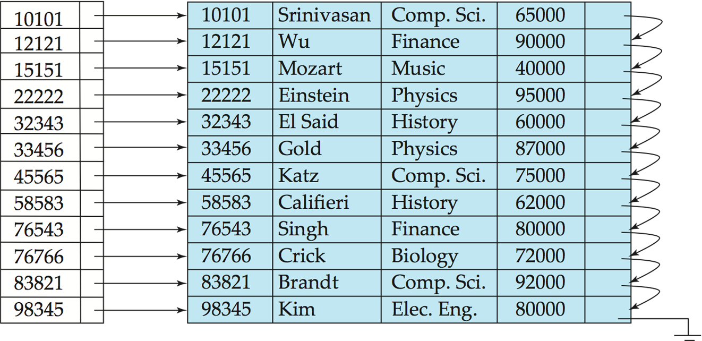
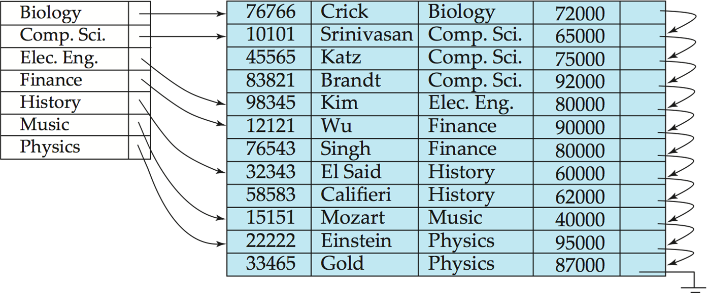
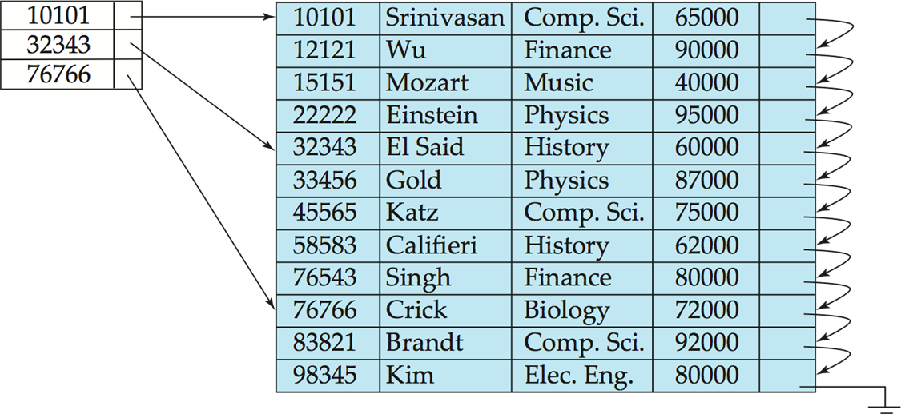
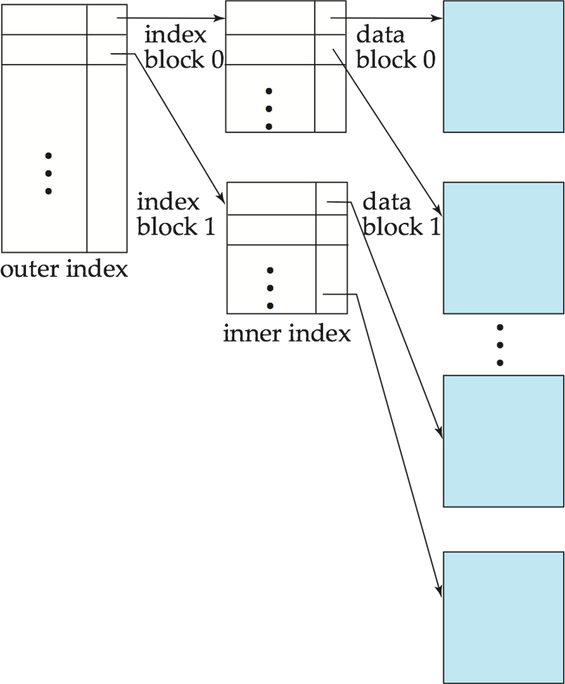
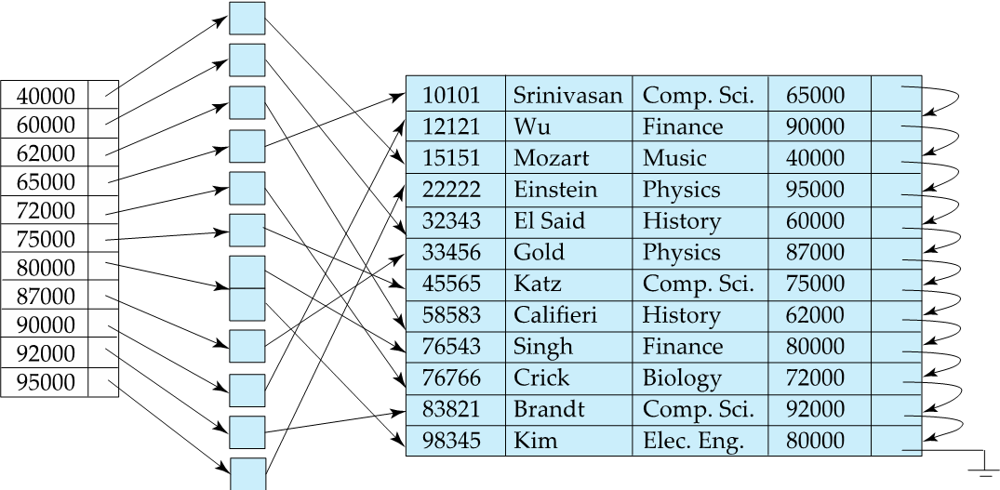
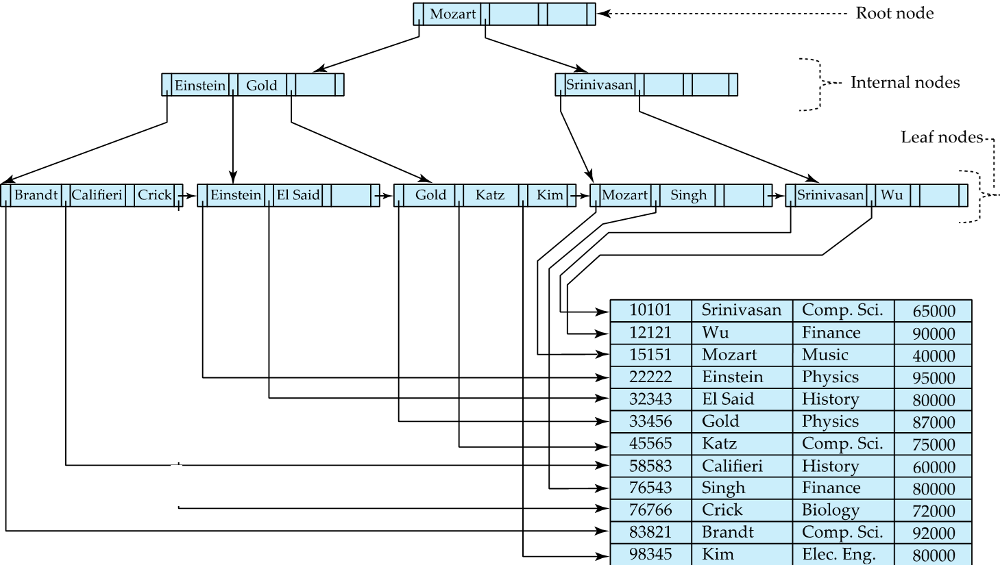
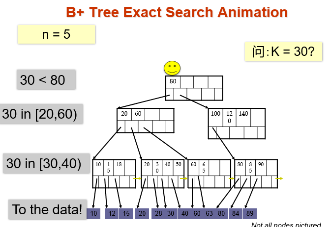
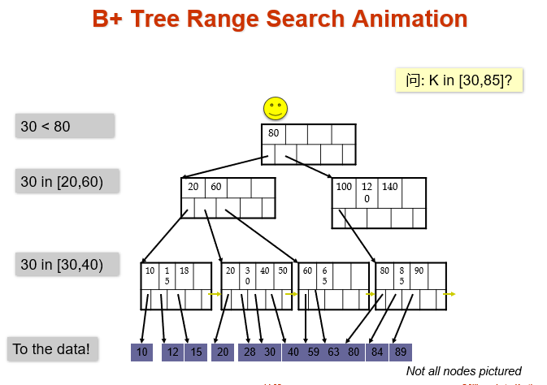

## 索引

**Chapter 14: Indexing**

### 索引的基本概念

> 需要强调的是: 当提到 `索引` 的时候, 多数情况指的都是 **索引文件**, 而不是单独的索引项.

​    首先, 要明白为什么需要索引机制. 它的 **目的是: 加速对所需数据的访问.** 可以类比为图书馆中的作者目录.

- **搜索码 (Search Key)**: 一个或者一组属性, 用来在文件中查找记录.

- **索引项 (Index Entry)**: 一个索引文件由一系列记录(称为 **索引项**)组成, 其格式为: `[搜索码 | 指针]`. 指针指向包含该码值的实际数据记录. 
- **特点**: 索引文件通常比原始数据文件小得多. 
- **分类**: 
    - **顺序索引(Ordered indices)**: 搜索码按排序顺序存储. 
    - **散列索引(Hash indices)**: 搜索码通过“散列函数”均匀分布在不同的“桶”(buckets)中. 


​    要评估一个索引是好是坏, 有以下标准:

1. 支持的访问类型: 是否能高效支持查询具有特定属性值的记录, 以及属性值处于指定范围的记录. 
2. 访问时间 (Access time): 查找一条记录所需的时间. 
3. 插入时间 (Insertion time): 插入新记录并更新索引所需的时间. 
4. 删除时间 (Deletion time): 删除记录并更新索引所需的时间. 
5. 空间开销 (Space overhead): 索引本身占用的额外存储空间. 


### 顺序索引

- **定义:** 索引项按照搜索码的值进行排序存储. 

    - **聚集索引(Clustering index)/主索引(Primary index):** 如果一个索引的搜索码指定的顺序与数据文件在磁盘上的物理存储顺序是一致的, 那么这个索引就叫聚集索引.

    - **非聚集索引(Non-clustering index)/辅助索引(Secondary index):** 索引定义的顺序与数据文件的物理存储顺序 **不一致**. 比如: 关键词索引是按照 A-Z 排列的, 但是书本正文是按照章节排列的. 

        - 特点: 辅助索引通常是 **稠密索引**(每一条记录都要在索引里有一个条目), 因为它无法利用物理排序的规律来快速定位.

            { .center width="70%" }


- **索引顺序文件**: 一种特定的文件组织形式. 指的是一个数据文件本身已经按着某个 **搜索码** 排列好了. 并且在这个搜索码上建立了一个 **主索引**. 这种结构很适合范围查询, 比如查找 ID 从 100 到 500 的所有学生, 因为索引是有序的, 并且数据在磁盘上是连续挨着的, 读取速度很快.

  - **稠密索引文件(Dense Index Files): 对于文件中的每一个搜索码值, 索引中都有一个对应的索引项.**

    { .center width="60%" }

    **特殊情况:** 当文件按照 dept_name 排序存储时, 针对 dept_name 建立的稠密索引, 其中的索引项指向该系名在 **数据文件中出现的第一条记录**. 

    > 图中强调: 这里的 ID 是 Primary Key; dept_name 是 Primary index

    { .center width="60%" }

  - **稠密索引文件(Sparse Index Files): 只为部分搜索码值建立索引项**

    ​    **前提条件:** 数据记录必须已经按照搜索码顺序存储

    ​    **查找过程:** 首先找到索引中最大的, 小于等于目标值 K 的键值; 然后从该键值对应地指针处开始, 在数据文件中顺序扫描, 直至找到目标记录.

    ​    **优点:** 索引占用空间更小, 维护成本更低.

    ​    **缺点:** 对比稠密索引, 定位单条记录的速度通常较慢.

    ​    **折中方案:** 

        - 对于聚集索引: 为数据文件的 **每一个物理块 (block)** 建立一个索引项(通常取块内的最小键值). 

        - 对于非聚集索引: 在稠密索引之上再建一层稀疏索引, 形成 **多级索引 (Multilevel Index)**. 

    { .center width="33%" }


- **多级索引(Multilevel Index)**

  **问题:** 当索引文件太大一直与无法完全放入内存时, 访问磁盘索引文件就会变得非常慢. 

  **解决方案:** 将索引文件本身看作是一个顺序文件, 并在其上再建立一个稀疏索引. 整个结构就变成了如下两个部分: 

  - **外层索引 (Outer Index)**: 指向内层索引块的稀疏索引. 
  - **内层索引 (Inner Index)**: 基础索引文件. 

  **特点:** 具有 **扩展性**, 如果外层索引还是很大, 可以继续往上建立

  **更新成本:** 当原始数据文件发生插入或删除时, 所有层级的索引都必须同步更新. 

  **结构图示:** 

  ​    其中, 右侧是数据块, 中间是内层索引, 它指向了数据块; 左侧是外层索引, 它是稀疏的, 指向内层索引的块.

  ​    { .center width="50%" }


- **辅助索引示例**

  { .center width="33%" }

  ​    观察图片可以看到, 这里索引的工资是按照顺序排列的, 但是它们指向的实际数据记录在物理位置上是乱序的. 

  - **桶(Bucket):** 索引项并没有直接指向记录, 而是指向了一个包含多个指针的桶, 这些指针指向具有相同搜索码值的实际记录.


### $B^+$ 树索引文件

> 关于$B^+$树的讲解, 可以看: [B+树看这一篇就够了(B+树查找、插入、删除全上)](https://zhuanlan.zhihu.com/p/149287061)
>
> 关于$B$​树和$B+$​树, 可以看: [b树, b+树, b-树,红黑树详解-博客园](https://www.cnblogs.com/henuliulei/p/15114440.html)

> 另外, 需要澄清的一点是: 由于$B$树的原英文名是$B-Tree$, 所以总是译作$B-$树, 容易让人理解为$B$树和$B-$树不是一个结构, 其实两者是完全一样的. 

- **为什么需要 $B^+$ 树?**

  之前提到的索引顺序文件有一些缺点: 

  1. 随着数据增长, 会产生大量的溢出块, 性能会退化
  2. 需要定期进行全表重组

  而 $B^+$ 树就是解决这个缺点的最佳方案. 他有以下优点:

  1. 自动平衡: 在插入和删除时通过局部的分裂或合并自动保持平衡
  2.  无需全局重组: 性能在长期运行中保持稳定

- **$B^+$ 树简介**

  - $B^+$​树示例

    如图所示, 它的层级结构可以大致分为三层: 根节点, 中间节点和叶节点. 

    查找逻辑: 通过节点中的搜索码进行导航, 例如查找 Gold, 从根节点开始查看, 比 Mozart 小, 走左边, 在中间节点找到 Gold, 再定位到子节点, 最终指向数据表记录.

    { .center width="50%" }

  - **$B^+$树的性质**
  
    1. **平衡性:** 从根节点到任意叶节点的路径长度都相等
    2. **节点填充度:** 
       - **中间节点:** 子节点数量在**$⌈n/2⌉$到$n$**之间, 其中$n$是指针最大容量
       - **叶子节点:** 包含的码值数量在**$⌈(n−1)/2⌉$到$n-1$**之间
       - **根节点:** 如果根节点**不是叶子节点**, 至少有**$2$​个孩子**; 如果根节点是**叶子节点**, 可以包含**$0 \sim n-1$​​**个码值.
  
  - **$B^+$​树的节点结构**
  
    - **结构模板:** `[P1,K1,P2,...,Pn−1,Kn−1,Pn]`. 其中$K$​是搜索码值, $P$是指针. 在非叶子节点中, 指针指向了子节点; 在叶子节点中, 指针指向了桶或者对应的实际记录. 
    - **叶子节点:** $P_i$指向了具有搜索码$K_i$的数据记录; $P_n$是叶子节点的末尾指针, 它指向下一个叶子节点. 
    - **非叶子节点:** 
      1. 指针$P_1$指向的所有子树值都小于$K_i$
      2. 指针$P_i(2<=i<=n-1)$指向的所有子树的值都大于等于$K_{i-1}$且小于$K_i$
      3. 指针$P_n$​指向的所有子树的值都大于等于$K_{n-1}$​
  
  - **$B^+$树的等值查找和范围查找**
  
    { .center width="33%" }
  
    { .center width="33%" }
  
    ​    对于范围查找, 当找到左侧值之后, 不需要回到上层节点, 而是利用叶节点之间的顺序指针来进行遍历.
  
    - 函数定义: findRange(lb, ub), 其中 lb是下界, ub 是上界. 
    - 实现方式: 在实际数据库系统中, 通常提供一个迭代器 (Iterator) 接口. 
    - next() 函数: 先定位起始点, 然后调用 next() 逐个获取匹配记录, 直到超出范围. 
    - 图示: 再次强调了叶节点层的双向链表/单向链表结构. 
  
  - **性能分析**
  
    - **树的高度**: 如果文件中有 K个搜索码值, 树的高度不超过 ⌈log⁡⌈n/2⌉(K)⌉
    - **节点大小**: 通常一个节点就是一个磁盘块 (disk block), 例如 4KB. 
    - **高扇出 (High Fan-out)**: 典型 n≈100n≈100
    - **极速查找**: 如果有 100 万个搜索码, B+-树只需要访问4个节点就能找到目标. 
    - **特点 (矮而胖)**: B+-树倾向于非常“矮”且“宽”. 
    - **对比二叉树**: 同样的 100 万记录, 平衡二叉树需要访问约 20 个节点. 由于每次访问节点都可能是一次 20 毫秒的磁盘 I/O, B+-树的速度是二叉树的数倍甚至数十倍. 
  
  - **非唯一键处理**
  
    如果搜索码不是唯一的(例如按姓名索引, 可能会有重名), 可选择以下三种处理方案:
  
    1. **复合键 (Composite Key):** 将搜索码与一个唯一属性(如主码或记录 ID)结合, 形成一个新的唯一键 $(a_i, A_p)$。
       - **查询实现:** 对 $a_i = v$ 的查找变成了对范围 $(v, -\infty)$ 到 $(v, +\infty)$ 的查找。
       - **I/O 影响:** 如果是聚集索引, 访问依然是顺序的; 如果是非聚集索引, 每次读取重复键的记录可能都需要一次随机磁盘 I/O。
       - **优点:** 插入/删除逻辑更简单，是**目前广泛采用**的方案。
    2. **独立数据块上的桶 (Buckets on separate blocks):** 将指针指向一个单独的桶文件，不推荐，因为有很多重复键值时会导致性能很差。
    3. **指针列表 (List of tuple pointers with each key):** 每个键包含一个元组指针列表。空间开销低，但如果某键有大量重复项，删除元组时会变得非常昂贵（最坏情况可能退化为 $O(N)$ 线性复杂度）。 


- **$B^+$树的更新操作**

  - **插入(Insertion)**

    **前提:** 假设记录已经被添加到数据文件中. 设 $pr$ 为指向该记录的指针, $v$ 为记录的搜索码值.

    **基本流程:**

    1. 找到搜索码值 $v$ 应该在的叶节点
    2. **若叶节点未满:** 直接在叶节点中插入 $(v, pr)$ 对
    3. **若叶节点已满:** 需要**分裂(split)**该节点

    **叶节点分裂过程:**

    - 将该节点中原有的 $n-1$ 个键值和新插入的共 $n$ 个 $(搜索码, 指针)$ 对按顺序排好
    - 前 $\lceil n/2 \rceil$ 个放在原节点, 其余放在新节点 $p$
    - 设新节点 $p$ 中最小的键值为 $k$, 将 $(k, p)$ 插入到父节点中
    - 如果父节点也满了, 则继续向上分裂
    - 最坏情况下分裂一直传递到根节点, 树的高度增加 1

    > **eg:** 在 $n=4$ 的 $B^+$ 树中插入 "Adams": 找到 "Brandt, Califieri, Crick" 所在叶节点 (已满), 分裂后新节点从 "Califieri" 开始, 向父节点插入 (Califieri, 指向新节点的指针).

  - **删除(Deletion)**

    **基本流程:**

    1. 从叶节点中移除 $(pr, v)$ 对
    2. **若节点仍满足最小填充条件:** 直接结束
    3. **若节点条目过少 (下溢):** 分两种情况处理:

    **情况 A: 合并(Merge)**

    > 当前节点 + 某个兄弟节点的条目数 ≤ 节点最大容量, 可以合并

    - 将两个节点的所有搜索码合并到一个节点(保留左边的那个)
    - 删除已被合并的节点
    - 在父节点中删除指向被删节点的指针 $P_i$ 和对应的键值 $K_{i-1}$, 并**递归地**向上处理
    - 如果根节点在删除后只剩 1 个指针, 则删除根节点, 其唯一子节点成为新的根节点

    **情况 B: 重分配(Redistribute)**

    > 当前节点 + 某个兄弟节点的条目数 > 节点最大容量, 无法合并但可以借

    - 从兄弟节点借一个指针/键值过来, 使两个节点都满足最小填充条件
    - 更新父节点中对应的分隔键值 (不是删除, 而是更新)

    > **更新代价:**  插入和删除的 I/O 代价与树的高度成正比, 最坏情况为 $O(\log_{\lceil n/2 \rceil} K)$. 实际中内部节点通常在缓冲区中, 大多数操作只涉及叶节点, 分裂和合并也比较少见.


- **多键属性索引(Indices on Multiple Keys)**

  - **组合搜索码(Composite Search Key):**  由多个属性组成的搜索码

    > **eg:** 在 instructor 上建立 (dept_name, salary) 的组合索引

  - **词典序(Lexicographic Ordering):**  组合码的排序方式

    > $(a_1, a_2) < (b_1, b_2)$, 当且仅当: $a_1 < b_1$, 或 $a_1 = b_1$ 且 $a_2 < b_2$

  - **组合索引的查询能力:**

    | 查询条件 | 是否可高效使用 (dept_name, salary) 索引 |
    | --- | --- |
    | `dept_name = 'Finance' AND salary = 80000` | ✅ 可以, 两个条件都能用 |
    | `dept_name = 'Finance' AND salary < 80000` | ✅ 可以, 先定位 dept_name, 再范围查 salary |
    | `dept_name < 'Finance' AND salary = 80000` | ❌ 不高效, 需要扫描大量记录再筛选 salary |

  - **多索引交集策略:**  也可以对每个属性分别建索引, 分别获取指针集合后取**交集**, 但效率通常不如组合索引.


### $B^+$树文件组织(B+-Tree File Organization)

- **定义:**  $B^+$树不仅可以用作**索引文件**, 也可以用来组织**数据文件本身**

  - 普通 $B^+$树索引: 叶节点存放的是 $(搜索码, 指针到实际记录)$
  - $B^+$树文件组织: 叶节点**直接存放实际记录**, 而不是指针

- **优点:**  即使在频繁的插入/删除/更新时, 也能保持数据记录的**聚集性(clustered)**, 避免顺序文件那种碎片化问题

- **注意:**  由于记录比指针大, 叶节点能放下的记录数比非叶节点的指针数少

- **空间利用率优化:**  通过在分裂/合并时引入**2个兄弟节点**参与再分配 (而非1个), 每个节点至少有 $\lfloor 2n/3 \rfloor$ 个条目, 提高空间利用率

- **其他相关话题:**

  - **记录重定位与辅助索引:**  当记录移动时, 所有存放记录指针的辅助索引都要更新 (代价很大); 解决方案是辅助索引中存放主索引的搜索码而非直接的记录指针
  - **字符串键索引:**  变长字符串可变扇出; 内部节点用**前缀压缩(Prefix Compression)**只存能区分子树的最短前缀即可
  - **批量加载(Bulk Loading):**  一次性插入大量条目时, 比逐条插入效率高得多; 先排序再自底向上构建 $B^+$树


### $B$树索引文件(B-Tree Index Files)

> 这里是作为教材中 $B^+$ 树的补充对比知识点

- **与 $B^+$树的关键区别:**  $B$树中每个搜索码只出现**一次** (非叶节点中的搜索码不在叶节点重复), 消除了搜索码的冗余存储

- **非叶节点结构:**  每个搜索码额外带一个**桶/记录指针 $B_i$**, 因为它本身就是数据

- **$B$树 vs $B^+$树**

  | 对比维度 | $B$树 | $B^+$树 |
  | --- | --- | --- |
  | **查找路径** | 可能在非叶节点就找到 (提前结束) | 总是要到叶节点 |
  | **节点大小** | 非叶节点更大 (含数据指针), 扇出更低 | 非叶节点小, 扇出高 |
  | **树的深度** | 通常更深 | 通常更浅 |
  | **插入删除** | 更复杂 | 相对简单 |
  | **实际使用** | 较少 | 广泛使用 |

  > **结论:** $B$树的优点 (提前找到) 通常不能弥补其缺点, 所以实际中基本都用 $B^+$树


### 闪存与主存索引 (Indexing on Flash / Main Memory)

- **闪存索引 (Indexing on Flash):**
  - **特点:**  闪存的随机读取开销极低 ($20 \sim 100 \ \mu\text{s}$)，但写操作不是就地写入 (no in-place write)，且最终需要进行较慢的物理擦除 (erase)。
  - **优化方案:**  使用比磁盘更小的物理页大小 (optimum page size)；**批量加载 (bulk loading)** 非常关键，能够大幅减少物理擦除的次数；另外可以采用写优化的树结构 (如 LSM-tree 等)。
- **内存索引 (Indexing in Main Memory):**
  - **特点:**  内存的随机访问虽然远快于磁盘，但相对于 CPU 缓存 (Cache Line) 的读取而言依然缓慢。
  - **缺陷:**  在节点容量极大的传统 B⁺ 树节点中执行键值的二分查找，会发生大量的 **CPU 缓存缺失 (Cache Misses)**。
  - **优化方案:**  使用较小的 B⁺ 树节点尺寸以契合 CPU Cache Line 的大小；或者在 B⁺ 树节点内部不再使用简单的数组，而是以小型树状结构来组织键值。


### 散列索引(Hash Indices)

#### 静态散列(Static Hashing)

- **基本思想:**  用散列函数(hash function) $h$ 将搜索码映射到 **桶(bucket)** 地址; 一个桶通常对应一个或多个磁盘块

  $$h(搜索码值) \rightarrow 桶编号$$

- **散列函数的要求:**  将搜索码值均匀分布在 $B$ 个桶上, 避免大量码值集中到同一个桶

- **两种用途:**

  - **散列文件组织(Hash File Organization):** 记录本身直接存放在桶中
  - **散列索引(Hash Index):** 桶中存放的是 $(搜索码, 记录指针)$ 对

- **查找过程:**  计算 $h(v)$ 得到桶号, 直接定位到对应桶, 在桶内顺序扫描找到目标记录

#### 桶溢出处理(Bucket Overflow)

- **溢出原因:**
  - 桶的数量不足
  - 搜索码分布不均匀 (多条记录同一搜索码值, 或散列函数分布不理想)

- **溢出链(Overflow Chaining):**  当桶满时, 分配一个**溢出桶**, 将其用链表链接到原桶上

  > 这种方案也叫**封闭寻址(Closed Addressing)** 或**拉链法**

  > 相对地, **开放寻址(Open Addressing)** 不使用溢出桶, 但不适合数据库应用

#### 静态散列的缺陷与动态散列

- **静态散列的问题:**
  - 桶数固定, 数据增长 → 大量溢出 → 性能退化
  - 预留过多桶 → 空间浪费
  - 解决方案: 定期重组 (昂贵, 且会中断正常操作)

- **动态散列(Dynamic Hashing)** — 允许桶数随时间动态变化:

  | 方案 | 简介 |
  | --- | --- |
  | **周期重散列** | 条目数达到阈值时, 创建两倍大的新表并重散列所有条目 |
  | **线性散列(Linear Hashing)** | 增量式地进行重散列 |
  | **可扩展散列(Extendable Hashing)** | 专为磁盘散列设计; 多个散列值共享同一个桶; 目录项翻倍而桶数不必翻倍 |

#### 有序索引 vs 散列索引

| 评估因素 | 有序索引 ($B^+$树) | 散列索引 |
| --- | --- | --- |
| **等值查找** | 好 | **更好** |
| **范围查找** | **好** | 差 (无法利用顺序) |
| **插入/删除成本** | 较低 | 静态散列可能很高 |
| **最坏情况** | 对数级 $O(\log n)$ | 可能退化为线性 |

> **实际情况:**
> - PostgreSQL 支持散列索引, 但因性能问题不推荐使用
> - Oracle 支持静态散列文件组织, 但不支持散列索引
> - SQL Server 只支持 $B^+$树


### SQL 中的索引创建

```sql
-- 创建索引
CREATE INDEX <index-name> ON <relation-name> (<attribute-list>);

-- 示例
CREATE INDEX b_index ON branch(branch_name);
CREATE INDEX takes_pk ON takes (ID, course_id, year, semester, section);

-- 删除索引
DROP INDEX <index-name>;

-- 创建唯一索引 (间接强制候选码约束)
CREATE UNIQUE INDEX <index-name> ON <relation>(<attribute>);
```

> 主键上的索引会被所有数据库系统**自动创建**; 某些数据库也会自动为外码创建索引

> 索引可以大幅加速查找, 但会增加插入/删除/更新的代价; 实际使用时需要权衡


### 写优化索引(Write-Optimized Indices)

- **背景:**  $B^+$树对**写密集型(write-intensive)**负载性能较差
  - 每次插入至少需要 1 次叶节点 I/O
  - 磁盘每秒插入量 < 100

#### LSM 树(Log-Structured Merge Tree)

- **核心思想:**  将数据分层存储, 写操作只写内存, 后台异步合并到磁盘

  ```
  写入 → L0 (内存 B+树) → 满了 → 合并到 L1 (磁盘 B+树) → 满了 → 合并到 L2 → ...
  ```

  - 每层的大小阈值是下一层的 $k$ 倍
  - 合并使用自底向上的 $B^+$树构建算法

- **优点:**  所有写操作都是**顺序 I/O**; 叶节点填满, 空间利用率高

- **缺点:**  查询时需要搜索多棵树; 数据被多次复制

- **Stepped-Merge 变体:**  每层有 $k$ 棵树, 当某层所有树都存在时合并成下一层的一棵树; 减少写代价, 但查询更慢

  - 优化: 为每棵树维护**布隆过滤器(Bloom Filter)**在内存中, 查询时先用布隆过滤器判断, 只搜索可能包含目标的树

- **删除处理:**  插入一条特殊的"删除标记"条目; 合并时遇到删除标记和原始条目则同时丢弃

- **应用场景:**  Google BigTable, Apache Cassandra, MongoDB, LevelDB, MySQL 的 MyRocks 引擎

#### Buffer 树(Buffer Tree)

- **核心思想:**  $B^+$树的每个内部节点都有一个**缓冲区**用于暂存插入操作; 缓冲区满时批量将数据下推到下层

- **优点:**  对查询的影响比 LSM 树小; 可以用于任何树状索引结构

- **缺点:**  随机 I/O 比 LSM 树多

- **实际应用:**  PostgreSQL 的广义搜索树 (GiST) 索引


### 位图索引(Bitmap Indices)

- **适用场景:**  属性只有**少量不同取值**的列 (如性别、国家、收入档次等)

- **基本结构:**  对属性的每个不同值, 维护一个**位图(bitmap)** —— 位数等于关系中的记录数; 若第 $i$ 条记录的该属性值为 $v$, 则对应位图的第 $i$ 位为 1, 否则为 0

  > **eg:** gender 属性有 male/female 两个值, 则维护两个位图:
  >
  > - male 位图: `10010...` (第1、4条记录是男性)
  > - female 位图: `01101...`

- **查询操作:**  通过位运算高效处理多属性联合查询

  ```
  AND (交集):  100110 AND 110011 = 100010
  OR  (并集):  100110 OR  110011 = 110111
  NOT (取反):  NOT 100110       = 011001
  ```

  > **eg:** 查询"男性且收入档次为L1": `male位图 AND L1位图`, 结果中为 1 的位置就是满足条件的记录

- **优点:**
  - 位图本身非常小 (记录 100 字节时, 单个位图仅占关系大小的 1/800)
  - CPU 一次可处理 32 或 64 位 (一条指令处理多条记录)
  - 统计匹配记录数速度极快 (利用预计算的 256 元素计数数组)

- **与 $B^+$树结合:**  在 $B^+$树叶节点层, 对取值重复很多的属性, 可以用**位图**替代元组 ID 列表


### 空间与时间索引(Spatial and Temporal Indices)

#### 空间数据索引

- **空间数据:**  数据库可以存储线段、多边形、栅格图像等空间数据类型

- **常见空间查询类型:**
  - **最近邻查询(Nearest Neighbor):** 给定一个点, 找最近的满足条件的对象
  - **范围查询(Range Query):** 查找部分或完全在指定区域内的对象
  - **空间连接(Spatial Join):** 以位置作为连接属性进行连接

- **常用空间索引结构:**

  | 结构 | 简介 |
  | --- | --- |
  | **k-d 树** | 早期多维索引结构; 每层按一个维度将空间分成两半; $k$-d-$B$ 树是其磁盘友好变体 |
  | **四叉树(Quadtree)** | 每个非叶节点将矩形区域均分为四个象限, 递归划分; 叶节点存放点的集合 |
  | **R 树(R-Tree)** | $B^+$树在 $N$ 维的推广; 每个节点关联一个最小包围盒(Minimum Bounding Box); 支持矩形和多边形的索引; 子节点的包围盒允许重叠 |

- **R 树查找:**  从根节点开始, 若当前节点的包围盒与查询区域相交, 则递归搜索其子节点

  > 最坏情况下需要搜索多条路径, 但实际中表现可接受

#### 时间数据索引(Temporal Data Indexing)

- **时间数据:**  每条记录关联一个**有效时间区间** (start_time, end_time)

  > end_time 为无穷大表示当前仍然有效

- **查询需求:**  查找在某个时间点或时间区间内有效的所有元组

- **索引方案:**

  - 将属性 $a$ 和时间看作二维数据, 用 **R 树**等空间索引结构建立时间索引
  - 对于 end_time 为无穷大的"当前有效"元组, 单独维护一个以 $(a, start\_time)$ 为键的索引, 查询时间点 $t$ 时做范围查询 $(a, 0)$ 到 $(a, t)$


### 补充: $B$ 树和$B^+$ 树

> 关于向上取整的一个算法:
>
> **对于计算$\lceil A/B \rceil$, 向上取整的公式为<span style="color:#FF0000;">$(A+B-1)/B$</span>**

#### $B$ 树

- **定义:** B树是一种平衡的多分树, 通常我们说<span style="color:#FF0000;">**$m$**阶</span>**(也就是一个节点的子节点数目的最大值)**的$B$树, 它必须满足如下条件： 

  1. 每个节点**最多**只有<span style="color:#FF0000;">**$m$**</span>个子节点
  2. 每个非叶子节点(除了根节点)**至少**有<span style="color:#FF0000;">**$\lceil m/2 \rceil$**</span>个子节点, 拥有 <span style="color:#FF0000;">**$\lceil m/2 \rceil -1$**</span> 到 <span style="color:#FF0000;">**$m-1$**</span> 个键值. 对于具有$k$个子节点的非叶子节点来说, 它包含$k-1$个键值. 
  3. 如果根节点不是叶子节点, 那么根节点**至少**有<span style="color:#FF0000;">2</span>个子节点
  4. 所有叶子节点都出现在同一水平, 高度一致.

  一个示例图

  { .center }


- **插入**

  ​    对于$m$阶高度h的B树, 插入一个元素时, 首先在B树种是否存在, 如果不存在, 即在叶子节点处结束, 然后在叶子节点中插入新的元素. 

  ​    核心规则如下: 

  - 若该节点元素个数**小于<span style="color:#FF0000;">$m-1$</span>**, 直接插入; 
  - 若该节点元素个数**等于<span style="color:#FF0000;">$m-1$</span>**, 引起节点分裂; 以该节点中间元素为分界, 取**中间元素**(偶数个数, 中间两个随机选取)插入到父节点中; 
  - 重复上面动作, 直到所有节点符合B树的规则; 最坏的情况一直分裂到根节点, 生成新的根节点, 高度增加1; 


- **删除**

  ​    首先查找$B$ 树中需删除的元素,如果该元素在$B$ 树中存在, 则将该元素在其结点中进行删除; 删除该元素后, 首先判断该元素**是否有左右孩子结点**, 如果有, 则上移孩子结点中的某相近元素**(“左孩子最右边的节点”或“右孩子最左边的节点”)**到父节点中, 然后是移动之后的情况; 如果没有, 直接删除. 

  ​    **核心规则如下:** 

  - 某结点中元素/键值数目**小于<span style="color:#FF0000;">$\lceil (m/2) \rceil -1$</span>**,则需要看其某**相邻兄弟结点是否丰满**; 
  - 如果丰满(结点中元素个数大于(m/2)-1), 则向父节点借一个元素来满足条件; 
  - 如果其相邻兄弟都不丰满, 即其结点数目等于(m/2)-1, 则该结点与其相邻的某一兄弟结点进行“合并”成一个结点; 


#### $B^+$树

- **定义**
  1. 有<span style="color:#FF0000;">$m$</span>个子树的中间节点包含有<span style="color:#FF0000;">$m$</span>个元素(B树中是k-1个元素), 每个元素不保存数据, 只用来索引; 
  2. 所有的叶子结点中包含了全部关键字的信息, 及指向含有这些关键字记录的指针, 且叶子结点本身依关键字的大小自小而大的顺序链接. (而$B$ 树的叶子节点并没有包括全部需要查找的信息); 
  3. 所有的非终端结点可以看成是索引部分, 结点中仅含有其子树根结点中最大(或最小)关键字. (而B 树的非终节点也包含需要查找的有效信息); 


- **插入**

  { .center }

  ​    为了保持平衡, 对于新插入的键值可能会产生大量的拆分操作, 也就是意味着磁盘的操作. 所以除此之外, $B^+$​树还提供了旋转操作, 以此来减少页的拆分. 

  - 只有当叶子节点已经满了, 还要进行插入时, 如果它的左右节点还没满, 那么就可以通过旋转将记录转移到兄弟节点上. 一般左兄弟被首先检查用来做旋转操作. 

    一个例子: 当我们插入70时, 可以看到如下变化

    { .center }

    { .center }


- **删除**

  $B^+$树使用填充因子(fill factor)来控制树的删除变化, 

  { .center }

