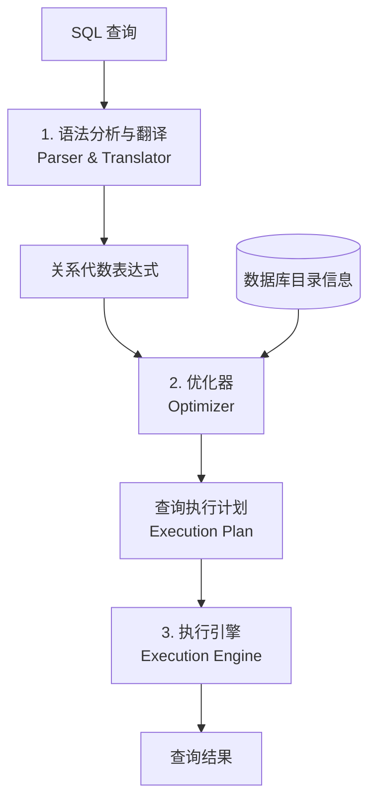
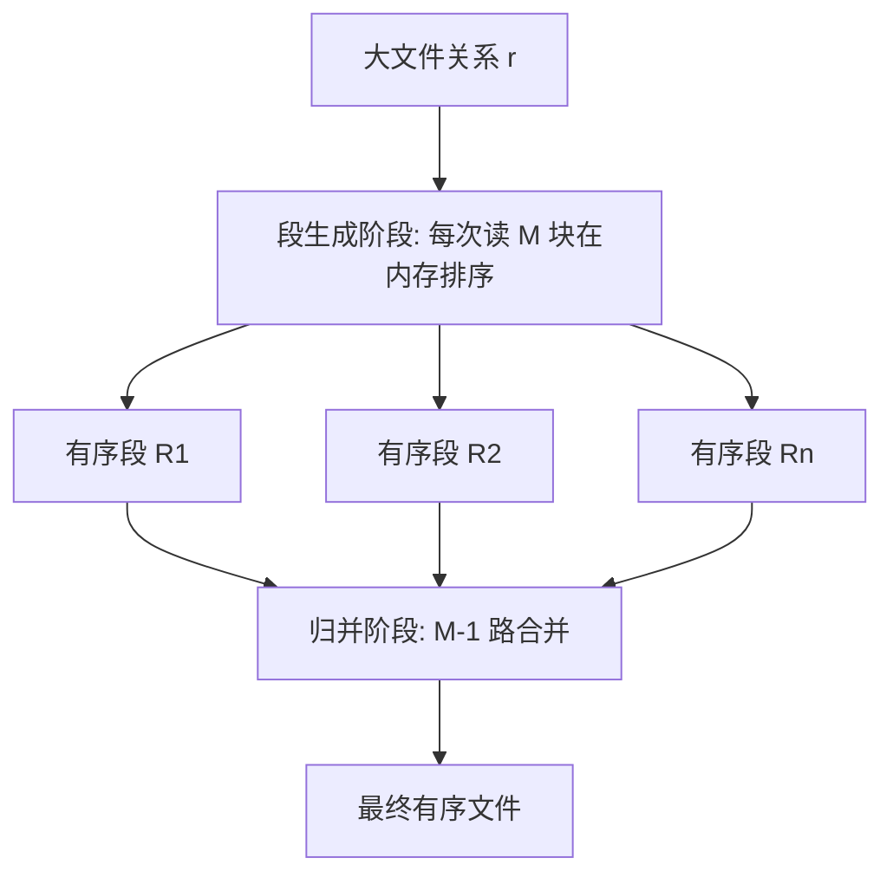
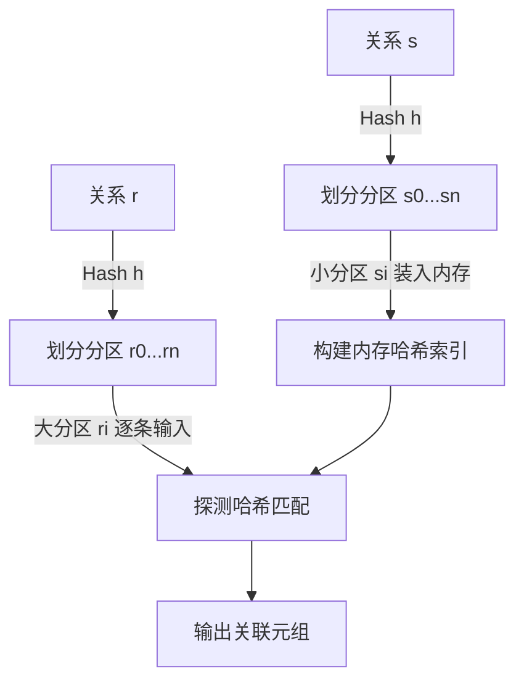

## 查询处理

**Chapter 15: Query Processing**

### 查询处理的基本步骤

> 查询处理指的是从数据库中提取数据所涉及的活动。包括 SQL 语句的翻译、优化以及物理执行。



1. **语法分析与翻译 (Parsing & Translation)**
    - 检查 SQL 的语法正确性，验证关系和属性是否存在。
    - 将 SQL 查询转换为内部表示——**关系代数表达式**。

2. **优化 (Optimization)**
    - 关系代数表达式通常有多种等价形式（例如选择操作可以下推）。
    - 每个关系代数算子可以用不同的物理算法实现。
    - 优化器利用**数据库目录 (Catalog)** 中的统计信息，估算各执行计划的代价，选择**代价最低的执行计划 (Evaluation Plan)**。

3. **执行 (Evaluation)**
    - 执行引擎接受选定的执行计划，执行计划中的具体算法，并返回最终结果。

---

### 查询代价度量 (Measures of Query Cost)

- **影响时间代价的因素:**  磁盘访问 (Disk access)、CPU 运算、网络通信。
- **度量指标:**  在共享的数据库系统中，通常以**总资源消耗**来衡量查询性能。在磁盘数据库中，由于磁盘 I/O 速度远慢于内存，因此**磁盘访问次数**是主要的考量指标。
    - 本章公式中默认**忽略 CPU 代价**（实际系统会考虑）。
    - 不计入**最终结果写回磁盘的代价**。

- **磁盘代价计算公式**
  
  $$\text{Cost} = b \cdot t_T + S \cdot t_S$$
  
    - $b$: 传输的物理块数 (block transfers)。
    - $S$: 磁头寻道次数 (disk seeks)。
    - $t_T$: 传输一个物理块的时间 (Time to transfer one block)。
        - 对于 4 KB 大小的块，高性能机械硬盘 $t_T \approx 0.1 \text{ ms}$；固态硬盘 (SSD) $t_T \approx 2 \sim 10 \ \mu\text{s}$。
    - $t_S$: 磁头定位寻道时间 (Time for one seek)。
        - 机械硬盘 $t_S \approx 4 \text{ ms}$；固态硬盘 (SSD) $t_S \approx 20 \sim 90 \ \mu\text{s}$。
        - **注:** $1 \text{ ms} = 1000 \ \mu\text{s}$。

- **缓存与估计的简化:**  在实际运行中，部分数据块可能已经缓存在内存缓冲区，从而减少实际 I/O。为简化估计，本章的公式通常采用**最坏情况估计 (Worst-case estimate)**：假设初始内存中无缓存，仅提供算法所需的最小内存大小。

---

### 选择操作 (Selection Operation)

#### A1. 线性搜索 (Linear Search / 无索引)

- **逻辑:**  扫描文件中的每一个数据块，检查所有元组是否满足选择条件。
- **代价公式:**
  
  $$\text{Cost} = b_r \cdot t_T + 1 \cdot t_S$$
  
    - $b_r$: 存储关系 $r$ 的文件物理块总数。

  > **特殊情况:** 若选择条件是在主键/候选键上进行等值查询，只要在文件中找到了匹配的记录就可以停止扫描，平均查找半个文件：
  > 
  > $$\text{Cost} = \left(\frac{b_r}{2}\right) \cdot t_T + 1 \cdot t_S$$

- **特点:**  线性搜索最为通用，适用于任何选择条件、无序存储文件或无索引的情况。

#### A2 ~ A4. 基于索引的等值选择 (Selections Using Indices)

> 设主索引或辅助索引的 B⁺ 树高度为 $h_i$。

- **A2 (主索引/聚集索引，候选键等值查找):**
    - 逻辑: 树上导航查到叶节点，叶节点指向唯一一条记录。
    - 代价: 需要访问 $h_i$ 个索引节点及 1 个数据块。
    - 
    $$\text{Cost} = (h_i + 1) \cdot (t_T + t_S)$$

- **A3 (主索引/聚集索引，非候选键等值查找):**
    - 逻辑: 满足条件的记录在物理磁盘上是连续存放的。
    - 设匹配的记录占据了 $b$ 个连续物理块。
    - 代价: 
    
    $$\text{Cost} = h_i \cdot (t_T + t_S) + 1 \cdot t_S + b \cdot t_T$$

- **A4 (辅助索引/非聚集索引，等值查找):**
    - **若是唯一候选键:**
      
      $$\text{Cost} = (h_i + 1) \cdot (t_T + t_S)$$
      
    - **若非唯一键 (匹配记录数为 $n$):**  由于是辅助索引，这 $n$ 条匹配记录在磁盘上通常是**乱序随机存放**的，每一条记录都可能需要一次独立的磁头寻道。
        - 代价: 
          
          $$\text{Cost} = (h_i + n) \cdot (t_T + t_S)$$
          
        - **警告:** 当 $n$ 很大时，辅助索引等值查询的代价会非常高，甚至远慢于直接进行全表线性扫描。

#### A5 ~ A6. 比较操作选择 ($\sigma_{A \ge V}(r)$ 或 $\sigma_{A \le V}(r)$)

- **A5 (主索引/聚集索引，比较操作):**  由于数据本已按排序存储：
    - 对于 $A \ge V$: 用索引找到第一个 $\ge V$ 的元组，接着往后顺序扫描。
    - 对于 $A \le V$: 直接从开头顺序读取，直到遇到第一个 $> V$ 即可，完全不需要使用索引。
- **A6 (辅助索引，比较操作):**
    - 从辅助索引中找到第一个边界项，然后顺着索引叶节点遍历指针获取记录。
    - 同样，由于记录在磁盘上无序，每次获取记录都可能消耗 1 次随机寻道。当结果记录数多时，线性文件扫描更便宜。

#### 复杂条件选择 (Complex Selections)

- **析取 (Conjunction - 且 `AND`):** $\sigma_{\theta_1 \land \theta_2 \land \dots \land \theta_n}(r)$
    - **A7 (单索引配合内存过滤):**  选择其中代价最小的一个条件 $\theta_i$ 用索引查出数据，其余条件在内存中用 CPU 逐一测试。
    - **A8 (复合索引):**  如果建立了多属性组合索引 (如组合键)，直接进行多键索引检索。
    - **A9 (指针交集算法):**  对每个条件分别查索引，取得符合条件的元组 ID/指针集合，在内存中求**交集**，最后再去磁盘读取元组。

- **合取 (Disjunction - 或 `OR`):** $\sigma_{\theta_1 \lor \theta_2 \lor \dots \lor \theta_n}(r)$
    - **A10 (指针并集算法):**  要求**每一项**都有可用索引。对每个条件查索引得到指针集，求**并集**后去磁盘读元组。
    - **注意:** 只要有一项没有索引，就必须退化为线性全表扫描。

- **非 (Negation - 非 `NOT`):** $\sigma_{\neg \theta}(r)$
    - 默认采用线性扫描。如果在很少的数据满足条件的情况下，且 $\theta$ 上有索引，可以先用索引找出符合 $\theta$ 的元组，再在内存中做求补。

#### 位图索引扫描 (Bitmap Index Scan)

> 常见于 PostgreSQL。为了解决辅助索引扫描中“不知道有多少匹配项”以及“磁头频繁随机跳转”的问题。

- **实现机制:**
    1. 先通过辅助索引扫描获取匹配记录的物理页面 ID。
    2. 在内存中建立一个位图 (每一位对应数据文件中的一个 Page)。将包含匹配记录的 Page 对应的位设为 1。
    3. 顺序地从磁盘读取位图为 1 的物理页面，在内存中过滤具体行。
- **效果:**  匹配行数少时表现接近索引扫描，多时接近顺序扫描，规避了辅助索引扫描的最坏情况。

---

### 外部排序归并 (External Sort-Merge)

> 当关系大小超出内存容量时，无法使用快速排序等内存排序方法，必须依靠外排。

#### 算法步骤

1. **创建有序段 (Create Sorted Runs):**
    - 设内存容量为 $M$ 块。
    - 循环读取关系 $r$ 的 $M$ 块数据到内存中，对其在内存中排序，写回到一个临时有序段文件 $R_i$。
    - 最终产生 $N = \lceil b_r / M \rceil$ 个有序段文件。

2. **归并段 (Merge Runs):**
    - 设 $N < M$。把 $N$ 个有序段的第一个块同时读入内存缓冲页中，预留 1 块作为输出缓冲。
    - 比较各输入块中的第一条记录，选出最小者输出到输出缓冲。
    - 当某输入块被读完，立即从其对应的有序段文件中读取下一块；当输出缓冲满了，将其写回磁盘。
    - 如此重复直到全部归并完毕，这被称为 **$N$ 路归并 (N-way Merge)**。



- **多趟归并 (Multiple Passes):** 
    - 若有序段的个数 $N \ge M$（内存装不下所有有序段的缓冲页），则需要分多趟进行归并。
    - 在每一趟中，每次读入 $M-1$ 个段进行归并，产生一个更大的有序段。
    - 每一趟将有序段的数量减少为原来的 $\frac{1}{M-1}$。如此重复多趟，直到最后只剩下一个有序段。

#### 外排代价计算

- 设每次磁盘 I/O 读写 $b_b$ 个块以提高性能。
- 此时单次归并的通道数为 $\lfloor M / b_b \rfloor - 1$。
- **总归并趟数 (Merge Passes):**
  
  $$\text{Passes} = \left\lceil \log_{\lfloor M / b_b \rfloor - 1} (b_r / M) \right\rceil$$

- **块传输次数 (Block Transfers):**
    - 每次读写都需要 $2 b_r$ 的开销（除了最后一趟不需要重新写回磁盘）。
  
  $$\text{Cost}_{\text{transfer}} = b_r \cdot \left( 2 \cdot \text{Passes} + 1 \right)$$

- **磁头寻道次数 (Seeks):**
    - 在有序段创建阶段：读 $b_r/M$ 次，写同样次数，共 $2 \lceil b_r / M \rceil$ 次寻道。
    - 在归并阶段：每一趟归并中，每读写 $b_b$ 块需要一次寻道。
    
  $$\text{Cost}_{\text{seek}} = 2 \lceil b_r / M \rceil + \lceil b_r / b_b \rceil \cdot (2 \cdot \text{Passes} - 1)$$

---

### 连接操作 (Join Operation)

> 介绍常见的几种 Join 实现算法。以两表关联为例：
> - 关系 $r$ (Outer relation，外表)，块数 $b_r$，记录数 $n_r$。
> - 关系 $s$ (Inner relation，内表)，块数 $b_s$，记录数 $n_s$。

#### 1. 嵌套循环连接 (Nested-Loop Join)

- **逻辑:**  双重 `for` 循环。对 $r$ 的每一个元组 $t_r$，遍历一遍 $s$ 中的所有元组 $t_s$，测试连接条件。
- **最坏情况代价 (内存只能容纳每张表 1 个物理块):**
  
  $$\text{Cost} = (n_r \cdot b_s + b_r) \cdot t_T + (n_r + b_r) \cdot t_S$$

- **缺点:**  开销极大，相当于把内表 $s$ 扫描了 $n_r$ 遍。

#### 2. 块嵌套循环连接 (Block Nested-Loop Join)

- **逻辑:**  按块进行嵌套配对。对于外表 $r$ 的每个物理块 $B_r$，读取内表 $s$ 的每个块 $B_s$，再在内存中作元组级配对。

```sql
for each block Br of r do begin
    for each block Bs of s do begin
        for each tuple tr in Br do begin
            for each tuple ts in Bs do begin
                if satisfy(tr, ts) then add to result;
            end
        end
    end
end
```

- **最坏情况代价 (内存只能容纳两表各 1 块时):**
  
  $$\text{Cost}_{\text{transfer}} = b_r \cdot b_s + b_r$$
  
  $$\text{Cost}_{\text{seek}} = 2 b_r$$

- **改进: 利用 $M-2$ 块缓冲外表**
    - 如果内存容量为 $M$ 块，用 $M-2$ 块作为缓冲载入外表 $r$ 的数据，剩下的 1 块缓冲内表 $s$，1 块做输出缓冲。
    - 代价公式改善为：
    
    $$\text{Cost}_{\text{transfer}} = \lceil b_r / (M - 2) \rceil \cdot b_s + b_r$$
    
    $$\text{Cost}_{\text{seek}} = 2 \lceil b_r / (M - 2) \rceil$$

#### 3. 索引嵌套循环连接 (Indexed Nested-Loop Join)

- **适用前提:**  等值或自然连接，且**内层关系**的连接属性上有可用索引。
- **逻辑:**  对物理外表 $r$ 里的每一个元组 $t_r$，利用内表 $s$ 的索引快速检索与之匹配的 $s$ 元组，无需全表扫描 $s$。
- **代价公式:**
  
  $$\text{Cost} = b_r \cdot t_T + n_r \cdot c$$
  
    - $c$: 在内表 $s$ 上单次利用索引检索匹配项的 I/O 开销。
- **注意:**  如果两表都有索引，应选**记录数较少**的表作为外表。

#### 4. 归并连接 (Merge-Join)

- **适用前提:**  仅适用于等值连接或自然连接。
- **逻辑:**  如果两表未在连接属性上排序，则先分别排序。排序后，使用双指针方法进行合并。对相同连接属性值的多个重复元组，进行笛卡尔积式匹配。
- **代价公式 (假定数据已排序且可用内存充足):**
  
  $$\text{Cost}_{\text{transfer}} = b_r + b_s$$
  
  $$\text{Cost}_{\text{seek}} = \lceil b_r / b_b \rceil + \lceil b_s / b_b \rceil$$

- **混合归并连接 (Hybrid Merge-Join):**  若一个表已排序，另一个表在此属性上有辅助 B⁺ 树索引。则可以将已排序表与 B⁺ 树的叶子结点指针归并，按地址排序后再去提取未排序表的物理记录。

#### 5. 散列连接 (Hash-Join)

- **适用前提:**  仅适用于等值连接或自然连接。
- **步骤:**
    1. **分区阶段 (Partition Phase):** 用散列函数 $h$ 对 $r$ 和 $s$ 进行划分。落入相同散列值的元组必定在对应的分区中 (例如 $r_i$ 只与 $s_i$ 进行配对)。
    2. **建立与探测阶段 (Build & Probe):** 对每个分区 $i$：
        - 将 $s_i$ (称为 Build Input) 装入内存，用**另一个**散列函数构建内存哈希索引。
        - 逐条读入 $r_i$ (称为 Probe Input) 的元组，探测内存哈希索引以查找匹配元组并输出。



- **哈希溢出与倾斜 (Skew):**  如果分区 $s_i$ 的大小超出了内存容量，即发生了下溢。可以通过使用不同的哈希函数进行**递归分区 (Recursive Partitioning)**。
- **混合哈希连接 (Hybrid Hash-Join):**  当内存足够大时，将第 0 个分区直接缓存在内存中。在对 $r$ 划分分区的同时，就可以直接探测 $s_0$ 并输出结果，省去了将 $r_0$ 和 $s_0$ 写回再读取磁盘的代价。

---

### 其他算子的物理实现

- **重复值消除 (Duplicate Elimination):**
    - **排序实现:**  排序后重复元组彼此相邻，保留第一个，删除其余。优化：在外部归并的 Runs 生成和段归并时就可以直接进行去重。
    - **哈希实现:**  将元组哈希到不同的桶中，在桶内进行局部去重。
- **投影 (Projection):**
    - 先对每一个元组提取所需的字段，然后再执行上述去重算法。
- **聚集操作 (Aggregation):**
    - 类似于去重。通过排序或哈希将元组按 GroupBy 属性聚集在一起，然后计算聚合函数。
    - **局部聚集优化:**  在归并段的合并阶段计算局部结果 (如对 COUNT 做加和，对 MIN/MAX 取最值)，以减少写盘开销。
- **集合操作 (并、交、差):**
    - 可以基于已排序文件的归并方式，或基于哈希分区的映射匹配方式实现。
- **倒排索引与关键字查询 (Keyword Queries):**
    - 用于文本检索。每个关键字映射到一个有序的文档 ID 列表 (Inverted list)。查询多个关键字时，对各自的倒排列表取交集。倒排列表中通常还会记录词频 (TF) 和逆文档频率 (IDF) 以支持排序。

---

### 表达式求值 (Evaluation of Expressions)

#### 1. 物化法 (Materialization)

- **原理:**  从树的最底层开始，每次计算一个完整的操作，将得到的临时中间关系**写入磁盘 (物化)**。上一层算子需要时，再从磁盘中读取。
- **优点:**  实现极其简单，始终适用。
- **缺点:**  频繁读写磁盘，I/O 开销非常高。
    - **优化:** **双缓冲 (Double Buffering)**。一个输出缓冲区满了往磁盘写入时，另一个缓冲区继续接受输出。

#### 2. 流水线法 (Pipelining)

- **原理:**  多个操作同时运行。下层算子产生的元组直接传递给上层算子，无需写入磁盘暂存。
- **优点:**  省去了中间结果写盘与读盘的巨大开销。
- **限制:**  并非所有算法都支持流水线。例如，排序 (Sort) 和哈希连接 (Hash Join) 中的 Build 阶段是**阻塞算子 (Blocking Operations)**——在完全消费掉全部输入前，无法输出任何结果。
- **执行方式:**
    - **需求驱动 (Demand-driven / Pull 模型):**  上层算子发出 `next()` 请求，下层算子计算并返回。每个算子实现为**迭代器 (Iterator)**：
      - `open()`: 初始化状态指针。
      - `next()`: 产出并返回下一个元组，在多次调用间必须维护迭代状态。
      - `close()`: 释放资源。
    - **生产者驱动 (Producer-driven / Push 模型):**  下层算子主动计算并向父算子推送数据，算子之间使用队列缓冲区进行限流。

---

### 内存数据库与缓存意识优化 (Cache Conscious Algorithms)

> 现代系统大量数据常驻内存，瓶颈从磁盘 I/O 转移为内存与 CPU 缓存 (L3 Cache) 的数据吞吐。

- **即时编译 (JIT Compilation):**  将查询树编译为机器码 (利用 LLVM 或 JVM Bytecode)，消除执行引擎解释 SQL 元数据、表达式逻辑的 CPU 开销。
- **列式存储 (Column-oriented Storage):**  将相同属性的列连续存储，有助于执行 CPU 的向量化指令 (SIMD)。
- **缓存感知排序:**  在生成有序 Runs 时，保证段的大小适配 L3 Cache（通常几 MB），避免段内排序时发生 Cache Miss。
- **缓存感知哈希连接:**  对分区进行细分 (Subpartition)，使得子分区与其哈希索引的大小之和能够完整装入 L3 Cache，从而在 Probe 阶段大幅消除 Cache 缺失带来的 CPU 等待。
- **紧凑存储:**  将频繁一起访问的属性在物理元组中紧邻排列，提高单条 Cache Line 的数据利用率。
- **多线程并发:**  当一个线程因为 Cache Miss 产生数据 Stall 时，允许其他并发执行的算子线程继续处理。
