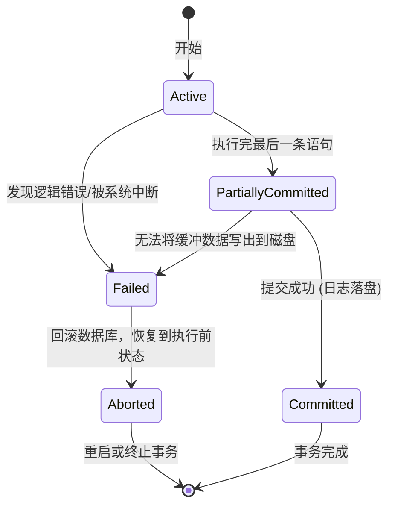

## 事务管理

**Chapter 17: Transactions**

### 事务的基本概念

> **事务 (Transaction):** 是数据库中执行的一个或多个 SQL 语句的逻辑工作单元，它是恢复和并发控制的基本单位。

#### ACID 特性

- **原子性 (Atomicity):**  事务中的所有操作要么全部成功执行，要么全部不执行（All-or-nothing）。
- **一致性 (Consistency):**  事务执行前后，数据库必须保持一致性状态。
- **隔离性 (Isolation):**  并发执行的事务之间互相隔离，一个事务的中间状态对其他事务不可见。
- **持久性 (Durability):**  一旦事务提交，它对数据库的修改就是永久性的，即使发生系统崩溃也不会丢失。

---

### 事务状态及转换



- **Active (活动状态):**  事务开始并正在执行过程中的状态。
- **Partially Committed (部分提交状态):**  事务执行完最后一条 SQL，但数据尚未全部安全写出到磁盘。
- **Failed (失败状态):**  正常执行无法继续或无法达到部分提交时进入的状态。
- **Aborted (中止状态):**  事务已被撤销 (Rollback)，数据库恢复至事务开始前的状态。
- **Committed (提交状态):**  事务所有更新全部成功写入磁盘，数据库进入新一致状态。

---

### 调度 (Schedules)

- **定义:**  一组并发执行事务的指令在时间上的执行序列。必须保留每个事务内部指令的相对顺序。
- **串行调度 (Serial Schedule):**  不同的事务依次完整地执行（不交叉）。
- **并发调度 (Concurrent Schedule):**  多个事务的指令交叉执行。
- **可串行化 (Serializability):**  如果一个并发调度的最终执行结果与某个串行调度的结果完全等价，则称该调度是**可串行化**的。

---

### 冲突可串行化 (Conflict Serializability)

#### 冲突指令 (Conflicting Instructions)

> 两个不同事务中的指令 $I_i$ 和 $I_j$ 访问**同一个数据项**，且其中**至少有一个是写操作 (write)** 时，它们之间就会发生冲突。

| 事务 $T_i$ 指令 | 事务 $T_j$ 指令 | 是否冲突 |
| --- | --- | --- |
| `read(Q)` | `read(Q)` | ❌ 不冲突 |
| `read(Q)` | `write(Q)` | ✅ 冲突 (读-写冲突) |
| `write(Q)` | `read(Q)` | ✅ 冲突 (写-读冲突) |
| `write(Q)` | `write(Q)` | ✅ 冲突 (写-写冲突) |

#### 冲突等价与可串行化

- **冲突等价 (Conflict Equivalent):**  如果调度 $S$ 可以通过一系列**交换非冲突相邻指令**的步骤变换为调度 $S'$，则称两者冲突等价。
- **冲突可串行化 (Conflict Serializable):**  如果调度 $S$ 冲突等价于某一个**串行调度**，则称 $S$ 是冲突可串行化的。

#### 冲突可串行化测试：优先图 (Precedence Graph)

- **优先图/前驱图:**  顶点为事务，如果 $T_i$ 与 $T_j$ 冲突且 $T_i$ 先访问该冲突数据项，则画一条有向边 $T_i \rightarrow T_j$。
- **判定定理:**
  
  > 一个并发调度是冲突可串行化的，**当且仅当它的优先图是无环的 (Acyclic)**。

- **串行顺序获取:**  通过对优先图进行**拓扑排序 (Topological Sorting)**，可以得到等价的串行事务执行顺序。

---

### 视图可串行化 (View Serializability)

> 视图等价不关心指令交换，只关注读写依赖和最终状态。

- **视图等价 (View Equivalent) 的三条件 (对于每一数据项 $Q$):**
  1. **初始读一致:** $S$ 中 $T_i$ 读了 $Q$ 的初始值，则 $S'$ 中 $T_i$ 也必须读 $Q$ 的初始值。
  2. **读-写依赖一致:** $S$ 中 $T_i$ 读的值是由 $T_j$ 的写操作产生的，则 $S'$ 中 $T_i$ 也必须读 $T_j$ 写入的值。
  3. **最终写一致:** $S$ 中最后对 $Q$ 执行写入的事务，在 $S'$ 中也必须是最后一个对 $Q$ 执行写入的事务。
- **盲写 (Blind Write):**  事务不执行 `read(Q)`，直接执行 `write(Q)`。
  - **重要结论:**  任何视图可串行化但非冲突可串行化的调度中，**必定存在盲写操作**。
- **判定问题:**  判定一个调度是否为视图可串行化是 **NP-Complete** 问题，实际中难以高效检测。
- **关系:**  冲突可串行化 $\subset$ 视图可串行化。

---

### 可恢复性与级联回滚

#### 可恢复调度 (Recoverable Schedule)

- **要求:**  若事务 $T_j$ 读取了被 $T_i$ 写入的数据，则 **$T_i$ 的提交操作必须发生在 $T_j$ 的提交操作之前**。
- **反例:**  若 $T_j$ 读了 $T_i$ 未提交的修改并直接 commit，随后 $T_i$ 发生 abort 回滚，由于 $T_j$ 已提交，其读取的脏数据无法撤回，破坏了数据库的持久性/一致性。

#### 无级联调度 (Cascadeless Schedule)

- **级联回滚 (Cascading Rollback):**  一个事务的失败导致一系列并发未提交事务不得不一起回滚，浪费大量计算资源。
- **无级联要求:**  若 $T_j$ 需读取 $T_i$ 写入的数据，$T_i$ 的提交操作必须发生在 **$T_j$ 读取数据操作之前**。
- **关系:**  无级联调度 $\subset$ 可恢复调度。数据库应当限制只产生无级联调度。

---

### 并发控制中典型的读写异常 (Anomalies)

| 异常名称 | 冲突类型 | 场景描述 |
| --- | --- | --- |
| **不可重复读 (Unrepeatable Read)** | **读-写冲突** | $T_1$ 读取 $A$，随后 $T_2$ 修改 $A$ 并提交，$T_1$ 再次读取 $A$ 时得到不同结果。 |
| **脏读 (Dirty Read)** | **写-读冲突** | $T_1$ 写入 $A$，$T_2$ 读取了 $A$ 并提交，随后 $T_1$ 回滚。$T_2$ 读取了本不存在的脏数据。 |
| **不一致读 (Inconsistent Read / 读部分提交)** | **写-读冲突** | $T_2$ 读 $A$ 和 $B$，$T_1$ 修改 $A$ 然后修改 $B$ 并提交；$T_2$ 在 $T_1$ 修改 $A$ 前读了 $A$，但在 $T_1$ 修改 $B$ 后读了 $B$，读到了不一致的中间状态。 |
| **部分丢失更新 (Partially-lost Update)** | **写-写冲突** | $T_1$ 写入 $A$ 并接着写入 $B$；中间 $T_2$ 写入了 $A$ 和 $B$。最终结果被两者的写入交叉覆盖，破坏了串行一致性。 |

---

### SQL-92 中的隔离级别

| 隔离级别 | 脏读 (Dirty Read) | 不可重复读 (Unrepeatable Read) | 幻读 (Phantom Read) |
| --- | --- | --- | --- |
| **Read Uncommitted (读未提交)** | 允许 | 允许 | 允许 |
| **Read Committed (读已提交)** | ❌ 禁止 | 允许 | 允许 |
| **Repeatable Read (可重复读)** | ❌ 禁止 | ❌ 禁止 | 允许 |
| **Serializable (可串行化)** | ❌ 禁止 | ❌ 禁止 | ❌ 禁止 |

- **幻影现象 (Phantom Phenomenon):**
  - **场景:** $T_1$ 读取 `salary > 90000` 的记录并加上行级锁，随后 $T_2$ 插入了一条新的 `salary = 100000` 的记录并提交。当 $T_1$ 再次以相同条件查询时，会发现多了一条记录。
  - **解决:** 普通的行级锁无法解决幻读问题，需要引入**谓词锁 (Predicate Locking)**。
- **快照隔离 (Snapshot Isolation - SI):**  许多主流数据库默认采用快照隔离（如 Oracle、PG 9.0 之前），它读取的是事务开始时的版本快照。

---

### SQL 事务控制语法

```sql
-- 开启并设置当前事务隔离级别
SET TRANSACTION ISOLATION LEVEL SERIALIZABLE;

-- 提交事务并隐式开启下一个新事务
COMMIT WORK;

-- 撤销/中止当前事务
ROLLBACK WORK;
```

> **JDBC 事务控制:** `connection.setAutoCommit(false)` 可关闭语句级隐式提交，使用 `connection.commit()` 和 `rollback()` 进行显式事务边界管理。
