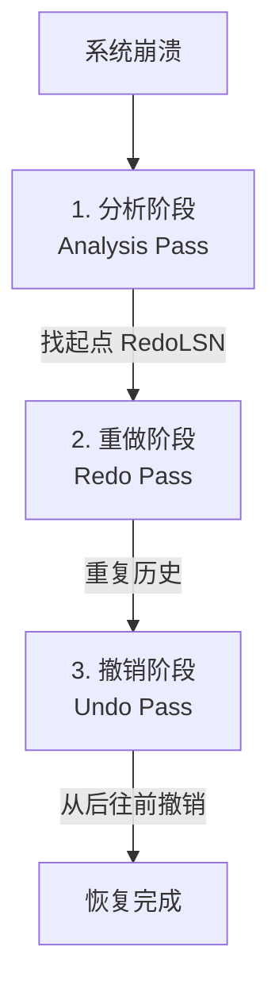

## 恢复系统

**Chapter 19: Recovery System**

### 故障分类与存储结构

#### 故障分类

- **事务故障 (Transaction Failure):**
  - **逻辑错误:**  如溢出、除零、数据格式错误导致事务无法继续。
  - **系统错误:**  DBMS 主动终止事务（如死锁处理选为受害者）。
- **系统崩溃 (System Crash):**  停电或硬件/软件故障导致系统宕机。
  - **Fail-stop 假设:** 假定发生系统崩溃时，非易失性存储器（如磁盘）上的数据不会遭到损坏。
- **磁盘故障 (Disk Failure):**  物理磁头损坏导致数据丢失。可以通过**校验和 (Checksum)** 来检测损坏。

#### 存储结构

- **易失性存储 (Volatile Storage):**  无法在系统崩溃中幸存（如内存、高速缓存）。
- **非易失性存储 (Nonvolatile Storage):**  可在系统崩溃中幸存（如磁盘、闪存、NVRAM）。
- **稳定存储器 (Stable Storage):**  一种概念上的理想存储介质，永远不会丢失数据。实际中通过在不同的独立物理介质上维护**多个数据副本**（如物理 RAID、异地容灾）来无限逼近。

---

### 数据访问与缓冲区管理

- **物理块与缓冲块:**
  - 物理块 (Physical Block): 存储在磁盘上的块。
  - 缓冲块 (Buffer Block): 临时缓存在主存中的块。
  - 块传输操作: `input(B)` 从磁盘读入内存；`output(B)` 从内存写入磁盘。
- **工作区交互:**  事务在私有工作区对局部变量进行操作：
  - `read(X)`: 从内存缓冲块将 $X$ 读入局部变量。
  - `write(X)`: 将局部变量值写回内存缓冲块的 $X$。并不意味着立刻执行 `output(B)` 刷盘。
- **提交 (Commit):**  当事务的 `commit` 日志记录被安全地写入稳定存储器时，该事务被正式认定为已提交。

---

### 日志与基本恢复机制 (Log-Based Recovery)

> 日志是保存在稳定存储器中的一组日志记录序列，用于记录所有数据库的更新活动。

- **常见日志记录格式:**
  - `<Ti start>`: 事务开始。
  - `<Ti, X, V1, V2>`: 事务更新。$X$ 是被修改项，$V_1$ 是旧值 (用于 Undo)，$V_2$ 是新值 (用于 Redo)。
  - `<Ti commit>`: 事务成功提交。
  - `<Ti abort>`: 事务被中止回滚。
- **预写日志协议 (Write-Ahead Logging, WAL):**
  - **核心准则:**  在任何缓冲数据块被写入物理磁盘（刷盘）之前，与之对应的**日志记录必须先成功写入稳定存储器**。
- **立即修改技术 (Immediate Database Modification):**
  - 允许未提交事务的更新在提交前就写入缓冲区或物理磁盘。目前大多数系统采用此方案（需要配合 WAL 协议）。
- **延迟修改技术 (Deferred Database Modification):**
  - 事务在提交前，所有更新只保留在本地缓冲区，绝对不物理写入数据库；只有在提交时才刷盘。

#### Undo 与 Redo 操作

- **`undo(Ti)`:**  反向撤销 $T_i$ 做的所有更新。从 $T_i$ 的最后一条日志开始往前扫描，将所有被它修改的值恢复为旧值 $V_1$。
  - 每次撤销一个写入时，会写出一条特殊的**补偿日志记录 (Compensation Log Record, CLR)** `<Ti, X, V1>`。
  - 撤销完毕后，写入 `<Ti abort>` 记录。
- **`redo(Ti)`:**  正向重做 $T_i$ 做的所有更新。从 $T_i$ 的第一条日志开始往后扫描，将所有被它修改的值设为新值 $V_2$。重做过程**不产生新的日志**。
- **系统故障后的判定:**
  - 若日志中有 `<Ti start>` 且**无** `<Ti commit>` 或 `<Ti abort>` $\rightarrow$ 执行 `undo(Ti)`。
  - 若日志中有 `<Ti start>` 且**有** `<Ti commit>` 或 `<Ti abort>` $\rightarrow$ 执行 `redo(Ti)`。
- **历史重复 (Repeating History):**  如果系统在恢复撤销期间再次崩溃，重启时仍然会将之前的撤销操作重新 redo (因为撤销写入的 CLR 也会被重做)。这极大地简化了数据库故障恢复的设计。

---

### 检查点 (Checkpoints)

- **目的:**  缩短系统故障恢复时的日志扫描量，避免对那些已经安全落盘的数据进行无意义的重做 (Redo)。
- **检查点步骤:**
  1. 暂停所有事务更新操作。
  2. 将当前内存中的所有日志记录强制刷盘。
  3. 将所有已修改的缓冲区数据块（脏页）刷盘 (output)。
  4. 在稳定存储器中写入一条 `<checkpoint L>` 日志，其中 $L$ 是当前所有活跃（未提交）事务的列表。
- **恢复时的扫描限制:**
  - 从后往前扫描日志找到最新的 `<checkpoint L>` 记录。
  - 只有 $L$ 中的活跃事务，以及该检查点之后启动的事务，才需要进行 undo/redo。比检查点更早提交的事务更新已确认安全落盘，在恢复时可直接忽略。

---

### ARIES 恢复算法 (IBM 黄金标准)

> ARIES 是现代数据库崩溃恢复的行业标准算法。它在基本日志恢复的基础上做出了许多精妙的性能优化。

#### 核心数据结构

- **Log Sequence Number (LSN):**  每条日志记录的唯一递增序号（通常是日志文件中的偏移量）。
- **PageLSN:**  数据库每个物理页面内存储的字段。记录的是**最后一次修改该页面的日志记录的 LSN**。
  - **幂等性保障:**  如果磁盘页面的 $\text{PageLSN} \ge \text{当前日志LSN}$，说明该更新已经反映在磁盘上了，重做阶段可直接跳过该操作，防止重复 Redo。
- **Dirty Page Table (脏页表):**  记录目前驻留在内存缓冲区中、已被修改但尚未被刷回磁盘的所有页面。
  - 每个脏页记录其 `RecLSN`（该页在内存中**首次变脏**时对应的日志 LSN）。`RecLSN` 决定了恢复时 Redo 阶段的绝对起点。
- **模糊检查点 (Fuzzy Checkpointing):**
  - **优化:**  在写检查点时，**不需要暂停事务并强制将脏页刷盘**。它仅仅将当前的脏页表 (Dirty Page Table) 和活跃事务列表写入日志，检查点开销极低。脏页依然由后台线程异步且持续地刷盘。

#### ARIES 三阶段恢复流程 (Three Passes)

1. **分析阶段 (Analysis Pass):**
   - 从最后一个成功的检查点记录开始**向前扫描**日志。
   - 找出崩溃时所有未完成的事务放入 `undo-list`。
   - 重建脏页表。
   - 找出脏页表中所有页的 `RecLSN` 的最小值，记为 **`RedoLSN`**（即最古老脏数据开始变脏的位置）。

2. **重做阶段 (Redo Pass):**
   - 从 **`RedoLSN`** 开始**向后扫描**日志，**重复历史 (Repeating History)**，包括那些崩溃前已被 abort 回滚的事务的操作。
   - 对于遇到的每条更新日志，满足以下条件之一则跳过（避免不必要的磁盘 I/O）：
     1. 该页面不在脏页表中；
     2. 日志 LSN < 脏页表中该页的 `RecLSN`。
   - 否则，从磁盘读取该页面。如果磁盘页的 $\text{PageLSN} < \text{当前日志LSN}$，执行重做并更新 PageLSN。

3. **撤销阶段 (Undo Pass):**
   - 从后往前扫描日志，撤销 `undo-list` 中所有不完整事务的修改。
   - 撤销时，写入 **CLR 补偿日志**。CLR 中带有一个 `UndoNextLSN` 字段，指向该事务上一个（更早的）需要被撤销的日志 LSN。
   - **优化:**  当扫描遇到 CLR 记录时，直接跳转到其 `UndoNextLSN` 处继续撤销，**跳过中间所有已经被撤销过的日志记录**，防止在崩溃恢复重启期间发生重复撤销。

---

### 影子页表技术 (Shadow Paging)

> 日志恢复之外的另一种非日志恢复替代方案（适用于单用户或串行执行的系统）。

- **原理:**  在事务生命周期内维护两个页表：**当前页表 (Current Page Table)** 和**影子页表 (Shadow Page Table)**。
  - 影子页表存在非易失性存储中，不作修改，保留事务开始前的数据库状态。
  - 写入数据时，分配一个空闲新物理页进行写入，当前页表指向新物理页，影子页表不变。
  - 提交时，将当前页表的内容持久化保存，覆盖为新的影子页表。
- **优缺点:**
  - **优点:**  无需写运行日志；崩溃恢复极其简单（直接把影子页表指针复位即可）。
  - **缺点:**  提交开销高（需强制刷所有修改页和当前页表）；数据页面碎片化严重；垃圾回收成本高；极难支持事务高并发。
