## Intro to Relational Model

### Structure of Relational DB

#### Relation Schema and Instance

- **Relation Schema**

  > **R =(A  1 , A  2 , ..., A  n )**
  >
  > **eg: instructor = (ID, name, dept_name, salary)**

  - **关系模式**:是指一个关系的结构, 即: 这个关系有哪些属性(Attribute), 也就是 "表结构".

- **Relation Instance**

  - **关系实例**:是指这个关系当前的具体数据, 即: 表中实际存储的内容. 例如:

    $r(R)$ 就是一个关系实例

- **tuple(元组)**

  - **元组**:关系实例里面的每个元素, 就叫做元组. 即: 对应表格中的一行数据.

  > 关系也就是元组的集合; 
  >
  > **关系是无序的, 因为它的本质是集合**, 具体来讲, **tuple** 的存放顺序不会影响关系本身; 

- **Attribute(属性)**

  - **Domain(域):**  每个属性允许取值的范围; 
  - **Atomicity(原子性):**  即: 不可再分性; 一个属性只能对应一个特性, 一个属性里也不能放多个值; 
  - **null(空值):**  特殊值; 后续有关于 null 的运算; 

### Keys

- **Superkey(超码/超关键字)**
  - 是一个或者多个属性的集合
  - 这些属性可以实现 **唯一标识 tuple**
- **Candidate key(候选码)**
  - 即满足极小性的 **superkey(它的任意真子集都不是超码 /去掉任何一个属性都无法唯一表示数据)**
- **Primary key(主码)**
  - 从候选键中挑出的一个, 具有唯一性
  - 主码属性要加下划线
- **Foreign key(外码约束)**
  - 定义: 关系 r  1  的 A 属性到关系 r  2  的 B 属性的外码约束, 其中, 在任何数据库实例中, r  1  中的每个元组对 A 的取值一定与关系 r  2  某个元组对 B 的取值相等(eg: 要在授课表中新添加一个老师 ID, 但是这个 ID 在讲师表中没有, 那么这个插入请求就被取消了)
  - 引用关系(referencing relation)/从表/子表: 即 r  1 
  - 被引用关系(referenced relation)/主表/父表: 即 r  2 

### Relational Algebra(关系代数)—— 一种过程化语言

#### 基础运算符

> 其中: 选择, 投影, 重命名是 **一元运算符(unary)**; 并, 差, 笛卡尔积是 **二元运算符(binary)**

- **Select($\sigma$​)选择**

  - 作用: 选择满足给定谓词(predicate, 即: 条件)的元组;

    - 谓词的规则

    > 是命题演算的 **公式**, 可以由 **$\land$(and)**, **$\lor$(or)**, **$\lnot$(not)** 连接组合

  - 记作: **$\sigma_{p}(r)$​**

  - 例子: 选出 A 关系中工资大于 1000 的元组

    ​    : **$\sigma_{salary>1000}(A)$​**

- **Project($\Pi$​)投影**

  - 作用: 保留所选择的属性列

  - 记作: **$\Pi_{A1,A2,...,An}(r)$​**

  - 例子: 选出关系 A 中的名称和 ID 属性

    ​    : **$\Pi_{name,ID}(A)$​**

  - 特性: 去除重复行(Duplicate rows), 因为关系的本质是集合

- **Union($\cup$​)并**

  - 作用: 合并两个关系的所有元组, 并自动去重
  - 记作: **$r \cup s$**​
  - 合法前提: 
    - 两个关系的元数必须相同
    - 对应位置的属性值域必须兼容, 即: 对应列数据类型必须一致

- **Set diffenence($-$​)差**

  - 作用: 选出属于关系 A 但不属于关系 B 的元组
  - 记作: **$r - s$​**
  - 合法前提: 和并操作一致

- **Cartesian-Product($\times$​)笛卡尔积**

  - 作用: 把任意两个关系的信息组合成一个新关系

  - 记作: **$r \times s$​**

  - 合法前提

    - 两个关系的属性集合不相交(disjoint), 即: 没有同名的属性

    > 为了避免同名, **重命名(renaming)** 是重要的

- **Rename($\rho$)重命名**

  - 作用: 将表达 E 的计算结果重命名为 X
  - 记作: **$\rho_{x}(E)$​**
    - 在此基础上, **$\rho_{x(A1,A2,...,An)}(E)$** 把关系的 n 个属性依次命名为 A1, A2,..., An
  - 核心特点: 尽修改关系/属性的名称(即关系模式), 而不修改实际数据(即关系实例)

#### 派生运算符

##### Join Operation(连接运算)

- **Semijoin($R \ltimes S$​)半连接**

- **Inner Join 内连接**

    - **Theta Join($\bowtie_\theta$)\theta 连接**

        - 实质: 先做笛卡尔积, 再对结果做选择筛选
        - 记作: $r \bowtie_{\theta} s$ = $\sigma_{\theta}(r \times s)$​

    - **Natural Join($\bowtie$​)自然连接**

        - 本质: $\theta$ 连接+投影; 是特殊的 $\theta$ 连接

        - 记作: $r \bowtie s$​

        - 规则:

            - 找出两个表中 所有同名的公共属性
            - 要求这些 公共属性的值必须相等, 自动完成等值 匹配筛选
            - 最终结果自动 去掉重复的公共属性列

            > 当自然连接中没有公共属性时, 相当于没有帅选条件, 直接进行笛卡尔积

        - 作用: 日常做关联查询的时候, 两个表总是会用同名的外码/主码做关联, 自然连接刚好直接匹配同名属性, 所以不用手动写匹配条件, 是最常用的连接类型

        - 例子:

            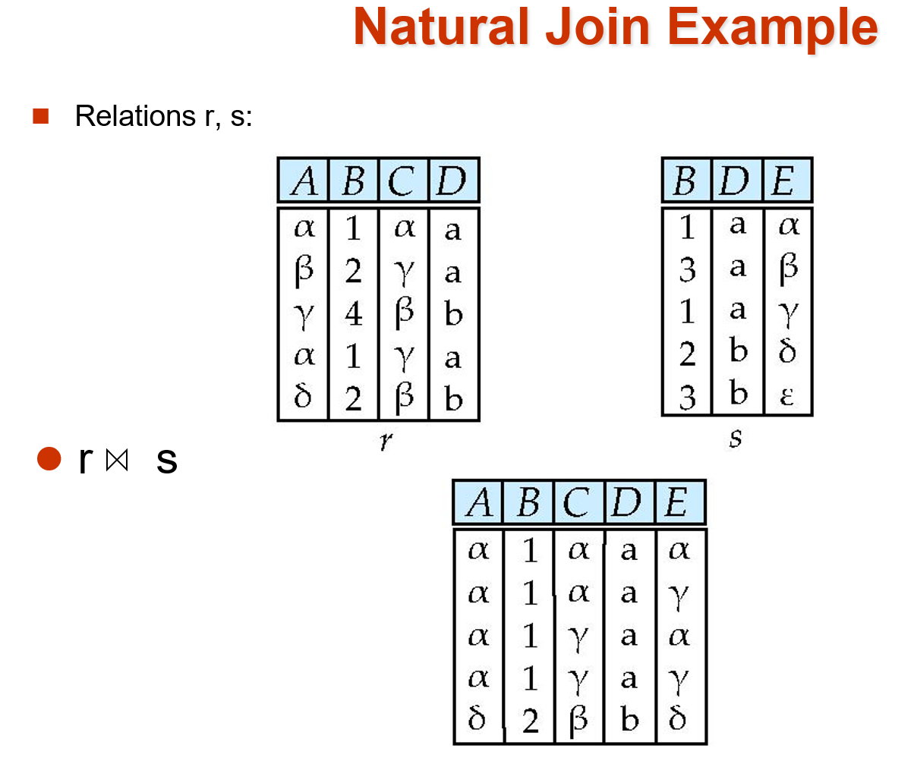{ width="33%" }

- **Outer Join(外连接)**

    - 作用: 是普通连接的扩展, 用来解决普通连接丢失数据的问题; 它会用 **null** 填充缺失的数据, 避免信息丢失

    - 分类

        - **Left Outer Join($R ⟕ S$)左外连接:** 保留左表所有元素
        - **Right Outer Join($R ⟖ S$​)右外连接:** 保留右表所有元素
        - **Full Outer Join($R ⟗ S$​)全外连接:** 左右表都保留, 哪边匹配不上就用 **null** 填充

    - 例子:

        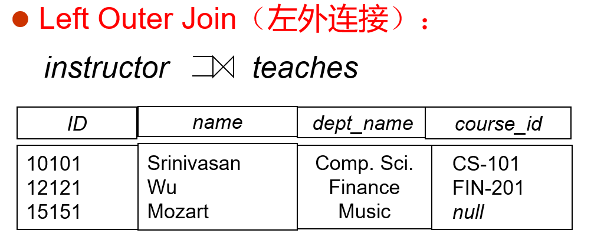{ width="50%" }

        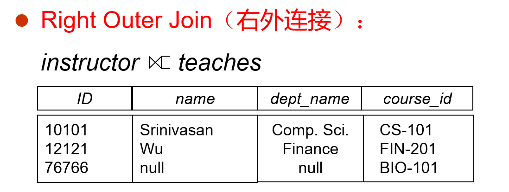{ width="50%" }

        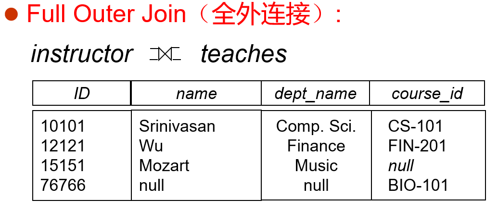{ width="50%" }

##### 其他派生运算符

- **Set-intersection Operation($\cap$)交运算**

  - 作用: 找到给出关系的 共有元组
  - 记作: **$r \cap s$ = $r-(r-s)$**
  - 合法前提: 
    - 两个关系的元数必须相同
    - 对应位置的属性值域必须兼容, 即: 对应列数据类型必须一致

- **Assignment Operation($\leftarrow$)赋值运算**

  - 作用: 类似于编程中的临时变量; 将复杂的关系代数表达式拆分开, 把中间部分的 结果赋值给临时变量, 以简化表达式

  - 记作: 

    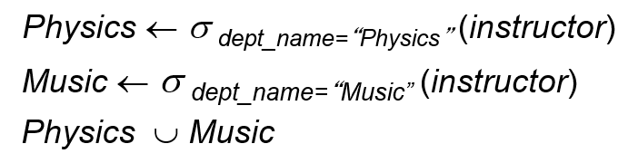{ width="67%" }

- **Division Operation($÷$)除运算**

  - 定义: 给定两个关系 $r(R)$ 和 $s(S)$($R$, $S$ 是属性集合), 并且 $S$ 是 $R$ 的子集, 那么结果 $r÷s$ 的结果是: 一个属性为 $R$ 中去掉 $S$ 的关系; 并且这个关系满足: 结果中的每一个元组 $t$ 和 $s$ 中的每一个元组进行笛卡尔积后, 结果一定在 $r$​中

  - 作用: 适合处理带有 for all 对于所有 这类描述的查询

  - 例子: 

    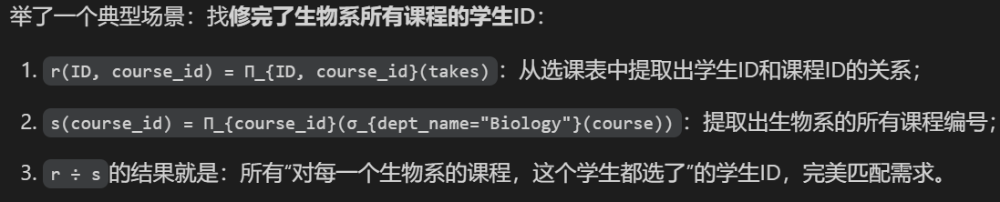{ width="67%" }

    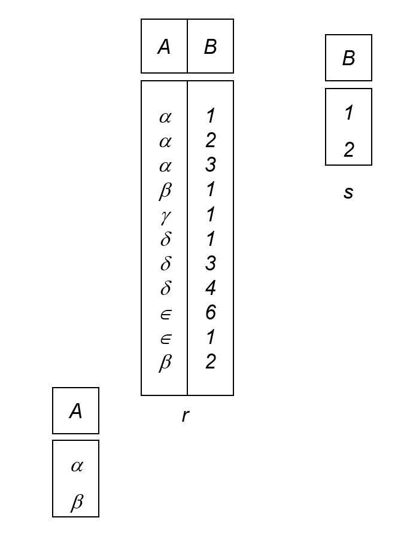{ width="33%" }

    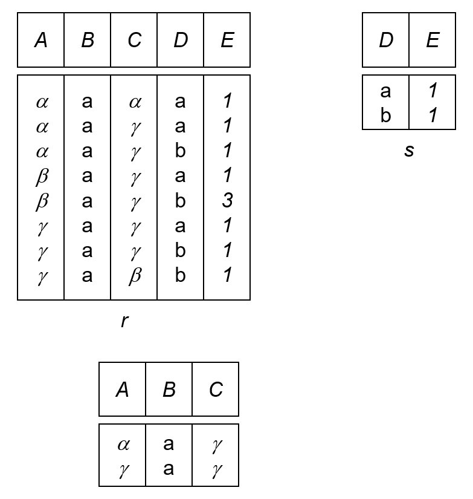{ width="33%" }

#### 空值(null value)

- **定义:**  元组中某个属性的值可以存储为 **null**, 用来表示未知/不知道 **(unknown)**

- **算数运算规则:**  任何算数表达式, 只要含 null , 结果一定为 null

- **Three-valued logic 三值逻辑:**

  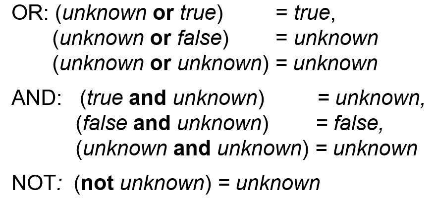{ width="50%" }

  > 在 SQL 中, 配有新语法 **"$P$ is unknown"**, 若 P 的真值是 unknown, 则返回 true

### Extended-Relational-Algebra-Operations(扩展关系代数运算)

#### Generalized Projection(广义投影)

- **功能:**  允许在投影列表中使用 算术运算表达式

- **记作:** $\Pi_{F1,F2,...,Fn}(E)$​​**

  - 参数说明
    - E: 关系表达式
    - Fn: 算数表达式

- **例子:**

  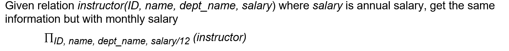{ width="50%" }

#### Aggregate Functions and Operations(聚集函数和运算)

- **作用:**  接受一组值, 计算后返回一个单值结果

- **常用函数: **

  - **avg**: 计算平均值
  - **min**: 计算最小值
  - **max**: 计算最大值
  - **sum**: 计算总和
  - **count**: 计数; 统计值的个数
  - **count-distinct**: 去重计数; 只统计不同值的个数

- **写法: $_{G_1,G_2} \mathcal{G}_{F_1(A_1), F_2(A_2)} (E)$​**

  - 参数说明
    - E: 关系代数表达式
    - ${G_1,G_2}$: 分组属性列表, 按这些属性分组, 其中相同值的为一组(可以为空)
    - ${F_i}$: 每个分组需要执行的聚集函数
    - ${A_i}$: 每个聚集函数作用的目标属性名
  - 结果说明
    - 默认情况, 聚集运算的结果得到的新列是没有属性名的(因为是新值), 所以需要用重命名来解决, 为了方便, 可以直接把重命名写在聚集运算里
    - 比方说: 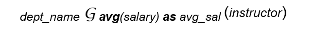{ width="50%" }

- **例子(实际用了重命名):**

  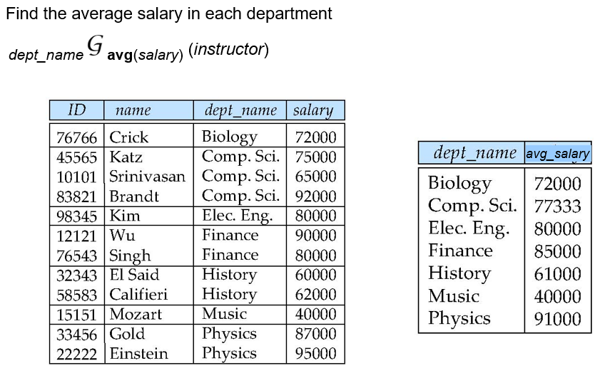{ width="67%" }

### Modification of the Database

> 数据库内容修改一共分三类操作: 删除, 插入和更新; 所有操作都可以由赋值操作($\leftarrow$)来完成

#### Deletion

- **逻辑:**  每一次都必须 删除一整个元组, 不能只删除某个属性中的值

- **记作:** $r \leftarrow r-E$​**

  - 参数说明
    - $r$: 要修改的原关系
    - $E$: 查询出要删除的元组的关系代数表达式

- **例子:**

  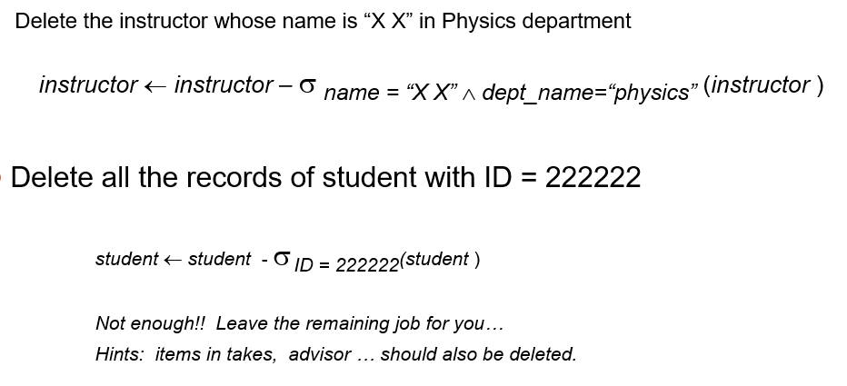{ width="67%" }

#### Insertion

- **作用:**  将新元组插入到原关系里, 既可以插入单个元组, 也可以插入一个查询结果的所有元组

- **记作:** $r \leftarrow r \cup E$​**

  - 参数说明
    - $E$: 要么是 **常量关系** (手动写好要插入的单个/多个元组) 要么是 **查询得到的元组集合**, 和原关系做并运算再写回就完成了操作

- **例子:**

  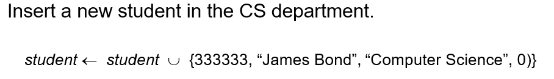{ width="67%" }

#### Updating

- **作用:**  修改已有元组的某个属性值, 不删除整行, 只改指定列的值

- **记作:** $r \leftarrow \Pi_{F_1,F_2,...F_i}(r)$​**

- 更新实现的两种方式

  - 方法一: 利用广义投影直接进行覆盖, 不需要修改的属性直接保留, 需要修改的用算数表达式进行计算
  - 方法二: 先删除再插入; 先将旧元组筛选出来, 删掉旧元组, 然后再将修改好的元组插入回去

- **例子:**

  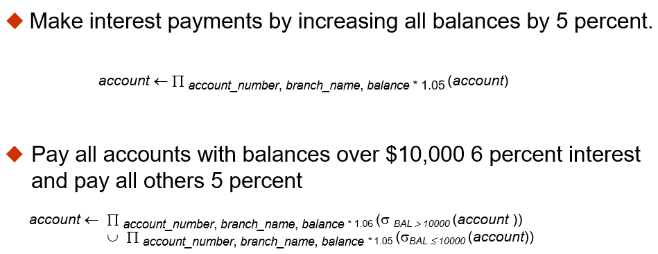{ width="67%" }

### Multiset Relational Algebra

> 传统关系代数中的任何运算都会将结果中的重复元组删除, 但为了适配 SQL 语义(SQL 本身默认是基于多重集合的), 扩展出了多级关系代数

- **多集的表示方法**

  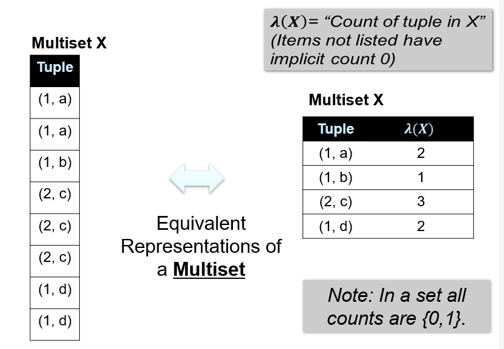{ width="67%" }

  > 记录每个元组的计数 $λ(X)$ (lambda 函数, 计数函数, 没列出的元组计数默认为 0)

- 多重集的运算规则

  - 多重集的交集
    -  对任意元素, 结果多重集 $Z$ 的重数为:  $λ(Z)=min(λ(X),λ(Y))$ 也就是取两个输入多重集里, 该 元素重数的较小值: 
  - 多重集的并集
    - 重数取和

- 多重集关系代数

  - **选择(selection)**:  如果一个元组满足选择条件, 那么结果中该元组的重复次数和它在输入多重集中的 重复次数相同. 
  - **投影(projection)**:  每个输入元组都会在结果中对应产出一个元组, 哪怕投影后出现重复元组, 也会 保留重复, 不会去重. 
  - **笛卡尔积(cross product)**:  如果关系 $r$ 中有 $m$ 份元组 $t_1$, 关系 $s$ 中有 $n$ 份元组 $t_2$, 那么笛卡尔积 $r \times s$ 中, 组合元组 $t_1,t_2$ 会 有 $m \times n$ 份. 
  - **其他运算符(Other operators)**($m,n$ 是两个输入中对应元素的份数)
    - 并集(union): 结果 保留 $m+n$ 份 该元素
    - 交集(intersection): 结果 保留 $min(m,n)$ 份 该元素
    - 差集(difference): 结果 保留 $max(0,m-n)$ 份 该元素

### SQL and Relational Algebra

> 讲解 SQL 语句和多集关系代数的等价转换规则

- 基础 SQL

    - 例子:

        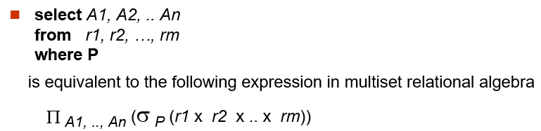

    - 转换逻辑
        1. **FROM** 子句的多个表, **对应做笛卡尔积**, 把所有表拼接成一个关系
        2. **WHERE** 子句的条件 **P**, 对应选择运算 **$\sigma_{P}$**, 筛选符合条件的行
        3. **SELECT** 子句指定的列, 对应投影运算 **$\Pi$**, 提取需要的列, 因为是多集代数, 会保留重复, 和 SQL 语义一致.

- 带分组聚合的 SQL

    - 例子:

        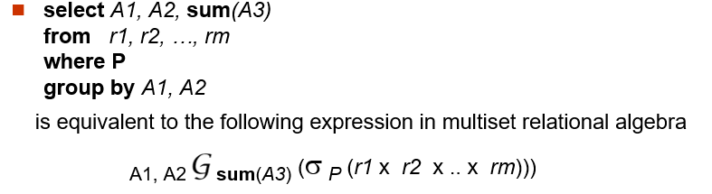{ width="67%" }

    - 转换逻辑

        1. 还是先做表的笛卡尔积, 再用 **WHERE** 筛选行
        2. 然后按 **GROUP BY** 的属性做分组聚集, 得到统计结果, 最后投影提取需要的列并重命名, 完全对应 SQL 的执行逻辑.

- 等价 Query

  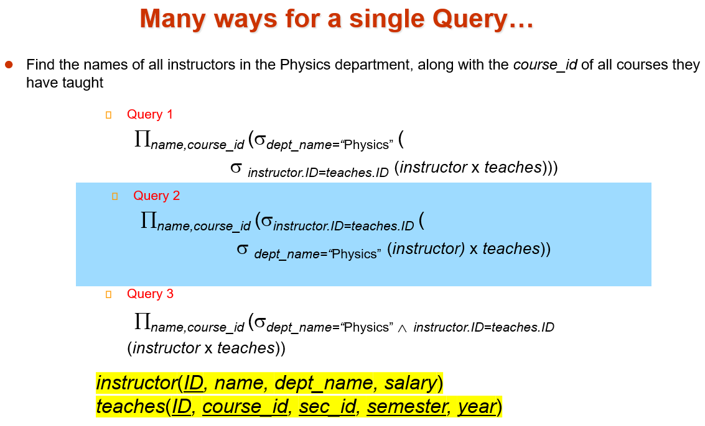{ width="67%" }

