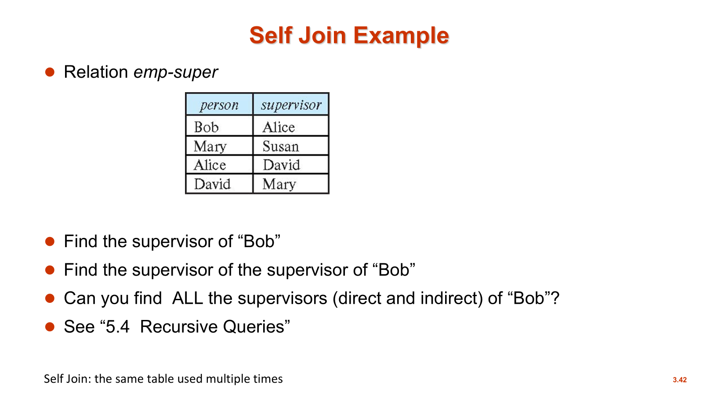
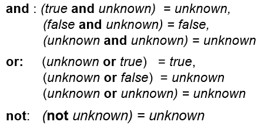

## SQL 简介

### SQL 中的域类型(Domain Types)

- **char(n):** 定长字符串
- **varchar(n):** 变长字符串, 最长为 n
- **int:** 整数类型
- **smallint/bigint:** 短整数/长整数
- **numeric(p, d):** 定点数类型. 其中 p 是总位数/总精度, d 是小数点后保留的位数
- **float(n):** 指定精度为 n 的浮点数(精度就是有效数字)
- **real, double precision:** 浮点数和双精度浮点数

### 表(Table)/关系

#### 表的定义

> 一个表/关系是由拥有关系模式所指定的属性的 **元组的多重集**

- **列表, 集合与多重集**

    - **list**: 普通列表, 有序, 允许重复;

    - **set**: 普通集合, 无序, 去重;

    - **multiset**: 多重集, 无序, 允许重复;

- **常见术语**
    - field: 字段--某个单元格的值
    - row -- tuple -- record: 行--元组--记录
    - column -- attribute: 列--属性/特性
    - cardinality(基数): the number of tuples; 集合的势
    - arity(元数): the number of columns; 


#### 表的创建

##### 创建表的指令

???+ example "创建一个表"
    ```sql
        CREATE TABLE instructor(
                ID            char(5),
                name        varchar(20) NOT NULL,
                dept_name     varchar(20),
                salary        numeric(8,2),
                PRIMARY KEY(ID),
                FOREIGN KEY (dept_name) REFERENCES department        
                );
    ```

创建时涉及到完整性约束(Integrity Constraints), 包括

- 主键约束(PK)

- 外键约束(FK)

- 非空约束(not null)

  其中, 未满足完整性约束的数据库更新会被拒绝; 而属性声明的 PK 会自动满足 not null 条件

##### 主键与外键定义

```sql
-- 列级约束(Column-level): 一次只能定义一个主键, 多了会报错
CREATE TABLE student(
    sid int PRIMARY KEY,
    ...
);
-- 表级约束(Table-level): 定义复合主键(Composite PK)
CREATE TABLE taken(
    sid int,
    cid int,
    ...
    PRIMARY KEY(sid,cid),
);
-- 外键定义与主键同理
CREATE TABLE taken(
    sid int references student(sid),
    ...
);

CREATE TABLE taken(
    sid int,
    ...
    
    foreign key (sid,...) references student (sid,...),
);
```

> A refers to B: A 指向 B
>
> B is referenced by A: B 被 A 引用
>
> 其中 B 是主表, A 是从表

##### 引用完整性(外键对于数据的一致性维护)

- **向子表插入不存在的记录**

    - 结果: 拒绝

- **删除父表的一条记录**

    - 禁止删除(rejected)

    - 级联删除(**cascade**)
    - 置为空值(null)


#### 表的更新

- **Insert**

  > 向表中插入一条新记录
  >
  > **insert into 表名称 values(‘属性 1 的值’, ‘属性 2 的值’, ...)**

- **Delete**

  > 删除表中的所有记录
  >
  > **Delete from 表名称**

- **Drop Table**

  > 删除整个表
  >
  > **Drop table 表名称**

- **Alter**

  > 修改表结构
  >
  > **Add(添加列): alter table 表名称 add 新属性名 数据类型**
  >
  > **Drop(删除列): drop table 表名称 属性名**


### 基本查询结构

- **经典的 SQL 查询语句**

```sql
SELECT 属性1,属性2,...属性n
FROM 表1,表2,...,表n
WHERE P(谓词)
```

**等价的关系代数表达式为:  $$\Pi_{A_1, A_2, \dots, A_n} (\sigma_P(r_1 \times r_2 \times \dots \times r_m))$$​**

- 关于 SQL 的两个基本常识
    - 结果仍然是一个关系——闭包性(Closure)
    - SQL 对于大小写不敏感, 但建议关键字大写


#### SELECT 子句

- **重复值处理(Duplicates)**
    - **distinct**: 强制删除重复的行, 并且作用于后面所有的列. 即: 当有多个属性/列时, 去除的实际上是它们的 **重复组合**
    - **all**: 明确指定不删除重复项. SQL 默认保留重复, 所以 all 一般很少显式地写出来
- **通配符和字面常量**
    - **星号 `*` (asterisk):** 返回表中的所有列
    - 常量(literal)
        - **不带 from:**  返回一个一行一列的单元值. 注: Oracle 不支持
        - **带 from:**  行数等于表的总行数, 列数为一的表
- **算术运算和列重命名**
    - **算数表达式:**  select 子句中可以使用+, -, *, /进行计算
    - **AS 重命名:**  使用‘AS’关键字给列进行重命名

- SQL 示例

```sql
SELECT DISTINCT 列名称 FROM 表名称
SELECT ALL 列名称 FROM 表名称

SELECT * FROM 表名称
SELECT '100' 
SELECT '100' FROM 表名称

SELECT name,salary*1.1 AS increased_salary FROM instructor 
```


#### WHERE 子句

- **作用:**  筛选符合条件的元组

- **数学对应:**  关系代数中的选择(selection, $\sigma$​​​)
- **谓词 P**
    - **逻辑连接符:**  and, or, not
    - **比较运算符:**  >, <, > =, <=, <>(不等于), =, BETWEEN...AND...
    - **元组比较:**  允许将多个属性打包成一个元组进行一次性比较

SQL 示例

```sql
SELECT name 
FROM instructor 
WHERE dept_name = 'SCI' AND salary=10000

-- 元组比较
WHERE (instructor.ID,dept_name)=(teachers.ID,'Biology')
-- 等价于:WHERE instructor.ID = teaches.ID AND dept_name = 'Biology'
```


#### FROM 子句

- **数学对应:**  关系代数中的笛卡尔积
- **执行逻辑:**  嵌套循环(Nested Loops), 如果需要满足条件的拼接则把一行放入结果集
- **点号表示法:**  加入两表都有 ID 属性, 为了区分, 写为 A.ID 和 B.ID 
- **使用 WHERE 子句添加条件:**  连接条件进行笛卡尔积的筛选, 使得结果更有意义

- SQL 示例

```sql
SELECT name,course_id 
FROM instructor,teachers
WHERE instructor.ID=teachers.ID
```


#### 自然连接

- **特点**

    - **自动匹配:**  不需要写 WHERE 条件
    - **去重:**  结果中的同名属性只保留一份
    - **本质:**  笛卡尔积+筛选

- **易错点**

    - 强制匹配所有同名属性

        > **一个很经典的例子:**
        >
        > 假设我们要查 "老师名字" 和 "他教的课程标题 (title)":
        >
        > - `instructor` 表有属性: `ID`, `name`, `dept_name`, `salary`
        > - `course` 表有属性: `course_id`, `title`, `dept_name`, `credits`
        >
        > 如果你写: `from instructor natural join teaches natural join course`
        >
        > * **后果:** 系统不仅会匹配 `instructor.ID = teaches.ID`, 还会因为 `instructor` 和 `course` 都有 `dept_name` 这一列, 而强制要求 `instructor.dept_name = course.dept_name`.
        > * **逻辑错误:** 这意味着你只能查到 "老师在 **自己所属的系** 教课" 的情况. 如果一个生物系的老师去计算机系教一门课, 这条记录就会被 **漏掉**, 因为他们的 `dept_name` 不相等.

- **解决方案**

    - **使用 join ... using(属性 1,...)**

        > 它只会在指定的属性上进行连接, 从而忽略掉其他的同名列

- SQL 示例

```sql
SELECT name,title
FROM instructor NATURAL JOIN teachers

SELECT name,title
FROM instructor NATURAL JOIN teachers,course
WHERE teachers.coursel_id=course_id

SELECT name,title
FROM instructor JOIN course USING (course_id)
```


#### 重命名(Rename)

- **特点**

    - 列重命名
    - 表重命名
    - 关键字‘AS’可省略
        - 注: Oracle 中必须省略

- **处理多表查询的属性歧义**

  > **假设**: Person 表和 Company 表都有 name 和 address 列. 
  >
    > - 解决方案 A(全称法): 在属性前带上表名, 如 Person.name.
    > - 解决方案 B(别名法 - 更常用): 给表起个短别名, 如 Person p, Company c, 然后写 p.name. 这让代码更简洁易读.

- **关于自连接**

  - 最经典的用法: 处理层级结构

    { width="50%" }

- SQL 示例

```sql
SELECT DISTINCT T.name
FROM instructor AS T, instructor AS S
WHERE T.salary>S.salary AND S.dept_name='Comp.Sci'
```


#### 字符串操作(String Operations)

- **字符串表示**
    - SQL 的字符串要用 单引号 `'` 包裹. 如果要把单引号看作是普通字符的话, 那就用双引号将其包裹
- **模糊匹配**
    - 百分号‘%’: 匹配/代替任意长度的字符串
    - 下划线‘_’: 匹配/代替一个字符
- 转义字符
    - 如果内容本身带%或者_, 那么可以使用反斜杠\ + %的方式书写
- 大小写敏感
    - 大多数标准 SQL 中, 字符串匹配区分大小写, 但是有例外, 比如:  MySQL 和 SQL Server
- 其他常用字符串函数
    - **拼接(Concatenation):**  使用‘||’将两个字符串连接起来. (MySQL 中使用 concat()函数, 写法有区别)
    - 大小写转换: upper()转大写, lower()转小写
    - 其他: length()找长度, substring()提取字符串
- SQL 示例

```sql
SELECT name
FROM instructor
WHERE name LIKE '%dar%' -- 即字符串中包含了dar
```


#### 输出排序(Ordering)

- 如果要对结果排序, 则必须使用关键字 **`ORDER BY`**

  > 注意: 如果不使用 **`ORDER BY`**, 输出结果的顺序是 **未定义的

- **升序:**  使用关键字 **`ASC`**, 默认情况下都是升序

- **降序:**  使用关键字 **`DESC`**

- SQL 示例

```sql
SELECT DISTINCT name
FROM instructor
ORDER BY name DESC

ORDER BY dept_name,name
```


### 集合运算符(Set Operations)

- 表示
    - **`UNION`:**  相当于 or
    - **`INTERSECT`:**  相当于 and
    - **`EXPECT`:**  相当于 not
- **自动去重:**  使用这些运算符会自动去重, 如果需要保留则需要在关键字后面加 **ALL**
- 数据库系统的实现
    - 在 Oracle 中, 可以使用 `UNION`, `UNION ALL`, `INTERSECT`, `MINUS`, 但是没有 `INTERSECT ALL` 和 `MINUS ALL`
    - 在 SQL Server 2000 中, 仅支持 `UNION` 和 `UNION ALL`
    - MySQL 不支持 `INTERSECT`


### 空值(Null)

- **含义:**  unknown 或者 not exist

- 含 NULL 的运算

    - **比较运算:**  均被判定为 unknown

        > 除了 `IS NULL` 和 `IS NOT NULL`, 它们可以用来检测空值和非空值

    - **逻辑运算:**

    { width="67%" }

- 如果 WHERE 子句 的谓词结果是 unknown, 则结果会被视为 false


### 聚合函数(Aggregate Functions)

**聚合函数**(aggregate functions) 将一组(集合 / 多重集)值作为输入, 然后返回单个值. SQL 提供以下五种标准的内建聚合函数: 

- `AVG(col)`: 平均值
- `MIN(col)`: 最小值
- `MAX(col)`: 最大值
- `SUM(col)`: 求和
- `COUNT(col)`: 计数(值的个数)


