## E-R Model

### 数据库设计

- 设计阶段(Design Phase)

  - **Initial Phase:** 调查明确用户需要存储什么数据, 以及这些数据如何被使用.
  - **Second Phase:** 将需求转化为 **概念模式(Conceptual Schema)**. 应用逻辑框架(如: 关系模型或 E-R 模型), 将收集到的数据转化为一种抽象结构
  - **Final Phase:** 从抽象模型向具体实施阶段移动. 主要包括以下内容
    - 逻辑设计: 决定 DB 模式
      - 业务决策: 应当在数据库中记录哪些属性?
      - 计算机科学决策: 应该拥有哪些关系模式? 如何将属性分布在不同的关系模式中?
    - 物理设计: 决定数据库的物理布局(数据在物理存储设备, 如硬盘, SSD 上的实际存放和组织)

- 设计替代方案(Design Alternatives)

  设计时要确保避免两个主要陷阱:

  - **冗余(Redundancy):** 不好的设计会导致信息重复, 可能导致各副本之间的数据不一致
  - **不完整性(Incompleteness):** 不好的设计使得某些方面难以建模

- 设计方法(Design Approaches)

  - **实体关系模型(Entity Relationship Model / E-R Model)**
  - **规范化理论(Normalization Theory)**

### E-R 模型概述

#### E-R 模型的组成部分

- **实体集(Entity Sets)**

  - **实体:** 一个客观对象, 可以是抽象的, 也可以是具体的. 例如: 某个人, 某个事件
  - **属性:** 实体通过一组属性来表示, 即该实体集所有成员都具有的描述性特征
  - **主键:** 实体集属性的一个子集, 用来唯一标识集合中的每一个成员
  - **实体集:** 具有相同类型且共享相同属性的实体集合

- 关系集(Relationship Sets)

  - **关系:** 指多个实体之间的关联. 比如: 学生 A 和老师 B 之间通过 advisor 关系关联
  - **关系集:** 指两个及以上的实体集之间的关系. 本质就是将不同实体集中的记录连线起来.
  - **关系集的属性:** 属性既可以属于实体, 也可以属于关系. 比如: 学生和老师的 advisor 关系就可以拥有一个 date, 用来记录开始指导的时间
  - **角色(Roles):** 当一个关系集连接同一个实体集时, 角色标记是必不可少的, 这在处理复杂层级关系时很重要.
  - **关系集的度(Degree):** 即参与到某个关系集的实体集的数量. 其中, 绝大多数都是二元关系, 当然也有三元关系. 比如: 老师, 学生, 项目这个三元关系

- 属性(Attributes)

  - **属性:** 描述实体集所有成员的特性
  - **域:** 属性允许取值的范围/集合
    - **属性类型:**
        - **简单属性与复合属性(Simple and Composite)**
            - 复合属性允许将一个大属性进一步划分为子属性: name-> first_name, middle_initial, last_name
            - 这样做的好处是检索方便. 如果想要查找所有住在某个城市的人, 只要查询对应的 city 字段, 不需要在长字符串地址中进行模糊匹配
        - **单值与多值属性(Single-valued and Multivalues):** 比如一个人可以有多个电话号码
        - **派生属性(Derived):** 可以通过其他属性计算得出. 例如, 有了出生日期就可以算出年龄

- 映射基数约束(Mapping Cardinality Constraints)

  即数量限制. 用来表达通过一个关系集, 一个实体可以和多少个其他实体相关联, 主要用于描述二元关系

    - **四种类型**

        - - **one to one:**A 中的一个实体最多关联 B 中的一个实体, 反之亦然.
        - - **one to many:**A 中的一个实体可关联 B 中的多个实体, 但 B 中的一个实体最多关联 A 中的一个.
        - - **many to one:**与 "一对多" 逻辑相反.
        - - many to many: A 中的一个可关联 B 中的多个, B 中的一个也可关联 A 中的多个.

        图例说明:

        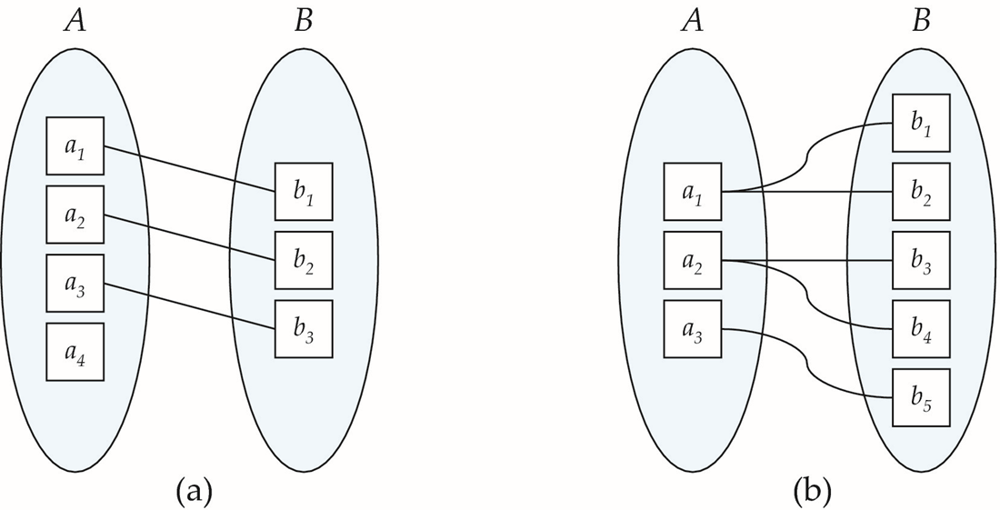{ width="33%" }

        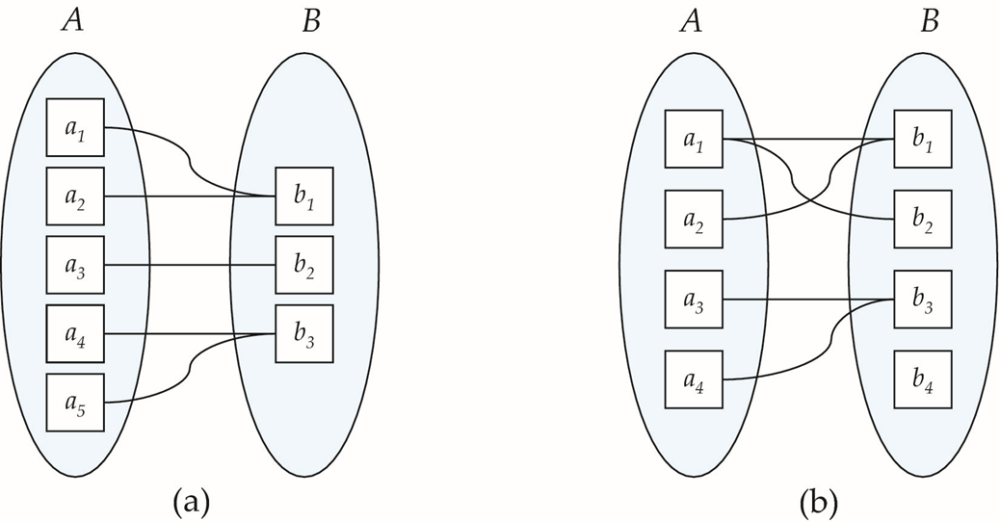{ width="33%" }

    - 三元关系上的基数约束

        - - Q: 在三元关系中, 使用箭头会产生歧义.
        - - A: 解决方案: 最多只允许出现一个箭头. 对于指向的一个实体集 A, 则对于另外两个实体的组合, 则最多对应 A 中的一个实体.

- 参与约束(Total/Partial Participation)

  实体集参与到关系集的一种联系

    - - **完全参与(Total Participation):**指实体集中的每一个实体都至少参与了一次该关系. 例如: 每个学生都必须有一位导师
    - - **部分参与:**指实体集中的某些实体可能不参与任何该关系. 例如: 并非所有老师都必须担任导师

- 主键(Primary Key)

    - 实体集中的主键

        - 唯一性

    - 关系集中的主键

        - - 由所关联的所有实体集的主键组成
        - - **$R的主键 = E_1主键 + E_2主键 + ... + E_n主键 + 关系自身的属性(如果存在)$**
        - - 二元关系主键的选择
            - - 多对多: **两个关联的实体集的主键合起来** 作为关系的主键
            - - 一对多/多对一: **多的那一侧实体的主键** 作为关系的主键
            - - 一对一: **任意一方的主键** 都可以作为关系集的主键

    - 弱实体集(Weak Entity Sets)

        - 定义: 有些实体自身没有足够的主键, 必须依赖于另一个 "强实体". 它们类似于从属关系, 比如: 订单明细依赖于订单号, 但是没有订单, 明细就没有了存在的意义

        > 注:
    >
        > 1. 在数据库的物理实现中, 弱实体集确实是通过外键约束实现的
        > 2. 有所区别的是: 普通的外键约束只是一个属性, 可以为 NULL, 即便删除掉也不会影响原本的实体, 它还在那; 对于弱实体集中的外键, 它是主键的一部分, 是不能为 NULL 的, 如果没有了它, 那么弱实体也就没有了意义.

        - **冗余:** 如果将某个属性添加到弱实体集中, 那么它就有了唯一辨识的能力; 如果不添加, 又显得关系不清晰;

            - 解决方式: 使用一种特殊关系, 表示弱实体集的存在依赖于另一个实体的实体集, 后者被称为标识实体(Identifying Entity). 通过标识实体, 连同弱实体的 **分辨符(discriminator)** 来作为主键.

                > 除了分辨符, 弱实体集还可能有其他的没有唯一性作用的属性

    - 强实体集(Strong Entity Set)

        - - 定义: 非弱实体集的实体集
        - - 关联弱实体集和标识实体集之间的关系叫标识关系

#### 基础 E-R 图的表示方法

- 实体集

  - 矩形框(Rectangles)表示 实体集
  - 属性列在矩形框内
  - 下划线表示该属性为 主键

- 关系集

  - 菱形(Diamonds)表示 关系集

  - 关系集连接实体集, 用来表示关联

  - (如果有)关系集的属性, 使用 虚线与菱形连接. 这些属性可以写在同一个矩形框中, 也可以单独写成一个小矩形

  - **一个关系集可以连接同一个实体集(即自关联)**. 这种情况下, 实体集中的每个参与者在关系中都扮演特定的角色

    - 例如:

    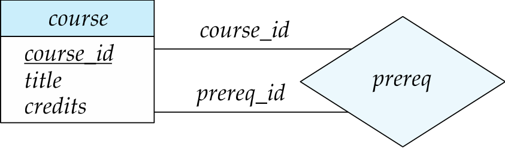{ width="33%" }

    course_id 角色代表主课程, prereq_id 则表示修主课程前要求的先修课程

    > 角色说明(Role indicator): 在联系线上写明该实体的角色

- **复杂属性的表示**

    - 属性的视觉标注规范

        - - **复合属性:** 通过缩进来表示层级结构, 代表复合属性
        - - **多值属性:** 花括号表示该属性可以有多个值
        - - **派生属性:** 圆括号前的属性表示它是由其他字段推算出来的, 不需要显式存储在数据库中

  - 例如: 

    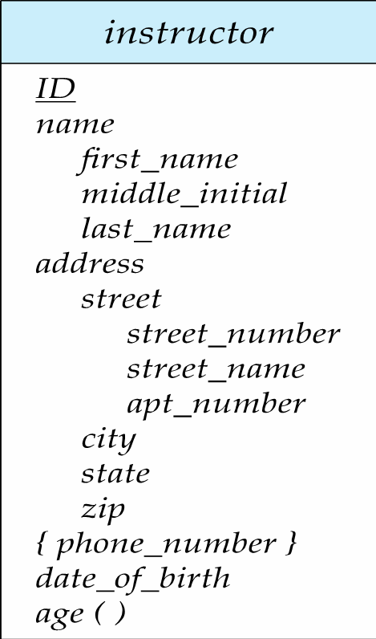{ width="33%" }

- **基数约束的表示**

  - 有箭头($\rightarrow$​): 表示 `一`; 其中, 箭头的方向代表了限制性, 箭头指向的一边表示 `1`

  - 无箭头($-$​​): 表示 `多`

    图例:  分别为一对一, 一对多, 多对一, 多对多

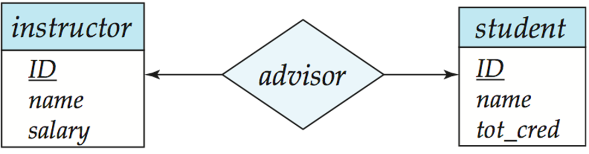{ width="25%" }

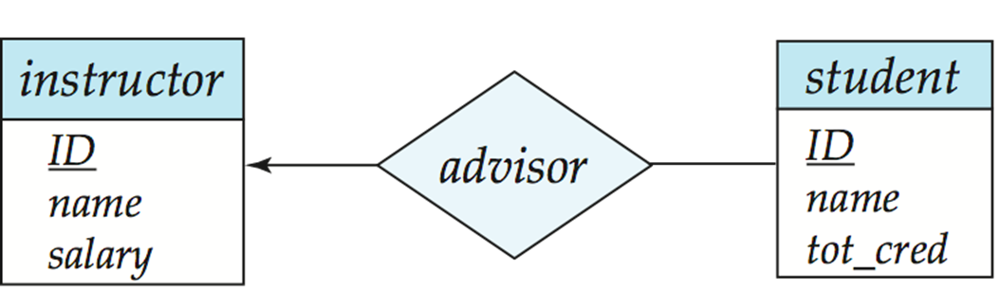{ width="25%" }

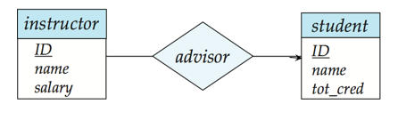{ width="67%" }

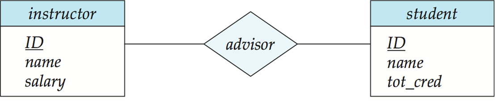{ width="25%" }

- **参与约束的表示**
  - **完全参与:** 使用双实线表示
  - **部分参与:**使用单实线表示
  - 复杂约束: **使用 `l..h` 表示法**, 其中 `l` 是下限, `h` 是上限. `1..1` 表示必须且只能有一个(等价于双线);` 0..*` 表示可以有 0 个或者多个

> 注: 关于基数约束和参与约束, 它们是独立的. 带箭头和不带箭头反映了基数, 而单线和双线反映了参与情况

- **弱实体集, 标识关系, 判别器**
  - **弱实体集: 双矩形**
  - **标识关系: 双菱形**
  - **分辨符:** 使用虚线下划线

### 转换为关系模式

- **表示实体集**

  - **强实体集**

    直接转化为具有相同属性的模式. eg: studnet(ID, name, tot_cred)

  - **弱实体集**

    除了自身的剩余属性/分辨符外, 还需要注意包含标识它的强实体集的主键. 同时创建外键约束, 并设置级联删除. eg: section(course_id, sec_id, sem, year)

  > 注: 在 E-R 图中不画主键是为了简洁, 在物理连表的时候需要将其引用进来

  - **处理具有复杂属性的实体集**

        - **复合属性:**

            通过 `展平(Flattening)` 处理, 将每个子属性创建为一个单独的属性. eg: name $\rightarrow$​first_name, middle_initial, last_name

        - **多值属性**

            - - 实体的多值属性由一个单独的 Schema 来表示
            - - 模式中包含实体的主键以及多值的属性
            - - 例子: 电话号码的对应, 用另外一个表存 ID 和电话号码, 同一个 ID 的多个值就存为多条元组

        - **派生属性**

            在表中不存储, 因为可以计算出来, 存了就会冗余

        - **特殊情况——具有复杂属性的强实体集表示**

            当一个实体除了主键外, 只有一个多值属性. 如果按照之前的方式处理, 为主键建立一个表, 为多值属性建立一个表, 那么就会很浪费.

            - - **优化:** 直接将多值属性拆开, 和主键一起写在一个表中
            - - **易错点:** 这样处理后, 原本的主键可能会失去唯一性, 所以之前弱实体集的外键就会失去作用. 但是系统没有办法检查, 所以要靠程序逻辑或者触发器来维护数据一致性.

- **表示关系集**

  - 多对多
    - 多对多的关系集需要表示为一个模式
    - 其属性包括: 参与关系的两个实体集的主键, 以及关系集自身的任何描述性属性
    - 对于同名的主键, 可以进行重命名进行区分, 同是注意创建外键约束
  - 多对一/一对多
    - 这两种情况下不需要单独创建表来连接
    - 将 `1` 端的主键直接塞到 `N` 的一端做外键即可
    - 例如: 一个部门有多个员工, 只需要在员工表中添加一列部门 ID, 就能减少很多连接操作
  - 一对一
    - 任何一边都可以存对方的主键作为外键
    - 如果参与是部分参与(Partial), 将联系集合并到实体表中可能会导致大量的 NULL(空值)
  - **对于弱实体集和属主强实体集之间的关系集是冗余的**
    - 这个关系集不需要单独建表. 直接将强实体集的主键写为其中的一列, 它和其他的分辨符一起组成了弱实体集的主键, 同时它还是一个外键. 

### 扩展的 E-R 特性(扩展画法)

#### 特化

- 特化(Specialization)——即数据库中的 `继承`: 

    - 定义: 自顶向下(top-down)的设计过程, 在一个实体集中区分出具有独特特征的子小组, 这些子小组成为底层实体集, 它们继承其连接的所有高层实体集的属性和参与的联系, 标记为 ISA, 意思是: is a (是...)

    - **E-R 图表示:** 使用三角形组件表示, 其中尖端指向父类.

        - 特性:
            - **重叠(Overlapping):** 一个人既可以是员工, 也可以是学生
            - **不相交(Disjoint):** 一个员工要么是导师, 要么是秘书, 不能兼为二者
            - **全部与部分(Total and partial):** 是否每个高层实体都必须属于某个底层实体

        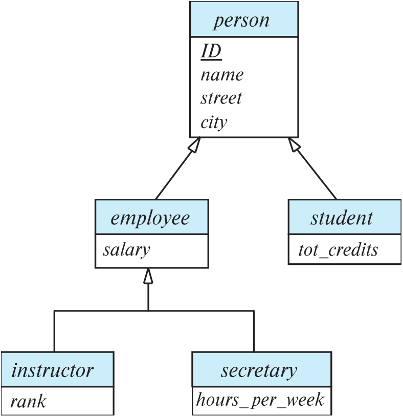{ width="33%" }

    - 通过模式表示特化

        - 方式一

            为高层实体创建一个关系模式, 对于每个底层实体集, 分别为其创建模式, 其中包含高层实体集的主键和局部自己的局部属性

            - 示例:

                person(ID, name, street, city)
                student(ID, tot_cred)
                employee(ID, salary)

            - 缺点

                查询变慢了. 获取一个底层实体的完整信息需要访问两个关系, 这样的话需要两个 Table 去做一个 Join 后才能查到姓名.

            - 优点

                节省存储空间, 没有冗余

        - 方式二

            为每个实体集创建一个模式, 包含其所有的局部属性和继承属性

            - 示例:

                person(ID, name, street, city)

                student(ID, name, street, city, tot_cred)

        ...

            - 缺点

                对于既是 student 又是 employee 的人, 它的姓名, 街道, 城市信息会被冗余存储

            - 优点

                查老师的姓名不需要 Join, 直接在 employee 表中查询就能找到

#### 泛化

- **泛化(Generalization)**

    - 定义: 自底向上(bottom-up)的设计过程, 将具有相同特征的若干个实体集组合成一个更高层的实体集. 与特化是互逆的过程, 

  - E-R 图表示: 也使用 ISA 三角形

    - E-R 图表示: 也使用 ISA 三角形

    - 完整性约束(Completeness Constraint)

        - 定义: 高层实体集中的实体是否必须属于泛化中的至少一个低层实体集
        - **全部(total):** 要求一个实体必须属于低层实体集之一
        - **部分(partial):** 要求一个实体不需要属于任何一个低层实体集

            例子: 比如人可以分为男和女, 如果是 total, 那么这个人不是男就是女, 如果是 partial, 那么这个人还可能是性别不明

        - 在 E-R 图中的表示

            其中部分泛化是默认情况; 对于全部泛化, 采用在三角形旁边用虚线连接并添加关键字 `total`

  

            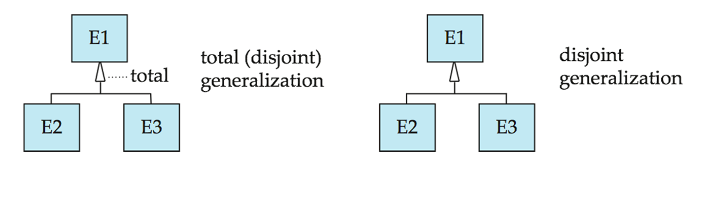{ width="33%" }

    - 特化/泛化的设计约束
        - 成员资格约束: 规定哪些实体可以成为给定低层实体集的成员
            - 条件定义: 比如让超过 60 岁的人都是 senior-citizen 的成员
            - 用户定义: 由用户手动指定
        - 重叠约束: 规定一个实体是否可以属于同一泛化下的多个低层实体集
            - 不相交: 一个实体只能属于一个子类. 在 E-R 图中表现为多个子类连接到同一个三角形
            - 重叠: 一个实体可以属于多个子类.

> 关于特化和泛化, 还有以下特征:
>
> 1. 一个实体集可以基于不同的特征有多个特化.
> 2. ISA 关系也叫做超类-子类(superclass-subclass)关系

#### 聚集

- **聚集(Aggregation)**

  - 问题: 如图所示, 对于之前的三元联系, 假设我们要记录'导师对学生在某个项目上的评价', 这种画法很复杂, 也很难体现出层次感.

  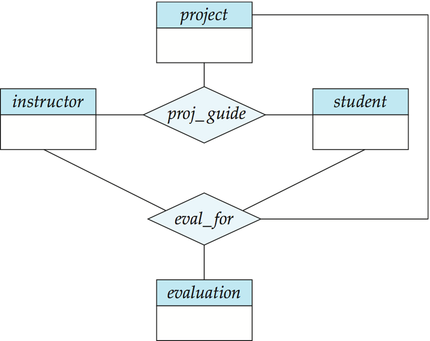{ width="33%" }

  - 分析: 可以看到, 这里的两个关系集表达的信息是有重叠的. 但是有些项目不需要评估, 但是每个评估一定对应一个指导联系, 所以我们无法直接删除 proj_guide 关系. (只有当该三者的联系在 eval_for 中是完全参与时, 才可以删除)

  - 解决方案: 通过聚集来消除这种冗余. 

        - - 将这里的关系看成一个抽象的实体
        - - 允许关系和关系之间建立联系

        简单理解: 就是将实体集和它们的关系打包, 当成一个整体实体来看待

  - E-R 图表示结果

        这里的 eval_for 菱形不再连接三个实体, 而是连接整个框内的内容, 所以评价就是对整件事进行打分

    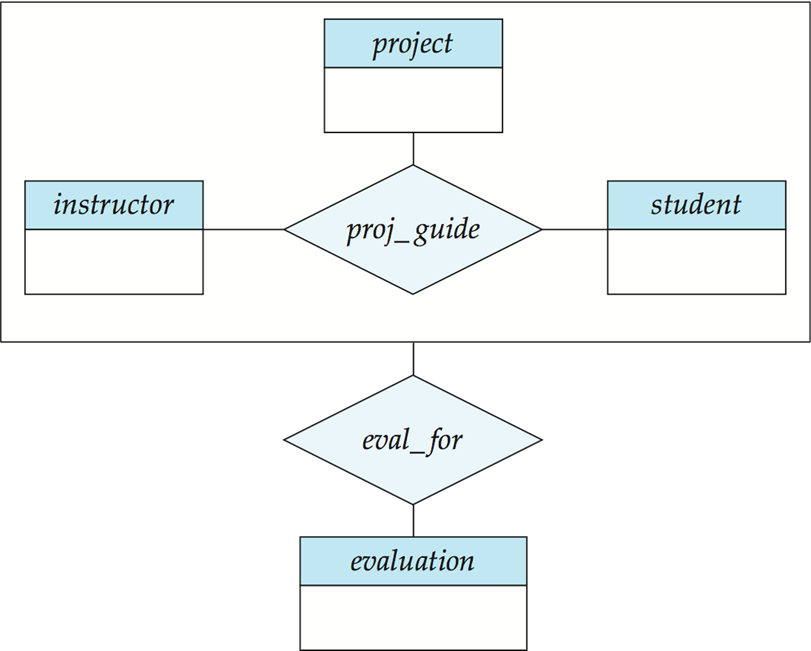{ width="33%" }

  - 转换为关系模式

        - - 包含被聚集联系的所有主键
        - - 包含关联实体集的主键
        - - 所有其他描述性属性

        比如这里: eval_for(s_ID, project_id, i_ID, evaluation_id)

### 设计问题

E-R 图设计中常见的坑

#### E-R 图中常见的错误

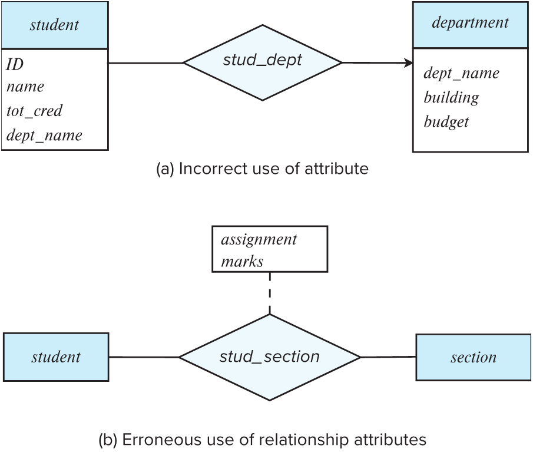{ width="33%" }

- **属性使用不当(Incorrect use of attribute)**

  - 错误点: 在 student 实体里写了 dept_name, 同时又画了一个 stud_dept 联系指向 department. 
  - 原因: 这造成了冗余. 既然有联系线, 就能查到系名, 不需要在学生属性里再写一遍. 

- **关系属性使用错误(Erroneous use of relationship attributes)**

  - 错误点: 把成绩(marks)专门做成了一个实体 assignment. 

  - 原因: 成绩通常是学生和课程段之间的一个属性(描述联系的特征), 而不是一个独立存在的实体. 

  - 一种替代方案: 将 assignment 做成弱实体集, 它依赖于 section. 学生与这个作业之间建立 marks_in 联系, 并带有 marks 属性. 

  - 另一种替代方案: 直接在学生与课程段的联系 stud_section 上挂一个复合属性. 

    图示如下:

  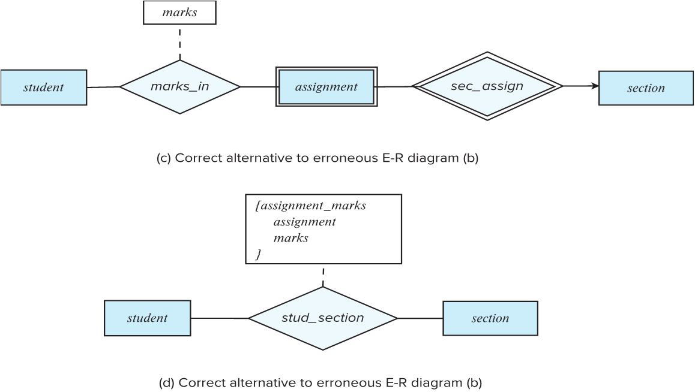{ width="33%" }

#### 实体, 属性, 关系集的选择

- **实体可以记录一些额外信息, 并方便处理多个信息.**

  例如: 如果只是存一个电话号码, 那就用属性; 如果要存 xx 地点的电话号码, 或者一个人有多个电话号码, 那么就单独建立实体

- 联系集可以描述实体之间发生的动作. 一些位于'中间'的信息可以作为联系

  例如: '注册'可以作为学生和学校的联系; 日期如果是具体到某个实体集的, 比如学生入学日期, 那么就放在学生表中; 如果是和其他表有联系的, 比如学生分配导师的日期, 那么就放在关系集里面.

#### 二元联系和非二元联系

- 任何 n 元联系都可以替换为一组不同的二元联系

  - 首先将非二元联系用一个人工实体集来代替, 然后再通过二元连线将参与者与之相连

    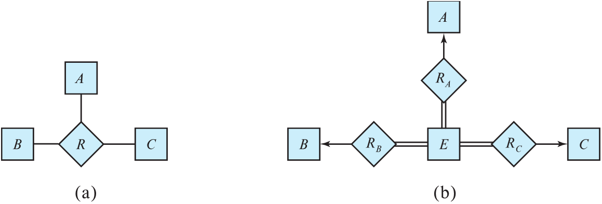{ width="33%" }

  - 还需要转换约束, 完全转换所有约束可能无法实现, 所以可以将 E 设置为弱实体集, 由那三个联系集共同标识, 从而避免创建人工的标识属性.

- 二元联系在数据库物理实现中最简单, 三元联系画图省事, 但是会限制数据的灵活性, 比如二元联系能更好地允许部分信息的存在

### UML

### 总结

1. **处理实体**
   - 将实体集(包含强弱)转为关系模式, 将它们写成独立的表
2. 处理关系
   - 将关系集转为关系模式, 把多对多的联系变为中间表. 在这之后注意有些一对多的联系是否可以合并或者去掉?
3. 去除冗余
4. 合并
5. 处理外键, 加上 foreign key 约束, 确保数据完整性

