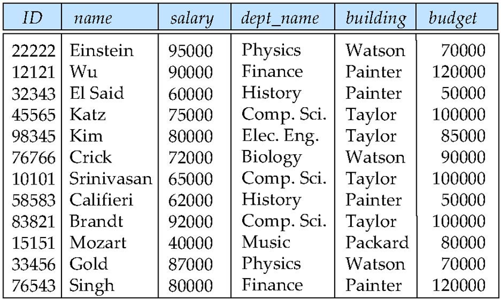
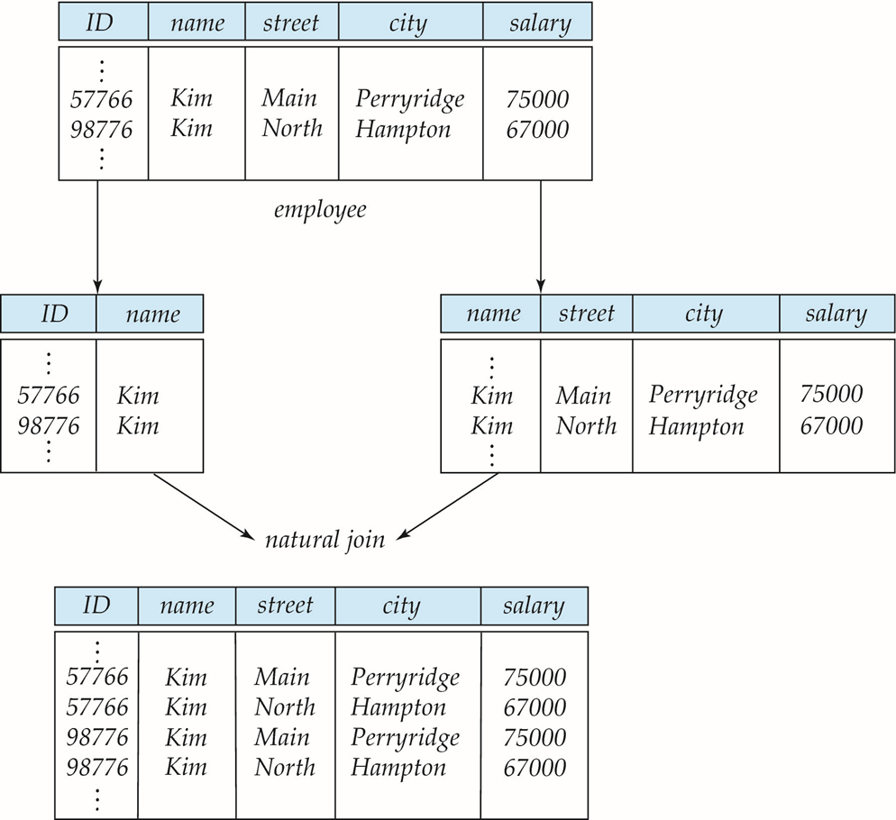
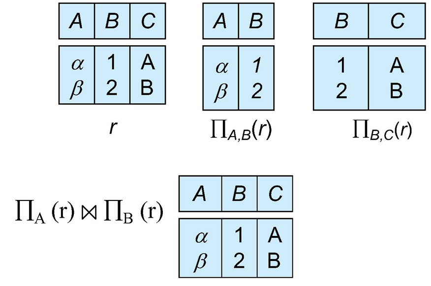
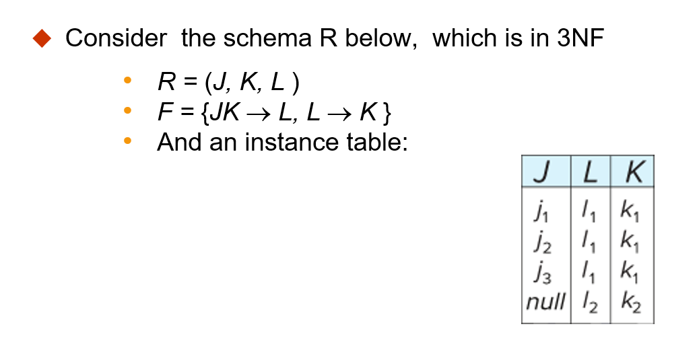
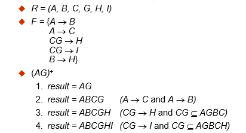
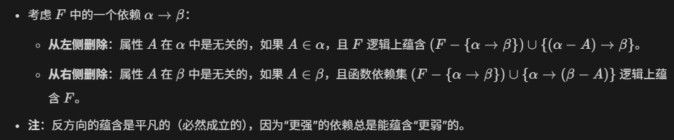
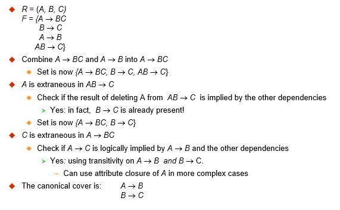
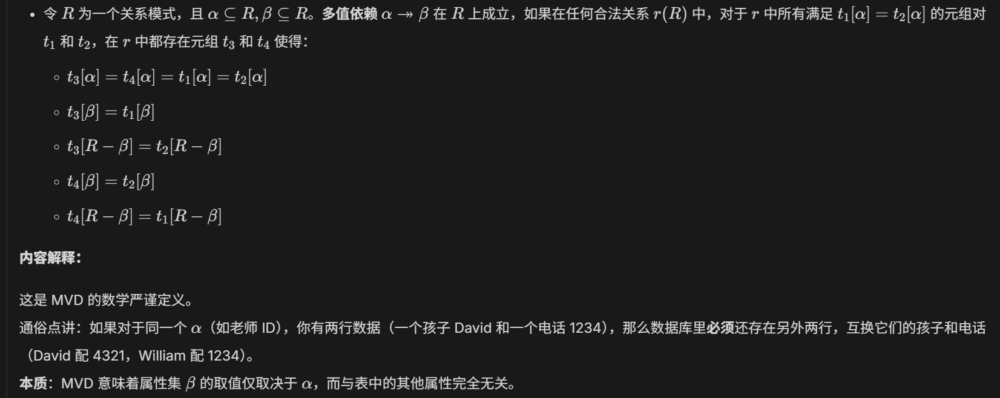

## 规范化

### 良好关系设计的特征

{ width="33%" }

- **问题:** 如果将两个表合并为一个表, 比如将 instuctor 和 depertment 合并, 那么它会存在信息重复的问题; 如果新添加一个部门, 它暂时还没有老师, 那么还需要使用 null 值来填充. 

  - 这不仅导致了冗余, 空间浪费
  - 还会导致更新异常, 如果一个部门搬家, 那么会导致修改几十行内容

- **解决方案:** 分解为两个模式. 

  > 当然, 并非所有的分解都是好的, 如果分解后进行 **自然连接** 但是无法重建原始的关系 **(元组变多或者变少)**, 那么就是一种 **有损分解(Lossy decomposition)** , 下图为示例: 

{ width="33%" }

- **形式化定义:** 

  - **无损分解(lossless decomposition): $\Pi_{R_1}(r)⋈\Pi_{R_2}(r)=r$**​

    先投影分解再自然连接, 结果完全等于原关系

  - **有损分解(lossy decomposition): $r⊂\Pi_{R_1}(r)⋈\Pi_{R_2}(r)$**​

    连接之后的结果比原表多出了错误的行

- **判断标准**

  一般如果 $R_1$ 和 $R_2$​的公共属性是其中一个表的 Key, 那么一般情况下这个分解就是无损的. 下图是一个好的分解的例子: 

{ width="25%" }

### 1NF

- > **第一范式(First Normal Form) / 1NF 约束: 类型必须是原子的**

- **原子性:** 如果一个属性的值在当前的逻辑操作中是 **不可再分的单元**, 那么这个域就是原子的

  - 相对性: 原子性是相对于应用逻辑而言的
  - 例子: 比如一个人的年龄是 25, 那么数据库查询的时候会将 25 取出来, 而不是拆分成 2 何 5; 而对于一些姓名集合, 符合属性, 标识编号(如 CS101)等, 都可以进行拆分. 

  > **简而言之: 表中每个格子只能填一个值, 不能存列表, 数组, 或者其他小表**

  | **Student** | **Courses**   |
  | ----------- | ------------- |
  | Mary        | {CS145, CS229} |
  | Joe         | {CS145, CS106} |
  | …           | …             |

  | **Student** | **Courses** |
  | ----------- | ----------- |
  | Mary        | CS145       |
  | Mary        | CS229       |
  | Joe         | CS145       |
  | Joe         | CS106       |

  从表一到表二就是转换为 1NF 的过程

### FD

- **函数依赖(Functional Dependencies / FD)**

  - **定义:** 设 $R$ ​为一个关系模式, 并且 $α⊆R $​且 $β⊆R$​. **函数依赖** $α→β$​ **在** $R$​**上成立**, 当且仅当对于任何合法关系 $ r(R)$​, 只要其中任何两个元组(行)$t_1$​和 $t_2 $​在属性 $α $​上取值相同, 它们在属性 $β$ ​上也必须相同. 即: $t_1 [α]=t_2 [α]⇒t_1 [β]=t_2 [β]$​

    > 注: 这里再次回顾一下关系模式和关系. $R$ 是关系模式, 也就是整个表格的框架; 而 $r(R)$ 是关系, 是在某个具体时刻, 整个表中的具体数据值. 

    - 因为可以由前一个值唯一确定后一个值, 所以和函数很像, 称为函数依赖
    - $A \rightarrow B$​ 读作 A 函数决定 B, 或者 B 函数依赖于 A. 其中 A 的值一旦确定, 那么 B 的值也就唯一确定了
    - 实际上就是 **Key** 的理论基础

- **函数依赖集的闭包(Closure of a set of FDs)**

  - **定义:** 给定一组函数依赖集 $F$ , 存在一些其他的函数依赖, 可以由 $F$ 逻辑推断出来, 所有的这些函数依赖的集合称为 $F$​ 的闭包
  - **表示:** 使用 **$F^+$** 来表示 **$F$ 的闭包**
  - **传递性:** 如果 $A \rightarrow B$ , $B \rightarrow C$ , 那么可以推断出 $A \rightarrow C$ 

- **函数依赖与码/键**

  意义: FD 比码更加细致, 它可以描述两个非码属性之间的关联.

  - 超码: 当且仅当 $K \rightarrow R$ , $K$ 是 $R$​ 的超码
  - 候选码: 当且仅当 $K \rightarrow R$ , 并且对于 $K$ 的任何真子集 $k$ , $k \rightarrow R$​ 都不成立

- **函数依赖的应用**

  - **满足:** 测试关系是否在给定 FD 集下是合法的, 如果合法, 称 **$r$ 满足(satisfies)$F$**
  - **成立:** 指定合法关系的约束. 如果所有合法关系实例 $r$​ 都满足 $F$ , ​那么称 **$F$​在 $R$​成立(holds on)** .
    - 要注意的是: 关系模式的一个特定实例可能凑巧满足某个 FD , 即使该 FD 在所有合法实例上并不成立. 比如 $name \rightarrow ID$ , 当没有重名的时候 $studnet$ ​表的某个实例恰好能满足

- **平凡函数依赖(Trivial Functional Dependencies)**

  - **定义:** 如果一个函数依赖被关系的所有实例满足, 那么它是平凡的. 例如: $name \rightarrow name$ **(即: 右边的属性完全包含在左边里面)**

- **使用函数依赖来证明某些无损分解**

  对于分解 $R=(R_1,R_2)$ 的情况, 如果 $F^+$ 中至少包含以下两种函数依赖之一, 那么分解时无损分解.  即: 公共属性是分解后的关系的超码

  - **$R_1∩R_2→R_1$**
  - **$R_1∩R_2→R_2$​**

  > **例题:** 对于 $R=\lbrace A,B,C \rbrace$  $F=\lbrace A \rightarrow B, B \rightarrow C \rbrace$, 对于以下两种分解方式, 哪些是无损分解呢?
  >
  > 1.$R_1=\lbrace A,B \rbrace$  $R_2=\lbrace B,C \rbrace$
  >
  > 2.$R_1=\lbrace A,B \rbrace$  $R_2=\lbrace A,C \rbrace$​
  >
  > 
  >
  > **答:** 对于 1 分解, $R_1∩R_2=\lbrace B \rbrace$, 并且有 $B \rightarrow C$ 也即 $B \rightarrow BC$, 所以 1 分解是无损分解. 对于 2 同理, 所以也是无损分解

- **依赖保持**

  问题: 由于每次更新数据库时都去测试函数依赖约束的代价可能是昂贵的, 所以我们需要将数据库设计为一种能够高效测试约束的形式. 如果测试一个函数依赖只需要考虑一个表, 那么这个约束成本就会很低. 然而, 有些时候, 将一个关系分解后, 可能出现不执行 Join 就无法测试的情况, 这种分解会造成执行函数依赖在计算上变得困难.

  - **非依赖保持(NOT dependency preserving):** 如果一个分解使得强制执行函数依赖在计算上变得困难, 那么这个分解被称为非依赖保持.
  - **依赖保持:** 反过来, 如果拆分完表后, 规则不需要拼表就能够检查, 那么就叫做依赖保持.

  **例子:** 

  ​    考虑一个模式: dept_advisor(s_ID, i_ID, dept_name).  具有以下函数依赖: i_ID -> dept_name(导师决定其所在的系)  以及  s_ID, dept_name -> i_ID(在一个系内, 一个学生只能有一位导师)

  ​    可以看到, 上述设计中, 每当一位导师参与一个 dept_advisor 关系时, 我们被迫重复了系名, 如果一个导师指导 10 名学生, 那么他的名字和系名就要重复 10 次, 这些都是冗余. 为了修复这个问题, 我们分解 dept_advisor. 比如分为: 表 1 [i_ID, dept_name], 表 2 [s_ID, dept_name]. 但是无论怎么分, 它都有一个麻烦, 就是无法囊括三个属性, 导致第二个函数依赖的规则很难检查, 每次都需要将两个表 Join 一次才能检查.

- **附: 利用函数依赖来找出关系模式的候选键**
  1. 首先, 观察所有的函数依赖. 所有出现的属性中, 哪些属性是从来没有出现在箭头右边的, 那么就说明这个属性是无法通过其他属性来推导出的. 所以它必须存在于候选键中.
  2. 接着, 尝试组合并计算闭包. 在已有 1 情况筛选出的属性的基础上, 添加其他属性, 并尝试通过关系来计算闭包. 如果能够获得所有的属性, 那么这个组合就是一个超码
  3. 已知它是超码, 我们还需要验证最小化来保证它是候选键. 尝试分别去掉其中的一个属性, 发现都无法得到全部属性, 那么它就是候选键.

### BCNF

- **Boyce-Codd 范式(Boyce-Codd Normal Form)**

  - 定义: 对于一个关系模式 $R$ 及其函数依赖集 $F$ , 如果 $F^+$ 中所有形式为 $\alpha \rightarrow \beta$ 的函数依赖都满足以下至少一项, 则 $R$ 属于 $BCNF$: 

    1. $\alpha \rightarrow \beta$ 是平凡的(也即: $\beta ⊆ \alpha$)
    2. $\alpha$ 是 $R$​ 的一个超码

    > 用一句话来讲: 对于表中的 **任何非平凡依赖, 它的决定因素必须包含主码(或超码)**

- **将模式分解为 BDNF**

  **假设 $R$ 是一个不符合 BCNF 的模式, 令 $\alpha \rightarrow \beta$ 是违反 BCNF 的函数依赖, 可以将 $R$​ 分解为:** 

  - **$(\alpha∪\beta)$**
  - **$(R-(\beta-\alpha))$​**

  > **例题:** 对于关系模式 $in\_dep (\underline{ID}, name, salary, \underline{dept\_name}, building, budget)$ ,  可知: $dept\_name \rightarrow building, budget$ 在 $in\_dep$ 上成立, 但是 $dept\_name$​ 不是超码. 现在要求将这个关系模式分解为 BCNF
  >
  > 
  >
  > **答:** $(α∪β)=(dept\_name,building,budget)$
  >
  > $(R−(β−α))=(ID,name,dept\_name,salary)$​

  > **整个分解为 BCNF 的通用过程为:**
  >
  > 1. **找到那个不符合的函数依赖**
  > 2. **将这个函数依赖涉及的属性单独拿出来做一张表, 其中左边作为新表的主键**
  > 3. **在原表中删掉被决定的(右边的)属性, 但保留左边的属性作为外键连接. 这样能够得到无损连接**

  > 对于 **BCNF 和依赖保持, 它们有时是冲突的.** 就像之前举的 $dept\_advisor$​的例子. 想要 BCNF 来消除所有冗余, 就会分解表导致依赖丢失; 想要保持依赖, 就不能分解表, 那么就会有冗余. 

### 3NF

- **第三范式(Third Normal Form)/3NF**

  - **定义:** 关系模式 R 属于第三范式, 如果对于 $F^+$ 中所有形如 $\alpha \rightarrow \beta$ 的函数依赖, 都有以下至少一项成立:

    1. **$\alpha \rightarrow \beta$ 是平凡的(即: $\beta ⊆ \alpha$​)**
    2. **$\alpha$ 是 $R$​ 的一个超码**
    3. **$\beta - \alpha$ 中的每个属性 $A$ 都包含在 $R$​ 的一个候选键中(注: 每个属性可能在不同的候选键中)**

    > 如果一个关系属于 BCNF, 那么它一定属于 3NF.

    其中的第三个条件是对 BCNF 的最小放宽, 目的是为了确保依赖保持

    例子: 

    ​    考虑一个模式: dept_advisor(s_ID, i_ID, dept_name).  具有以下函数依赖: i_ID -> dept_name(导师决定其所在的系)  以及  s_ID, dept_name -> i_ID(在一个系内, 一个学生只能有一位导师).

    ​    很明显, 它不属于 BCNF, 但是它属于 3NF. 对于依赖 2, 左侧是超码; 对于依赖 1, i_ID 不是超码, 但是 dept_name 包含在候选键{s_ID, dept_name}中

- **3NF 的冗余**

  { width="50%" }

  - **BCNF 与 3NF 比较**

    从这张表就能看到区别. 

    3NF 的优点: 可以获得一个无损连接并且依赖保持的 3NF 设计

    3NF 的缺点: 信息重复; 并且有时不得不用 null 来填充关系

### 规范化的目标

- 令 $R$ 为一个具有函数依赖集 $F$ 的关系模式
- 确定关系模式 $R$ 是否处于 "良好" 的形式(一般指: 没有冗余, 没有异常, 能自动强制执行规则)
- 如果 $R$ 不处于 "良好" 形式, 将其分解为一组模式 $\lbrace R_1,R_2,...,R_n \rbrace$ , 使得:
  - 每个关系模式处于良好形式
  - 该分解是 **无损连接** 分解
  - (如果可以)最好该分解还是 **依赖保持** 的

### 计算: 函数依赖集的闭包

​    在我们设计数据库时, 手头上有几条显而易见的规则 $F$ , 通过逻辑推导, 可以计算出更多的隐藏规则 $F^+$

- **Armstrong 公理(Armstrong’s Axioms)**
  - **自反性(Reflexive rule): 如果 $β⊆α$ , 那么 $α→β$**
  - **增补性(Augmentation rule): 如果 $α→β$ , 那么 $\gammaα→\gammaβ$**
  - **传递性(Transitivity rule): 如果 $α→β$ 并且 $β→\gamma$ , 那么 $α→\gamma$​​**
- 额外规则
  - **合并律(Union rule): 如果 $α→β$ 并且 $α→\gamma$ 成立, 那么 $α→β\gamma$ 成立**
  - **分解律(Decomposition rule): 如果 $α→β\gamma$ 成立, 那么 $α→β$ 且 $α→\gamma$ 成立**
  - **伪传递律(Pseudotransitivity rule): 如果 $α→β$ 且 $\gamma\beta→\delta$ 成立, 那么 $α\gamma→\delta$​ 成立**

​    有了这些规则, 我们可以通过暴力枚举的方式来计算 $F^+$ , 但实际上数据库系统很少真的去计算完整的 $F^+$ , 这太庞大了, 通常会用到下面的方法:

- **属性集的闭包(Closure of Attribute Sets)**

  - **定义:** 给定一组属性 $\alpha$ , 定义 $\alpha$ 在 $F$ 下的闭包为: 在 $F$ 下由 $\alpha$ 通过函数依赖关系决定的 **属性集合**.  **记作 $\alpha^+$**

  > 示例:
  >
  > { width="67%" }

- 属性闭包的应用

  1. 测试属性集 $\alpha$ 是否为超码
  2. 测试函数依赖, 检查 $\alpha \rightarrow \beta$​ 是否成立
  3. 计算 $F$​ 的闭包

### 正则覆盖/标准覆盖

​    在一个关系模式中, 我们会有一组函数依赖 $F$ , 每当用户执行更新的时候, 数据库系统必须确保不违反任何函数依赖, 如果违反了, 系统必须回滚更新. 

- **正则覆盖**

  - **定义**: 我们可以通过一个简化版的函数依赖集来减少检查违反情况所需的工作量, 简化版的集合与原集合就具有相同的闭包, 这个简化后的集合就称为 **正则覆盖**

    > 实际上就是 **能够推导出整个闭包的最小函数依赖集合**

  - **正式定义:** $F$ 的正则覆盖是一个依赖集 $F_c$ , 使得:

    1. $F$ 逻辑上蕴含了 $F_c$​ 中的所有依赖
    2. $F_c$ 逻辑上蕴含了 $F$​ 中的所有依赖
    3. $F_c$ 中 **没有任何函数依赖包含无关属性**
    4. $F_c$ 中 **每个函数依赖的左侧都是唯一的**

- **冗余依赖**

  - **整体冗余**

    比如: $\lbrace A \rightarrow B, B \rightarrow B, A \rightarrow C \rbrace$, 那么, $A \rightarrow C$ 就是冗余的, 

  - **局部冗余**

    有时候一条规则中混进了无关紧要的属性. 比如 $ID+gender \rightarrow name$, 这里的性别其实就是废话, 可以直接删除.

- **无关属性**

  **左侧:** 从函数依赖的左侧删除一个属性可能会使其称为一个 **更强** 的约束. 对应的, **左侧冗余的意思就是条件给多了.**

  ​    例如: 如果我们有 $AB \rightarrow C$ 并删除 $B$ , 那么我们会得到一个更强的结果 $A \rightarrow C$ . 之所以更强, 是因为 $A \rightarrow C$ 在逻辑上蕴含了 $AB \rightarrow C$ , 但是反过来却不行. 

  > 同时这也取决于我们的函数依赖集 $F$ 到底是什么, 我们也许能够安全地从 $AB \rightarrow C$ 中删除 $B$. 比如 $F=\lbrace AB\rightarrow C, A\rightarrow D, D\rightarrow C \rbrace$ 那么这时 $B$ 在 $AB\rightarrow C$ 就是无关的.

  **右侧:** 从函数依赖的右侧删除一个属性可能会使其成为一个 **更弱** 的约束. 对应的, **右侧冗余的意思就是在结论中写了已经知道的事情**

  ​    例如: 如果我们有 $AB \rightarrow CD$ 并删除 C, 那么我们可能得到更弱的结果 $AB \rightarrow D$. 它时更弱的, 因为仅使用 $AB \rightarrow D$ , 我们无法推导出 $AB \rightarrow C$​. 

  > 同样的, 这也取决于 $F$ . 比如 $F=\lbrace AB\rightarrow CD, A\rightarrow C\rbrace$ , 那么可以证明将 $AB\rightarrow CD$ 替换为 $AB\rightarrow D$ 后, 依然可以推导出 $AB\rightarrow C$​ .

  - **无关属性的正式定义:** 如果在不改变 $F^+$ 的情况下可以删除 $F$​ 中某个函数依赖的一个属性, 那么该属性是 **无关的(extraneous)**

    { width="50%" }

    > **例题:** 令 $F=\lbrace AB \rightarrow CD, A \rightarrow E, E \rightarrow C \rbrace$ , 检查 C 是否在 $AB \rightarrow CD$ 中无关?
    >
    > **答:** 假设无关, 那么对于 $F=\lbrace AB \rightarrow D, A \rightarrow E, E \rightarrow C \rbrace$ , 可以推得 $A \rightarrow C$​ , 所以它是无关的.

- **计算正则覆盖**

  大致过程如下:

  1. 使用合并律合并函数依赖;
  2. 寻找无关属性并删除
  3. 循环执行以上步骤, 直到 $F_c$​ 不再发生变化

  一个例子:

  ​    { width="67%" }

### 依赖保持

- **依赖保持的数学定义:** 令 $F_i$ 为 $F^+$ 中仅包含 $R_i$ 属性的依赖集. 如果满足 $(F_1∪F_2∪...∪F_n)^+=F^+$​ , 则该分解是依赖保持的. 

  使用上述定义来测试依赖保持需要指数级时间.

- **限制集(Restriction)**

  - 令 $F$ 为模式 $R$ 上的依赖集, 令 $R_1,R_2,...,R_n$ 是 $R$ 的一个分解
  - $F$ 在 $R_i$ 上的 **限制** 是 $F^+$ 中所有仅含 $R_i$ 属性的函数依赖集 $F_i$
  - 由于限制集中的所有函数依赖只涉及一个关系模式中的属性, 所以我们可以通过仅检查一个关系来测试这种依赖是否满足
  - 注意, 限制的定义使用的是 $F^+$ 中的所有依赖, 而不仅仅是 $F$ 中的
  - 限制集 $F_1, F_2, ... , F_n$ 是可以被高效检查的函数依赖集合

### MVD

​    有时候一个表即使复合 BCNF 它也很可能烂的一塌糊涂. 当两个独立的一对多关系强行塞到一起后, 就会导致冗余, 这种情况 BCNF 无法处理, 需要引入 MVD

- **多值依赖(Multivalued Dependencies / MVDs)**
  - 定义: { width="80%" }

### 4NF

- **第四范式(Fourth Normal Form / 4NF)**

  - **定义:** 关系模式 $R$ 关于函数依赖和多值依赖集 $D$ 属于 4NF, 如果对于 $D^+$ 中所有形如 $\alpha \rightarrow\rightarrow \beta$ 的多值依赖, 至少满足以下一项:

    1. **$\alpha \rightarrow\rightarrow \beta$ 是平凡的**
    2. **$\alpha$ 是模式 $R$ 的一个超码**

    > 如果一个关系属于 4NF, 那么它一定属于 BCNF

