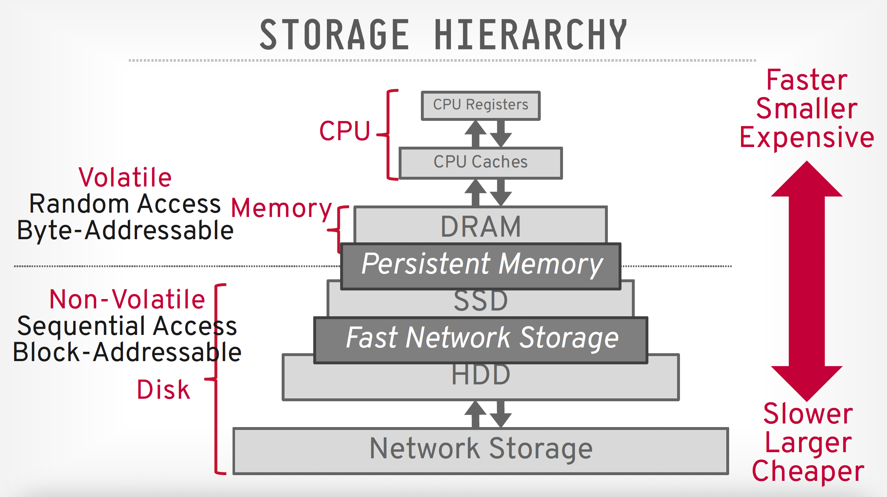
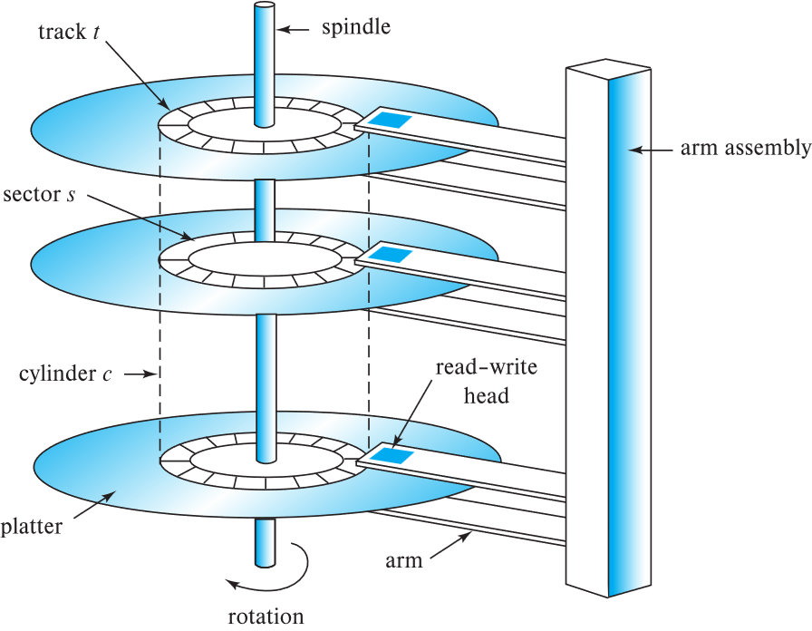

## 物理存储系统

chapter 12: Physical Storage System

### 物理存储介质的分类

- **存储分类: **

  - **易失性存储 (volatile storage): **
    1. 断电后内容会丢失. 
  - **非易失性存储 (non-volatile storage): **
    1. 断电后内容依然存在. 
    1. 包括二级存储, 三级存储, 以及带有电池备份的主存储器. 

- **影响选择存储介质的因素: **

  1. 数据访问速度(speed): 从发出指令到拿到数据需要多长时间.

  2. 单位数据成本(cost per unit of data): 每 GB 或者 TB 需要花多少钱. 
  3. 可靠性(Relilability): 包括因断电或系统崩溃导致的数据丢失, 以及存储设备的物理损坏. 

- **存储层次结构**

  存储设备层级图:

  

  1. 缓存 (cache)

  2. 主存储器 (main memory)

  3. 闪存 (flash memory): 

     - 常用于相机, 智能手机等设备中. 基于闪存实现的存储器有: U盘, 固态硬盘(SSD)等

  4. 磁盘 (magnetic disk)

  5. 光盘 (optical disk)

     - 包括DVD(digital video disk), 光驱(optical disk jukebox)等

  6. 磁带 (magnetic tapes)

     其中, **存储层级越往上,速度越快, 成本越高, 容量越小**, 反之同理. 

     DB会将经常访问的数据放在上方, 而大量历史数据放在下方

  

  除此之外还可以将存储分为以下几个层级: 

  1. 主存储/一级存储 (Primary storage):  

     - 速度最快,成本最高
     - 具有**易失性**
     - 例如: **缓存**, **主存** 

  2. 二级存储(Secondary storage)/联机存储 (on-line storage):

     - 访问速度适中
     - **非易失性**

     - 例如: 闪存, 磁性硬盘

  3. 三级存储 (Tertiary storage):  层次结构中的最低级, **非易失性**, 访问速度慢. 
     - 也称为脱机存储 (off-line storage), 常用于归档存储 (archival storage). 
     - 例如: 磁带, 光盘. 
     - 磁带:  顺序访问, 单盘容量 1 至 12 TB; 自动磁带库(Jukeboxes)可提供拍字节(PB, 即 1000s TB)级别的存储. 

更现代的层级划分:

​    { width="50%" }

- **存储接口**

  - 磁盘接口标准家族: 
    1. SATA (Serial ATA): 串行 ATA;  常见于个人电脑. SATA 3 支持最高 6 Gbps 的传输速度. 
    2. SAS (Serial Attached SCSI): 串行连接 SCSI; 常见于企业级服务器. SAS 3 支持 12 Gbps. 
    3. NVMe (Non-Volatile Memory Express): 非易失性内存主机控制器接口规范; 现代最快的标准, 通过 PCIe 接口连接. 
       - 优势: 更低的延迟, 更高的传输率. 
       - 速度: 最高可达 24 Gbps. 

  - 存储网络架构: 
    1. SAN (存储区域网络):  通过高速网络将大量硬盘连接到多台服务器. 磁盘通常组织在 RAID(冗余磁盘阵列, 用于提速和防灾)中. 
    2. NAS (网络附加存储):  提供文件系统接口的联网存储设备. 解释: 简单说, SAN 像是一个网络上的 "虚拟硬盘", 而 NAS 像是一个网络上的 "共享文件夹". 
    3. Cloud Storage (云存储): 随着互联网发展, 近年来增长迅速. 

### 磁盘

- **磁性硬盘(Magnetic Hard Disk Mechanism)的结构**

  { width="50%" }

  Platter (盘片): 硬盘里叠在一起的圆形金属片, 表面覆盖磁性材料. 图中显示了三张盘片. 通常 1 到 5 张盘片安装在同一个主轴上.

  Spindle (主轴): 盘片中心旋转的轴. 

  Rotation (旋转): 盘片以高速(如 7200 转/分)不停旋转. 

  Arm assembly (磁臂组件): 像老式留声机的唱臂, 负责带着磁头来回移动. 所有的磁头跟随同一个磁臂同步移动

  Read-write head (读写磁头): 每个盘片的上下表面各有一个磁头, 它们悬浮在高速旋转的盘片表面极近的地方. 

  - **几何单位定义: **

  **Track  $t$ (磁道):** 盘片表面分为同心圆磁道. 典型硬盘每个表面有 5 万道 10 万个磁道

  **Sector  $s$ (扇区):** 磁道被划分成的小弧段, 称为扇区, **是读写的最小单位**. 大小通常为 512 字节. 

  **Cylinder  $c$​ (柱面):** 所有盘片上具有相同半径的所有磁道的集合(就像一个垂直的圆柱体表面). 

  - **如何读/写一个扇区?**

  **寻道(Seek): ** 磁臂摆动, 将磁头定位到正确的磁道上. 

  **旋转 (Rotation): ** 盘片持续旋转, 直到目标扇区转到磁头下方. 

  - **磁盘控制器(Disk controller)**

    是计算机系统与磁盘驱动器硬件之间的接口. 

    接受高层命令来读写扇区. 

    启动动作(如将磁臂移动到正确磁道并实际读写数据). 

    计算并附加校验和 (checksums): 为每个扇区验证读取的数据是否正确. 如果数据损坏, 校验和很可能不匹配. 

    通过在写入后立即读回扇区来确保写入成功. 

    执行坏扇区重映射. 

- **磁盘性能度量**

  - **存取时间 (Access time):**  从发出读写请求到数据开始传输所花费的时间. 由以下部分组成: 

    1. **寻道时间 (Seek time):**  将磁臂重新定位到正确磁道所需的时间. 

       - 平均寻道时间是坏情况寻道时间的 1/2. 

       - 典型磁盘上为 4 到 10 毫秒. 

    2. **旋转延迟 (Rotational latency):**  等待要访问的扇区旋转到磁头下方所需的时间. 

       - 典型磁盘(5400 到 15000 转/分)上为 4 到 11 毫秒. 
       - 平均延迟是上述延迟的 1/2. 

       总延迟:  取决于磁盘型号, 通常为 5 到 20 毫秒. 

  - 数据传输率 (Data-transfer rate):  从磁盘检索或存储数据的速率.

    - 最大速率为 25 到 200 MB/秒, 内圈磁道的速率较低. 

  > 影响机械硬盘(HDD / Hard Disk Drive)性能的两大因素就是寻道和旋转两个物理动作, 所以数据库优化的一个主要目的就是减少这种物理寻道时间

  - 磁盘块 (Disk block): 存储分配和检索的逻辑单位. 
    - 通常为 4 到 16 KB. 
    - 更小的块: 从磁盘传输的次数更多. 
    - 更大的块: 由于块未填满而浪费的空间更多. 
  - **顺序访问模式 (Sequential access pattern):** 
    - 连续的请求访问连续的磁盘块. 
    - 仅在访问第一块时需要寻道. 
  - **随机访问模式 (Random access pattern):** 
    - 连续的请求访问磁盘上任意位置的块. 
    - 每次访问都需要寻道. 
    - 由于大量时间浪费在寻道上, 传输率很低. 
  - 每秒输入/输出操作数 (IOPS): 
    - 磁盘每秒能支持的随机块读取数量. 
    - 当前一代机械硬盘约为 50 到 200 IOPS. 

  > 数据库非常在意顺序访问和随机访问的区别. 顺序读取要比随机读取快得多. 而 IOPS 是衡量数据库处理高并发小请求能力的关键指标. HDD 在这一项上表现很弱.

  - **平均无故障时间 (MTTF): ** 预期磁盘连续运行而不发生故障的平均时间. 
    - 通常为 3 到 5 年. 
    - 新磁盘的故障概率很低, 对应于新磁盘 50 万 到 120 万 小时的 "理论 MTTF". 
    - 例如: 如果 MTTF 为 120 万小时, 意味着在 1000 个相对较新的磁盘中, 平均每 1200 小时会有一个损坏. 
    - MTTF 会随着磁盘老化而降低. 

  > MTTF 用于评估系统的可靠性. 虽然时间看上去很久, 但是拥有上万块硬盘的数据中心, 硬盘损坏是每天都会发生的常态, 所以数据库必须要具备数据冗余(如: RAID 或多副本)的能力

### 磁带

- **磁带(Magnetic Tapes)**
  - 可存储海量数据并提供高传输率. 
    - DAT 格式几 GB, DLT 格式 10-40 GB, Ultrium 格式 100 GB+, Ampex 螺旋扫描格式 330 GB. 
    - 传输率从几 MB/s 到几十 MB/s. 
  - 磁带本身便宜, 但驱动器(读写机)价格非常高. 
  - 与磁盘和光盘相比, **存取时间非常慢**. 
    - 局限于顺序访问. 
    - 某些格式提供较快的寻道(几十秒), 但以降低容量为代价. 
  - 主要用于备份, 存储不常用的信息, 以及作为系统间传输信息的脱机介质. 
  - **磁带库 (Jukeboxes)** 用于超大容量存储. 
    - 可达数拍字节(PB, 10151015 字节). 

### 闪存

- **闪存(Flash Storage)**

  - **NOR 闪存**(快, 但贵, 容量小)vs **NAND 闪存**(容量大, 单位成本低). 
  - **NAND 闪存: **
    - 广泛用于存储, 比 NOR 闪存便宜. 
    - 要求 **按页读取**(每页: 512 字节到 4KB). 
      - 读取一页需 20 到 100 微秒. 
      - 顺序读取和随机读取之间差异不大. 
    - **一页只能写入一次**: 必须先擦除才能重新写入. 

- **固态硬盘 (SSD / Solid State Drive): **

  ​    使用标准的面相块的磁盘接口, 但在 **内部将数据存储在多个闪存设备上.** 目前 SSD 几乎全部采用的是 NAND 闪存. 它是一个完整的存储设备. 它除了包含多颗闪存芯片外, 还包含两个至关重要的部分: 

  ​    主控芯片 (Controller):  相当于 SSD 的 "大脑", 负责管理数据怎么写, 怎么读, 以及执行刚才幻灯片里提到的 "磨损均衡" 和 "重映射". 

  ​    接口与固件 (Interface & Firmware):  负责让电脑能识别它(比如 SATA 或 NVMe 协议).

  > SSD 强大的地方在于没有机械寻道延迟, 因此随机访问极快. 但是它有一个物理限制是必须 "先擦后写", 这导致 SSD 写入比读取慢.

  - 擦除以 **擦除块 (erase block)** 为单位进行. 
    - 耗时 2 到 5 毫秒. 
    - 一个擦除块通常为 256 KB 到 1 MB(包含 128 到 256 页). 
  - **重映射 (Remapping):**  将逻辑页地址映射到物理页地址, 以避免等待擦除. 
  - 闪存转换表 (Flash translation table) 跟踪映射关系. 
    - 同时也存储在闪存页的标签字段中. 
    - 重映射由 闪存转换层 (FTL) 执行. 
  - 在 10 万 到 100 万 次擦除后, 擦除块会变得不可靠且无法使用. 
    - 磨损均衡 (wear leveling):  均匀分布写入压力. 

- **SSD 的性能指标**

  - 每秒随机读/写次数: 
    - 典型的 4 KB 读取: 每秒 10,000 次(10,000 IOPS). 
    - 典型的 4 KB 写入: 40,000 IOPS. 
  - SSD 支持并行读取: 
    - 典型的 4 KB 读取: 
      - 在 SATA 上使用 32 路并行请求(QD-32)可达 100,000 IOPS. 
      - 在 NVMe PCIe 上使用 QD-32 可达 350,000 IOPS. 
  - 顺序读写的数据传输率: 
    - SATA3 约为 400 MB/sec, NVMe PCIe 约为 2 到 3 GB/sec. (注: 手写补充提示 PCIe 5.0 可达 14 GB/s). 
  - 混合硬盘 (Hybrid disks):  将少量闪存缓存与大容量机械硬盘结合. 

  > SSD 的 IOPS 远超机械硬盘(10 万+ vs 200). QD-32 (Queue Depth) 指的是并发请求的深度, SSD 非常擅长同时处理多个请求. 数据库现在大量转向 NVMe SSD 以榨取极致性能. 

### RAID

#### RAID 简介

- **独立磁盘冗余阵列(Redundant Arrays of independent Disks / RAID)**

  RAID 是一种磁盘组织技术. 它将多个物理硬盘结合成一个逻辑硬盘(在计算机系统中显示为一个大硬盘). 主要目的是通过不同的组合方式, 达到以下的一些目标:

  1. **提升读写性能:** 通过多块硬盘并行书写.

  2. **提高数据安全性:** 通过数据冗余, 即使某块硬盘坏了, 数据也不会丢失.

  3. **扩大单张逻辑卷的容量:** 将多块小硬盘整合成一块大硬盘.

     就是将多块物理硬盘(无论是 HDD, 还是 SSD, 都称为物理硬盘)的空间合并起来, 或者在原有的基础上追加新的硬盘, 让 OS 认为这是一个超大硬盘

     > 逻辑卷(Logical Volume): 这是操作系统'看'到的硬盘. 比如电脑中的 C 盘, D 盘; 或者 Linux 系统下的/dev/sdal

  同时, RAID 也有矛盾存在. 当磁盘越多, 它的读写越快, 但是坏掉其中任意一个的概率就会大幅增加, 所以 RAID 要考虑利用冗余来抵消这种风险.

  - **通过冗余提高可靠性**

    - **冗余 (Redundancy):** 存储额外信息, 可用于在磁盘损坏时重建丢失的信息. 

      例如: **镜像 (Mirroring / Shadowing): **

      1. 复制每个磁盘. 一个逻辑磁盘由两个物理磁盘组成. 
      2. 每次写入都在两个磁盘上同时进行. 
      3. 读取可以从任意一个磁盘进行. 
      4. 如果一对磁盘中的一个损坏, 数据仍可从另一个获得. 
      5. 数据丢失仅在磁盘损坏且其镜像盘在修复前也损坏时发生. 这种情况概率极小, 除非发生火灾, 建筑坍塌或断电冲击等相关联的故障. 

    - **平均数据丢失时间 (MTTDL):** 取决于平均无故障时间(MTTF)和平均修复时间. 

      例如: MTTF 为 10 万小时, 修复时间为 10 小时, 镜像对的平均数据丢失时间可达 5.7 万年. 

  - **通过并行提高性能**

    磁盘系统中并行的两个主要目标: 

        1. 负载均衡: 分散多个微小访问, 以增加吞吐量. 
        1. 并行化: 并行处理大型访问, 以减少响应时间. 

    > 通过在多个磁盘上 **条带化 (Striping)** 数据来 **提高传输率.** 

    - **位级条带化 (Bit-level striping):** 将一个字节拆开后, 将每一位存到不同的盘中. 对于一个 8 个磁盘的阵列, 理论上它可以将读取速度提升为单盘的 8 倍. 但是实际上这种方式会导致硬盘频繁的为了读一个字节而集体寻道, 所以效率其实不高, 并不常用.
    - **块级条带化 (Block-level striping):** 按照一定的大小将数据切块, 比如 64KB. 当要读一个大表时, 所有磁盘并行工作; 当读一个极小的文件时, 可能只需要访问其中一块盘, 其他盘可以用来处理其他的请求(并行性)

#### RAID 级别

​    利用条带化结合 **校验位(Parity bits)**, 以较低成本提供冗余的方案. 不同的 RAID 级别具有不同的成本, 性能, 可靠性.

- **RAID 0: 只进行块条带化, 没有冗余**

  只追求效率, 可以满足对于数据安全性不敏感的高性能应用需求.

- **RAID 1: 镜像磁盘(Mirrored disks)**

  用另外一块硬盘来复制数据, 实现冗余. 这种方式读取速度快, 谁闲着谁就可以读数据, 但是成本也很高. 常用于存储数据库系统的日志文件. 

- **校验块 (Parity blocks):** 假如现在有 10 块硬盘, 要存一个 900KB 的文件. 将这 900KB 的文件分为 9 份, 每份 100KB, 存入前 9 个硬盘中. 那么第 10 块硬盘计算前 9 块硬盘中存入块的异或值, 即: $1 \space XOR \space 2 \space XOR \space 3 \space ...XOR \space 9 $ . 这样, 当有一个盘的数据出错后, 利用计算就能重新复原之前的数据. 

- **RAID 5: 块条带化 ＋ 分布式校验**

  它的核心逻辑是 **异或运算**. 也就是 $AXorB=C$​, 如果知道 B 和 C, 那么就能算出 A.

  - 将数据和校验信息分散在所有 $N+1$ 个磁盘上, 而不是将校验固定存放在一台磁盘. 例如: 5 块盘, 第 $n$ 组块的校验块存在磁盘 $(n \space mod \space 5)+1$ 上, 数据块存在其余 4 块盘. 
  - 如果数据块和校验块在不同磁盘, 块写入可以并行. 

  > 根据异或运算的原理可知, **RAID 5 仅允许同时坏 1 个盘**, 当坏了两个及以上的盘后它就无法进行复原了.

- **RAID 6: P+Q 双重校验. ** 类似于 RAID 5, 但存储两个错误纠正块(P 和 Q), 以防止 **两块磁盘同时损坏**. 

  当硬盘容量越来越大的时候, RAID 5 就会因为恢复数据太慢而变得不太靠谱了. 因此诞生了 RAID 6 , 同时成本也更高

  - RAID 6 就是在 RAID 5 的基础上, 多拿出了一个盘用来做校验. 一个盘用 XOR 的运算进行校验, 另一个盘用更复杂的方式来校验, 比如: 伽罗瓦域数学运算等.

  

  一些实践中不常用的级别: 

- **RAID 2: ** 内存式纠错码(ECC), 采用位条带化. 

- **RAID 3: ** 位交错校验. 

- **RAID 4: ** 块交错校验; 使用 **单独的专用校验盘**. 

  - RAID 5 优于 RAID 4, 因为在随机写入时, RAID 4 的校验盘会承受极高的写负载, 成为瓶颈. 

#### RAID 级别的选择

- 选择 RAID 级别的因素: 
  1. 磁盘的数量以及成本
  2. 性能: 正常运行时的 IOPS 和带宽. 
  3. 故障时的性能表现. 
  4. 磁盘重建时的性能表现(包括重建所需的时间). 
- **RAID 0 仅在数据安全性不重要时使用. ** 例如, 数据可以很容易地从其他来源恢复. 

- **RAID 1 的写入性能远优于 RAID 5. **
  - RAID 5 写入一个块至少需要 2 次读和 2 次写, 而 RAID 1 只需要 2 次写. 
- **RAID 1 的存储成本高于 RAID 5. **
- **RAID 5 适用于顺序且大型的写入应用**(需要大容量数据存储). 
- **RAID 1 适用于有大量随机/微小更新的应用. **
- **RAID 6 提供了比 RAID 5 更好的数据保护**, 因为它能容忍两块磁盘(或块)同时损坏. 
  - 随着单盘故障风险增加, RAID 6 的重要性日益凸显. 

### 硬件问题

- **软件 RAID (Software RAID): ** 完全由软件实现 RAID 逻辑, 不需要特殊的硬件支持. 
- **硬件 RAID (Hardware RAID): ** 使用专用硬件实现 RAID 逻辑. 
  - 使用 **非易失性内存 (NV-RAM)** 来记录正在执行的写入操作. 
  - **警惕: ** 写入过程中的电源故障可能导致磁盘数据损坏. 
    - 例如: 在镜像系统中, 写入第一块数据后, 写入第二块数据前发生故障. 
    - 当电源恢复时, 必须检测到此类损坏数据. 
    - **恢复: ** 从损坏中恢复类似于从故障磁盘中恢复. 
    - **NV-RAM 的作用: ** 帮助高效地定位潜在损坏的块. 
    - 如果没有 NV-RAM, 则必须读取磁盘的所有块并与镜像盘/校验块进行对比. 

- **潜伏故障 (Latent failures): ** 早期成功写入的数据随后发生损坏. 
  - 即使只有一个磁盘发生故障, 也可能导致数据丢失. 
- **数据清理 (Data scrubbing): **
  - 持续扫描磁盘以寻找潜伏故障, 并利用副本或校验块进行恢复. 
- **热插拔 (Hot swapping): ** 在系统运行状态下更换磁盘, 无需关机. 
  - 由某些硬件 RAID 系统支持. 
  - 缩短了恢复时间, 大幅提高可用性. 
- 许多系统维护着 **备用磁盘 (Spare disks)**. 这些磁盘保持在线, 一旦检测到故障, 立即作为故障盘的替代品. 
  - 极大地减少了恢复时间. 
- 许多硬件 RAID 系统通过以下方式确保 **不存在单点故障 (SPOF)**: 
  - 带有电池备份的 **冗余电源**. 
  - **多个控制器** 和多条互连线路, 以防止控制器或线路故障. 

- 磁盘块访问的优化
  - **缓冲 (Buffering): ** 在内存中设置缓冲区来缓存磁盘块. 
  - **预读 (Read-ahead): ** 预测随后会被请求的块, 提前从磁道读取额外的块. 
  - **磁盘臂调度 (Disk-arm-scheduling): ** 通过算法对块请求进行重新排序, 以最小化磁盘臂的移动. 
    - **电梯算法 (elevator algorithm): ** 就像电梯一样, 按一个方向移动并顺路处理所有请求, 直到到达尽头再掉头. 

