##  数据存储结构/数据库物理存储管理

**Chapter 13:** **Data Storage Structures** 

虽然自己理解了很多次, 但是还是想着把这部分内容记录一下. `文件` 是一种逻辑层的理解, 它里面存着成千上万条记录. 对应到物理层, 也就是 block , 硬盘只认识它. 将文件存入硬盘的过程实际就是 DBMS 将记录打包存入 block 的过程. DBMS 是空间的管理者, 所谓的文件组织就是它的管理方式, 就是 DBMS 为了规避硬盘读写慢, 只能按块读写的弱点, 设计的一些空间规则. 比如堆文件组织, 就是将一堆块扔给你, 当塞数据的时候, 哪个块有空就塞哪个块, 不用管顺序. 

### 文件组织

- 文件组织(File organization)

  数据库被存储为文件(files)的集合. 每个文件是一系列记录(records). 每个记录是一系列字段(fields). 

  > 这里的物理概念可以和逻辑概念相比较来记忆.
  >
  > | 逻辑概念 (User View)           | 物理概念 (Storage View) | 类比                                 |
  > | ------------------------------ | ----------------------- | ------------------------------------ |
  > | **属性值 (Attribute Value)**   | **字段 (Field)**        | 单元格里的值                         |
  > | **元组 (Tuple)**               | **记录 (Record)**       | 完整的一行                           |
  > | **关系/表 (Relation / Table)** | **文件 (File)**         | 记录的集合(一个表对应一个或多个文件) |

  块(Block/Page): 硬盘的读写不是一条一条记录读的, 而是一次读一个块, 通常 4KB/8KB, 一个块中包含多条记录.

  - 一种可行的方法:

    假设每个 record 的大小是固定的, 每个 file 仅包含一种特定类型的记录, 不同的 file 用于存储不同的关系/表. 这种情况最容易实现, 除此之外还有 变长 record .

### 定长记录

- **定长记录(Fixed-Length Records)**

- **存储方式:** 将第 i 条 记录存储在从字节 n*(i-1) 开始的位置, 其中 n 是每条记录的大小. 记录访问很简单, 但是记录可能会跨越块边界, 所以常修改为不允许记录跨越块边界.

  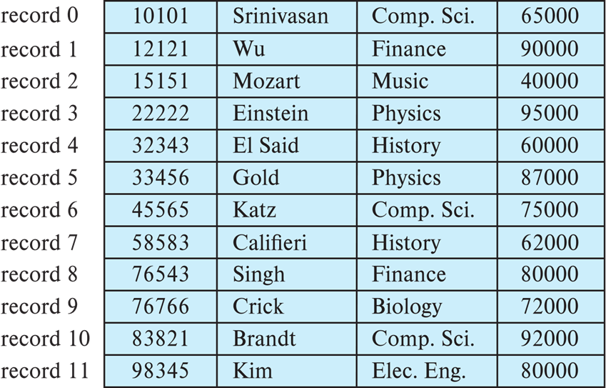{ width="50%" }

  > 硬盘是由很多个 block 整齐排列得到的. 而每个 block 的大小是固定的. 举个例子, 一个 512B 的 block, 存了 5 条 100B 的 record , 还剩 12B, 这不够存第 6 条 record 了, 所以就舍弃这部分空间, 从下一个 block 开始再存储.

- **删除方法:**

  - 方案一: 将记录 i+1,..., n 移动到 i,..., n-1 的位置, 即: 整体前移

    ​    优点: 空间紧凑

    ​    缺点: 如果文件很大, 删除一条记录会导致后面大量记录的物理移动, 性能开销很大

    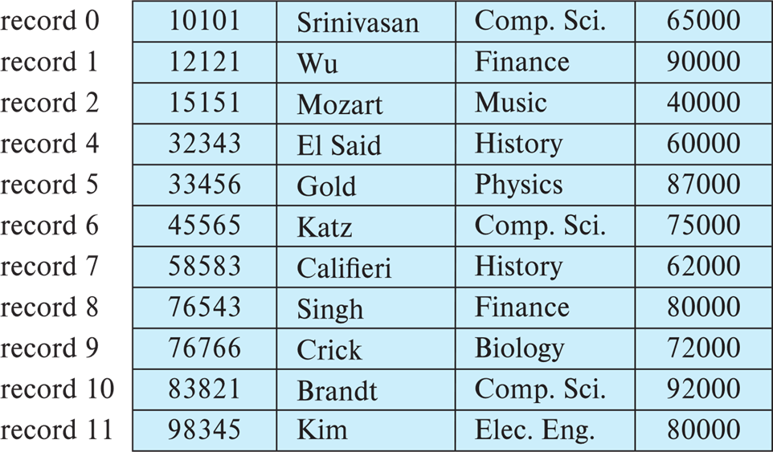{ width="50%" }

  - 方案二: 将最后一条记录 n 移动到被删除的 i 位置

    ​    优点: 速度更快, 只需要移动一条记录

    ​    缺点: 破坏了记录在物理存储上的原始顺序

    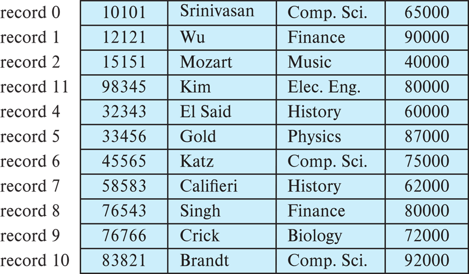{ width="50%" }

  - 方案三: 不移动记录, 而是将所有空闲空间链接在一个 **空闲列表(free list)** 上

    ​    **最常用的方法**. 删除记录后, 该位置被标记为'空闲', 并加入链表. 下次插入新数据时, 直接复用这些链表中的位置, 不需要移动任何现有的数据. 

    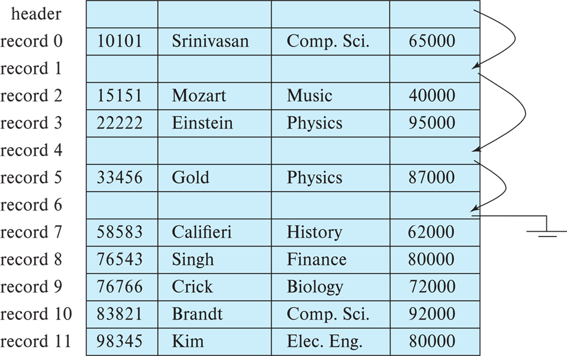{ width="50%" }

    > **空闲列表(free list)**
    >
    > 1. 在文件头(header)存储第一个被删除记录的地址
    > 2. 使用这第一个记录的空间来存储第二个被删除记录的地址, 以此类推
    > 3. 可以将这些存储的地址视为'指针', 因为他们都指向一个记录的位置. 如果用更节省空间的表示方法, 复用空闲记录的正常属性字段来存储指针
    >
    > 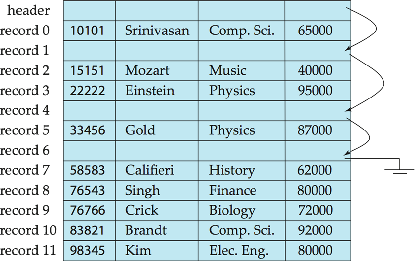{ width="50%" }

### 变长记录

- **变长记录(Variable-Length Records)**

- 变长记录出现的原因 

  1. 在一个文件中可能存储多种类型的记录; 
  2. 记录类型允许一个或者多个字段拥有可变长度; 
  3. 允许重复字段

- **变长记录的存储方式**

  - 属性按照顺序存储: 从第 21 字节开始, 依次存储了 ID, name, dept_name.

  - 变长属性由固定大小 **(位移量, 长度)** 表示, **实际数据存储在所有定长属性之后.** 

    结合示意图, 0-4 字节存储了 `(21,5)`, 就是说第一个变长属性从这条记录的第 21 字节开始, 长度是 5 字节, 后面两个同理, 它们就像记录里面的'指针'; 到了 `65000`, 这是定长属性. 

  - 空值由 **空值位图(null-value bitmap)** 来表示, 值为 1 的部分表示'空'.

    `0000` 就是空值位图, 因为这个记录中只存储了 4 个属性: salary, ID, name, dept_name. 所以 1 个 Byte 的空值位图只需用到前 4 位, 后面 4 位就闲置了, 设为 0. 每个 bit 对应了一个属性, 如果此时改为 1000, 就表示 salary 为 NULL

  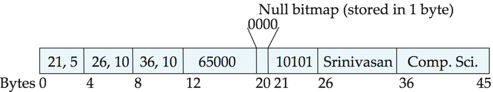{ width="67%" }

- **分槽页结构**

  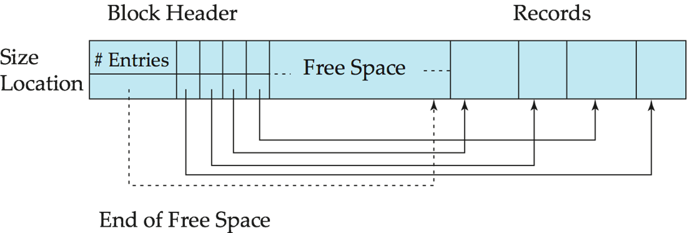{ width="50%" }

  如图所示, 这个长方形块就代表了磁盘上的一个 block 或者 page. 它的布局是两头往中间长的.

  - 头部: 位于左侧. 它包含了元数据和槽目录(slot directory). 从左往右增长

  - 记录: 位于右侧. 它是真正的用户数据, 从右往左排列.

  - 中间是空闲的空间, 当左右相遇的时候, 说明这个块满了

  - **槽(Slot): 图中的 Size 和 Location 组成的组合体就是槽.** 有几条记录就有几个槽, 槽中存放着: 第 i 条记录存放在这一页的第几个字节处, 以及有多长. 槽的顺序代表了记录的逻辑顺序, 先存入的就对应 0, 后面是 1, ... n

    这种结构是由 DBMS 定义和管理的逻辑结构, 而非硬件实现的物理属性.

    - 优点: 间接引用.

      当有一个 外部指针/索引 指向某条记录时, 它不会记录这条记录的绝对物理字节地址, 而是指向它的对应槽. 这样, 当删除中间的一条记录后, 为了不浪费空间, 数据库会移动后面的记录, 这样它们的物理地址就会发生改变, 如果改指向记录的索引代价就会特别大. 有了槽这个结构, 只需要修改对应槽的 Location 即可.

### 存储大对象

- 例如: blob (二进制大对象) / clob (字符大对象) 类型. 
- 记录必须小于页(但在某些情况下对象很大). 
- **备选方案: **
  - 作为文件系统中的文件存储. 
  - 作为由数据库管理的文件存储. 
  - 将其分解成片段并存储在单独关系的多个元组中. 
    - 例如: PostgreSQL 的 **TOAST** 技术. 

​    对于处理像图片, 视频或长文本这样由于太大而无法塞进一个标准数据库页(通常 4KB 或 8KB)的数据. 常见做法是将其切碎存放, 或者存放在数据库之外专门的区域, 在原表记录中仅保留一个引用.

### 文件中的记录组织方式

 Organization of Records in Files

1. Heap: 堆文件. 记录可以放在文件中任何有空间的地方

2. Sequential: 顺序文件. 根据每个记录的搜索键值, 按顺序存储记录

3. Multitable clustering: 多表聚集文件组织. 几个不同关系的记录可以存储在同一个文件中

   动机: 将相关记录存储在同一个块上以减少 I/O

4. $B^+$-tree file organization: B+树文件组织

   即使有插入/删除也能够保持有序存储

5. Hashing: 哈希/散列. 在搜索键上计算散列函数; 结果指定记录应放置在文件的哪个块中

- **堆文件组织**

  直接在硬盘上开辟一些块用来存放数据. 

  - **特点**

    1. 记录可以放在文件中任何有空间的地方
    2. 记录在分配后通常不会移动

    这种组织方式的关键在于: 如何 **有效地在文件中找到空闲空间**, 于是引入 `空闲空间映射` 的管理设计. 

  - **Free-space map(空闲空间映射 / FSM): **

    **设计细节:** 

    1. **不记录每个块精确的剩余字节数**(比如需要用到 2 Byte), 那样用到的空间会比较多. **元数据越小, 读取到内存里的速度就越快.** 

       > 元数据: 关于数据的数据. 
       >
       > 元数据块: 专门用来存放这些管理信息的磁盘块. 这些信息是数据库软件使用的. 它可能包括: 哪些块是空的/FSM, 这个表有哪些列, 每列是什么类型...

    2. 整个空闲空间映射表通常存储在文件开头的专门的一组或者几组块中 **(元数据块)**, 这些块不存数据, 只存映射表. 它就像书的目录, 

    3. 整个表是一个独立紧凑的数组, 其中 **每个 3-bit 为一组, 对应一个块**. 其中的值除以 8 就是该块空闲的比例. 

    当文件变得很大时, 即使是 3-bit 的 FSM 数组也会占据很多块. 所以采用 `二级映射`

    **二级映射:** 

    1. 存放在更顶层的元数据块里, 甚至常驻在内存中
    2. 二级映射类似于总结, 它只记录每 4 个一级条目中的最大值. 这样能成组的跳过一些空闲不够的块.

    **FSM 的性能权衡:** 

    ​    如果每改动一个块, 就要立即把对应的映射图写回硬盘, 这会很麻烦. 

    ​    **解决方案:** 允许这张图在内存更新, 但是延迟写回硬盘. 如果存储数据的时候发现块满了, 那么这个时候再进行修正, 接着找下一个块.

- **顺序文件组织**

  ​    这种组织方式适合于需要全表扫描并且结果有序的场景. 一般指的是文件中的记录按搜索键(search-key)排序. 

  > 搜索键(search-key): 文件中用来决定记录的物理存储顺序或者逻辑排列顺序的一个或一组属性. 比如说: 数按照 ID 进行数据排列, 那么 ID 就是一个搜索键.

  ​    下表展示了 ID 从小到大排列, 并用指针相连:

  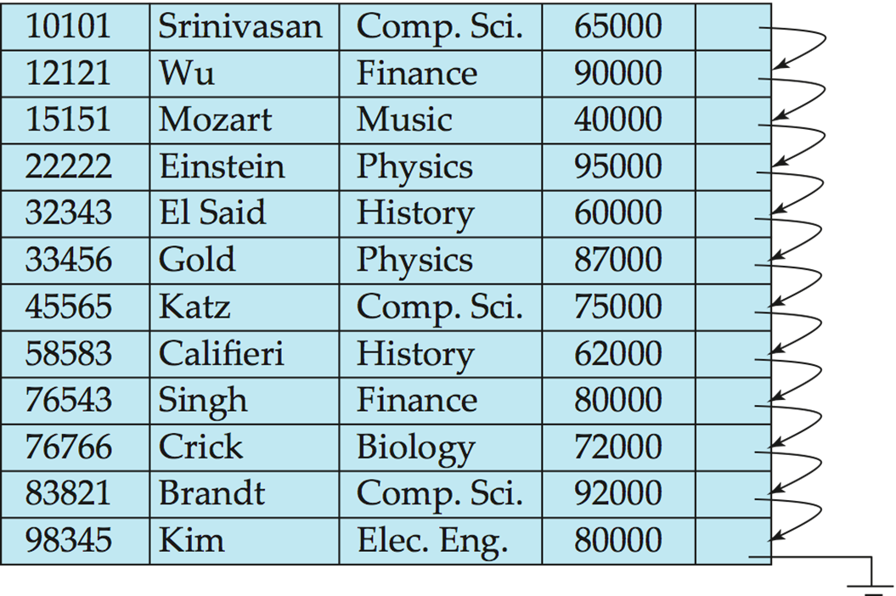{ width="50%" }

  **双重有序:**

  1. 物理有序: 文件创建初期, 记录在磁盘块上是紧挨着按顺序排放的
  2. 逻辑有序: 每一条记录末尾都有一个指针, 指向逻辑上的下一条记录. 即使物理位置乱了, 顺着指针找, 依旧是有序的.

  **删除操作:** 

  ​    不一定要物理删除这个数据, 而是修改指针链. 比如: 要删除记录 A, 只需让 A 的前驱记录的指针跳过 A, 直接指向 A 的后继记录, 就像在链表中删除一个节点. 

  **插入操作:**

  1. 首先寻找逻辑位置

  2. 理想情况下应该是插在两个记录中间, 但是当磁盘块满的时候, 物理上无法插入

  3. 使用溢出块(Overflow Block), 数据库会在文件的末尾或者溢出区找个空位把记录放进去

  4. 重连指针, 让它们在逻辑上保持正确的位置

     以下是图示: 

     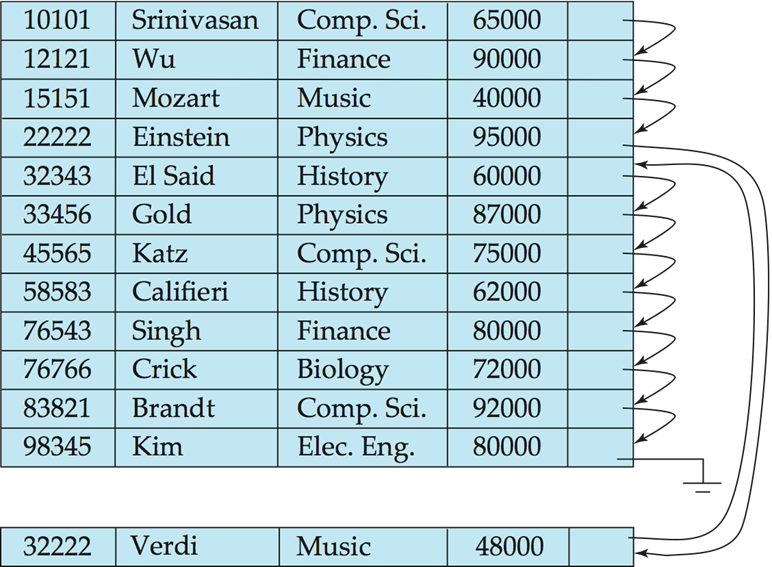{ width="50%" }

  **定期重组:** 当插入变多之后, 磁头在读取时一下到文件头读一下到文件尾读, 这种跳跃会导致查询效率下降. 所以一段时间后数据库会扫描整个文件, 按照逻辑顺序重新排布所有记录, 剔除已删除的空位, 把溢出块的数据搬回主区域, 恢复物理上的有序. 

- **多表聚集文件组织**

  ​    传统的数据库存储, 不同的表通常存储在不同的物理文件中. 多表聚集则允许将多个不同表的记录混合存储在同一个物理文件, 甚至同一个磁盘块中. 它的核心思想就是将逻辑上经常一起使用的相关数据, 在物理上也存放在一起. 

  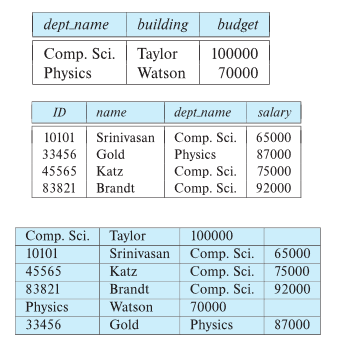{ width="67%" }

  ​    聚集后的物理存储顺序: 首先存入 Comp.Sci 的系记录, 紧接着连续存入所有属于 Comp.Sci. 的教师记录, 然后存入 Physics 的系记录, 然后存属于 Physics 的教师记录.

  - 优点: 
    1. 极大优化了 连接/Join 查询
    2. 适合局部查询
  - 缺点:
    1. 单表扫描变慢: 当只看系信息的时候, 数据库性能会下降, 因为可能要从之前的读 1 个块变为读 5 个块.
    2. 记录长度可变: 由于同一文件中混合了不同结构的表, 每条记录的字段数量和长度都不一样, 增加了底层管理的复杂性.
    3. 维护成本高: 如果某个教师转入到了另一个系, 这里面要移动大量的物理记录来保证聚集的顺序, 会导致巨大的写入开销.

### 其他存储设计

- **分区**

  - **表分区 (Table partitioning): ** 一个表/关系中的记录可以被拆分为更小的, 独立存储的关系. 

    例如: transaction(交易)表可以按年份拆分为 transaction_2018, transaction_2019 等. 在 transaction 表上的查询必须访问所有分区. 除非查询包含特定的选择条件, 如 year = 2019, 在这种情况下仅需访问一个分区. 

  - **优点: **

    1. 降低某些操作的成本, 如空闲空间管理. 

    2. 允许将不同分区存储在不同的存储设备上. 

    例如: 当年的交易数据存放在 SSD 上, 往年的旧数据存放在磁带或机械硬盘上. 

- **数据字典存储**

  - **数据字典(Data Dictionary Storage)/系统目录 (system catalog): ** 存储元数据.

    例如: 

    ​    关系的信息: 名称, 属性类型, 长度, 视图定义, 完整性约束. 

    ​    用户和账户信息, 包括密码. 

    ​    统计和描述性数据: 每个表中的记录行数. 

    ​    物理文件组织信息: 存储方式(顺序/散列等), 物理位置. 

    ​    关于索引的信息.

- **系统元数据的关系表示**

  展示了元数据时如何以 `表` 的形式存在的. 数据库用表来存储表的信息.

  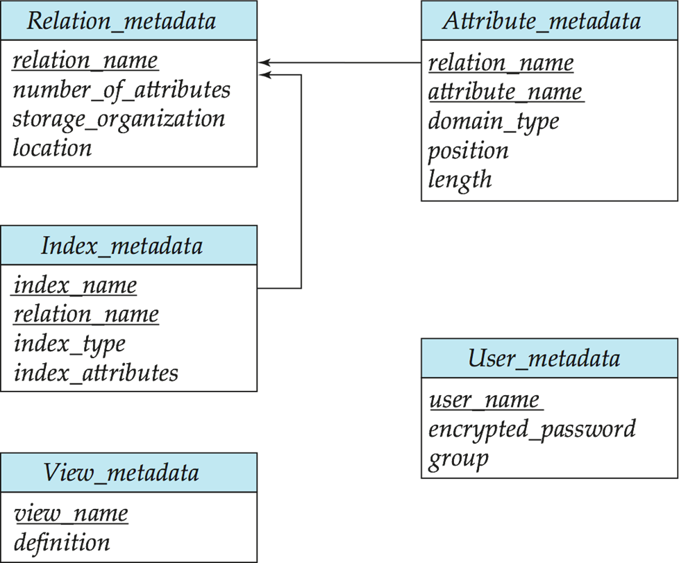{ width="50%" }

- **存储访问**

1.  **块 (Blocks)** 是存储分配和数据传输的单位. 
2.  数据库系统寻求尽量减少磁盘和内存之间的块传输次数. 
3.  **缓冲区 (Buffer)**: 主存中用于存储磁盘块副本的部分. 
4.  **缓冲区管理器 (Buffer manager)**: 负责在主存中分配缓冲区空间的子系统.  因为磁盘比内存慢成千上万倍, 所以缓冲区管理器对于数据库性能的好坏很重要. 尽可能把常用数据留在内存中, 程序要数据时, 先看内存能否 hit, 没有才去读磁盘.

- **缓冲区管理器(Buffer Manager)**

  ​    和其他 buffer 一样. 当程序需要从磁盘获取块时, 会调用缓冲区管理器. 如果该块已经在缓冲区中, 缓冲区管理器直接返回该块再主存中的地址, 如果不在缓冲区, 那么管理器执行以下操作:

  1. 在缓冲区中为该块分配空间; 如果有必要, 替换出其他块来腾出空间
  2. 被替换的块如果之前被修改, 那么要写回磁盘. 当从磁盘读到需要的块之后, 将其主存地址返回给请求者

  - **钉住块(Pinned block): 不允许写回磁盘的内存块**

    在读取/写入块数据之前进行 Pin(钉住), 读写完成后进行 Unpin(取消钉住), 支持多个并发的 pin/unpin 操作. 通过 **pin 计数器** 管理, 只有当计数为 0 时, 缓冲区块才能被移出. 

  - **缓冲区上的共享锁与排他锁: **

    ​    作用: 防止并发操作在页面移动/重组时读取页面内容, 并确保一次只有一个移动/重组操作. 

    - 读者获取共享锁, 更新块数据需要排他锁. 
    - 锁定规则:  一次只有一个进程能获得排他锁; 共享锁不能与排他锁并发; 多个进程可同时获得共享锁. 

  - **缓冲区置换策略(Buffer-Replacement Policies)**

    - **LRU:** 大多数 OS 使用 LRU, 但是 LRU 对某些查询可能不佳. 比如嵌套循环计算两个关系的连接:

      ​    对于 r 中的每个元组 tr: 
            对于 s 中的每个元组 ts: 
      ​        如果 tr 和 ts 匹配 ...

    - **立即丢弃策略(Toss-immediate):** 一旦块中的最后一个元组处理完毕, 立即释放该块占用的空间. 

    - **最近最常使用 (MRU) 策略**: 系统必须钉住当前正在处理的块. 处理完该块最后一个元组后, 取消钉住, 它就变成了“最近最常使用”的块. 

- **磁盘块访问优化**

  缓冲区管理器支持块的 **强制输出 (forced output)**, 用于恢复目的. 

  - **非易失性写缓冲区 (Nonvolatile write buffers)** 通过立即将块写入非易失性 RAM(NV-RAM)或闪存缓冲区来加速磁盘写入. 
    - 可以重新排列写入顺序, 以最小化磁盘臂的移动. 
  - **日志磁盘 (Log disk)** – 专门用于写入块更新顺序日志的磁盘. 
    - 用法完全类似于非易失性 RAM. 
    - 写入日志磁盘非常快, 因为不需要寻道(顺序写入). 
  - **日志文件系统 (Journaling file systems)** 将数据按顺序写入 NV-RAM 或日志磁盘. 
    - 不使用日志功能的重新排序: 存在文件系统数据损坏的风险. 

- **列式存储(Column-Oriented Storage)**

  也称为 **列式表示(columnar representation)**, 分别存储关系的每个属性. 图示: 展示了 ID, 姓名, 系别, 工资分别被存放在四个独立的列块中

  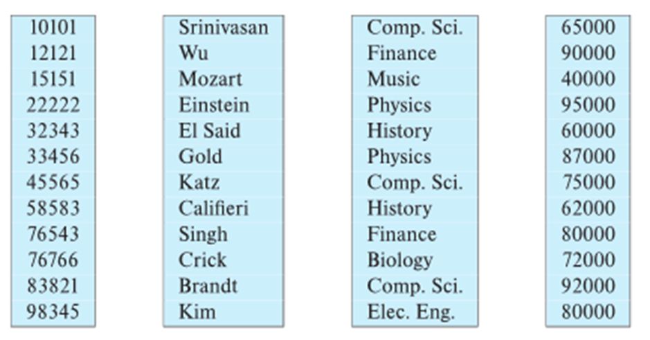{ width="50%" }

  - **优点: **

    1. 如果只访问部分属性, 减少了 I/O. 

    2. 提高 CPU 缓存性能. 

    3. 提高压缩率. 

    4. 现代 CPU 架构上的 **向量处理**. 

  - **缺点:** 

    1. 从列式表示重建元组(行)的成本. 
    1. 元组删除和更新的成本. 
    1. 解压缩的成本. 
    1. 发现列式表示对 **决策支持(分析型)** 比行式表示更有效. 
    1. 传统行式表示更适合 **事务处理**. 
    1. 某些数据库支持两种表示, 称为 **混合行/列存储 (hybrid row/column stores)**. 

  - **列式文件表示**

    **ORC 和 Parquet: ** 文件内部采用列式存储的文件格式.  在 Apache Hadoop 等大数据应用中非常流行. 

    图中展示了 **ORC 文件格式**: 

    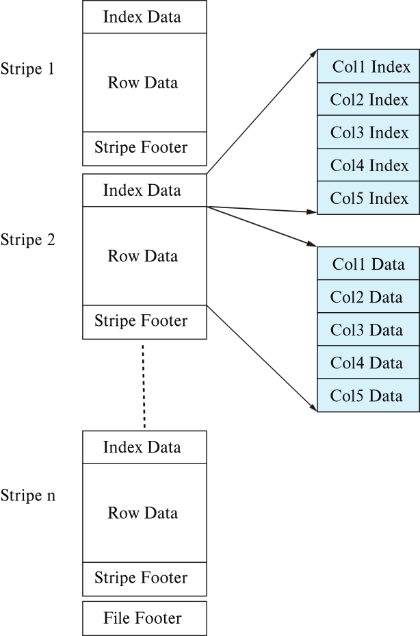{ width="50%" }

    1. Stripe 1, Stripe 2 ... Stripe n(条带). 每个条带包含: 索引数据, 行数据(分列存储), 条带页脚. 每个条带大小: 250 MB. 

    2. Sybase IQ: 开发于 1990 年代, 第一个商业成功的列式数据库. 

    3. MonetDB 和 C-Store: 学术研究项目. 

  

- **内存数据库中的存储组织**

  1. 可以 **不使用缓冲区管理器**, 直接将记录存储在内存中. 

  2. 列式存储可用于内存中的决策支持应用. 压缩降低了内存需求. 

     图示展示了 **Indirection Table(间接表)** 指向不同列的数据. 

  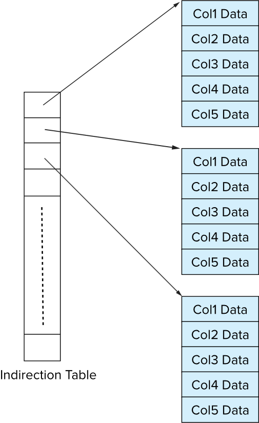{ width="50%" }

