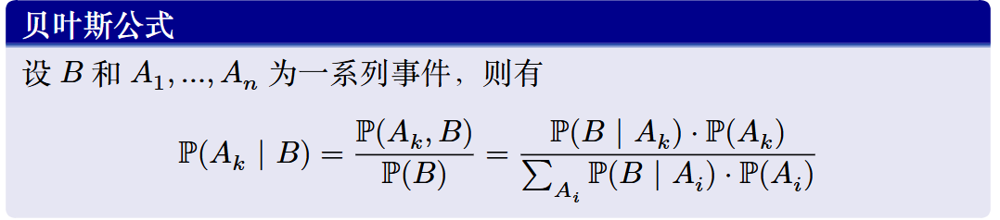
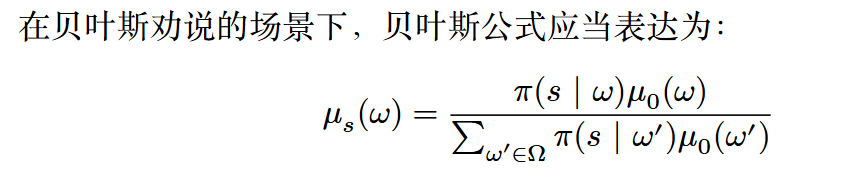
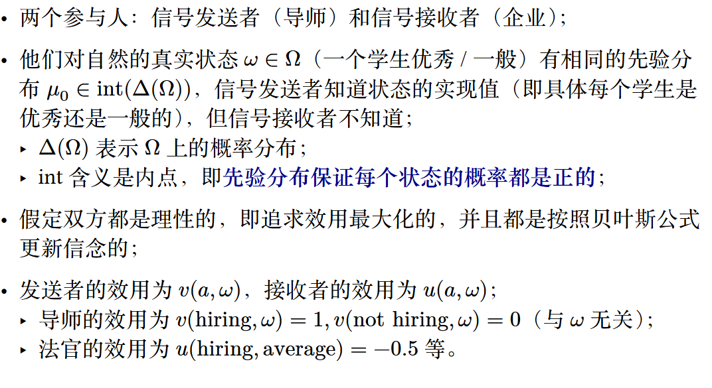
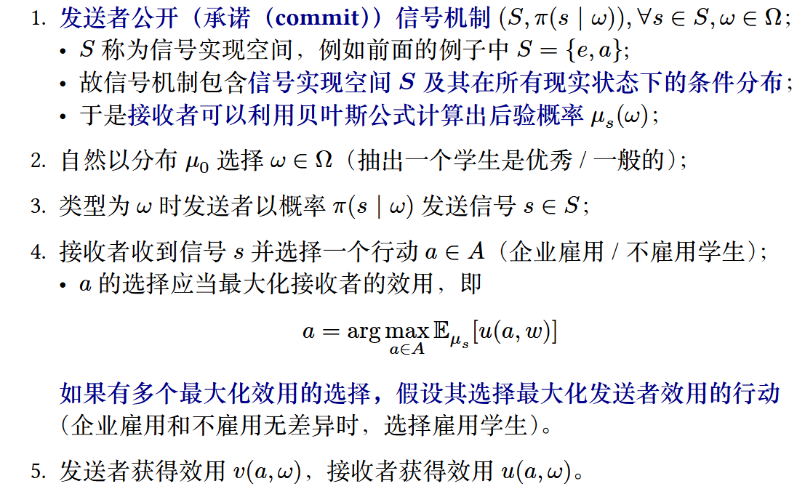
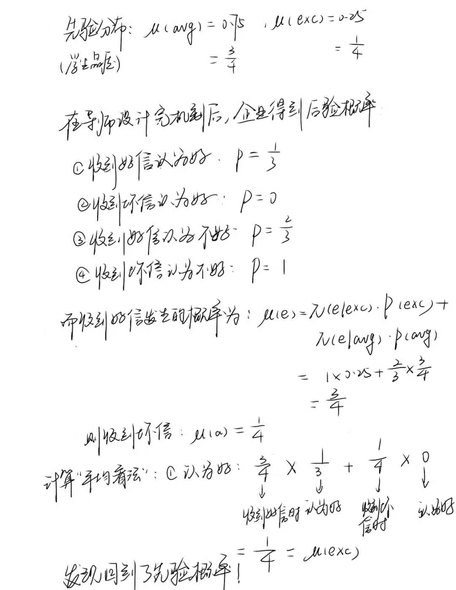
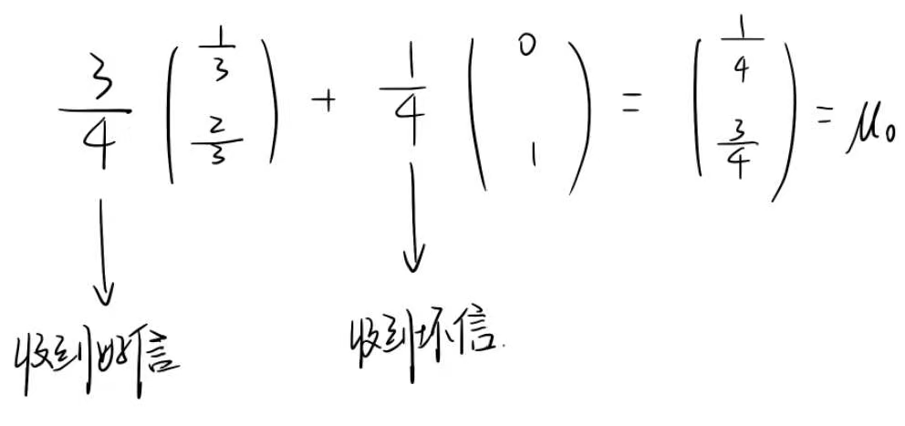
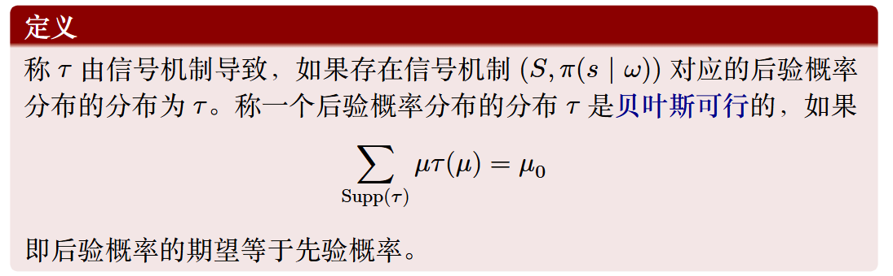
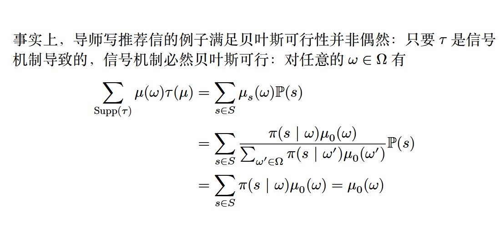
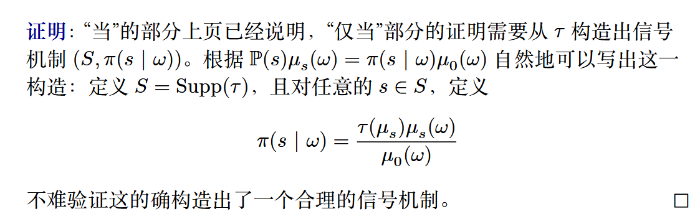
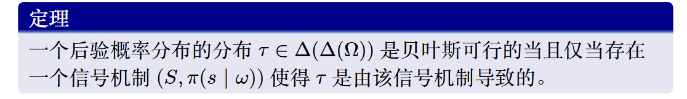

# 信息设计与信息定价

## 贝叶斯劝说

### 导师写推荐信例子

劝说：指通过有选择性地披露或设计信息结构，来改变决策者的信念，进而引导其做出有利于劝说者的决策。

可以将其概括为几个特征：

1. 劝说者无法直接干预接受者的决策，而是通过控制接收者接收到的信息，即**设计信号发送机制**，来间接影响它们的选择
2. 接收者是理性的，他们会根据接收到的信号，**利用贝叶斯法则将先验概率更新为后验概率/信念**，并基于新概率做出符合自身利益最大化的决策
3. 劝说者必须在获取具体真实信息之前，公开且可信地承诺其信息披露的规则

---

下面通过导师写推荐信将学生推荐到企业的例子来贯穿整个章节，基本设定如下：

1. 两个参与人：导师和企业。其中老师是信号发送者，企业是信号接收者
2. 老师的任务是写推荐信，推荐信有“好”和“一般”两种等级
3. 企业的任务是接收到推荐信后决定是“雇佣”还是“不雇佣”
4. 学生不参与博弈，并且学生有两种类型：“优秀”(excellent)和“一般”(average)
5. 学生的类型对于导师是已知的，对于企业是不完全信息
6. 企业对学生类型有先验分布，并且该分布符合导师已知的实际学生类型分布。即企业和导师对学生类型有共同的先验分布

现在令企业的先验分布为$\mu_0(avg) = 0.75$，$\mu_0(exc) = 0.25$。

规定效用函数，对于导师来说，企业每雇佣一个学生，导师获得效用1，否则为0；对于企业，每招收到优秀学生时获得效用1，招到普通学生获得效用 -0.5

在这个模型下，发信号就是指导师向企业写不同类型的推荐信。导师写推荐信的策略就是如下两个条件概率分布$\pi(\cdot | exc)$和$\pi(\cdot | avg)$​，也称作**信号机制**，所有情况如下：

$\pi(e | exc)$，$\pi(a | exc)$；

$\pi(e | avg)$，$\pi(a | avg)$​ 

即：在学生为优秀/一般类型时，写优秀/一般推荐信的概率。

需要说明的是，**导师的这个策略是企业看推荐信前已知的**，因为它们之间的长期关系可以验证导师的策略

接下来从几个角度来考虑这个问题

---

#### 诚实推荐

一个极端的策略，即什么样的学生就写什么样的推荐信。

企业是已知导师的策略的，所以企业将会接收所有的优秀学生，拒绝所有一般学生

易得：企业和导师的期望效用都是0.25，这个效用是很低的

### 完全不诚实推荐

为了提高效用，导师可能会选择为所有学生都写优秀推荐信。

又因为企业是已知导师策略的，所以计算企业的期望效用$U = 0.25 \times 1 + 0.75 \times (-0.5) = -0.125 < 0$，而不雇佣效用为0，那么企业不会雇佣任何一个学生

结果是导师和企业的效用都是0

### 部分诚实

现在给定一种信号机制（ 后续将会证明这个信号最优）

$$\pi(e | exc)=1，\pi(a | exc)=0$$

$$\pi(e | avg)=\frac{2}{3}，\pi(a | avg)=\frac{1}{3}$$

先计算企业对于学生类型的后验概率，需要用到**贝叶斯公式**：

??? example "贝叶斯公式"
    

分析一种情况：当企业看到推荐信为优秀时，该学生属于优秀的概率为：

$$\Large \mu_{e}(exc) = \mu(exc|e) = \frac{\mu(exc，e)}{\mu(e)} = \frac{\pi(e|exc) \cdot P(exc)}{\pi(e|exc) \cdot P(exc) + \pi(e|avg) \cdot P(avg)} = \frac{0.25}{0.25+0.5} = \frac{1}{3}$$

可以计算得到所有的后验概率：

$\mu_{e}(avg) = \frac{2}{3}$

$\mu_{a}(exc) = 0$

$\mu_{a}(avg) = 1$

可以计算企业对于一个好推荐信对应的学生雇佣获得的期望效用为：$1/3 \times 1 - 2/3 \times 0.5 = 0$，即是无差异的，所以企业会选择雇佣。

再计算导师的效用，因为导师将全部优秀学生以及$2/3$的一班学生推荐进入了企业，所以他的期望效用为：$0.25 + 0.75  \times 2/3 = 0.75$

综上，使得企业不雇佣和雇佣无差异的信号是最优的

---

## 模型描述与问题转化

通过之前的例子，我们将其抽象并概括为数学模型，来得到贝叶斯劝说的一般框架，即贝叶斯模型：

1. 学生优秀与一般被抽象成自然的真实状态
2. 每种状态的先验概率必须大于0
3. 效用函数中的$a$和$\omega$分别指的是采取的行动和客观的状态

添加解释：1. 自然的真实状态是什么？2. 理性人是根据贝叶斯公式更新信念的？

---

接下来考虑博弈的行动顺序：

导师的承诺建立了可信度。如果导师不提前承诺，每次写信都是临时起意，那么肯定会对所有人写优秀信，企业知道老师会撒谎也就不会选择任何雇佣了。

贝叶斯劝说本质上是发送者（导师）利用“先手优势”，通过设计一个能约束自己后期行为的信息披露规则，来引导接收者（企业）做出有利于自己的决策。

---

贝叶斯劝说的目标

1. 贝叶斯劝说主要适用于结果可验证的场景中
2. 该博弈的本质是双层优化+完美贝叶斯均衡（企业的决策在任何信号下都是最优的，导师的机制设计是针对企业反应最优的）

---

贝叶斯可行

或者我们也可以用解向量的形式来表达：

贝叶斯可行的定义：

其中：

1. $\mu$就是指后验概率分布，是一个概率向量，就像上面计算写的那样；
2. $\tau(\mu)$是信念发生的概率；
3. $\mu_0$​是先验概率分布。

本质上，不同的后验概率分布都是$Ω$上的概率分布。

这里我们仅对写推荐信的例子进行了分析，那么这个规律是不是具有普遍性的呢？我们还需要进行说明：

- 必要性说明

- 充分性说明

于是我们可以得到一个充要条件：

## 最优信号机制

### 最优信号机制问题

### 显示原理

