# 博弈论基础

## 微观经济学基础

### 偏好

**偏好**：在微观经济学中，偏好指的是消费者对不同商品或服务组合的主观喜爱程度和选择倾向。比如说：有的人喜欢购买一个苹果两个香蕉，有的人喜欢一次性买三个香蕉。

关于偏好，它总是满足下面几个基本假设：

- 完备性：消费者能够对任意两个商品组合进行比较。就比如之前例子中提到的组合 A（一苹果两香蕉）和组合 B（三个香蕉），消费者总能做出以下判断之一：
    1. 更喜欢 A
    2. 更喜欢 B
    3. 无差异（即两者差不多）
- 传递性：消费者的选择是一贯的，不自相矛盾的。如果消费者认为 A 比 B 好，且 B 比 C 好，那么肯定有 A 比 C 好。
- 自反性：任何商品组合至少与它自身一样好。
- 单调性：也称作“多多益善”。即其他条件相同的情况下，商品的数量越多，消费者越喜欢。
- 凸性：偏好的多样化。消费者通常更倾向于均衡/混合 of 商品组合，而不是极端的组合。例如：对于三个香蕉的组合，消费者更喜欢一个苹果两个香蕉的混合组合。

### 效用与效用函数

**效用**：可以用一个常数来表示消费者对于一个消费组合的偏好程度，这个常数就叫做该消费组合对消费者产生的效用。

**效用函数**：对于形式为 $x=(x_1,...,x_n)$ 的消费组合/消费束，其中 $x_i$ 表示购买 $x_i$ 单位物品 $i$，效用函数就是从消费组合映射到满意程度的函数：

$$u:R^n \rightarrow R$$

常见的效用函数有：

#### 柯布-道格拉斯效用函数

$$u(x_1,x_2) = x_1^{\alpha} x_2^{1-\alpha}，其中\alpha \in (0,1)$$

可以这样理解公式：

1. 因为两个指数都是大于 0 的，所以当商品 1、2 的消费数量增加时，对应的总效用 $u$ 也会增加，这也就是所说的“多多益善”
2. 边际效用递减。以商品 1 为例，对其求偏导得到边际效用 $\frac {\partial f(u)} {\partial f(x_1)} = \alpha x_1^{\alpha-1} x_2^{1-\alpha}$，可以看到，$x_1$ 的指数 $\alpha-1 < 0$。所以当 $x_1$增加时，每次多消费一单位的商品 1 所新增的效用是递减的

    > 边际效用的定义：指消费者对某种物品的消费量每增加一单位所增加的额外满足程度。
    >
    > 边际效用总是递减的，总效用达到最大时，如果继续消费，那么边际效用可能变为负数。

3. 如果有任何一种商品的消费量为 0，那么整个效用为 0。这反映了消费者倾向于平衡消费，而不是极端的仅选择一种商品

#### 冯诺伊曼-摩根斯坦效用函数（V-NM效用函数）

$$u(L) = p·u(x) + (1-p)·u(y)$$

同样的，我们理解这个效用计算的概念：

1. 这个函数反映人们在比较不同结果下得到的满足感的加权平均值
2. 效用函数$u(x)$的凹凸性直接反映了决策者对风险的态度：

    > 风险：即抉择的后果是不确定的，但每种可能后果发生的概率是已知的

    - 严格凹函数，$u^n<0$，如对数函数$ln(x)$$\rightarrow $风险厌恶：由于凹函数对应了边际效应递减，所以损失同样数额的财富带来的痛苦要大于赢得所带来的快乐。这类人宁要稳定的平均财富，也不要冒险

      {style="display: block; margin: 0 auto;" width="35%"}

    - 严格凸函数，$u^n>0$，如平方函数$x^2$ $\rightarrow$风险偏好：凸函数对应了边际效用递增，所以与上面的情况恰好相反，这类人更喜欢冒险

      {style="display: block; margin: 0 auto;" width="35%"}

    - 线性函数，$u^n=0 \rightarrow$风险中性：边际效用恒定，这类人对风险的态度是只看钱的期望值，不在于有没有波动

    这个机制跟两个概念有关：期望财富的效用$u(E[w])$和期望效用$E[u(w)]$。前者是彩票的平均期望值，后者是玩该彩票在不确定状态下平均能获得的满足感。当$u(E[w]) \leq E[u(w)]$时，函数是凸函数；当$u(E[w]) \geq E[u(w)]$时，函数是凹函数。

    > 通过一个例子来更深入地理解：假设小明现在有财产100元，现在有一个彩票，有$50\%$的概率赢$50$元，有$50\%$的概率输$50$元。整个彩票的财富期望值/平均值是：
    >
    > $E[w] = 50\% \times 150 + 50\% \times 50 = 100 元$
    >
    > 也就是说，买这个彩票平均而言不输不赢。但是，对于不同效用函数的人选择是不同的：
    >
    > 对于风险厌恶者小王，效用函数是$u(w) = \sqrt{w}$，是一个凹函数。当不赌时，拿确定的100元的效用，所以：$u(w) = \sqrt{100} = 10$；当去赌时，期望效用为：$E[u(w) ] = 0.5 \times \sqrt{150}  \space + 0.5 \times \sqrt{50} \approx 0.5 \times 12.25 \space + 0.5 \times 7.07 = 9.66$。对比发现，确定的效用要大于赌彩票的期望效用，实际上也就是赢了$50$所增加的效用只有2.25，而输了却减少效用$2.93$，输钱的痛苦超过了赢钱的快乐，所以小王拒绝赌博。
    >
    > 对于风险偏好者小李，效用函数为$u(w) = w^2$，是凸函数。用同样的方法进行分析，得到赌彩排的期望效用为$12500$，而不赌的效用为$10000$，所以对于李四，他更渴望去赌一把。

#### 拟线性效用函数

$$u(x,p) = v(x) - p$$

1. 假定每一元钱的效用是单位1，$p$就是支付的价格
2. $v(x)$表示消费者获得的纯粹满足感，并且$v(x)$与他手里有多少钱是无关的
3. 该函数反映了消费某种商品获得的效用与为此支付的货币成本之间的折抵关系。

### 效用最大化问题

为了方便，这里只考虑两个商品：效用函数$u(x_1,z_2)$，商品价格$p_1$和$p_2$，消费者收入/预算为$p$。这里考虑了消费者的预算约束，这样可以将效用最大化的目标写为：

$$\max\limits_{x_1, x_2} u(x_1, x_2)$$

$$s.t. \space p_1x_1+p_2x_2 \leq p$$

要求$u$关于$x_1,x_2$是递增的，这样当$u$取最大值是不等式必然取等号（可以用反证法证明）。

???+ example "效用最大化例题"

    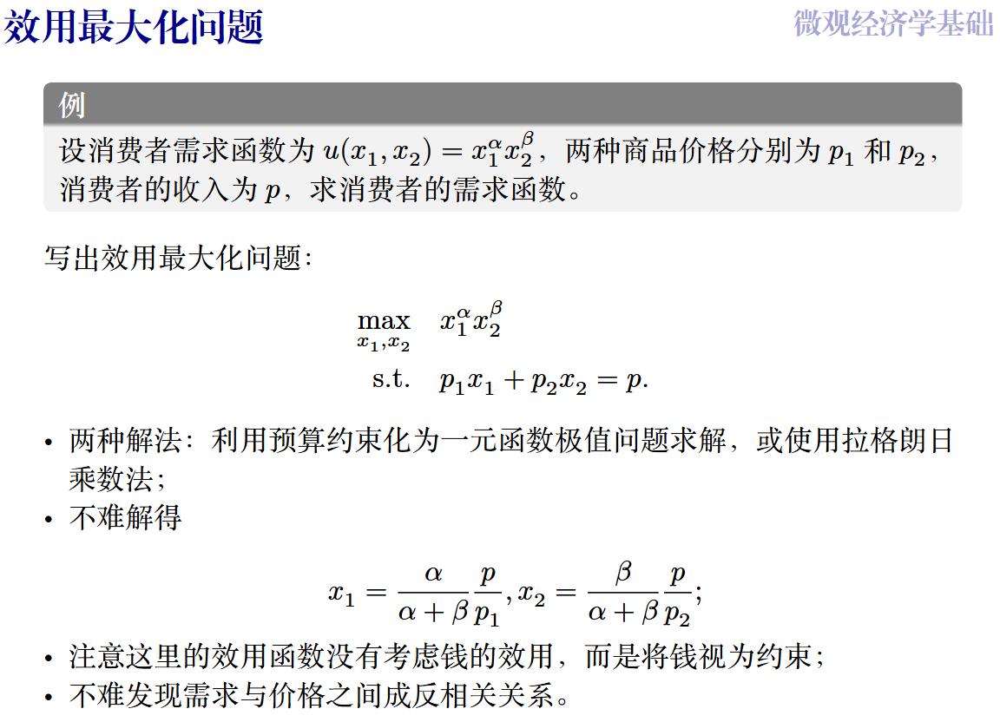{ style="display: block; margin: 0 auto;" width="60%" }

### 市场出清 (Market Clearing)

- 需求定律

    在其他条件不变的情况下，商品的需求量与价格之间成反方向变动的关系，即价格上涨，需求量减少；价格下降，需求量增加。

- 供给定律

    对于正常商品来说，在其他条件不变的情况下，商品价格与供给量之间存在着正方向的变动关系，即一种商品的价格上升时，这种商品的供给量就会增加，相反，价格下降时供给量减少，这就是供给定律。

- 市场出清

    市场出清：市场机制能够自动地消除超额供给或超额需求，市场在短期内自发地趋于供给等于需求的均衡状态。这个均衡也叫做“竞争均衡”。

    其几何模型如下：

    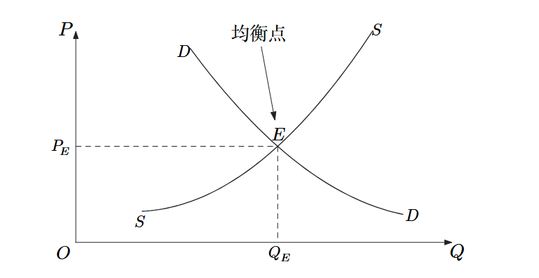{style="display: block; margin: 0 auto;" width="50%"}

    - 横轴$Q$：Quantity，商品的数量

    - 纵轴$P$：Price，商品的价格

    - 曲线$S$：Supply，供给曲线。越往左对应价格越低，商家觉得没利润，越不生产。

    - 曲线$D$：Demand，需求曲线。越往左对应价格越低，消费者嫌贵，买的少。

    - 交点$E$：需求曲线$D$和供给曲线$S$的焦点，称为均衡点

    - 均衡价格$P_E$：交点的纵坐标值，指双方达成一致的价格

    - 均衡数量$Q_E$​​：交点的横坐标值，指均衡价格下发生交易的商品数量

### 社会福利

了解了竞争均衡， 我们还需要了解一个市场达到的均衡有多好，于是引入了`福利`

福利：资源配置有效性的主要衡量标准

福利主要分为以下部分：

1. 消费者剩余：即消费者的心理估值/商品效用和实际支付之间的差额。通俗来讲就是自己占了多少便宜

2. 生产者剩余：厂商获得的商品收益/价格和生产成本之间的差额

3. 社会总福利：二者的总和，即消费者剩余＋生产者剩余。因为消费者的支付和厂商的价格相互抵消了，剩下的是“消费者得到的总效用-厂商的总生产成本”，这一部分就是全社会得到的净效用。

    可以用下面三张图来展示它们的逻辑
    

    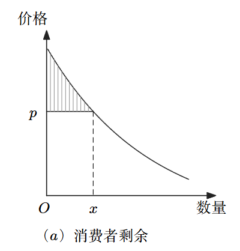{ width="31%" }
    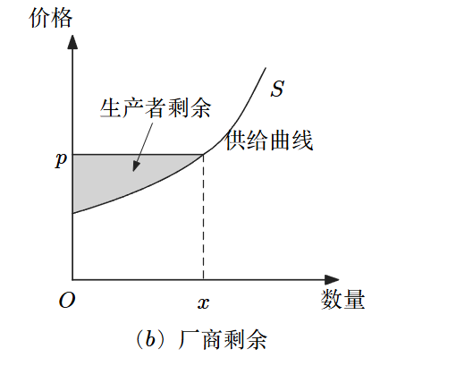{ width="34%" }
    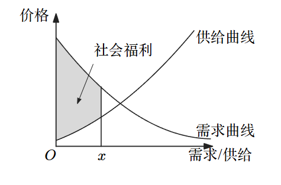{ width="35%" }
    

综上，可以得到福利经济学第一定律：在竞争市场中，当市场供求达到均衡时，市场资源配置是社会福利最大化的。

### 市场失灵（market failure）

现实中无法满足福利经济学第一定律中的很多假设，所以总是会出现市场失灵的情况。

- 垄断：一个商品只有一家厂商生产，所以它可以决定商品价格，破坏了完全竞争市场的福利最优性
- 外部性：一个人或一群人的行动和决策使另一个人或一群人受损或受益的情况。比如：上游水源污染导致下游受到影响
- 信息不对称：厂商与厂商之间，厂商与消费者之间所拥有的信息是不同的。信息不对称可能会导致“劣币驱逐良币”的结果，比如经典的“柠檬市场”概念。

### 数据的特性

- 卖家垄断
- 零成本复制性：供给曲线失效。同时数据出售更容易，人们更容易受到外部性影响

由此，我们可以实施价格歧视（price discrimination）:

1. 一级价格歧视：厂商完全了解消费者，将价格定在消费者的最大支付意愿上
2. 二级价格歧视：版本化定价。厂商设计不同的套餐或者产品组合，让用户根据自身需求来选择。
3. 三级价格歧视：把消费者分为不同的群体，并制定不同的价格

## 博弈论基础

微观经济学关注个人最大化自身效用的单人决策问题，到了现实生活中，人的决策会受多方影响，所以这里面存在相互博弈，效用的数学公式也就变为了：

$$\max \limits_{x \in X} u(x) \rightarrow \max \limits_{x_i \in X_i} u(x_i,x_{-i})$$

其中：$X$和$X_i$表示决策者的可选决策，$x_{-i}=(x_1,...,x_{i-1},x_{i+1},...x_n)$表示除了$i$之外的其他人的决策。

- 博弈的表达

    三元组：$G=(N,S_i,u_i)$，其中$N$是参与人的集合，$S$是每个参与者可选的策略，$u$​是每个参与者的效用函数。

- 博弈论中对人的假设

    理性、智能、双方彼此完全了解对方

- 博弈的解

    即整个博弈的结局，博弈论的核心就是预测这个结局

- 博弈论的分类

    - 非合作博弈：参与人之间没有直接的合作效用

        - 是否完全信息？
        - 是静态博弈（参与人行动一次同时完成）还是动态博弈（参与人行动序贯完成）？

        四大类博弈：完全信息静态博弈、完全信息动态博弈、不完全信息静态博弈、不完全信息动态博弈

    - 合作博弈：考虑参与人之间合作后产生的联合效用

## 占优策略均衡

这里以囚徒困境为例。

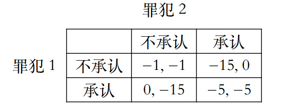{style="display: block; margin: 0 auto;" width="40%"}

可以发现，不论是罪犯一还是罪犯二，他们不管对方怎么选择，自己选择承认的效用都是更好的。这时就可以说不承认是一个**严格劣策略**（strictly dominated strategy），其详细定义如下：

??? example "严格劣策略"
    {style="display: block; margin: 0 auto;" width="70%"}

有了占优这个工具，我们就能针对一些博弈论问题展开分析了。

### 重复剔除严格劣策略

以下图情况为例进行分析：

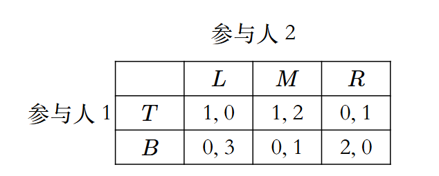{style="display: block; margin: 0 auto;" width="40%"}

可以发现，对于参与人2，不论参与人1怎么选，策略$M$总是优于策略$R$，即策略$M$严格占优于$R$，这样就可以剔除策略$R$的那一列。

进一步地，对于参与人1，也有策略$T$严严格占优$B$，剔除$B$，于是得到了最终监护的博弈：

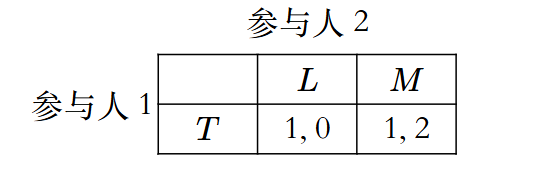{style="display: block; margin: 0 auto;" width="40%"}

### 弱占优

严格劣策略不是总是出现的，比如：

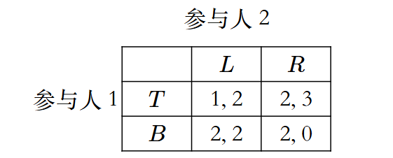{style="display: block; margin: 0 auto;" width="40%"}

虽然没有严格劣策略，但是对于参与人1来说，策略$B$是不会比策略$T$差的，即部分相等，有些占优。这种情况，就称策略$B$**弱占优**（weakly dominates）于策略$T$。

弱占优的详细定义如下：

??? example "弱占优"
    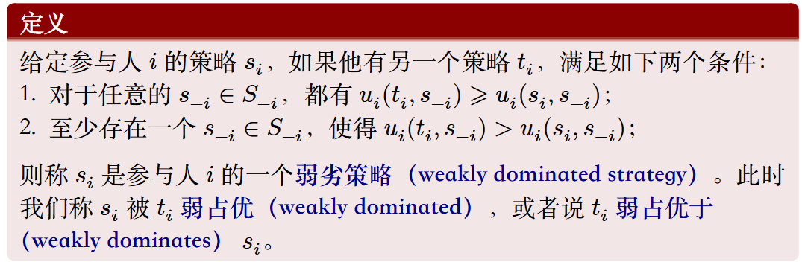{style="display: block; margin: 0 auto;" width="70%"}

需要注意以下几点：

1. 一般情况下，默认的占优指的是弱占优，除非强调是严格占优
2. 理性参与人不会选择（弱）劣策略
    - “颤抖的手”原则：就对于上面的那个图片来说，如果参与人1确信对方100%回选择$R$​，这样对于参与人1，选择$T$​和选择$B$​应该是一模一样的结果，但是理性人是不会选择$T$​的，因为现实中人会犯错。假如参与人2有极小的概率$x$​会选择$L$​，那么得到的预期收益就会从$2$​变为$2-x$​，这样选$B$​的期望收益就严格大于选择$T$​的
3. 剔除弱劣策略的最终结果受剔除顺序的影响。所以一般不进行剔除弱劣策略的操作，执行时也会更加谨慎

## 纳什均衡

在之前，我们讨论了博弈中拥有占优策略的情况，相对的，有些博弈可能完全没有占优策略，比如：

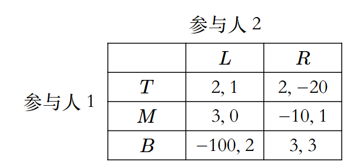{style="display: block; margin: 0 auto;" width="40%"}

既然无法找到不论条件的占优，那么现在就退而求其次，寻找有条件下的最优：如果我提前知道了对方的选择，那么我的最佳选择应该是什么？这就是**最优反应/最佳应对**（Best Response）

寻找最佳应对的一个简便方法是**划线法**

如果对于每个人来说，一个策略组合都是他们的最佳应对，那么这个策略组合就是一个**纳什均衡**

其中，占优策略均衡一定是纳什均衡

关于最佳应对和纳什均衡的详细定义如下：

??? example "最佳应对与纳什均衡"
    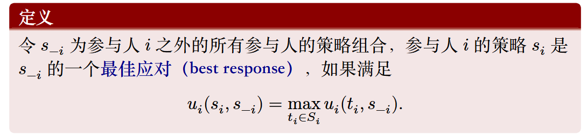{style="display: block; margin: 0 auto;" width="70%"}
    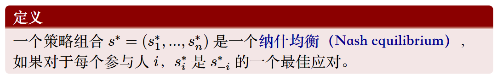{style="display: block; margin: 0 auto;" width="70%"}

??? example "纳什均衡的等价定义"
    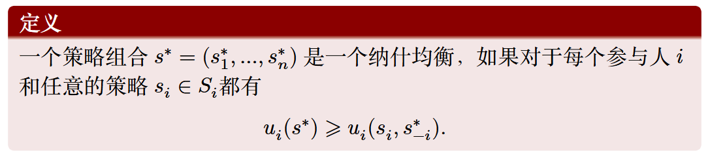{style="display: block; margin: 0 auto;" width="70%"}

定义中的星号`*`指的是均衡值

### 古诺竞争

在介绍古诺竞争之前，先了解以下伯川德竞争的内容：两个寡头同时在小镇卖书，每本书成本$20$元，消费者能够接受的最大价格是每本书$200$元，这两个寡头的博弈就是决定自己的售价。这种情况下，最优策略是定价等于成本；否则，价格竞争就会使得两者都没有利润，都降到$20$元每本书。

总之，伯川德竞争是双方进行价格竞争，而古诺竞争则是进行产量竞争，一个二人古诺竞争例子如下：

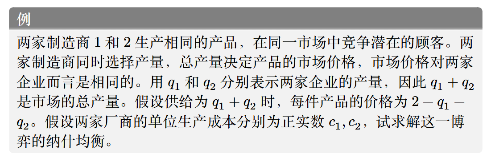{style="display: block; margin: 0 auto;" width="80%"}

这种情况下，参与者的选择不再是离散的，而是连续的，所以无法画出表格，需要借助求导来寻找最优反应：

已知价格函数是$P=2-q_1-q_2$，所以可以计算两个厂商品的效用函数：

$$u_1(q_1,q_2)=P \cdot q_1-c_1q_1=q_1(2-q_1-q_2-c_1)$$​

$$u_1(q_1,q_2)=q_2(2-q_1-q_2-c_2)$$​

根据纳什均衡，在给定对方产量的情况下，每个厂商都会选择自己的产量来最大化自身利润。以厂商1为例，对$q_1$求偏导数，并令导数为0：

$$\frac{\partial{u_1}}{\partial{u_2}}=2-2q_1-q_2-c_1=0$$

这样就得到了厂商1的最优反应函数：

$$q^*_1(q_2)=\frac{2-c_1-q_2}{2}$$

同理，解出厂商2的最优反应函数：

$$q^*_2(q_1)=\frac{2-c_2-q_1}{2}$$

纳什均衡就是这两个反应函数的交点，即两个厂商的产量在此时都是“最大化”的，联立两个式子解得：

$$q^*_1=\frac{2-2c_1+c_2}{3}$$

$$q^*_2=\frac{2-2c_2+c_1}{3}$$

所以最终的均衡策略就是上面计算的两个结果

??? example "参考：古诺竞争均衡求解图示"
    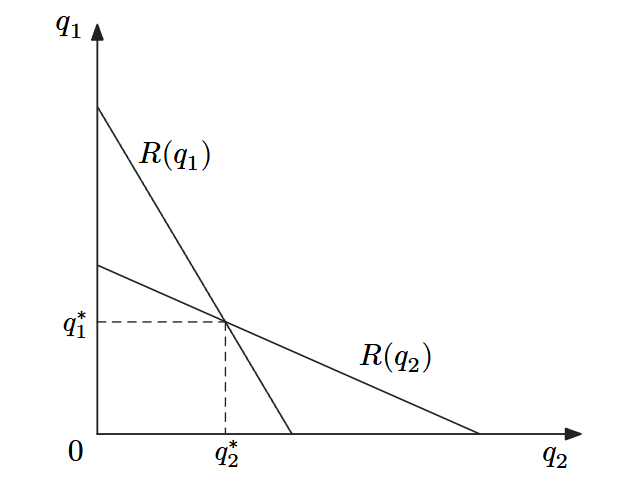{style="display: block; margin: 0 auto;" width="35%"}

