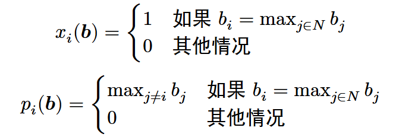
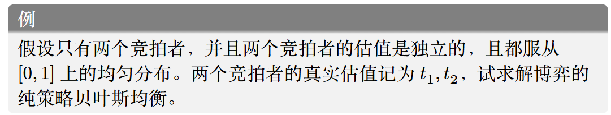
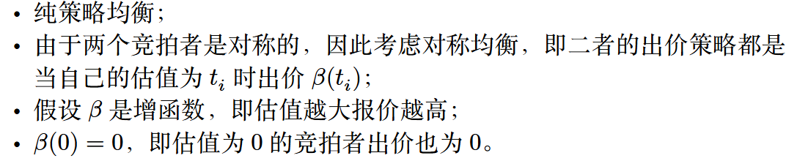
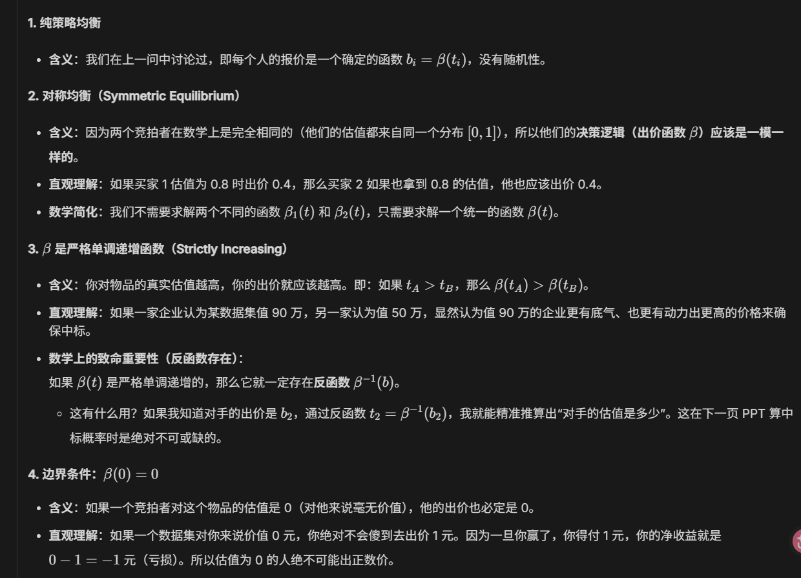
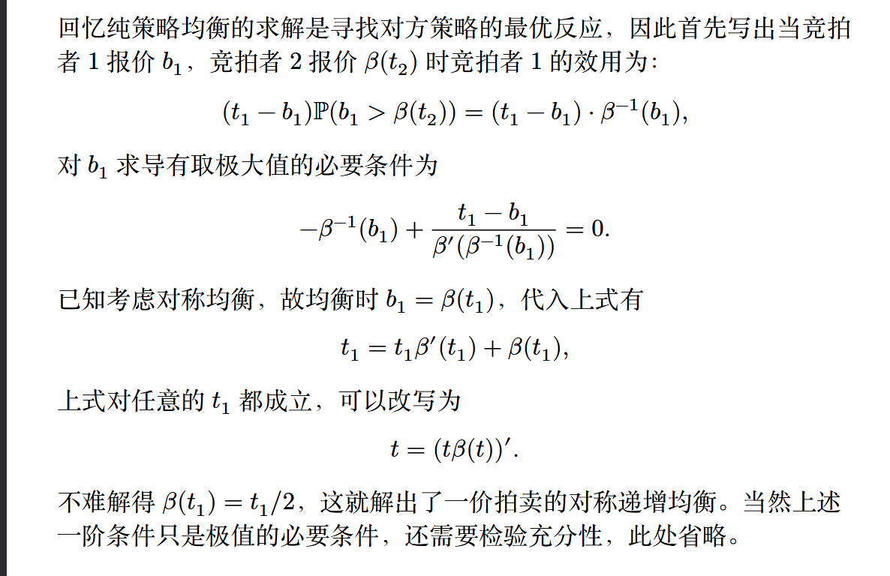

# 拍卖与机制

## 背景与介绍

通常情况下，出售物品的方式可以分为以下两种方式：

1. 公布价格
2. 拍卖

- 常见的拍卖形式

    按照拍卖形式来分

    - 公开拍卖：比如英式拍卖/公开升价拍卖（以较小的增量逐渐提高价格）、荷式拍卖/公开降价拍卖（以足够高的价格开始，逐渐降低价格）
    - 密封拍卖：比如第一价格拍卖、第二价格拍卖。二者都是报价最高者赢得物品，前者支付自己的报价，后者支付第二高的报价

    按照拍卖品数量来分

    - 多物品拍卖
    - 单物品拍卖

    其他的一些拍卖方式

    - 一轮投标确定拍卖结果：如密封第一、第二价格拍卖
    - 多轮逐次决定：如讨价还价、双向拍卖

    - 卖家报价：反向拍卖

## 拍卖理论基础

### 单物品密封拍卖的一般框架

1. 一个待出售的商品

2. $n$个竞拍者/买家

    - 每个买家$i$有一个估值$t_i$（或$t_i$是买家$i$的类型），对于卖家和其他买家来说是不完全信息

    - 买家估值具有先验概率密度$f_i:[a_i,b_i] \rightarrow \mathbb{R}^+$​，属于共同知识。一般都满足$f_i$连续且$f_i(t_i)>0$对于区间上的所有$t_i$成立，所以可以计算分布函数：

        $$F_i(t_i) = \displaystyle \int^{t_i}_{a_i} f_i(s_i)ds_i$$

3. 卖家对物品的估值，属于共同知识，$t_0 = 0$

- 用不完全信息静态博弈来描述

    1. 估值是一个私人信息，但具有先验分布共同知识

    2. 买家$i$ 的策略是选择一个报价$b_i$

    3. 卖家没有策略，仅根据买家们的报价组$b = (b_1,...,b_n)$来决定博弈结果$(x,p)$

        - $x$指的是分配规则，$x_i(b)$表示买家$i$在所有买家投标为$b$下获得物品的概率

        - $p$指的是支付规则，$p_i(b)$表示买家$i$​在……下需要支付的价格

        - 给定分配结果$(x,p)$，每个买家$i$的效用可表达为：

            $$u_i = x_i(b)t_i - p_i(b) = (t_i - b_i) \times p_i(b)$$

            $$即：效用 = 赢的概率 \times 估值 - 期望支付价格 = (估值-报价)\times赢的概率$$

### 单物品第二价格拍卖

依据第二价格拍卖内容，易得其博弈结果如下：

#### 二价拍卖诚实占优

即：单物品二价拍卖中，每个买家都将自身估值$t_i$作为报价$b_i$得到的策略向量是（弱）占优策略均衡。

证明：假设$p_i$是当前竞拍中第二高的报价/二价，对于任意竞拍者$i$，可以分三种情况讨论：

- 当$t_i > p_i$时：考虑如下数轴表示

    

    如果报价$b_i < p_i$将会输掉拍卖，效用为0；当报价$p_i \leq b_i < t_i$时赢得拍卖，效用为$t_i - p_i > 0$；当报价$b_i = t_i$以及报价$b_i > t_i$时，效用都是$t_i - p_i$。所以在这种情况下，诚实报价是一种弱占优策略

- 当$t_i = p_i$时，不论怎么报价，所有的报价效用都是0

- 当$t_i<p_i$时：依旧通过分段的方法

    

    易得，效用一定是非正的，仅当输掉拍卖时效用为0，而诚实报价就是一种输掉拍卖的方法，所以此时它是弱占优策略

综上，对于任意买家$i$，全部诚实报价是弱占优策略均衡

### 一价拍卖的均衡与收益

不同于二价拍卖，一价拍卖不是诚实占优的。比如：当$t_i > p_i$时，报价$b_i$在$p_i$和$t_i$之间时效用为正值；当$b_i = t_i$时，效用为0；当报价$b_i > t_i$时，效用又变为了负值。所以一价拍卖并非诚实占优。

关于一价拍卖的均衡与收益，通过用一个例题来说明：

这个特殊均衡往往具有如下性质：

说明性质猜想

详细解题过程……

强调反函数的应用…… 待完成

添加补充：最终平均效用的值计算

考虑补充：充分性

添加小测：陷阱：不从0开始的均匀分布区间

### 收入等价定理

即：一价密封拍卖和二价密封拍卖，在均衡状态下，卖家能赚到的期望收益是一样多的

添加：一价拍卖和二价拍卖的计算

## 机制设计基础

机制设计的思想：

机制设计定义：

### 直接显示机制

### 显示原理

### 迈尔森引理

#### 二价拍卖与迈尔森引理

#### 迈尔森引理的证明

