# 数据定价的其他视角

## 隐私与外部性视角
(待完成)

## 信息提取机制

自然，我们在收集数据时，总是希望能够得到真实的数据。所以，如何得到参与人地诚实回答是我们的目的。

在关于拍卖的讨论中，谈到了诚实性。但是拍卖中参与人关注的是自身效益与回复之间的联系和影响，属于内生激励。

这一节则重点关于外生激励：即设计一个奖励机制，使得参与人的回答会导致获得不同的外部奖励，而不影响自己的内部效用。

### 信息论基础

一些长得奇形怪状的公式……

- **熵/香农熵**

  所谓熵，就是混乱度，或者说不确定性。当不确定性增大，熵值就增大，反之同理。
  
  其定义如下：
  
  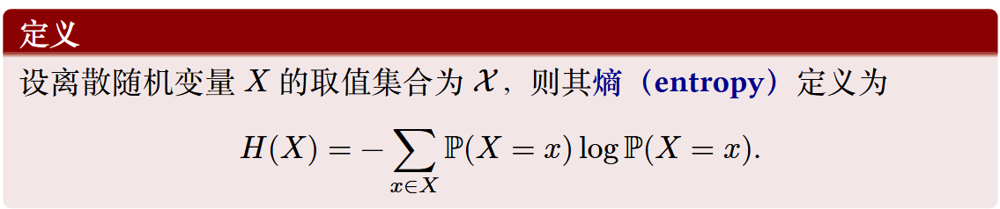{style="display: block; margin: 0 auto;" width="70%"}
  
  > $\mathbb P$相较于$P$来说是更规范的符号，因为$P$有时候可能会作为其他变量名等，$\mathbb P$唯一指代概率，在学术文章中也会经常见到
  
  这个公式主要分为两个部分：
  
  1. $\mathbb P(X=x)$：即**事件发生的概率**
  
  2. $-log \mathbb P(X=x)$：表示该**事件发生时带来的信息量/我对事件的不确定量**
  
      我分析这个对数函数：首先因为概率是不大于1的，在对数函数前面添加负号来将结果变正；同时，这个函数反应的规律是：当概率越低的事件发生，它带来的信息量就越大，同时也反映出我对事件的不确定性很大。
  
  所以，$H(X)$就是量化了一个不确定性。
  
  此时就能理解熵与数据定价的关系，如果一份数据能显著降低某个业务场景的熵，那么这份数据的信息价值就比较高，买方自然愿意出更高的价格。除此之外，有用的场景还有很多……

---

- **联合熵与条件熵**

    定义如下：

    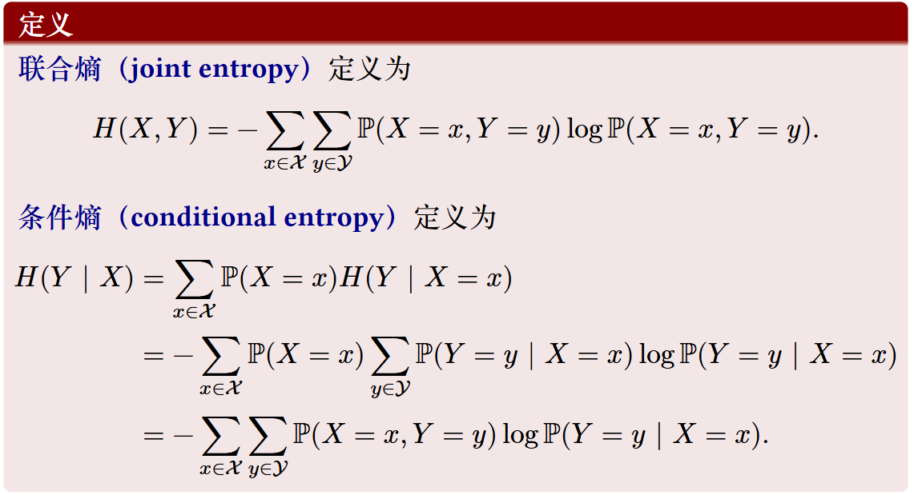{style="display: block; margin: 0 auto;" width="65%"}

    关于其定义，可以考虑类比二元离散型随机变量的联合概率分布：

    $P(X=x,Y=y)$，所有的组合概率和就是：$\Sigma_{x \in X} \Sigma_{y \in Y} P(x,y) = 1$

    条件熵同理，可以先考虑$X$固定时：

    $$H(Y|X=x) = - \Sigma_{y \in Y} P(y|x) \cdot logP(y|x)$$

    然而$X$本身是随机的，所以我们需要求平均值：

    $$H(Y|X) = - \Sigma_{x \in X} P(x) \cdot H(Y|X=x)$$

    将$H(Y|X=x)$​的式子带入，进行合并化简，就能得到图片中的最终形式了

---

- **链式法则**

    $$H(X,Y) = H(X) + H(Y|X)$$

    同样的，这个公式可以和“联合分布律 = 边际分布律 × 条件分布律”来类比，不过从含义的角度理解更加方便，即：

    **确定一个$(X,Y)$系统总的不确定性 $=$ 先确定$X$的不确定性 $+$ 已知$X$后剩下的$Y$​的不确定性**

---

- **互信息**

    定义如下：

    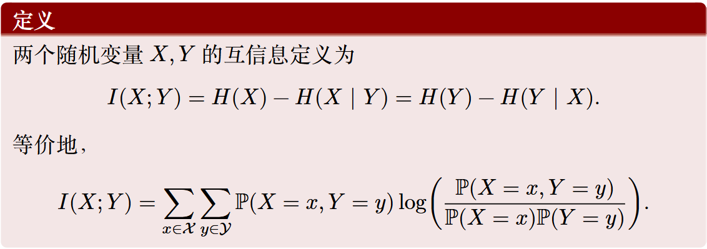{style="display: block; margin: 0 auto;" width="70%"}

    信息论中衡量两个随机变量之间相互依赖程度的指标，它回答了这样的一个问题：“**如果我得知了X，能帮我减少多少关于Y的不确定性？**”

    利用韦恩图可以很好地理解这个公式：

    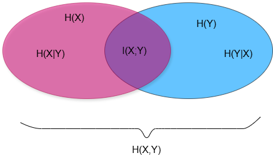{style="display: block; margin: 0 auto;" width="55%"}

    所以公示的含义为：

    **互信息 = $X$地总不确定性 $-$ 知道$Y$后剩余$X$的不确定性**

    也即：$X$中融到/包含在$Y$中的信息

    也即：$Y$中融到/包含在$X$​中的信息

    同时韦恩图还提供了**互信息的另一种计算方式：$I(X;Y) = H(X) + H(Y) -H(X,Y)$**

    所以互信息具有以下特点：

    1. 对称性：$I(X;Y) = I(Y;X)$
    2. 自信息：$I(X;X) = H(X)$

---

- **条件互信息**

    $$I(X;Y|Z) = H(X|Z) - H(X|Y,Z) = H(Y|Z) - H(Y|X,Z)$$

    即：**知道$Z$后$X$剩余不确定信息 $-$ 知道$Y,Z$后$X$的不确定信息 $=$ 引入$Y$后减少的$X$的不确定信息 = 引入$X$后减少的$Y$的不确定信息**

    其可以用来计算某份新数据的“纯增量价值”

---

- **互信息链式法则**

    $I(X,Y;Z) = I(X;Z) + I(Y;Z|X)$

    即：**打包数据$X,Y$预测$Z$的总信息量 $=$ 先用$X$预测 $+$ 已知$X$的情况，$Y$​带来的增量信息量**

    “预测Z”就是指用已知数据X,Y去推测、猜测那个无法直接观察的目标Z

---

- **KL散度/相对熵**

    离散随机变量的散度公式：

    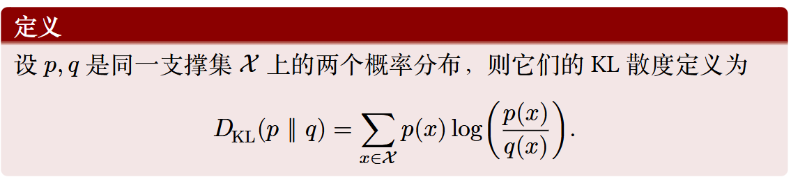{style="display: block; margin: 0 auto;" width="70%"}

    两个内容：

    1. $P$：拥有的针使概率分布
    2. $Q$：近似的/预测的/用模型估计的概率分布

    两个特征：

    1. 非负性：$D_{KL}(P||Q) \geq 0$  只有当$P$和$Q$完全相同时，散度才等于0；只要有偏差，散度就大于0
    2. 不对称性：$D_{KL}(P||Q) \neq D_{KL}(Q||P)$  用$Q$去近似$P$带来的损失，和用$P$去近似$Q$带来的损失，在数值上通常是不相等的。

---

- **重要结论：数据处理不等式**

    其内容如下：

    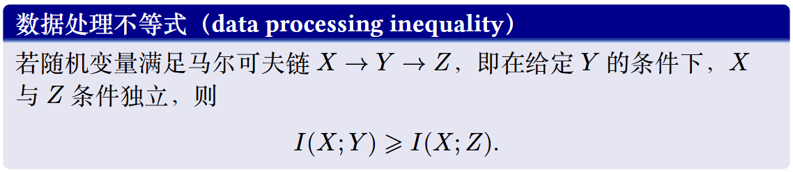{style="display: block; margin: 0 auto;" width="70%"}

    **马尔可夫链**：表示了一个单项依赖关系，即：$Z$是由$Y$加工得到的，$Y$又是由$X$得到的。

    - 一旦我们知道了中间的节点$Y$​，那么后续的$Z$​就不会再给关于$X$​的预测带来任何独属新线索了。
    - 定理后面的一句话其实说明了数学表达：$I(X;Z|Y) = 0$​

    > 数据处理不等式解释了一个内容：**任何对数据的加工处理，都绝对不可能凭空产生新的信息，它只会让信息流失，或者最多保持不变。**

    结论证明如下：

    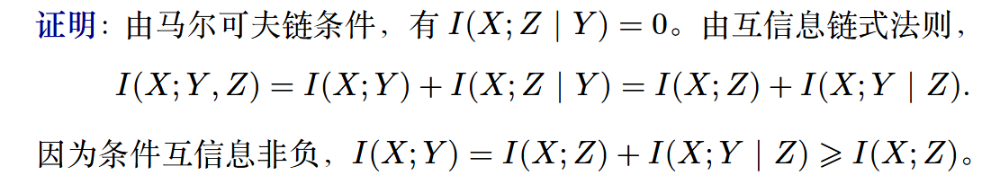{style="display: block; margin: 0 auto;" width="70%"}

### 适当评分规则

引入：

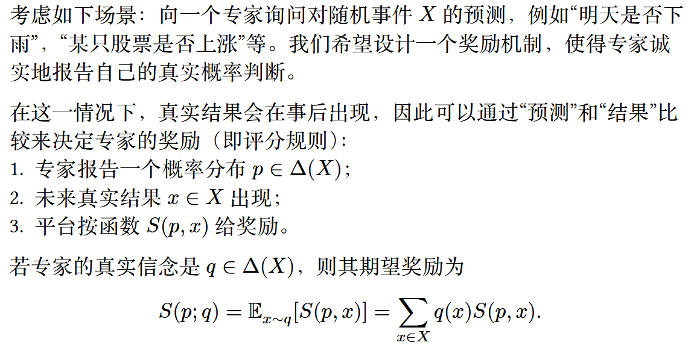{style="display: block; margin: 0 auto;" width="70%"}

专家的期望奖励是用专家的信念概率去求平均值的，因为真实世界下雨的客概率在专家脑子中还是信念的概率值

评分规则实际上就是一个结账的公式，并且该公式取决于专家的预测概率和最终真实结果的对比。

**适当评分规则的定义**：

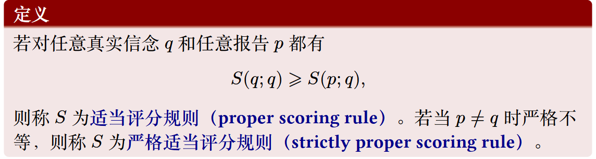{style="display: block; margin: 0 auto;" width="70%"}

即：专家汇报真话时，它的期望报酬大于等于汇报任何假话时的期望报酬。

---

我们可以做出专家的各种汇报值下的奖励值/评分规则图像，即图中的各个线段：

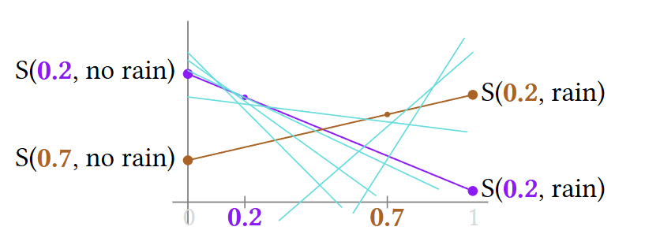{style="display: block; margin: 0 auto;" width="60%"}

例如：其中的红色线段就对应了专家汇报概率为0.2

要使得评分规则是适当的，就要保证信念等于汇报值时，对应的奖励应该是大于等于其他情况的。所以可以看到横轴信念$q$为0.2时，紫色线段对应的奖励值在所有线段中最大，对于0.7也是同理。

于是，将每个$p$值对应的最大值找出来，练成一条曲线，就得到了上包络线，即诚实期望收益函数的图像$G(q)$。又因为曲线$G(q)$是多个线性函数取最大得到的，而线性函数是凸函数，所以**$G(q)$在这里一定是凸函数**（其他情景设定并不一定）

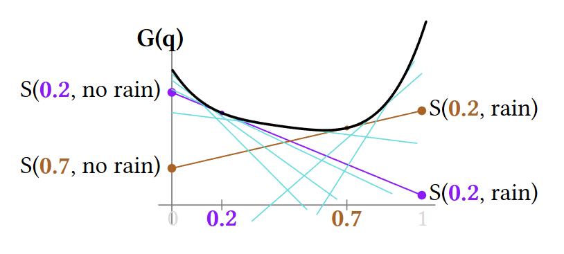{style="display: block; margin: 0 auto;" width="60%"}

现在**通过图像来反推出具体的给奖公式**：

首先，因为曲线$G(q)$在$q = p$时，即说真话时，与直线刚好相交。所以对应的那个直线就是曲线在$p$点处的切线。由切线方程可以得到：

$$y = G(p) + G'(p) \cdot (x-p)$$

而在高维空间下，导数就变成了梯度$\nabla G(p)$，同时将自变量$q$写入，得到更一般的公式：

$$S(p;q) = G(p) + \nabla G(p) \cdot (q-p)$$

期望奖励$S(p;q)$是事前算的，并且里面包含了变量$q$，但这个$q$是未知的，我们只能得到一个具体的结果$x$：要么为真(1)，要么为假(0)。所以我们需要做出这样的改动：

- 既然我们只能知道结果，那就将结果写成概率的形式。以预测下雨为例，如果第二天真下雨那么就是$\delta_{下雨}=[1,0]$，即下雨得概率为100%，不下雨概率为0%；如果第二天晴天，那么就是$\delta_{下雨}=[0,1]$。这种确定性的分布就叫做**退化分布**
- 将期望公式中的真实信念$q$替换成确定结果$\delta_x$，就得到了最终命题：

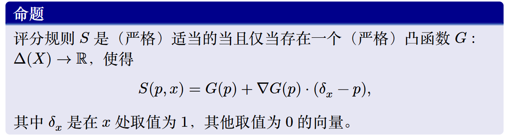{style="display: block; margin: 0 auto;" width="70%"}

这个过程是**具有普遍性**的，所以以后只需要随便选一个**开口向上的凸函数**$G$，然后求导带入上面的公式就能得到一个非常好的适当评分规则！比如：

- 如果你选$G(p)= \Sigma{p^2_i}$(二次方函数)，代入公式算出来的就是 Brier 评分规则
- 如果你选$G(p)= \Sigma p_i \cdot log p^i$(负熵函数)，代入公式算出来的就是 对数评分规则

### 同伴预测：已知先验的情况

从有验证移步到**无验证**……

---

之前预测下雨的例子中，虽然我们当时不知道结果，但是第二天一定会得到一个具体的答案，也就是说**结果会被验证**

现在一个新的例子是：

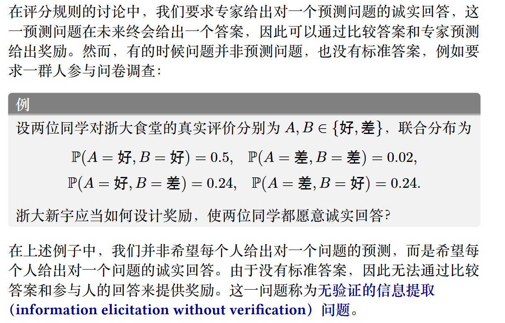{style="display: block; margin: 0 auto;" width="70%"}

虽然没有客观的标准答案，但是两个同伴的内心体验是高度关联的。假如说现在A同学吃了一顿：

1. 如果A同学觉得好，此时他内心进行贝叶斯更新，去猜测B的想法，认为B也觉得好的概率是： $\frac {0.5}{0.5+0.24} \approx 67.6\%$
2. 如果A同学觉得差，同理，它认为B觉得好的概率会更新为$\frac {0.24}{0.24+0.02} \approx 92.3\%$

这就是**信念更新**

---

为了解决问题，我们先将情景抽象成一般问题/博弈论模型：

- 每个人的真实体验(好或差)是他们的**真实类型（Type）**，记为$A_i$和$B_j$。设计者不知道哪个答案是诚实的，只知道诚实答案的先验分布，并且是共同知识
- 每个人提交给平台的报告是他们的**策略/行动（Action）**，记为$\bar{A}$和$\bar B$
- 平台的奖励政策是公开的函数，两个人的奖励分别为：$r_1(\bar A,\bar B)$和$r_2(\bar A,\bar B)$
- 我们的目标：设计出合理的$r$函数，使得这个博弈存在一个贝叶斯纳什均衡，即所有人都诚实是拿钱最多的最优策略

---

- 一个简单的想法

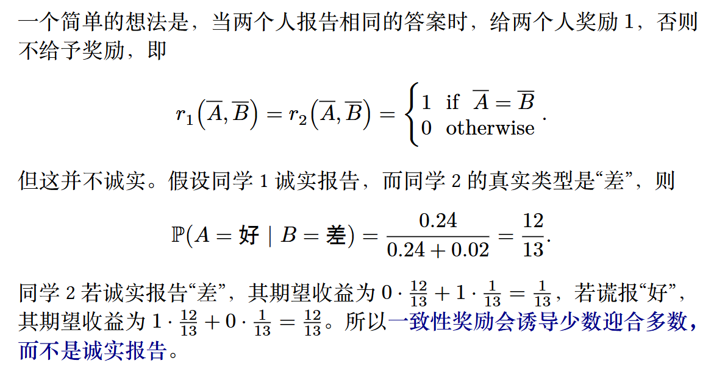{style="display: block; margin: 0 auto;" width="70%"}

---

- **同伴预测方法**

适当评分规则保证了诚实最优，但是适当评分规则需要可以验证的结果

所以尝试将问题转化为可以验证的形式：

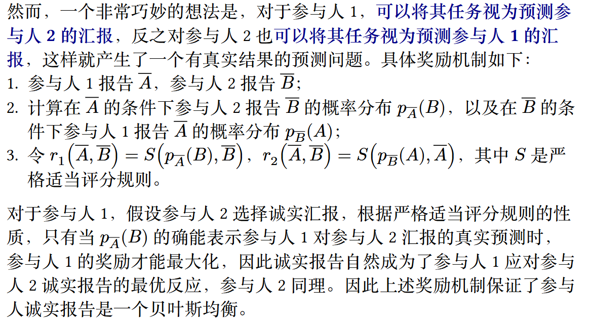{style="display: block; margin: 0 auto;" width="70%"}

总结上述奖励机制的核心思想，就是利用一方的汇报来评估另一方的汇报，因此这一方法也被非常形象地称为同伴预测（peer prediction）。这个机制非常简洁漂亮，但也有三个局限：

1. 它需要先验分布且是共同知识；
2. 诚实报告可能不是唯一均衡，例如在某些情况下可能存在“所有人都始
终报好”的合谋均衡；
3. 上面只讨论了两人机制；
• 当然推广到多人（大众点评）虽然不难，只需随机匹配“同伴”即可，
但前面两个问题仍然存在。

### 贝叶斯吐真剂(BTS)

bula bula 好多啊……

---

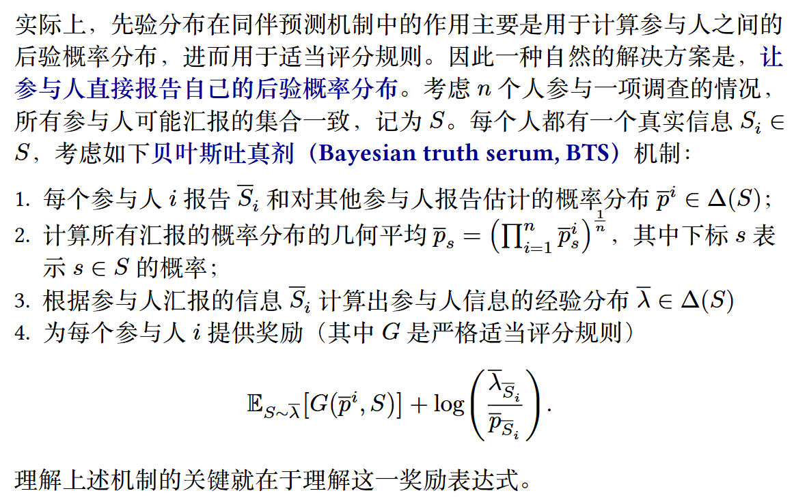{style="display: block; margin: 0 auto;" width="70%"}

整个奖励公式可以分为两个部分：

- 预测得分

    拿你对大众答案的预测值$\bar {P}^i$，和最终问卷统计出来的真实比例$\bar {\lambda} $做对比，然后平台用严格适当评分规则$G$进行打分

- 信息得分

    $\bar {\lambda}_{S_i}$：你的这个答案，在人群中**实际出现的比例**

    $\bar {P}_{S_i}$​：大家预测这个答案会出来的平均比例

    所以当实际比例高出了大家的预测值时，这个比值就大于1，所以就会获得极高的额外奖金

或者可以看下面的描述：

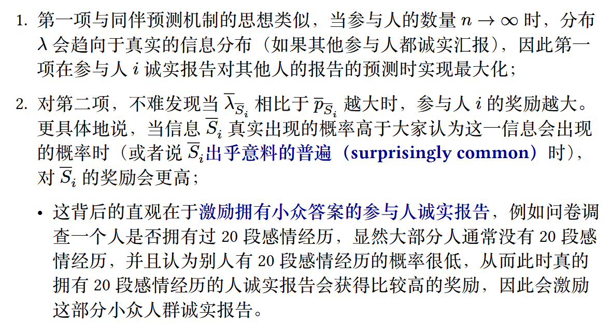{style="display: block; margin: 0 auto;" width="70%"}

### 众包问题

浅浅了解一下即可……

---

众包的新痛点：偷懒

之前的问卷中，你不需要付出任何体力，一秒钟就能知道自己爱不爱吃食堂。平台只需要解决你说不说真话的问题

对于众包，无法一下子给出答案，需要付出努力。如果没有平台监督，有的人为了省事，可能会乱搞一通，没有认真完成任务。比如：看医学片子标注肿瘤，为了省事，可能会闭着眼睛胡乱选无肿瘤，一秒钟刷100道题去骗钱

---

解决方法：**奖励同一任务一致，惩罚不同任务一致**

比如：

1. 奖励同一任务的一致性：你和同伴对图片 1进行了标注。如果你们都认真看图并标了有肿瘤，答案一致，平台奖励你们。
2. 惩罚不同任务的一致性：如果你的“图片 1”的答案，和同伴对“图片 2”的答案一模一样，平台就要惩罚你们。

### 互信息范式

从各种同伴预测机制中找到一个统一的框架，这需要利用数据处理不等式：**可以随机为每个参与人抽取一个参考评分者，然后将两者之间的互信息作为参与人的奖励**。直观上此时参与人不会选择不诚实汇报，因为不诚实汇报相当于对自己报告的随机变量做了“数
据处理”，会导致与参考评分者之间的互信息降低，从而导致奖励减少。

---

- **信息单调互信息**

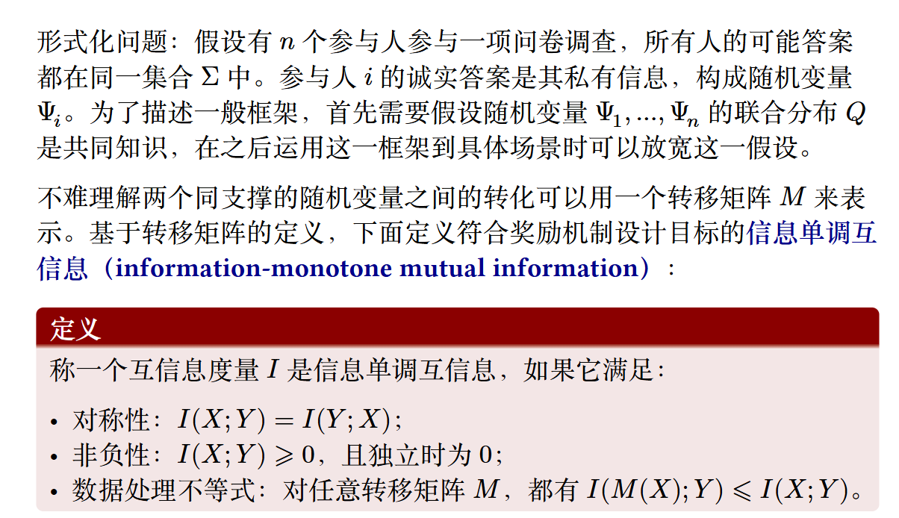{style="display: block; margin: 0 auto;" width="70%"}

在博弈论中，这里的$M$就可以代表”撒谎”。这里就是说：**只要你撒谎，你的和同伴之间的有效信息量一定会下降**

现在，平台制定了如下的统一游戏规则：

1. 收集所有人报告的信息分布
2. 对于参与人$i$，平台在剩下的人里随机挑选一个同伴$j$
3. 平台发给你的奖金，直接等于你的报告和同伴报告之间的（广义）互信息$I(\hat{\Psi_i};\hat{\Psi_j})$

---

- **互信息范式(MIP)**

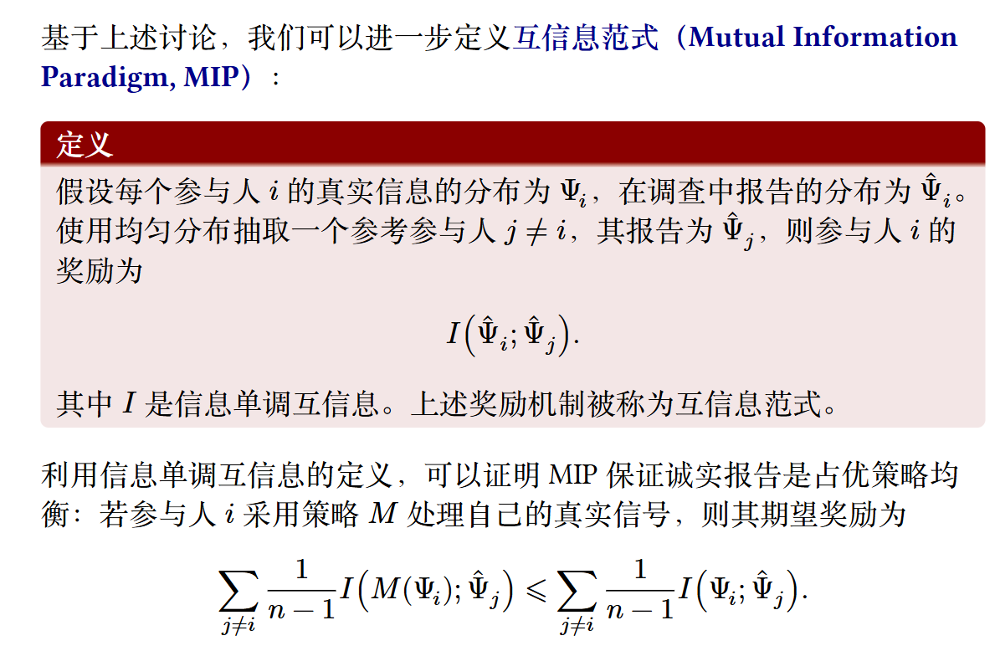{style="display: block; margin: 0 auto;" width="70%"}

随机抽取一个人，除了自己剩$n-1$​个，所以概率是$\frac{1}{n-1}$​

$期望收益 = \Sigma概率 \times 收益$

如果撒谎，期望奖金是左边；如果说真话，期望奖金是右边

## 诚实数据获取机制

怎么还有!*&$%@......

---

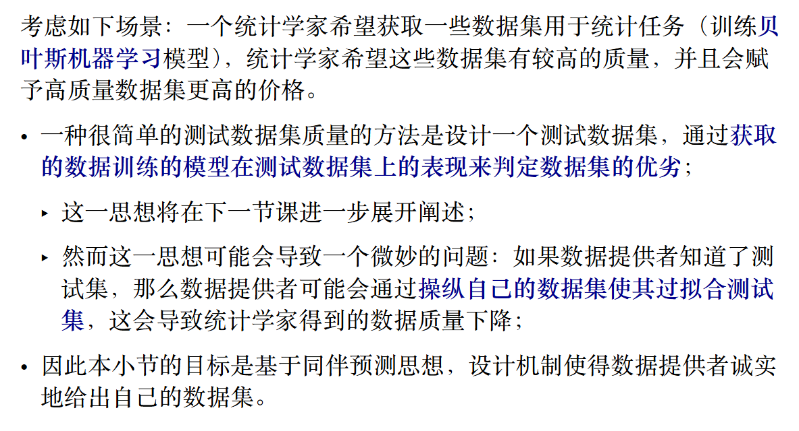{style="display: block; margin: 0 auto;" width="70%"}

- **构建模型**

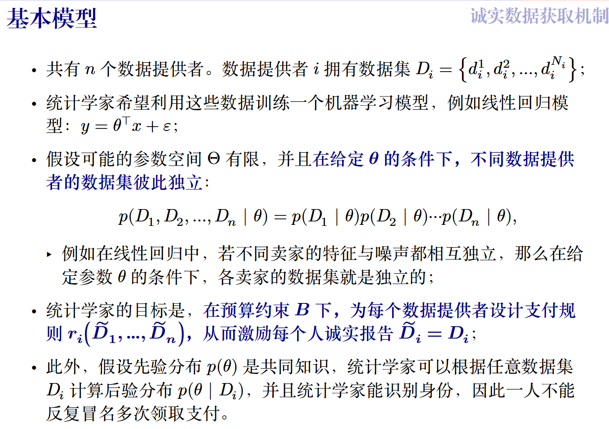{style="display: block; margin: 0 auto;" width="70%"}

买方设计的支付函数不仅取决于卖家提交的数据集，还取决于其他所有人提交的数据集。目的是达到纳什平衡：让每个卖家都老实上交自己的原数据集。

我们把未知参数$\theta$​当成了大自然隐藏的真理。每个卖家的数据集$D_i$​都是对这个真理的一次不完美观测

接下来，利用卖家们对于真理观测的关联性，即计算后验分布$p(\theta|D_i)$，来给他们的数据集分级定价。

---

- **奖励机制设计**

1. **诚实性**（但不一定构成唯一的均衡）

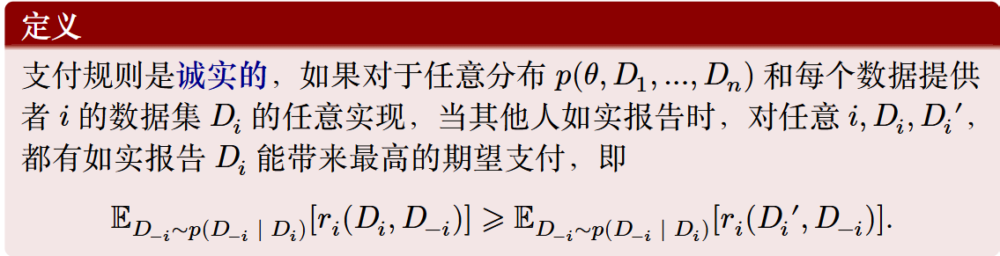{style="display: block; margin: 0 auto;" width="70%"}

左边就是大家都说真话，你平均能拿的钱，右边是大家都说真话，只有你一个人撒谎，平均能拿的钱。最终左边$\geq$右边，所以只要别人都诚实，自己诚实就是最好的选择。

2. **敏感性**

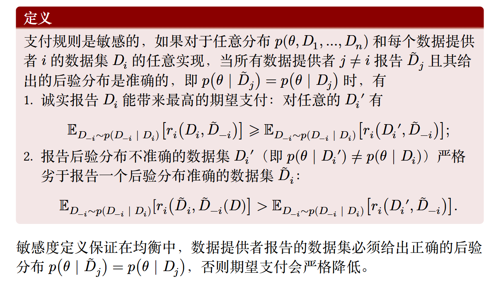{style="display: block; margin: 0 auto;" width="70%"}

这里的第二个核心公式是指：当交了一个被篡改的数据集$D'_i$后，导致它的后验分布变形了，所以拿到的钱严格低于任何一个对应后验分布没变形的数据集

这样，如果大家想着合谋交全零的空数据集，因为空数据集和真数据集的指纹/后验分布完全对不上，发生了严重变形，所以将会被惩罚扣款。

3. 其他的基本要求

    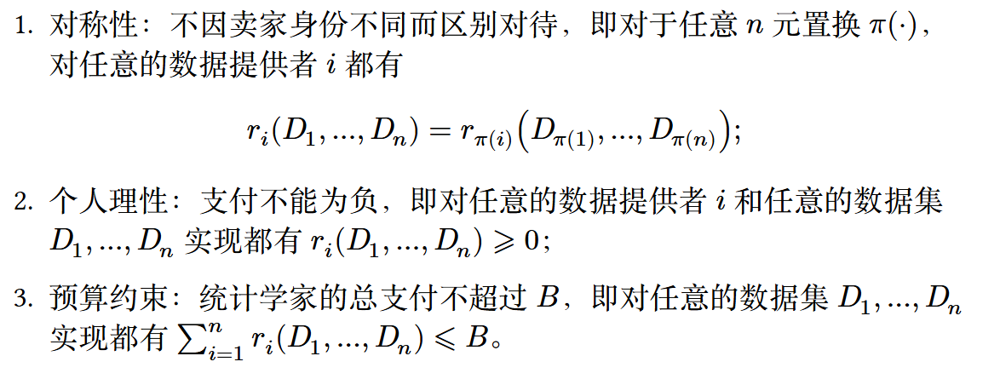{style="display: block; margin: 0 auto;" width="70%"}

---

- **同伴预测方法**

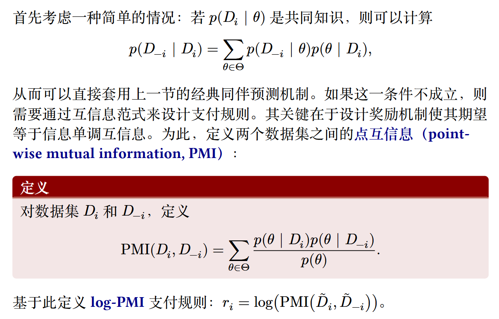{style="display: block; margin: 0 auto;" width="70%"}

1. 简单情况下，我们可以通过全概率公式计算出：在已知我的数据$D_i$的情况下，别人数据是$D_{-i}$的条件概率。这样的话就可以回退到之前的食堂案例，然后套用其同伴预测机制来进行支付。

2. **点互信息(PMI)公式**的含义

    - 其中的分子用来衡量你和哦同伴对于同一个模型参数$\theta$的认同度。如果数据都是真货，那么会指向同一个正确的$\theta$，分子就会很大；如果有人造假，分子就会很小
    - 分母是先验概率，用来做归一化惩罚。如果这个$\theta$本来的先验概率就很高，那么猜中它并不是难事，所以分母会削弱得分；反之如果$\theta$比较罕见，但是却被猜中了，那么分母就会让得分增加

3. **log-PMI支付规则**：卖家拿到的钱等于他提交的数据集$\bar{D}_i$和别人提交的$\bar{D}_{-i}$的点互信息的对数值

    它能够保证诚实：

    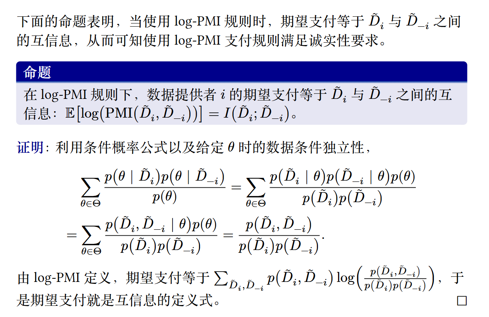{style="display: block; margin: 0 auto;" width="70%"}

    - 点互信息取对数 的数学期望值等于 香农互信息
    - 香农互信息$I(D_i;D_{-i})$是一个标准的信息单调互信息，严格满足数据处理不等式
    - 不撒谎，期望互信息是最优的，同时期望奖金也是最优的

