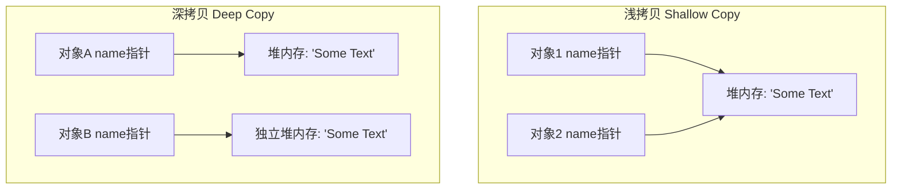

# 拷贝构造、静态成员与命名空间

第五节统剖析了 C++ 拷贝构造函数（Copy Constructor）的原理与深浅拷贝陷阱、委托构造函数、静态（`static`）特性的多重语义与静态初始化依赖难题、以及命名空间（`namespace`）的进阶用法。

---

### 拷贝构造函数与深浅拷贝


#### 最令人头疼的解析陷阱（Most Vexing Parse）

??? example "点击查看代码"
    ```cpp
    void f() {
        Stash students(); // 究竟是创建对象还是声明函数？
    }
    ```

* **编译器行为**：编译器会将此语句解析为**一个函数原型声明**——该函数名为 `students`，不接受参数，返回值类型为 `Stash`。
* **正确写法**：
    * 使用无括号定义：`Stash students;`
    * 使用现代化列表初始化（推荐）：`Stash students{};`（同时可防范类型窄化转换，如 `int x{3.14}` 会报错，而 `int x = 3.14` 会被截断）。

#### 拷贝构造函数（Copy Constructor）
* **触发场景**：
    1. **按值传递对象**：调用函数时，形参对象通过拷贝实参进行构造。
    2. **按值返回对象**：从函数返回一个临时对象时（若未被 RVO 优化）。
    3. **显式初始化**：如 `Person baby_b = baby_a;` 或 `Person baby_c(baby_a);`。
* **签名规范**：`T::T(const T&)`。
!!! info "为什么必须是引用传递（`&`）？"
    如果拷贝构造函数的形参是按值传递的（如 `T::T(T)`），那么为了向拷贝构造函数传递参数，系统又需要调用拷贝构造函数，这会导致**无限递归调用**，最终导致栈溢出。

#### 默认拷贝构造与逐成员拷贝（Memberwise Initialization）
* 如果未定义拷贝构造函数，编译器会自动合成一个默认拷贝构造函数。
* **默认拷贝构造函数行为**：逐个拷贝每个数组成员、内置类型成员；对于类对象成员，会**递归调用**其所属类的拷贝构造函数。
* **当类成员皆为行为良好的对象**（如 `std::string`、`std::vector`）时，默认生成的拷贝构造函数已足够安全。


#### 指针成员与深浅拷贝陷阱
当类中包含指针成员并涉及动态内存管理时，默认的逐成员拷贝（浅拷贝）会引发灾难：



* **浅拷贝（Shallow Copy）**：仅复制指针地址。导致两个对象的指针指向同一块堆内存。
    * **危害**：其中一个对象修改内容，另一个随之改变；析构时会对同一个指针释放两次（**Double Free**），直接导致程序崩溃。
* **深拷贝（Deep Copy）**：在堆上重新开辟一块相同大小的内存，将原内存中的数据拷贝过去。两个对象完全独立。

    举例：一个C-Style 字符串深拷贝实现：

??? example "点击查看 C++ 字符串深拷贝代码实现"
    ```cpp
    // 构造函数
    Person::Person(const char *s) {
        name = new char[::strlen(s) + 1]; // 加上结束符 \0 的位置
        ::strcpy(name, s);
    }
        
    // 析构函数
    Person::~Person() {
        delete[] name;
    }
        
    // 拷贝构造函数（深拷贝）
    Person::Person(const Person& w) {
        name = new char[::strlen(w.name) + 1];
        ::strcpy(name, w.name);
    }
    ```

#### 拷贝优化与禁止拷贝
* 返回值优化（RVO）：现代编译器会自动优化多余的拷贝。在返回匿名临时对象时（如 `return Person(who);`），直接在外部接收者的内存空间内构造对象，完全跳过拷贝构造。
* 禁止拷贝：如果不希望类对象被拷贝，可将拷贝构造函数声明在 `private` 作用域中，且无需提供定义。

---

### 委托构造函数（Delegating Constructor）

* **定义**：允许在一个构造函数中调用同类的另一个构造函数，减少冗余代码。
* **语法要求**：调用动作必须放在**初始化列表**中。

    ??? example "点击查看代码"
        ```cpp
        class Player {
            string name;
            int hp, level;
        public:
            // 核心构造函数
            Player(string n, int h, int l) : name(n), hp(h), level(l) {}
            // 委托构造函数
            Player(string n) : Player(n, 100, 1) {} 
            Player() : Player("未知玩家") {}
        };
        ```
* **注意**：委托构造函数的初始化列表中**不能**再对其他成员变量进行单独初始化。

---

### static 静态特性的进阶语义

`static` 关键字具有两大核心语义：**静态存储性**（生命周期贯穿整个程序）与**内部链接性**（限制名字仅在当前文件内可见）。

#### 静态局部对象
* **构造时机**：只有在代码首次运行到其定义点时才进行构造。
* **析构时机**：仅在整个程序退出时被销毁。
* **销毁顺序**：遵循**后进先出（LIFO）**原则，即后构造的静态对象先被析构。
* *注：可以利用 `if` 分支条件构造静态局部对象，避免不必要的性能开销。*

#### 全局变量/全局对象
* **构造时机**：全局对象的构造函数在 `main()` 函数执行之前就已经运行了！
* **析构时机**：在 `main()` 退出或调用 `exit()` 时。
* **静态初始化依赖难题（Static Initialization Order Fiasco）**：
    * 问题：在同一 `.cpp` 文件内，全局/静态对象的构造顺序与其定义顺序一致。但是，**不同文件之间的全局静态对象的构造顺序是未定义的**。如果 `FileB.cpp` 中的全局对象构造函数依赖于 `FileA.cpp` 中的全局对象，且 `FileB` 恰好先初始化，会导致读取到未初始化脏数据甚至程序崩溃。
    * 解决方案：避免全局静态变量之间的初始化相互依赖；或者将相互依赖的全局变量定义在同一个源文件内，确保正确的代码物理先后顺序。

#### 类静态成员
* **静态成员变量**：<u>不属于某个具体的对象实例，而是属于整个类。</u>它在没有任何对象创建前就已存在。
    * 定义与初始化：在 `.h` 头文件内进行声明，**必须在 `.cpp` 源文件中进行物理定义和初始化**（在 `.cpp` 中定义时**不能**再带 `static` 关键字）。
* **静态成员函数**：
    * **没有 `this` 指针**，不与任何实例绑定。
    * **访问限制**：只能访问类的静态成员变量或静态成员函数，禁止访问普通成员变量。
    * **不能声明为虚函数（`virtual`）**。

---

### 命名空间（Namespace）进阶

命名空间用于在逻辑上对类、函数、变量进行分组，消除全局命名冲突。

* **语法规则**：

    ??? example "点击查看代码"
        ```cpp
        namespace Math {
            double abs(double);
        } // 注意：右大括号后面不需要加分号！
        ```

* **使用方式**：
    1. 完全限定名：`Math::abs(-5.0)`。
    2. using 声明：`using Math::abs; abs(-5.0);`，只引入特定名字，避免命名空间污染。
    3. using 指令：`using namespace Math;`，将命名空间内的所有名字全部拉入当前作用域。若与当前作用域同名名字冲突，只在使用时（如调用同名函数）引发二义性编译错误。
* **别名控制**：可以使用 `namespace alias_name = long_name;` 缩短长命名空间名称。
* **组合与选择**：可以在新空间内使用 `using` 声明将多个其他空间的部分类/函数进行挑选组合。
* **命名空间是开放的**：可以在不同的文件中多次续写同名 `namespace`，编译器会自动将它们合并为一个整体。

#### 派生类中的 using 函数引入
在继承关系中，如果子类重写了父类的某个重载函数，父类中其他的同名重载函数在子类中会被默认“隐藏”。

* **解决方法**：在子类中使用 `using Base::func;`，将父类的重载版本拉入子类作用域，解决隐藏难题，实现跨作用域的函数重载。
