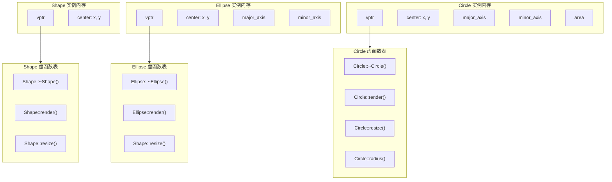
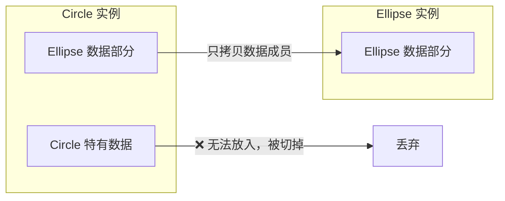
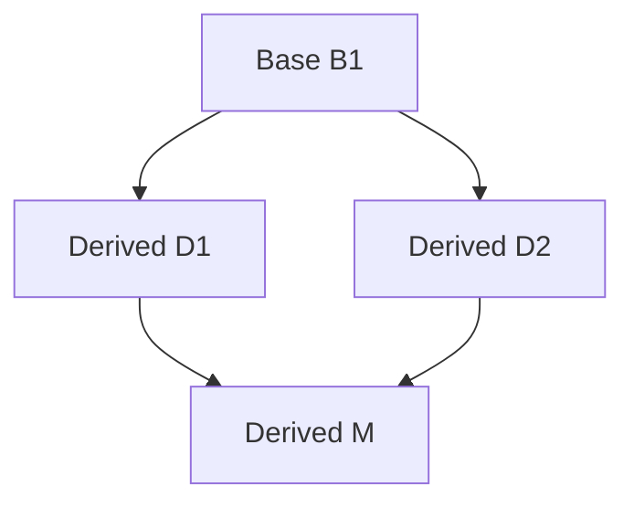
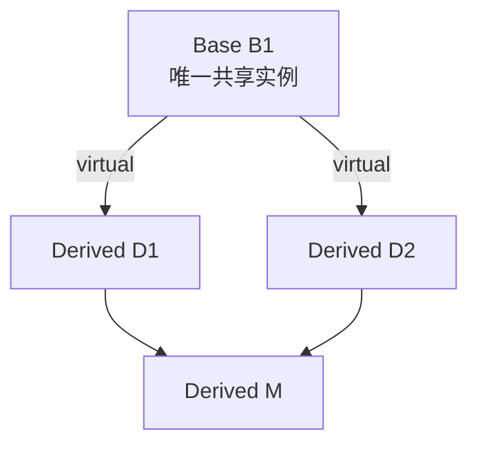

## 多态（Polymorphism）

多态是OOP中最核心、最具威力的特性，本节将由浅入深地剖析其概念、底层机制、常见陷阱以及多重继承的复杂性。

---

### 继承与类型转换

多态的实现离不开继承。在 C++ 中，**公有继承（Public Inheritance）** 建立了类之间的 Is-A 关系。

#### 替换原则（Substitution Principle）
如果类 `B` 公有继承自类 `A`（即 `B` Is-A `A`），那么在任何需要 `A` 对象的地方，都可以安全地使用 `B` 对象。这是因为派生类 `B` 包含了基类 `A` 的所有数据成员和行为，它是基类的一个“超集”（Superset）。

#### 向上转型（Upcasting）
**向上转型** 是指将派生类的指针或引用转换为基类的指针或引用的行为。

* **隐式转换**：由于 Is-A 关系成立，向上转型总是安全的，编译器允许进行隐式转换。
* **类型信息丢失**：当我们通过基类指针或引用访问派生类对象时，如果不做特殊处理，编译器将只能看到基类定义的接口，从而“丢失”了派生类特有的行为。

??? example "点击查看代码"
    ```cpp
    class Employee {
    public:
        void print() { cout << "Employee print" << endl; }
    };
    
    class Manager : public Employee {
    public:
        void print() { cout << "Manager print" << endl; }
    };
    
    Manager pete;
    Employee* ep = &pete; // 向上转型（隐式指针转换）
    Employee& er = pete;  // 向上转型（隐式引用转换）
    
    ep->print(); // 默认调用的是 Employee:: print()，而不是 Manager:: print()！
    ```

!!! warning "未开启多态时的类型退化"
    在上述代码中，尽管 `ep` 实际指向一个 `Manager` 对象，但由于 `print()` 是普通非虚函数，编译器在编译期根据指针的静态类型（`Employee*`）进行了 **静态绑定**，导致调用了基类版本。这正是多态需要解决的核心痛点。

---

### 什么是多态？

多态的英文单词 *Polymorphism* 源自希腊语，意为“多种形态”。在 C++ 中，多态的公式可以概括为：

$$\text{多态} = \text{向上转型 (Upcasting)} + \text{动态绑定 (Dynamic Binding)}$$

#### 静态绑定 vs 动态绑定

| 特性 | 静态绑定（Static Binding / Early Binding） | 动态绑定（Dynamic Binding / Late Binding） |
| :--- | :--- | :--- |
| 决策时机 | **编译期**（Compile-time） | **运行期**（Runtime） |
| 判定依据 | 变量/指针/引用的 **声明类型**（静态类型） | 指针/引用实际指向的 **对象类型**（动态类型） |
| 实现方式 | 编译器直接生成调用特定函数地址的汇编指令（如 `call` 某个具体地址） | 通过指针间接寻址，在运行期查询虚函数表（vtable） |
| 触发条件 | 默认情况下的普通成员函数调用 | 通过基类指针或引用调用 **虚函数（`virtual`）** |
| 性能开销 | 无任何额外开销，速度极快 | 存在一次指针跳转和查表的微小运行期开销，且阻碍了内联优化 |

#### 案例：图形绘制程序
假设我们要设计一个绘图软件，支持绘制椭圆（`Ellipse`）、圆（`Circle`）等。

??? example "点击查看代码"
    ```cpp
    #include <iostream>
    #include <vector>
    
    class XYPos {
    public:
        double x, y;
        XYPos(double x = 0, double y = 0) : x(x), y(y) {}
    };
    
    // 基类：Shape
    class Shape {
    public:
        Shape() {}
        virtual ~Shape() {}           // 关键：虚析构函数（后文详解）
        virtual void render() {       // 关键：声明为虚函数
            std::cout << "Rendering generic shape." << std::endl;
        }
        void move(const XYPos& new_center) { // 非虚函数：所有图形的移动逻辑相同
            center = new_center;
        }
    protected:
        XYPos center;
    };
    
    // 派生类：Ellipse
    class Ellipse : public Shape {
    public:
        Ellipse(float maj, float minr) : major_axis(maj), minor_axis(minr) {}
        void render() override {      // 重写基类的虚函数
            std::cout << "Rendering Ellipse with axes " << major_axis << ", " << minor_axis << std::endl;
        }
    protected:
        float major_axis, minor_axis;
    };
    
    // 派生类：Circle
    class Circle : public Ellipse {
    public:
        Circle(float radius) : Ellipse(radius, radius) {}
        void render() override {      // 重写虚函数
            std::cout << "Rendering Circle with radius " << major_axis << std::endl;
        }
    };
    ```

我们可以编写一个统一的渲染函数，接受基类指针作为参数：

??? example "点击查看代码"
    ```cpp
    void drawShape(Shape* p) {
        p->render(); // 动态绑定！在运行期根据 p 指向的实际对象类型调用对应的 render()
    }
    
    int main() {
        Shape* s1 = new Ellipse(10.0f, 5.0f);
        Shape* s2 = new Circle(8.0f);
    
        drawShape(s1); // 输出: Rendering Ellipse with axes 10, 5
        drawShape(s2); // 输出: Rendering Circle with radius 8
    
        delete s1;
        delete s2;
        return 0;
    }
    ```

!!! tip "设计深思：Circle 是否应该继承自 Ellipse？"
    课件中提到：`Deriving Circle from Ellipse is a poor design choice!`（从 Ellipse 派生 Circle 是一个糟糕的设计选择）。
    
    * **数学上**：圆是椭圆的特例（长轴等于短轴）。
    * **OOP 中（Liskov 替换原则）**：派生类必须完全能够替换基类。如果 `Ellipse` 提供了一个 `setMajorAxis(float a)` 接口允许单独改变长轴，那么 `Circle` 继承后也将拥有这个接口。但一旦单独改变长轴，`Circle` 就不再是圆了！这破坏了圆的约束条件（不变量）。因此，在 OOP 中，**“圆是椭圆”这一逻辑通常是不成立的**，它们更适合继承自共同的基类 `Shape`。

---

### 虚函数及其底层机制

为了在运行期决定调用哪一个函数， C++ 编译器在底层使用了一套精妙的机制：**虚函数表（Virtual Table，简称 vtable）** 和 **虚表指针（Virtual Pointer，简称 vptr）**。

#### 底层结构解析
对于包含虚函数的类：

1. **vtable（虚函数表）**：编译器会为 **每个类** 生成一张只读的表。表中按顺序存放着该类中所有虚函数的入口地址。如果派生类重写了某个虚函数，表中对应的位置就会被替换为派生类自己的函数地址。
2. **vptr（虚表指针）**：编译器会为该类的 **每个对象实例** 隐式添加一个指针成员（通常放在对象内存布局的最前面，即偏移量为 0 处）。这个指针指向该类对应的 vtable。

#### 内存布局示意图

以下是 `Shape`、`Ellipse`、`Circle` 对象的内存布局及虚函数表指向关系：



* **分析 `Ellipse` 的虚函数表**：
  * 因为 `Ellipse` 重写了 `render()`，所以它的 vtable 中原本指向 `Shape::render()` 的槽位（Slot）被替换成了 `Ellipse::render()` 的地址。
  * 因为 `Ellipse` 没有重写 `resize()`，所以它继承自 `Shape`，它的 vtable 中该槽位依然指向 `Shape::resize()`。
* **分析 `Circle` 的虚函数表**：
  * `Circle` 重载了 `resize()` 和 `render()`，并在基类基础上新增了虚函数 `radius()`。其 vtable 会在末尾追加新的槽位指向 `Circle::radius()`。

#### 运行期调用流程
当执行语句 `p->render();` 时，CPU 执行的步骤为：

1. 取出指针 `p` 指向的地址。
2. 从该地址的头部（`vptr` 所在位置）读取虚函数表的首地址。
3. 根据 `render()` 函数在虚函数表中的索引（偏移量，例如第 2 个槽位），取出函数入口地址。
4. 跳转到该地址执行代码。

由于 `vptr` 是和对象绑定在一起的，因此无论指针 `p` 的类型是 `Shape*` 还是 `Ellipse*`，只要它指向的是 `Circle` 对象，获取到的 `vptr` 就指向 `Circle vtable`，最终调用的就是 `Circle::render()`。这就是 **动态绑定** 的本质。

---

### 对象切片（Object Slicing）

对象切片是 C++ 中由于 **值传递** 或 **值赋值** 导致多态失效的经典陷阱。

#### 切片现象的发生
当我们将一个派生类对象 **按值（By Value）** 赋值给基类对象时，会发生以下情况：

```cpp
Ellipse elly(20.0f, 40.0f);
Circle circ(60.0f);

elly = circ; // 发生了对象切片！
```

* **数据丢失**：`circ` 中特有的成员（如 `area`，或者是圆特有的不变量）无法放入 `elly` 中，因为 `elly` 的内存大小是 `sizeof(Ellipse)`。多余的数据被直接“切掉”了。
* **虚表指针未被拷贝**：`elly = circ;` 实际上调用的是基类的拷贝赋值运算符。它只复制数据成员，而 **不会拷贝对象的 `vptr`**。因此，`elly` 的 `vptr` 依然指向 `Ellipse vtable`。

```cpp
elly.render(); // 调用的是 Ellipse::render()，多态消失！
```



#### 避免切片的黄金法则

!!! info "多态实现的必要条件"
    C++ 中的多态 **必须** 通过 **基类的指针** 或 **基类的引用** 来实现。值传递会导致拷贝构造或拷贝赋值，从而触发对象切片，使多态性彻底丧失。
    ```cpp
    // ❌ 错误：值传递，发生切片
    void renderVal(Ellipse e) { e.render(); } 
    
    //  正确：引用传递，不复制对象，保留 vptr，实现多态
    void renderRef(Ellipse& e) { e.render(); } 
    
    //  正确：指针传递，实现多态
    void renderPtr(Ellipse* e) { e->render(); }
    ```

---

### 虚析构函数（Virtual Destructor）

在多态设计中，基类的析构函数 **必须** 声明为虚函数（`virtual`）。

#### 内存泄漏的隐患
考虑以下代码：
    ```cpp
    Shape* p = new Ellipse(10.0f, 20.0f);
    // ...
    delete p;
    ```

* **如果 `Shape::~Shape()` 不是虚函数**：
  编译器会进行静态绑定。因为 `p` 的静态类型是 `Shape*`，所以 `delete p` 只会调用 `Shape` 的析构函数 `Shape::~Shape()`。而派生类 `Ellipse` 的析构函数 `Ellipse::~Ellipse()` 将 **不会被调用**！
  如果 `Ellipse` 在构造函数中申请了动态内存（例如包含指针成员并使用 `new` 申请了空间），那么这部分内存就永远无法被释放，导致 **内存泄漏（Memory Leak）**。
* **如果 `Shape::~Shape()` 是虚函数**：
  `delete p` 会通过虚表找到实际的析构函数 `Ellipse::~Ellipse()` 并调用它。而在执行完派生类的析构函数后，系统会自动 **向上调用** 基类 `Shape::~Shape()`，确保整条继承链上的资源都被正确释放。

!!! info "开发准则"
    任何可能作为基类的类，其析构函数都应当声明为 `virtual`。即使基类不需要显式析构，也应当声明一个空的虚析构函数：`virtual ~Base() {}`。


### 为什么构造函数不能是虚函数？

虽然析构函数在多态设计中**必须**声明为虚函数，但**构造函数绝对不能是虚函数**。

#### 1. 底层机制原因（vptr 尚未就绪）
* 虚函数的动态绑定依赖于对象内存中的**虚函数表指针（`vptr`）**。
* `vptr` 是在构造函数执行期间由编译器生成的代码进行初始化和赋值的。
* 如果构造函数是虚函数，调用它就需要查阅 `vptr` 指向的虚表（vtable）。然而此时对象尚未构造出来，内存中根本没有可用的 `vptr`，从而产生逻辑矛盾。

#### 2. 概念设计原因（对象尚未诞生）
* 虚函数多态的语义是：对于一个**已经存在的对象**，通过基类指针或引用动态调用其子类的特定方法。
* 构造函数的目的是**创建一个尚未存在的对象**。在对象创建之前，不可能有针对该对象的多态调用。

#### 3. 黄金实践：虚拟构造器模式（Virtual Constructor Pattern）
虽然 C++ 语法不支持虚构造函数，但在实际工程中，如果需要通过基类指针复制出与子类类型完全一致的新对象，可以通过定义虚函数 `clone()`（原型模式）来模拟“虚构造”：

??? example "点击查看代码"
    ```cpp
    class Shape {
    public:
        virtual ~Shape() {}
        virtual Shape* clone() const = 0; // 模拟虚拟构造
    };
    
    class Circle : public Shape {
    private:
        double radius;
    public:
        Circle(double r) : radius(r) {}
        virtual Circle* clone() const override {
            return new Circle(*this); // 实际调用拷贝构造函数
        }
    };
    ```

---

### 函数重写（Override）与协变

#### 虚函数重写的细节

在派生类中重写基类的虚函数时，建议显式写出 C++11 引入的 `override` 关键字。编译器会帮我们检查签名是否完全一致，避免由于手误将重写写成了重载。

* **调用基类实现（链式调用）**：在重写虚函数时，通常需要保留基类的基本行为，再添加派生类的特有逻辑。可以使用 `BaseClass::function()` 进行显式调用：
        ```cpp
        void Derived::render() {
            Base::render(); // 显式调用基类的 render()
            // 执行派生类特有的渲染逻辑
        }
        ```

#### 协变返回类型（Covariant Return Types）

在 C++ 中，重写虚函数要求 **返回值类型也必须相同**。但存在一个例外：**协变返回类型**。
如果基类的虚函数返回一个基类指针或引用，那么派生类在重写该虚函数时，可以返回该基类对应派生类的指针或引用。
    ```cpp
    class Expr {
    public:
        virtual Expr* clone() { return new Expr(*this); }
    };
    
    class BinaryExpr : public Expr {
    public:
        // 协变：返回值从 Expr * 放宽为子类指针 BinaryExpr*
        BinaryExpr* clone() override { return new BinaryExpr(*this); }
    };
    ```

!!! danger
    **注意**：协变仅适用于 **指针和引用类型**，不适用于值返回类型。例如 `virtual BinaryExpr clone()` 将导致编译错误。

---

### 必须小心的编译期陷阱

#### 重载（Overload）会隐藏（Hide）虚函数
如果基类中重载了多个同名虚函数，而派生类只重写了其中一个，那么基类中 **其他同名重载函数在派生类中将被隐藏**。
    ```cpp
    class Base {
    public:
        virtual void func() { cout << "Base::func()" << endl; }
        virtual void func(int x) { cout << "Base::func(int)" << endl; }
    };
    
    class Derived : public Base {
    public:
        void func() override { cout << "Derived::func()" << endl; }
        // ❌ 忘记重写 func(int)
    };
    
    Derived d;
    d.func(10); // ❌ 编译报错！Base:: func(int) 在 Derived 的作用域中被隐藏了
    ```

* **解决方案**：
  1. 重写基类的所有重载版本。
  2. 使用 `using` 声明将基类的名字引入派生类作用域：
        ??? example "点击查看代码"
            ```cpp
            class Derived : public Base {
            public:
                using Base::func; // 引入 Base 中的所有 func 重载，解决隐藏问题
                void func() override { ... }
            };
            ```

#### 不要重新定义继承来的默认参数值
**默认参数值是静态绑定的，而虚函数是动态绑定的！** 这种机制的错配会导致极其诡异的行为。

??? example "点击查看代码"
    ```cpp
    class Base {
    public:
        virtual void display(int value = 10) {
            cout << "Base: " << value << endl;
        }
    };
    
    class Derived : public Base {
    public:
        void display(int value = 20) override { // ❌ 重新定义了默认参数
            cout << "Derived: " << value << endl;
        }
    };
    
    Base* p = new Derived();
    p->display(); // 输出的是 "Derived: 10" ！！！
    ```

* **深层解析**：
  1. 编译期，编译器看到 `p` 的静态类型是 `Base*`，且 `display()` 调用没有传参，因此编译器使用 `Base::display` 声明的默认参数 `10` 进行填补。代码被编译为 `p->display(10)`。
  2. 运行期，由于 `display()` 是虚函数，动态绑定生效，最终执行了 `Derived::display(int)`。
  3. 于是，`Derived::display(10)` 被执行，输出 `Derived: 10`。
* **最佳实践**：**永远不要重新定义虚函数的默认参数值**。如果基类中设置了默认参数，派生类重写时不应再写默认参数，或者必须保证其数值完全相同。

#### 构造函数与析构函数中虚函数的失效
在构造函数和析构函数内部调用虚函数时，多态是 **不生效** 的（呈现静态绑定特征）。

??? example "点击查看代码"
    ```cpp
    class A {
    public:
        A() { f(); } // 构造函数中调用虚函数
        virtual void f() { cout << "A::f()" << endl; }
    };
    
    class B : public A {
    public:
        B() {}
        void f() override { cout << "B::f()" << endl; }
    };
    
    B obj; // 输出: "A:: f()"
    ```

* **原理解析**：
  在构造 `B` 对象时，会先执行基类 `A` 的构造函数。此时，`B` 的特有成员尚未初始化，对象的 `vptr` 指向的仍然是 `A` 的虚函数表。为了防止在基类构造期间调用到未初始化的子类成员，C++ 规定在构造函数中，对象的类型被视为当前的基类类型，因此调用的 `f()` 是 `A::f()`。同理，析构时的调用顺序相反，在执行基类析构时派生类成员已被销毁，因此虚函数同样退化。

---

### 多重继承（Multiple Inheritance, MI）与菱形继承

C++ 允许一个类同时继承自多个基类。多重继承虽然功能强大，但会极大地增加内存布局和代码逻辑的复杂度。

#### 普通多重继承与复制问题
当类 `M` 同时继承自 `D1` 和 `D2`，且它们都继承自基类 `B1` 时，就形成了经典的 **菱形继承（Diamond Inheritance）**。


    ```cpp
    class B1 {
    public:
        int m_i;
    };
    class D1 : public B1 {};
    class D2 : public B1 {};
    class M : public D1, public D2 {};
    ```

在大规模普通多重继承下，基类 `B1` 的成员在 `M` 中会被 **复制两份**（一份来自 `D1`，一份来自 `D2`）。这会导致两个严重问题：

1. **歧义（Ambiguity）**：
    ```cpp
    M m;
    m.m_i = 10; // ❌ 编译错误！编译器不知道你是想修改 D1:: B1:: m_i 还是 D2:: B1:: m_i
    ```

2. **指针转换模糊（Upcast Ambiguity）**：
    ```cpp
    B1* p = new M(); // ❌ 编译错误！到底转换到哪一个 B1 分支？
    ```

#### 解决方案：虚继承（Virtual Inheritance）
通过在继承声明前加上 `virtual` 关键字，可以使共享的基类在派生类中只保留 **唯一一份实例**。
    ```cpp
    class B1 {
    public:
        int m_i;
    };
    class D1 : virtual public B1 {}; // 虚继承
    class D2 : virtual public B1 {}; // 虚继承
    class M : public D1, public D2 {}; // M 中现在只有一份 B1
    ```
    ```cpp
    M m;
    m.m_i = 10;      // OK! 唯一共享的 m_i
    B1* p = new M(); // OK!
    ```



##### 虚继承的代价：
* **间接访问开销**：虚基类的成员不再能通过固定偏移量直接访问，必须通过虚基类表（vbptr / vbtable）进行两次间接寻址，降低了执行效率。
* **复杂的构造顺序**：由于虚基类是共享的，不能再由其直接派生类来初始化。C++ 规定，**虚基类必须由最底层的派生类（Most Derived Class）的构造函数直接负责初始化**。
    
---
    
### 接口类与协议类（Protocol / Interface）
    
鉴于多重继承与虚继承的高复杂性，C++ 社区总结出了 **安全使用多重继承** 的最佳实践：**使用协议类（接口）**。
    
#### 什么是接口类（Protocol Class）？
接口类是 C++ 中实现“面向接口编程”的手段，它必须满足以下严格限制：

1. **没有任何非静态成员变量**（避免数据布局混乱 and 复制问题）。
2. **除了虚析构函数外，所有成员函数都是纯虚函数（Pure Virtual Functions）**（例如 `virtual int read() = 0;`）。
3. 虚析构函数体为空。
    
#### 接口类示例
Unix 字符设备接口的抽象：
    ```cpp
    class CDevice {
    public:
        virtual ~CDevice() {} // 虚析构，空实现
    
        virtual int open(const char* name) = 0; // 纯虚函数
        virtual int read(char* buf, int len) = 0;
        virtual int write(const char* buf, int len) = 0;
        virtual int close() = 0;
    };
    ```

!!! tip "多重继承的黄金法则"
    * **SAY NO to Multiple Inheritance (MI)**：除非有绝对充分的理由，否则尽量避免菱形继承。
    * **优先使用组合（Composition）而不是继承**。
    * 如果必须使用多重继承，**确保除最多一个基类含有数据成员外，其余基类全都是纯接口类（Protocol Classes）**。这能完全规避菱形继承的全部歧义与开销，是在 C++ 中使用 MI 最安全的形式。

---

### 总结：多态与继承设计检查清单（Checklist）

- [ ] **需要实现多态的基类函数是否声明为 `virtual`？**
- [ ] **作为基类的类，其析构函数是否为 `virtual`？**
- [ ] **派生类重写虚函数时是否显式加上了 `override` 关键字？**
- [ ] **多态调用是否全部通过指针或引用进行？是否排除了值传递导致的对象切片？**
- [ ] **是否在派生类中重定义了继承来的非虚函数？（应当绝对禁止）**
- [ ] **是否重新定义了虚函数的默认参数？（应当绝对禁止）**
- [ ] **是否在构造函数或析构函数中调用了虚函数并期望其表现出多态性？（应当避免）**
- [ ] **在多重继承结构中，是否存在普通菱形继承？能否使用虚继承或提取纯接口类来重构？**